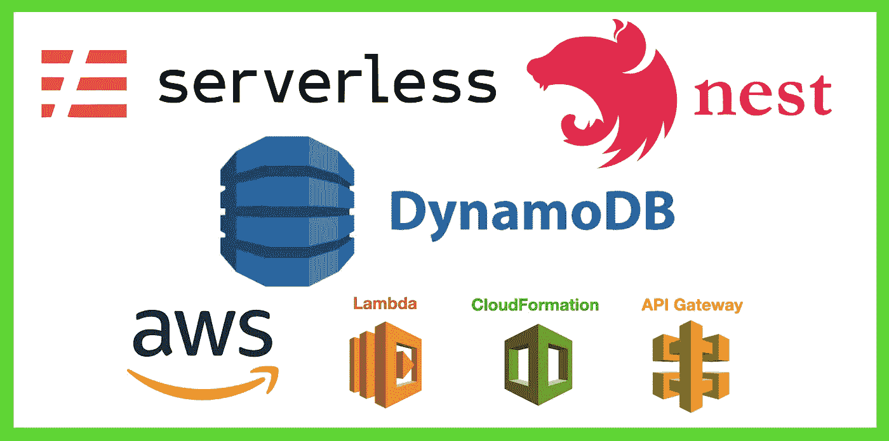
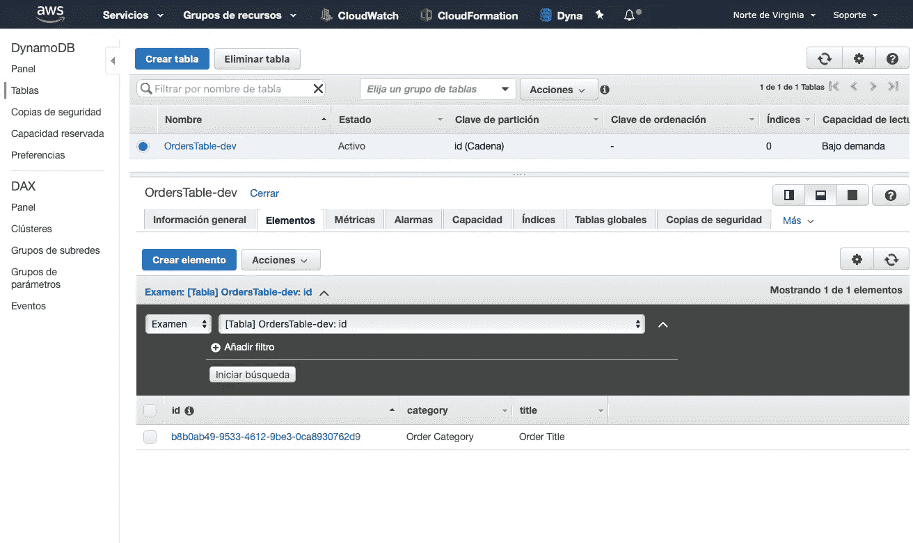

# 带 AWS DynamoDB 的无服务器 NestJS

> 原文：<https://javascript.plainenglish.io/serverless-nestjs-with-aws-dynamodb-e7530ab33c78?source=collection_archive---------1----------------------->



如果我们用 NestJS 谈论数据库，你可能已经与 MongoDB 和 mongoose 或 MySQL 和 typeorm 建立了某种联系。

但是如果我们谈论 AWS 的无服务器，我强烈推荐测试 DynamoDB。

# 为什么是 DynamoDB？

首先因为也是无服务器的！这里有更多关于它的信息:

[](https://aws.amazon.com/dynamodb/) [## 亚马逊 DynamoDB | NoSQL 键值数据库|亚马逊网络服务

### 适用于任何规模的快速灵活的 NoSQL 数据库服务 Amazon DynamoDB 是一个键值和文档数据库，它…

aws.amazon.com](https://aws.amazon.com/dynamodb/) 

“Amazon DynamoDB 是一个键值和文档数据库，在任何规模下都能提供一位数的毫秒级性能。这是一个全面管理的、多区域、多主控、耐用的数据库，具有内置的安全性、备份和恢复以及适用于互联网规模应用程序的内存缓存。DynamoDB 每天可以处理超过 10 万亿个请求，每秒可以支持超过 2000 万个请求的峰值。”

所以很快！真的很快，你可以在我贴在这里的页面上找到更多信息。

我们将把我们的无服务器 NestJS 应用程序与我们的 Dynamo DB 连接起来。

本文的目的是让您可以将您的 NestJS 无服务器应用程序与 DynamoDB 连接起来，我将为您留下到资源库的链接，在那里您可以看到所有代码，以便您可以下载和使用它，请记住，您必须使用以下命令配置 AWS 帐户:

```
aws configure
```

我们将创建一个具有两个端点的简单应用程序，第一个端点创建一个带有标题和类别的订单，第二个端点通过 id 获取已创建的订单。

# 第一步:NestJS

我们需要用可爱的命令和 serverless.yml 文件创建堆栈。

[](https://nestjs.com) [## NestJS——一个渐进的 Node.js 框架

### NestJS 是一个用于构建高效、可伸缩的 Node.js web 应用程序的框架。它使用现代 JavaScript，是建立…

nestjs.com](https://nestjs.com) 

Image 1: NestJS Structure

因此，首先让我们谈谈我是如何组织一个 NestJS 应用程序的:

NestJS 应用程序基本上与模块、服务和控制器逻辑一起工作。

我还使用了一个存储库文件，这个存储库文件用于 MySQL 的 typeorm 和 entities，我也用于 MongoDB 和我的所有项目，在我看来它更有序。

我将. service.ts 用于业务逻辑，将存储库用于与数据库或外部 API 的各种类型的连接，这种方式是分离的，例如，如果我更改数据库，我不必更改很多逻辑。


Image 2: NestJS Logic

所以，现在我们已经有了基本文件和 NestJS 应用程序，我们需要使用无服务器来部署我们的堆栈。

# 去无服务器！

为了部署我们的堆栈，我们将使用无服务器！

[](https://www.serverless.com) [## 无服务器应用程序框架 Serverless

### 软件正在吞噬世界。不幸的是，大多数企业仍然不能成功地交付软件，更不用说这样做了…

www.serverless.com](https://www.serverless.com) 

首先，我们需要创建我们的 serverless.yml 文件，并配置它来部署我们的应用程序:

所以我们需要给我们的应用程序起一个名字，最重要的是我们需要创建我们的 DynamoDB 表。

正如您已经在 NestJS 文件图像上看到的，我们需要创建两个文件夹，一个文件夹用于 AWS IAM 角色，另一个文件夹用于 AWS 资源。

让我们看一下 yml 的 provider 部分，我们有我们的环境变量，其中是 ORDERS_TABLE_NAME 和 iamRoleStatements，它们指向带有 OrdersTable 的 IAMRole 的文件。

此外，我们还有一个自定义部分，在这个自定义部分，您可以添加您需要的任何内容，例如 OrdersTable 名称和 arn，我们将在部署应用程序后使用它们。

你可以在这里看到 CloudFormation 文档:

 [## 裁判员

### 内部函数 Ref 返回指定参数或资源的值。当您指定参数的…

docs.aws.amazon.com](https://docs.aws.amazon.com/AWSCloudFormation/latest/UserGuide/intrinsic-function-reference-ref.html) 

使用 CloudFormation，您可以检索 DynamoDB 表的名称和 arn。所以你会有一个这样的无服务器. yml:


Image 3: Serverless.yml file

我们还需要创建 OrdersTable.yml 文件，这里我们引用 DynamoDB 表并定义 AttributeDefinitions，在这种情况下，我使用“S”类型的“id”作为属性名，这意味着“string ”,我还在 KeySchema 中将此 id 定义为类似主键的哈希。我也强烈推荐阅读 DynamoDB 文档。

[](https://docs.aws.amazon.com/amazondynamodb/latest/developerguide/Introduction.html) [## 什么是亚马逊 DynamoDB？

### 欢迎阅读亚马逊 DynamoDB 开发者指南。Amazon DynamoDB 是一个完全托管的 NoSQL 数据库服务，它提供…

docs.aws.amazon.com](https://docs.aws.amazon.com/amazondynamodb/latest/developerguide/Introduction.html) 

因此，您将有一个类似这样的文件:


Image 4: OrdersTable.yml file

最后，我们需要创建 OrdersTableIAM.yml，该文件将允许我们从 DynamoDB 表中放置 Items、Scan、GetItem、UpdateItems 并查询它们，该表是在指向 serverless.yml 的自定义部分的资源上定义的。

在这种情况下，我们将只使用 PutItem 和 GetItem。该文件应该如下所示:


Image 5: OrdersTableIAM.yml file

# 编码时间到了

我们终于完成了配置。现在，我们需要对我们的存储库和服务进行编码，以使用控制器和公开端点来创建订单，并通过 Id 获取订单。

我将与您分享我的 Github 存储库和示例代码，所以我不打算写代码的所有细节，只写控制器和存储库，还记得我们在文章的 NestJS 部分描述的应用程序的逻辑吗。

## 秩序。模块. ts

这是 order.module.ts，我们基本上提供了 order.repository.ts 和 order.service.ts。


Image 6: order.module.ts file

## 秩序。控制器. ts

这是订单控制器，它通过由 app.module.ts 导入的 order.module.ts 公开。

这里我们有两个端点:

/createOrder:这是一个 POST 方法，主要创建订单并根据结果响应 true 或 false。

/getOrderById/:id:这是一个 GET 方法，用于检索由其 Id 创建的订单。


Image 7: order.controller. ts file

## 秩序。Repository.ts

最后我们有 order.repository.ts，这里我们导入 aws-sdk 以使用 DynamoDB 客户端，我们还导入 uuid 以在 DynamoDB 上创建我们唯一的 id，我还使用 nestjs/common 进行错误处理。

让我们从 createOrder 方法开始，它接收一个由标题和类别组成的 createOrderDto，您可以直接调用它们或者使用对象析构。

我们定义了一个名为 newOrder 的常量变量，然后创建了 DynamoDB 的一个实例。DocumentClient()，我们使用一个 put 调用在 serverless.yml 中定义的环境中的 TableName 和我们之前定义的 newOrder 变量。这是一个承诺，如果一切按预期进行，我们将在 DynamoDB 表中创建新订单。

对于接收订单 Id 的第二个方法 getOrderById，我们定义了一个 let 订单变量，并调用 DynamoDB。DocumentClient()使用 get 方法再次使用 TableName 并将 id 作为对象传递给 Key param，这将返回我们分配给 order 变量的顺序。


Image 8: order.repository.ts file

所有这些都完成后，我们就可以用 sls deploy 命令部署我们的应用程序了。

# 部署应用程序

我们已经完成了所有的代码和配置，现在可以部署我们的无服务器 NestJS 应用程序了。

```
sls deploy
```


Image 9: sls deploy execution


Image 10: sls deploy result

记住，这个命令将使用您用 aws configure 命令定义的用户在您的 AWS 环境中创建 CloudFormation、Lambda 函数、API 网关和 DynamoDB 表。一旦这个过程完成，你会收到 API 的网址进行测试。

# 测试应用程序

是时候测试我们的应用程序了，首先我们需要 Postman，以下是链接，以防您还没有:

[](https://www.postman.com) [## postman | API 开发的协作平台

### 进行任何种类的 API 调用——REST、SOAP 或普通 HTTP——并轻松检查最大的响应。邮递员也有…

www.postman.com](https://www.postman.com) 

因此，在 Postman 中，我们将创建一个 POST 方法，使用 url 将**“{ proxy+}”**替换为**“order/create order”，**我们将标题和类别传递给订单，并点击发送按钮。如果一切按预期进行，我们将看到以下响应:


Image 11: Testing first endpoint with Postman

找到了。有用！让我们检查一下我们的 AWS 控制台。

[](https://aws.amazon.com/console/) [## AWS 管理控制台

### 访问和管理 AWS 云所需的一切都在一个 web 界面中。帮助我们使这个页面更好地告诉我们…

aws.amazon.com](https://aws.amazon.com/console/) 

在 AWS 控制台中，转到 services，然后转到 DynamoDB，您将看到我们创建的表，如果您单击“Elements ”,您将看到我们刚刚创建的订单。



Image 12: AWS Console with DynamoDB

因此，我们可以使用订单测试我们的第二个端点，单击订单 id，您将看到对象，复制 id，让我们试试！


Image 13: AWS DynamoDB Object

回到 Postman 中，我们创建一个新的 GET 请求，其端点与之前相同，将 **"/order/createOrder"** 更改为 **"order/getOrderById/orderId "，**用您之前复制的 Id 替换" orderId "。点击发送和**瞧！**

我们收到之前创建的订单。


Image 14: Testing second endpoint with Postman

我们的无服务器 NestJS 应用程序可以与 DynamoDB 一起工作！

# 结论

DynamoDB 是一个真正强大的 AWS 工具，速度非常快，适用于任何类型的应用程序，缺点之一是你必须学会如何使用它，因为它与 MySQL、Postgres、MongoDB 和其他工具有点不同。我强烈建议你试一试。

如果您想了解更多关于 Serverless 和 NestJS 的信息，请参阅我关于 NestJS 和 Serverless 的其他文章。

# Github 回购

[](https://github.com/Cfvillarroel/nestjs-serverless-dynamodb) [## cfvillarroel/nestjs-无服务器-dynamodb

### 这个例子演示了如何设置一个嵌套应用程序。这将导致:$ sls 脱机启动无服务器…

github.com](https://github.com/Cfvillarroel/nestjs-serverless-dynamodb) 

如果您有任何问题或疑问，请随时联系我，这是我的 linkedin。

[](https://www.linkedin.com/in/carlos-villarroel-navarro/) [## Carlos feli PE Villarroel Navarro-IT 经理- Rindegastos | LinkedIn

### 查看 Carlos Felipe Villarroel Navarro 在世界上最大的职业社区 LinkedIn 上的个人资料。卡洛斯·费利佩…

www.linkedin.com](https://www.linkedin.com/in/carlos-villarroel-navarro/)