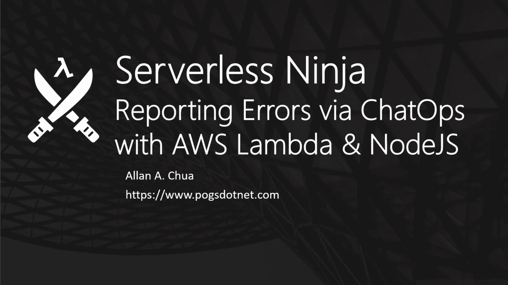
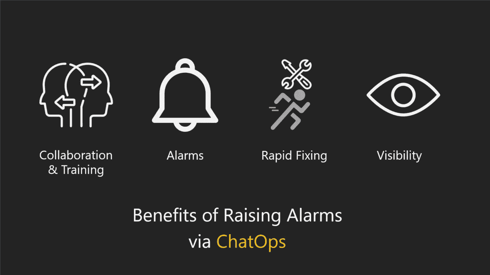
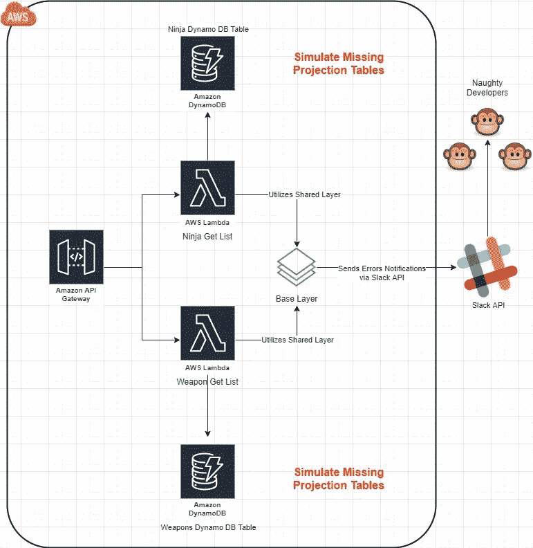
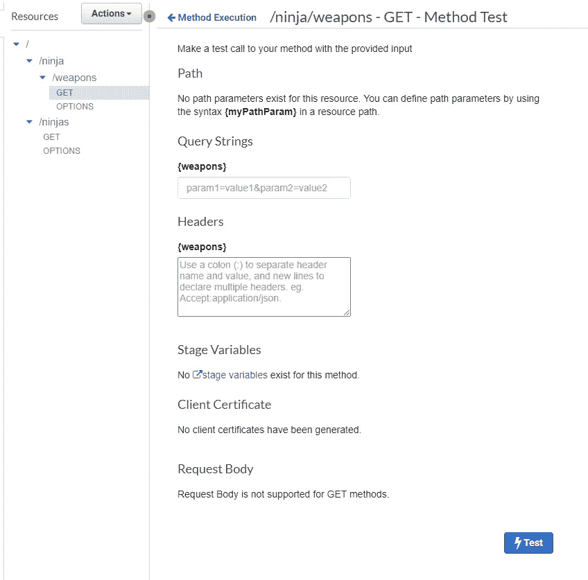
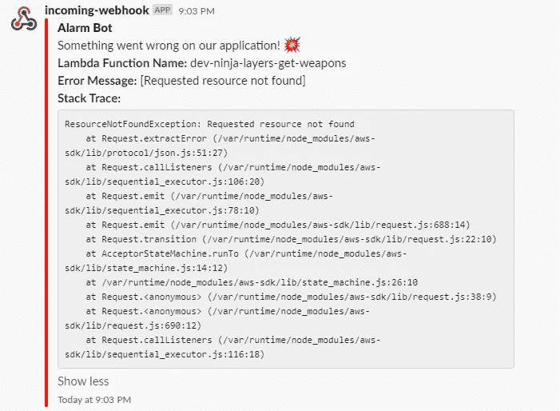

# 使用 AWS Lambda & NodeJS 通过 ChatOps 报告错误

> 原文：<https://javascript.plainenglish.io/serverless-ninja-part-02-reporting-errors-via-chatops-using-aws-lambda-nodejs-8d56dccadc9b?source=collection_archive---------6----------------------->



本文解释了如何使用 ChatOps 注入错误报告模块，以及它如何帮助组织更快地对运行在 AWS Lambda 函数中的应用程序出现的问题做出反应。在这个演示中，我将使用 NodeJS，并利用 Slack 向重要的利益相关者发送警报:

*   应用开发人员
*   软件经理
*   软件测试人员
*   安全响应小组
*   当东西坏了的时候，谁需要保持清醒

# 利益



在我们开始编码之前，我认为有必要了解 ChatOps 带来的好处，以便我们可以向我们的软件开发团队解释我们在构建这种警报机制方面所做努力的重要性。

## 软件问题的早期检测

嘿，在开发环境中捕捉 bug 是开发人员在代码中犯错误时可以瞄准的最好目标。这允许你和平地谷歌应用程序错误，并找到正确的方法来修复它。

## 对生产问题的快速响应

向消息传递应用程序发出警报有助于软件工程团队获得到达生产阶段的问题的实时可见性。这通过减少停机时间和应用程序问题对业务的影响而使组织受益。

## 它将你从无声的失败中拯救出来

如果没有 ChatOps，后台工作人员会默默无闻地失败，没有礼貌地通知您生产中出现了问题。我发现这些后台工作人员是最讨厌的，因为他们可以轻而易举地把你的工作安全置于摇椅上。安装适当的错误处理和警报机制可以避免将中断的工作交付给生产

## 刺激协作和学习

在一个渠道中提出问题，让整个团队积极倾听，通过提高意识，在以下主题上培训您的开发团队，从而微妙地让组织受益:

*   为什么会提出一个问题
*   可以修复问题的地方
*   如何解决该问题
*   如何防止它再次发生

## 设置松弛挂钩 URL

要运行这个示例，您需要设置一个 [Slack 传入 Webhook URL。](https://slack.com/intl/en-sg/help/articles/115005265063-Incoming-webhooks-for-Slack)

## 我们的解决方案架构



上图解释了我们想要的解决方案。把它分解成可消化的小块:

*   我们正在接受 HTTP 请求拉忍者和武器对象
*   我们使用 API 网关来处理公共流量，并将其卸载到适当的基于 lambda 的 API。
*   我们使用 Lambda 层在 lambda APIs 之间共享公共库和功能代码
*   我们有意不提供 Dynamo DB 表来模拟连接问题。
*   我们将优雅地处理错误，并基于它们的元数据构建降价消息
*   然后，我们将基于降价的消息发送到 Slack Hook URLs
*   利益相关者随后对通知做出反应

## NodeJS 实现先决条件

你需要以下资源来完成这个项目。

*   AWS CLI
*   AWS SAM CLI
*   AWS 帐户
*   Shell 脚本执行环境(Linux、MAC、WSL)
*   AWS CLI 的命名配置文件
*   用于 SAM 工件存储的 S3 桶
*   NodeJS
*   带有传入网钩的松弛通道
*   [克隆这个 Github 库](https://github.com/allanchua101/serverless-ninja/tree/master/012-reporting-errors-via-chatops/node)

[](https://github.com/allanchua101/serverless-ninja/tree/master/012-reporting-errors-via-chatops/node) [## allancha 101/无服务器-忍者

### 存储库的这一部分旨在展示通过基于 Slack 发送错误通知的 NodeJS 实现…

github.com](https://github.com/allanchua101/serverless-ninja/tree/master/012-reporting-errors-via-chatops/node) 

## 部署应用程序

1.  如果你是 Linux 或 Mac 用户，你需要提供这个[文件夹](https://github.com/allanchua101/serverless-ninja/tree/master/012-reporting-errors-via-chatops/node)根目录下的 shell 脚本的执行权限。如果您是 windows 用户，请忽略此步骤。

```
chmod +x *.sh
```

2.您将需要运行**001 _ install _ dependencies . sh**脚本来为基础层和 API 文件夹安装节点模块。

3.您必须将**base-layer \ nodejs \ Slack . config . sample . JSON**文件复制到**base-layer \ nodejs \ Slack . config . JSON**，并提供您的 Slack webhook URLs 和所需的频道名称。如果不进行配置，您将会遇到可怕的静默故障问题，这个问题只能通过 CloudWatch 日志来诊断。查看下面显示文件内容的代码片段。

```
{  
    "slackChannelName": "#place-your-channel-name",
    "slackHookUrl": "https://place-your-hook-url-here"
}
```

4.运行 shell 脚本后，您必须通过执行 **002_release_apis.sh** 脚本来释放 APIs CloudFormation 堆栈。为了验证步骤 3 是否正常工作，您可以访问您的 AWS 帐户的 CloudFormation 门户网站，应该能够看到名为 **dev-ninja-alarms** 的 CloudFormation 堆栈。这将包含下面列出的 AWS 资源:

*   1 个 API 网关
*   1 个 API 密钥
*   1 API 使用计划
*   2 个λ函数
*   2 个 IAM 角色
*   1λ层
*   4 个 Lambda 权限(2 个用于 CORS，2 个用于 GET)

# SAM 模板

这是我用来在多个 API 端点之间共享 API 网关和 Lambda 层的 SAM 模板。

## 测试警报



Trigger any endpoint using the test console from AWS.

为了简化测试，您可以导航到 AWS 控制台的 API Gateway 部分，找到名为 **dev-ninja-alarms** 的网关，并查看其资源列表。

## 查看生成的警报



您应该能够在您用传入的 webhook URL 链接的 Slack 通道上获得以下错误消息。

## 它是如何工作的？

我们在共享的 lambda 层文件夹中创建了一个名为**base-layer \ nodejs \ slack-alarm . js**的出色模块，代码如下:

Cloud Formation template used for provisioning the project

我们还配置了两个基于 Lambda 的 API 来捕捉 Lambda 执行范围内可能出现的任何形式的异常。

## 停用云形成堆栈

我知道 Lambda 非常便宜，你甚至可以让你的 API 运行，它们不会让你付出任何重大的代价。然而，为了防止您的 AWS 帐户变得混乱，我建议您使用脚本**003 _ decoration _ APIs . sh**来解除这个示例的 CloudFormation 堆栈。

## 我在写一本关于无服务器的书！

如果你有兴趣了解更多关于无服务器架构的知识，你可以访问我的 [GitHub](https://github.com/allanchua101/serverless-ninja) 库，阅读更多我还没有在博客中发表的主题。您还可以找到有趣的示例代码和项目，它们可以帮助您开始使用无服务器架构。

## 相关链接

*   [无服务器=效率](https://medium.com/@ac052790/serverless-ninja-part-01-serverless-efficiency-64cf77915838)
*   [Github 库](https://github.com/allanchua101/serverless-ninja)

*原载于 2020 年 8 月 22 日 https://www.pogsdotnet.com**的* [*。*](https://www.pogsdotnet.com/2020/08/serverless-ninja-reporting-errors-via.html)