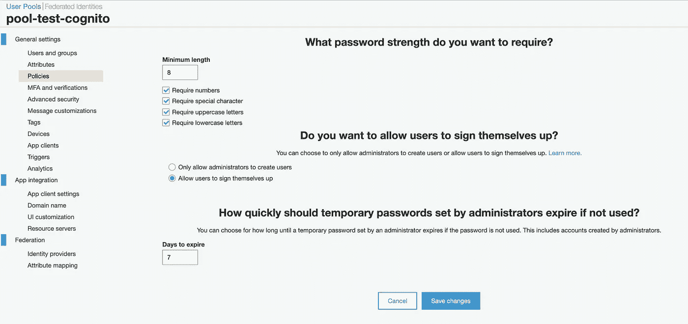
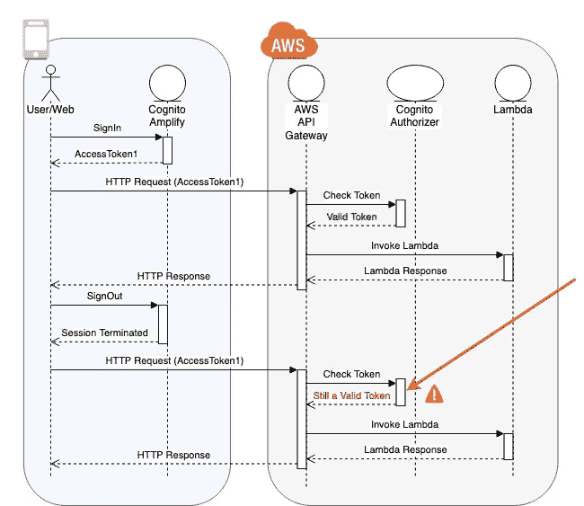
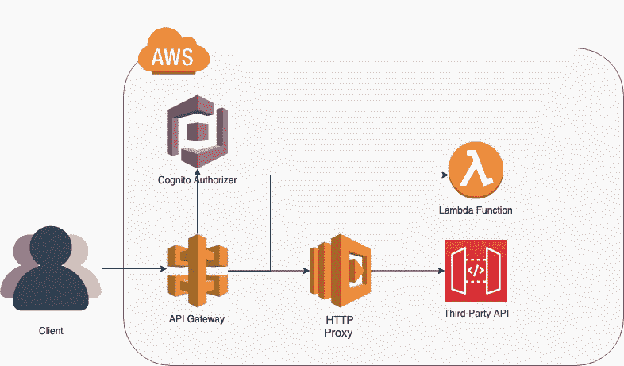
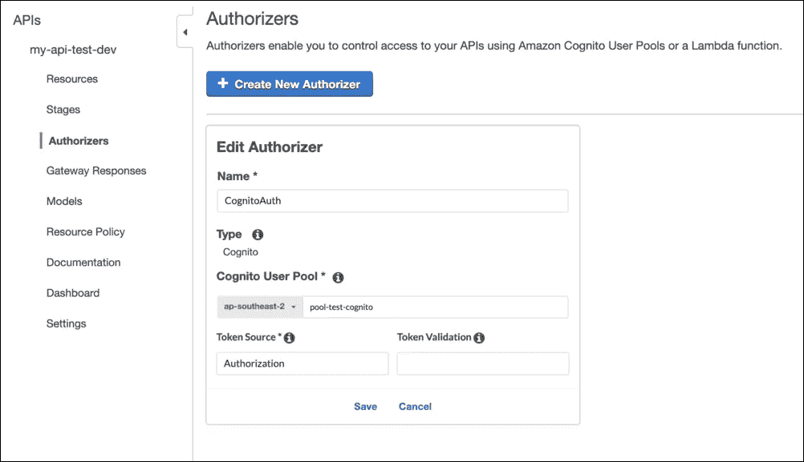
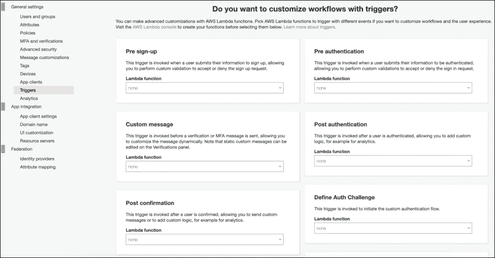
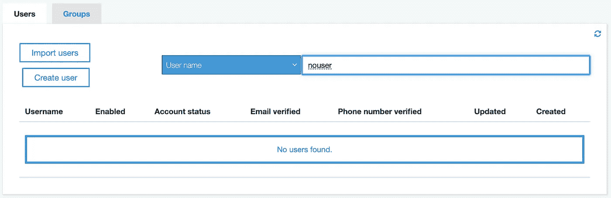

# 无服务器:AWS Cognito 需要做好生产准备的 3 件事

> 原文：<https://javascript.plainenglish.io/serverless-things-i-wish-i-had-known-before-i-started-part-1-aws-cognito-cf5d3a0c3d9d?source=collection_archive---------0----------------------->

Image from [https://www.kaspersky.com.au/blog/security-week-digest-33/9591/](https://www.kaspersky.com.au/blog/security-week-digest-33/9591/)

上周我分享了一篇文章，“无服务器:学习如何在你的团队中实现 it，而不使他们成为 AWS 云架构师专家”，鼓励公司和团队实现无服务器架构。然而，作为一个相当近期推出的架构，该工具可能没有(如果有的话)一个简单的方法来实现一些必要的功能，这可能会给新用户带来困难。因此，我将讲述一系列我希望在开始使用 AWS Cognito 用户池之前就知道的事情。

# **认证:Cognito 提供什么，真正需要什么。**

*Cognito 用户池是用于无服务器架构的 AWS 资源，其目的是提供基于云的服务，通过 API(或其他服务，如* [*Amplify*](https://aws-amplify.github.io/) *)可以对用户进行身份验证。它提供了几个级别/类型的配置，其实现非常简单。*

Cognito User Pool AWS Console

虽然有机会通过一个独特的独立工具来管理访问控制可能令人兴奋，并且所提供的配置级别可以覆盖几乎所有的用户需求，但仍然存在一些问题，如令牌无效、缺少备份和个性化身份验证，这将需要 AWS 做一些额外的工作。

**1。令牌失效**

考虑一个 web 应用程序用户案例，在用户登录并保持非活动状态一段时间(比如 15 分钟)后，他们将被注销。看起来很简单，对吧？不完全是。尽管 amplify 的 Auth 模块会自动运行令牌验证并在必要时刷新令牌，但为客户端配置的最短过期时间是 1 小时。因此，如果需要实现更短的有效期，则必须通过客户端手动完成。

有人可能会想:“这不是什么大问题，因为这是一个易于实现的解决方案”。如果不是因为令牌不会在 1 小时之前失效，这一点没有争议。是的，用户注销，但生成的令牌仍然可以使用。换句话说:用户登录应用程序并收到一个令牌，然后，考虑到他们已经有一段时间不活动，应用程序检测到它并执行注销 API 方法。用户已注销，但是，使用此令牌向 API(使用与授权者相同的 Cognito)发出的任何请求将在 1 小时内被接受。不幸的是，这还没有得到解决，但至少，有一个公开的[问题](https://github.com/aws-amplify/amplify-js/issues/3435)。

Cognito Token Invalidation Flow

**2。集成代理验证**

*代理集成是一个选项，其中 API 路径可以以这样一种方式配置，到该路径的每个请求将被重定向到另一个配置的 url API* 。

考虑到并非所有的方法都需要重新实现，使用代理可能会非常方便，但是应用程序仍然需要在转发用户请求之前对用户进行身份验证。最方便的选择应该是 Cognito，但在这种情况下，它带来的限制多于灵活性。

将 Cognito 实现为代理身份验证并不是一个很大的挑战，因为有一种简单的方法来配置它，但是如果需要一些额外的业务逻辑来验证用户的请求呢？设想一个与第三方服务集成的应用程序，它返回给定乘客的航班详细信息。即使用户 A 在应用程序中通过了身份验证，他们也不能请求用户 B 的数据，除非他们拥有“管理员”角色。换句话说，仅仅因为一个用户注册了一个密码，并不意味着他们可以访问所有应用程序的服务。不幸的是，由于集成代理的配置方式，在转发请求之前没有执行 lambda 函数。在这种情况下，如何根据用户的详细信息或角色来验证用户从代理访问数据？

AWS Architecture of Lambda and HTTP Proxy

> 使用 Cognito 无法做到这一点，因为在授权后没有执行 lambda 函数的选项。

API Gateway Authorizer Configuration

虽然很少有人会想到(这非常符合逻辑)仔细检查 Cognito 的配置，试图找到一种在请求令牌验证之后执行代码的方法，但 Cognito 处理与注册和登录相关的事件，而不是令牌验证。事实上，API Gatway 是一个组件，它使用 Cognito 处理令牌验证，然后将请求重定向到 Lambda 或代理。

Cognito User Pool — Triggers

可能的解决方案是什么？不使用 Cognito 内置授权器，而是构建一个定制的 lambda 授权器，然后将其用于代理端点。这种方法的好处是可以根据用户的详细信息、角色以及请求路径和方法灵活地定义规则。然而，也有一些权衡:

1.  Cognito auth 令牌需要手动解密，在这种情况下，这意味着要编写一些额外的代码，并重写已经存在的代码。
2.  无法缓存 Cognito 令牌。虽然授权者允许配置缓存周期(这样，为了节省时间，API 网关将跳过令牌验证，直到缓存过期)，但因为每个端点可能有不同的业务规则，所以这种情况不太可能适用。

**2020 年 3 月 25 日更新:**代码示例

Example of a customised lambda authorizer

另一个要考虑的方法是重写第三方的每个方法，并通过 lambda 函数发出请求。这样，在发出请求之前，就可以验证用户的详细信息和角色。

目标是了解应用程序将使用多少第三方 API，以及将包含多少第三方 API 的方法。意识越强，就越容易决定什么对项目更好。

**3。用户数据备份怎么办？**

作为一个独立的访问控制工具，Cognito 拥有自己的用户和组实体，不需要任何外部数据库存储。然而，它们没有提供备份或导出这些数据的方法- [问题参考](https://forums.aws.amazon.com/thread.jspa?threadID=296932)。

Cognito User Pool without option to Export Users

完全可以理解的是，云服务的原则之一是“信任”，这意味着他们保证服务将始终可用和稳定。但是如果有人不小心删除了 Cognito 资源呢？如果需要将用户迁移到另一个服务，该怎么办？记住为什么要有数据库备份的原因，由于缺少这些选项而导致的潜在问题是数不胜数的。

尽管忽略这一点的简单决定就足够了，但考虑到更愿意为某一情况做好准备而不是事后准备，找到导出数据的方法被认为更安全。找到的解决方案是创建一个调度 lambda(与 cron 作业中的概念相同),它将调用 Cognito API，提取用户的详细信息，将它们导出到文件中，然后上传到某个存储服务中。因为一个 [npm 合作者](https://www.npmjs.com/~mifi)编写了这个伟大的[认知备份模块](https://www.npmjs.com/package/cognito-backup)，它将完成所有将数据提取到文件的工作，不需要编写太多代码。因此，最终的解决方案是一个包含两个步骤的脚本:备份和上传。

**结论**

作为一个新的框架，有一些选项对业务来说可能很重要，但它们可能仍然是提供商所缺少的。因此，有必要进行一些分析性修订，以检查是否存在不同解决方案的可能性，或者是否根本不可能(并接受它)。这篇文章是为了分享一些“糟糕”的经历和一个潜在的解决方法。

更重要的是，值得强调的是，不管强调了哪些要点，AWS 和无服务器框架在根据用户需求更新其服务方面一直做得很好，因此，毫无疑问，最终很少有人会很快被修复。

**资源**

[https://aws-amplify.github.io/](https://aws-amplify.github.io/)
[https://www . Kaspersky . com . au/blog/security-week-digest-33/9591](https://www.kaspersky.com.au/blog/security-week-digest-33/9591/)[https://github.com/aws-amplify/amplify-js/issues/3435](https://github.com/aws-amplify/amplify-js/issues/3435)
https://forums.aws.amazon.com/thread.jspa?threadID=296932[https://www.npmjs.com/package/cognito-backup](https://www.npmjs.com/package/cognito-backup)

## [**第二部——DynamoDB x MongoDB x**傲罗 **a**](https://medium.com/@cbernardes/serverless-things-i-wish-i-had-known-part-2-dynamodb-x-mongodb-x-aurora-serverless-1053cfddff36?source=friends_link&sk=a0891772e2c260bdcbd4cd365d91254d) **→**