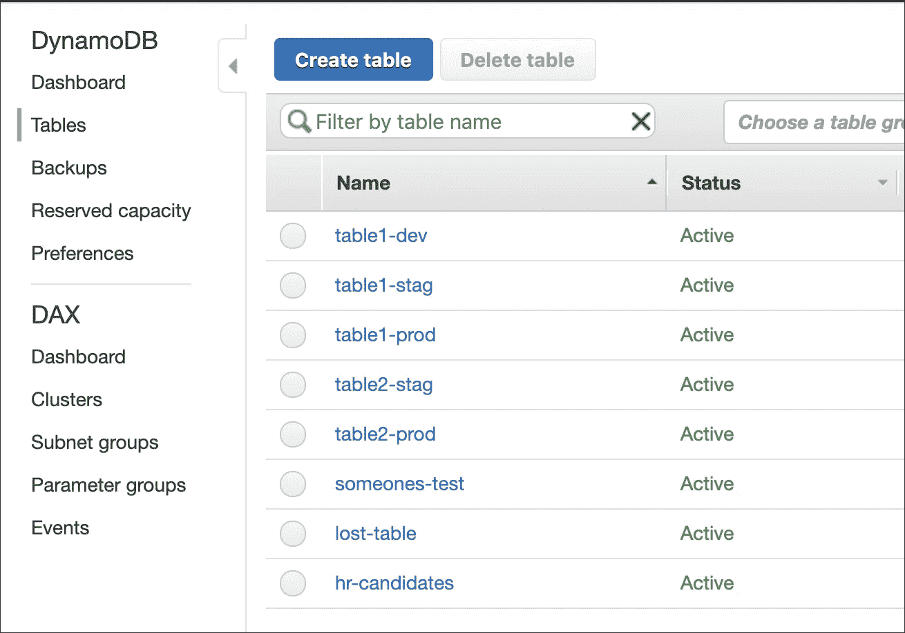

# 在将 AWS Lambda 函数连接到数据库之前，您应该知道的一些事情

> 原文：<https://javascript.plainenglish.io/serverless-things-i-wish-i-had-known-part-2-dynamodb-x-mongodb-x-aurora-serverless-1053cfddff36?source=collection_archive---------2----------------------->


Image from [Amazon documentation](https://docs.aws.amazon.com/amazondynamodb/latest/developerguide/SQLtoNoSQL.Accessing.html)

几周前，我写了一篇文章，在文章中我强调了我在使用无服务器的实现 [AWS Cognito 用户池时遇到的一些问题。接下来，今天我想描述一下我在选择和使用具有无服务器架构的数据库时发现的一些挑战，并探讨一些重要的 lambda 概念，这些概念会对无服务器项目的决策产生影响。](https://medium.com/@cbernardes/serverless-things-i-wish-i-had-known-before-i-started-part-1-aws-cognito-cf5d3a0c3d9d)

**DynamoDB**

如果您考虑过使用无服务器，并且读过一些 AWS 的文章或文档，那么您很可能已经找到了使用他们的 dynamodb 服务来持久化数据的建议。尽管这个数据库有几个好处，但它可能不是所有应用程序类型的最佳选择。让我们考虑一下中等规模 API 的一些要点:

从内容组织的角度来看，在 dynamodb 中，表并不像大多数普通数据库那样进行聚合。因为它们是完全独立的，即使它们可以在不同的 VPC 中分开，所有的表都将显示在一个混合列表中。假设有两个项目，它们都有一个名为“message”的表。我们应该如何命名这些表？pr J1-消息-产品和 pr J2-消息-产品？看起来很混乱。



AWS DynamoDB table list

此外，因为它们非常独立，所以不支持 join 操作。连一个“填充”都没有。让我们考虑一个简单的查询，列出给定用户的所有消息。为此，有必要在用户的表模式中设计这些信息，或者运行两个查询。现在，图像用户相关的信息(评论、交易、日志、订单等)随着项目的增长而不断增加，结构和表格会变得多大？

从查询的角度来看，语法也没有提供多少帮助。它不直观，写起来费力(这可能是因为我们缺乏经验)，而且可用的 ORM 也不是很支持。

因此，由于上述因素，我们决定将 MongoDB 作为无服务器项目的数据库。尽管如此，出于不同的原因(例如微服务)，该工具可能非常适合您的项目，因此，我建议您阅读[无服务器和 DynamoDB](https://serverless.com/dynamodb/) 终极指南，以获得更深入的理解。

MongoDB 和 Lambda:悖论

随着我们向前发展，上述所有问题都很容易解决(我猜是由于以前的经验)，但问题是 mongodb 是一个连接驱动的数据库。这怎么成问题了？lambda 是一组自给自足的代码，每次被调用时都会反复执行，这意味着每次被调用时都需要一个数据库连接。这将增加方法的执行时间并降低其性能，因为我们需要连接和断开数据库。为了更好地理解它，让我们把这个问题分成几个小的概念:

***冷启动*** *是 lambda 在其第一次请求时，准备执行其代码所需的所有依赖项的时间段。*

这里的问题是，除了冷启动(启动容器、加载模块、配置等)，数据库连接还会延迟代码执行。请记住，db 连接不是冷启动的一部分，因为它是 lambda 代码执行的一部分，但是它对准备好执行我们的主方法有很大的影响，从技术上讲，每次 lambda 冷启动时，它也必须进行连接，所以它们是相关的。

了解到这一点后，为什么我们在使用 DynamoDB 时没有这个问题呢？因为 DynamoDB 使用 API 请求来读写表中的项，而 MongoDB 依赖于 DB 连接。换句话说，即使正在使用 AWS SDK 或 AWS CLI，也没有持久的网络连接。因此，为了提高性能，每次 lambda 被重新调用时，我们都需要使用相同的 DB 连接。

> DynamoDB 使用 API 请求来读写表中的项，而 MongoDB 依赖于 DB 连接

[***事件循环***](https://nodejs.org/en/docs/guides/event-loop-timers-and-nexttick/) *允许 Node.js 执行非阻塞 I/O 操作——尽管 JavaScript 是单线程的——尽可能将操作卸载到系统内核。*

为什么这些信息很重要？因为 DB 连接是一个工作池，lambda 直到运行时堆栈中的所有操作完成后才返回回调，因此，如果连接没有关闭，lambda 将超时失败。

如果您到目前为止一直在跟踪，我们得到的是:为了避免访问数据库期间的性能问题，有必要保持连接打开，但是为了通过回调返回 lambda 响应，需要关闭连接。我们有一个悖论。

**这是怎么解决的？**

通过重置上下文配置选项，配置 lambda 不等待事件循环运行时为空。

```
context.callbackWaitsForEmptyEventLoop = false;
```

默认情况下，在冻结进程并将结果返回给调用方之前，回调会一直等到运行时事件循环为空。将此属性设置为 false 会请求 AWS Lambda 在回调被调用后立即冻结进程，即使事件循环中有事件。AWS Lambda 将冻结流程、任何状态数据和事件循环中的事件。如果 AWS Lambda 选择使用冻结的进程，则在下一次调用 Lambda 函数时，将处理事件循环中的任何剩余事件。参考自 [mongodb 最佳实践](https://docs.atlas.mongodb.com/best-practices-connecting-to-aws-lambda/)。

现在，我们已经从 lambda 的角度和 db 连接了解了事情是如何工作的，为了实现该解决方案，必须考虑三件事情:

1.  连接必须在 lambda 处理程序之外。这是将被冻结的代码。
2.  在尝试再次连接到数据库之前，您应该检查连接是否已经打开。
3.  在 lambda 处理程序中，将“callbackWaitsForEmptyEventLoop”设置为 false。

**这里是代码**

正如我们在上面的例子中看到的，整个代码并不复杂，但是当理解了为什么这些配置是必要的时，就更有意义了。如果你一直在使用 MySQL，杰里米·戴利的博客上有一个很好的[例子](https://www.jeremydaly.com/reuse-database-connections-aws-lambda/)。

**未解决的问题**

考虑到我们已经完全隔离了每个 lambda 的连接问题，如果应用程序有 100+lambda 会发生什么？因为 lambda 是独立的，所以每一个 lambda 都有自己的 DB 连接，这将导致 MaxListenersExceededWarning 和潜在的[问题](https://github.com/awslabs/aws-serverless-express/issues/242)。尽管 AWS 会自动清理未使用的(它们的算法或周期未知)lambda 环境，但有几种方法可以帮助缓解这个问题:

1.  有多个端点方法引用同一个处理程序，这将导致创建一个 lambda，但为多个方法服务。示例:假设端点 get: **cms/messages/{id}** ， **put: cms/messages/{id}** 和**delete:CMS/messages/{ id }**。因为它们具有相同的结构，所以它们可以调用相同的处理程序。然后，处理程序会根据它们的方法将它们路由到不同的数据库操作。缺点是 lambda 需要更多的资源，缺乏粒度管理，可能还有额外的代码/架构复杂性。
2.  更改数据库配置，尽量避免过多的连接，并在连接发生时做出反应。杰里米在他的博客上有一篇很棒的[文章](https://www.jeremydaly.com/manage-rds-connections-aws-lambda/)，就如何管理关系提出了建议。

也许 AWS 应该为这个独特的问题提供某种共享的 lambda 资源。这违背了 lambda 独立性的目的，但对于 API 开发来说，这也是非常重要的。

好消息是，亚马逊去年(2018 年 8 月 9 日)推出了 Aurora 无服务器服务，根据杰瑞米的[文章](https://www.jeremydaly.com/aurora-serverless-the-good-the-bad-and-the-scalable/)，这似乎是一个不错的选择。如果我几个月前就开始这个项目，我会给它一个机会。更重要的是，这一公告表明，供应商正在不断努力改善他们的服务。

**总而言之**

在实现无服务器项目时，很难选择最好的工具或正确的架构，但是如果很好地理解并考虑了这些概念，做出正确的决定会变得更容易。

**信用**

我想给 Jeremy 的博客[一点额外的奖励，在那里我找到了我所涉及的主题的很好的参考和用例。它包含了大量与无服务器相关的信息。](https://www.jeremydaly.com)

**资源**

[https://serverless.com/dynamodb](https://serverless.com/dynamodb)
https://docs . AWS . Amazon . com/Amazon dynamodb/latest/developer guide/SQLtoNoSQL。Accessing.html
[https://nodejs . org/en/docs/guides/event-loop-timers-and-next tick](https://nodejs.org/en/docs/guides/event-loop-timers-and-nexttick)
[https://www . Jeremy Daly . com/reuse-database-connections-AWS-lambda](https://www.jeremydaly.com/reuse-database-connections-aws-lambda)
[https://docs . atlas . MongoDB . com/best-practices-connecting-to-AWS-lambda](https://docs.atlas.mongodb.com/best-practices-connecting-to-aws-lambda)
[https://mongoosejs.com/docs/lambda.html](https://mongoosejs.com/docs/lambda.html)
[https:/](https://github.com/awslabs/aws-serverless-express/issues/242)

## ← [第 1 部分- AWS 认知](https://medium.com/@cbernardes/serverless-things-i-wish-i-had-known-before-i-started-part-1-aws-cognito-cf5d3a0c3d9d)