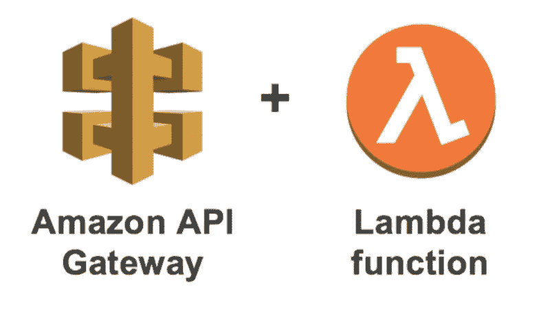

# 使用 AWS Lamda 和 API 网关和无服务器提供文件服务— 2020 年

> 原文：<https://javascript.plainenglish.io/serving-files-using-aws-lamda-and-api-gateway-using-serverless-2020-20359c071827?source=collection_archive---------4----------------------->

这个例子说明了我们如何使用 [AWS Lamda](https://aws.amazon.com/lambda/) 提供文件，以及如何使用[无服务器](https://www.serverless.com/)提供 AWS API 网关。[亚马逊 API 网关](https://aws.amazon.com/api-gateway/)支持服务二进制文件。我们将编写一个服务于图像的无服务器 API。



开始之前，您需要

1.  无服务器的基本知识
2.  系统中安装的 Node.js 和 npm
3.  亚马逊网络服务(AWS)帐户

如果你不熟悉无服务器的基础知识，你可以参考这个博客

# 项目设置

我们将创建一个项目文件夹并初始化一个 npm 项目。在项目文件夹中创建新的无服务器服务。

```
mkdir my-serverless-project
cd my-serverless-project
npm init -y
serverless create --template aws-nodejs
```

无服务器框架为应用程序生成样板文件。其中，`handler.js`和`serverless.yml`是重要的。

现在我们将安装`[serverless-offline](https://www.npmjs.com/package/serverless-offline)`,这是一个用于在本地主机上运行无服务器框架的插件。这将在我们的本地机器上模拟 Lambda 和 API 网关，以加速您的开发周期。否则，我们将不得不每次都将服务部署到 AWS 来测试变更。

```
npm install -D serverless-offline
```

修改`serverless.yml`文件以包含插件。

```
service:
  name: serverlessplugins:
  - serverless-offline
provider:
  name: aws
  runtime: nodejs12.x
  apiGateway:
    minimumCompressionSize: 1024
  environment:
    AWS_NODEJS_CONNECTION_REUSE_ENABLED: 1
functions:
  hello:
    handler: handler.hello
    events:
      - http:
          method: get
          path: /
```

现在，在项目文件夹中运行以下命令来启动无服务器脱机服务器。

```
serverless offline start
```

我们做了一个基本的无服务器应用程序。转到`[http://localhost:3000/dev](http://localhost:3000/dev)`查看开发服务器。

# 在 API 网关中设置二进制文件服务

我们将使用一个名为`[serverless-apigw-binary](https://github.com/maciejtreder/serverless-apigw-binary)`的插件通过 API 网关提供文件服务。

```
npm install -D serverless-apigw-binary
```

将图像文件添加到项目文件夹中。这是为了便于演示。二进制文件可以是任何类型，也可以来自不同的来源。这里我们提供的是 PNG 图像。我们需要在`serverless.yml`中显式添加一行，以便在部署时包含图像文件。默认情况下，无服务器将忽略应用程序中未引用的所有文件。修改`serverless.yml`如下

```
service:
name: serverless
include:
  - my-image.png
plugins:
  - serverless-offline
  - serverless-apigw-binary
custom:
  apigwBinary:
    types:
      - '*/*'
provider:
  name: aws
  runtime: nodejs12.x
  apiGateway:
    minimumCompressionSize: 1024
  environment:
    AWS_NODEJS_CONNECTION_REUSE_ENABLED: 1
functions:
  hello:
    handler: handler.hello
    events:
      - http:
          method: get
          path: /
```

我们将需要相应地修改`handler.js`。API Gateway 不支持直接发送二进制数据，而是以字符串形式发送。`isBase64Encoded: true`将让 API 网关知道二进制数据是以 base64 编码的。

```
'use strict';const fs = require('fs');
module.exports.hello = async (event) => {
const file = fs.readFileSync('my-image.png');
*return* {
  statusCode: 200,
  headers: {
    'Content-Type': 'image/png',
  },
  body: file.toString('base64'),
  isBase64Encoded: true,
  };
};
```

使用`serverless deploy`部署无服务器应用程序。瞧，我们已经成功地通过 AWS Lambda 和 API Gateway 提供了二进制文件。

# 包扎

本文向您展示了创建一个提供二进制文件的无服务器应用程序的过程。当我们创建一个涉及提供二进制文件的应用程序时，这将是很有帮助的，比如一个截图应用程序，它可以对图像进行截图。你可以在这里看到完整的代码