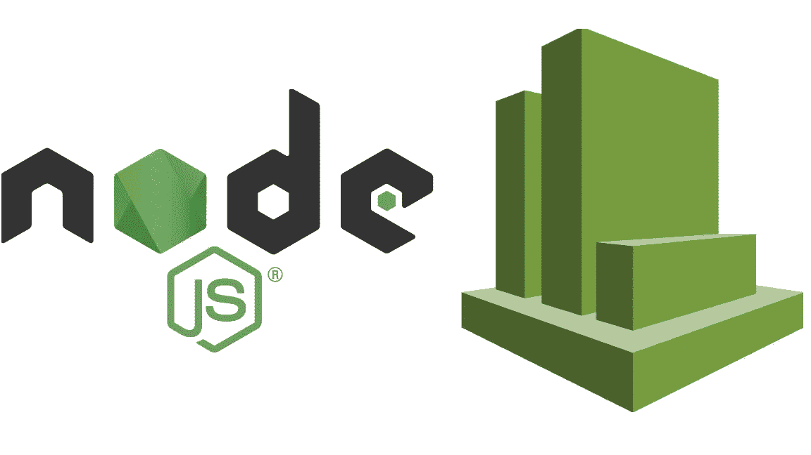
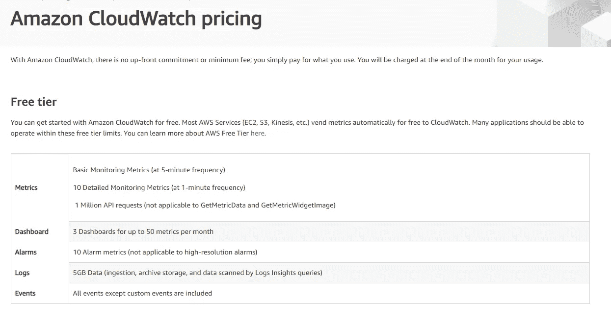
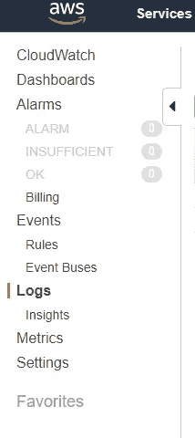
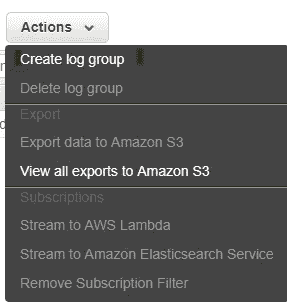
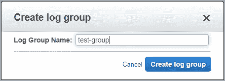
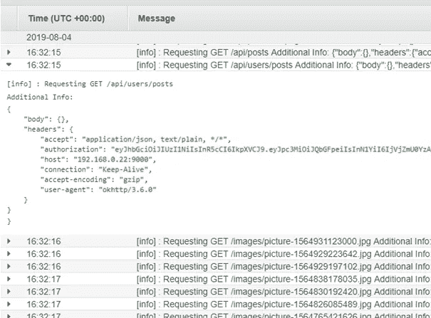

# 用 Winston 和 Cloudwatch 在 5 分钟内为你的 node 应用设置一个日志程序

> 原文：<https://javascript.plainenglish.io/set-up-a-logger-for-your-node-app-with-winston-and-cloudwatch-in-5-minutes-dec0c6c0d5b8?source=collection_archive---------0----------------------->



在一周内发生两起独立事件后，我开始确信是时候深入了解我们的应用程序了。监控和记录不再是一个选项，而是必须的。由于我们已经使用了 AWS，我决定使用 AWS CloudWatch。我仍然不得不选择一个日志记录器，我选择了 Winston，因为它非常受欢迎(在 NPM 上每周有超过 300 万次下载，在 GitHub 上有超过 13K 次下载),并且一直保持着。

如果您想做同样的事情，并为您的节点应用程序设置日志记录，您可以使用本教程来做到这一点，这不会超过 5 分钟。我们走吧！

**设置云观察**:



what’s included in the free tier for AWS CloudWatch

首先，转到 AWS Cloudwatch 仪表板，然后从右边的菜单中选择“日志”



从“操作”弹出式按钮中，选取“创建日志组”并给它命名



如果您还没有，您应该创建一个 IAM 用户，并给它适当的权限，我使用了“CloudWatchFullAccess”，保存它的凭证(访问密钥 ID & secret key)供以后使用。

# **设置 Winston 记录器**

## **安装需要的包**

首先，我们需要安装将要使用的 npm 包。这些是“温斯顿”和“温斯顿-云观察”。为此，请使用以下命令:

```
npm i winston winston-cloudwatch --save
```

## **2。添加和配置记录器**

```
const winston = require('winston'),
      WinstonCloudWatch = require('winston-cloudwatch');const logger = new winston.*createLogger*({
    format: winston.format.json(),
    transports: [
        new (winston.transports.Console)({
            timestamp: true,
            colorize: true,
        })
   ]
});if (process.env.NODE_ENV === 'production') {
const cloudwatchConfig = {
    logGroupName: process.env.CLOUDWATCH_GROUP_NAME,
    logStreamName: `${process.env.CLOUDWATCH_GROUP_NAME}-${process.env.NODE_ENV}`,
    awsAccessKeyId: process.env.CLOUDWATCH_ACCESS_KEY,
    awsSecretKey: process.env.CLOUDWATCH_SECRET_ACCESS_KEY,
    awsRegion: process.env.CLOUDWATCH_REGION,
    messageFormatter: ({ level, message, additionalInfo }) =>    `[${level}] : ${message} \nAdditional Info: ${JSON.stringify(additionalInfo)}}`
} logger.add(new WinstonCloudWatch(cloudwatchConfig))
}module.exports = logger;
```

*细目:*
1。我们首先导入我们想要使用的包，
2。然后通过调用带有选项对象的 createLogger 方法来启动 logger 对象，我已经添加了一个 winston.transports.Console 类型的传输，这样我就可以在开发
3 时在默认输出上看到我的 console.log。根据我们是否在生产环境中，我们然后配置并添加一个新的传输到 logger，它将负责将日志传输到 cloudwatch。有关可用配置选项的完整列表，请参见:[https://www.npmjs.com/package/winston-cloudwatch#options](https://www.npmjs.com/package/winston-cloudwatch#options)
4。我们最后导出记录器，这样我们就可以在应用程序中的任何地方使用它

## 3.**添加环境变量**

这可以根据部署环境和您的个人偏好以不同的方式完成；但是我们总是建议*永远不要*把密匙直接放在代码库中(即使你的 git repo 是私有的！！).就我个人而言，我在 dotnev([https://www.npmjs.com/package/dotenv](https://www.npmjs.com/package/dotenv))中使用一个. env 文件，因为它有助于我轻松地为每个环境使用不同的变量。

## 4.**最后，记录你需要记录的一切**

一个简单的例子是这样记录传入的请求

```
app.use((req, res, next) => { logger.log('info', `Requesting ${req.method} ${req.originalUrl}`, {tags: 'http', additionalInfo: {body: req.body, headers: req.headers }}); next() })
```

这样，每次请求进来时，它将被直接记录到控制台*和*到 CloudWatch。

塔拉阿！一切就绪，部署和享受。现在，我们可以进入 CloudWatch，查看我们的日志，如下图所示:



Results from the simple log we tried

后来，我在任何需要的地方添加了包含我想要的信息的日志。现在，如果我在生产中遇到问题，我可以更加自信，并且有一个跟踪来帮助我调试。