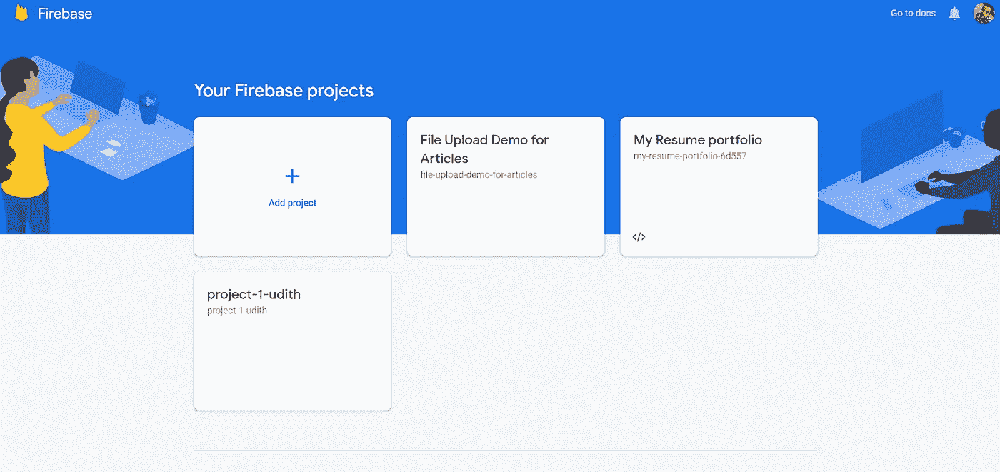
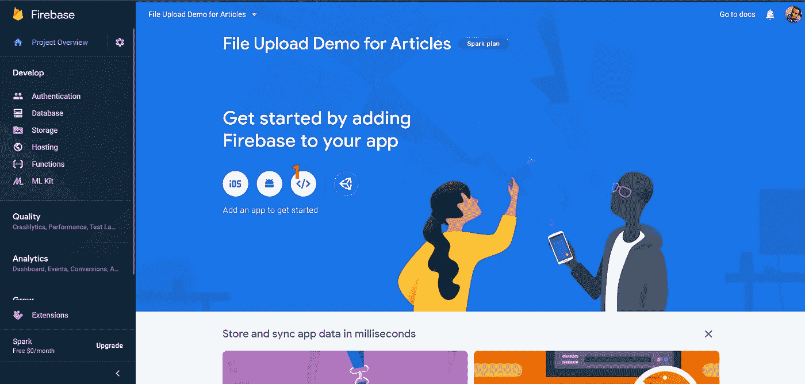
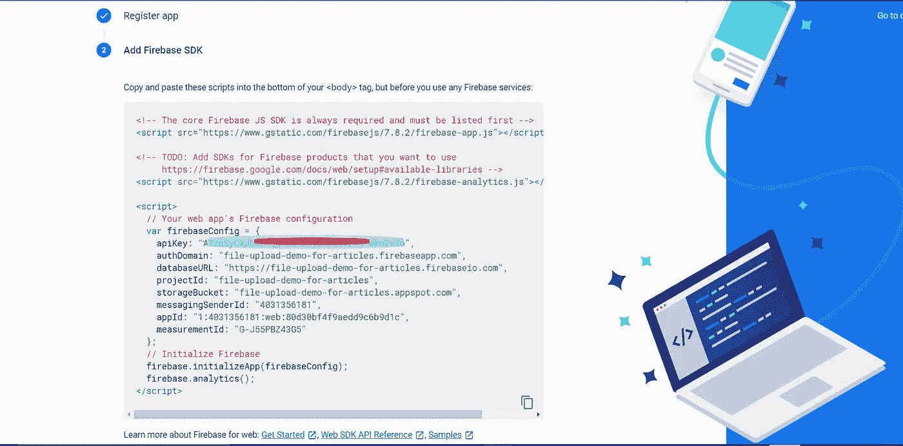
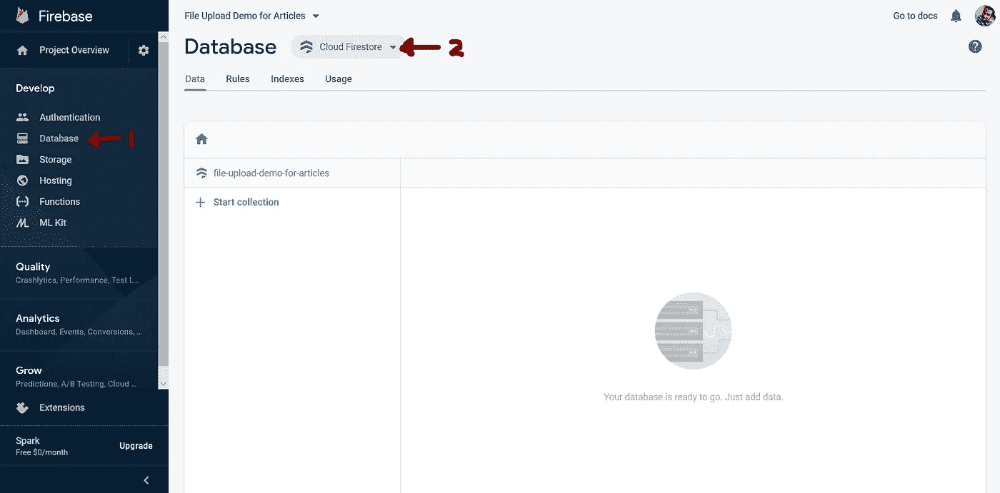

# 第一次在你的 Angular 应用中设置 Firebase

> 原文：<https://javascript.plainenglish.io/set-up-firebase-in-your-angular-app-for-the-first-time-79e0875e504b?source=collection_archive---------2----------------------->


@[codequs.com](https://codequs.com/)

# 介绍

这是一篇短文，告诉你如何第一次为你的 Angular 应用程序设置 Firebase。与早期的过程相比，最新版本的 Firebase 的安装文件有一些小的变化。因此，通过这篇文章，解释了设置 Firebase 的最新方法。

我用一个简单的项目向 firebase 数据库上传数据来解释这一点。

# 步骤 1(设置 Firebase 帐户)

1.  前往[https://console.firebase.google.com/](https://console.firebase.google.com/)，使用您的谷歌账户凭证登录。然后你可以看到这样一个页面。



Fig 1

2.单击“添加项目”并为此项目键入您喜欢的名称。创建项目后，您可以进入您的项目内部，您将在下面找到这个页面。



Fig 2

3.你的应用需要访问密钥才能访问此帐户。若要创建，请单击标有红色“1”的按钮，并输入访问键的名称。然后，您可以在下面看到您需要知道的访问详细信息。



Fig 3

(您需要将这些细节保存在某个地方，因为我们在 Angular 应用程序中配置 firebase 时会再次用到它们)。你以后也可以找到这些细节。

4.如下图所示，转到左侧菜单中的数据库选项，然后选择云 firestore 选项。(然后，有时您可能会被引导选择一些选项并继续。可以读，可以做。然后，它会出现如下图所示。



Fig 4

5.设置规则以授予对数据库的写入权限。在上图中，你可以看到一个菜单项。转到那里，编辑规则如下。

> rules _ version =“2”；
> service cloud . firestore {
> match/databases/{ database }/documents {
> match/{ document = * * } {
> 允许读、写:如果**为真；**
> }
> }
> }

关于火焰基地的一切都结束了。

# 步骤 Angular 应用程序中的配置)

1.  如果你还没有创建一个角度项目，使用下面的命令创建一个

> ng 新 firebase-演示应用程序

2.进入你的项目文件夹，输入下面的命令来安装 firebase 依赖项。

```
npm install --save firebase @angular/fire
```

3.现在转到*src/environments/environment . ts*中的文件，插入您在前面步骤中保存的 firebase 配置详细信息(只有 **firebaseConfig** 对象)。最终 *environment.ts* 会是这个样子。

4.进入***app . module . ts***文件，导入配置文件如下

```
import { AngularFireModule } from '@angular/fire';
import { AngularFireDatabaseModule } from '@angular/fire/database';
import { environment } from '../environments/environment';
import { AngularFirestore } from '@angular/fire/firestore';@NgModule({
        // [...]
    imports: [
        // [...]
        AngularFireModule.initializeApp(environment.firebaseConfig),
        AngularFireDatabaseModule
    ],
    providers:  [AngularFirestore]
```

现在，配置结束了。接下来让我们看看如何做一些 CRUD 操作。

# **步骤 3(进行一些 CRUD 操作)**

在这里，我要做的是，我创建一个简单的表单来获取学生的一些详细信息，将它们保存在 firestore 中，检索它们并显示在一个表中。

1.  使用下面的命令在名为 Entities 的单独包中创建一个模型类。

```
ng g class entities/student --type=model
```

在*src/app/entities/student . model . ts 文件中，*创建一个类，如下所示

```
export class Student {
     id: string;
     name: string;
     age: number;
     address: string;
}
```

2.创建一个服务类来调用 firebase 服务。奔跑

```
ng g service  services/student
```

3.转到 src/app/services/student . service . ts，修改如下。在这里，我们定义了一些方法，这些方法用于调用 firebase 中的相关函数来完成相关任务。

4.让我们创建一个组件来注册和查看学生。

```
ng g component  components/student-registration
```

5.先转到 *app.module.ts* 文件，导入表单模块。

```
//  Other  imports  here
import {  FormsModule  } from '@angular/forms';

@NgModule({
        // [...]
    imports: [
        // [...]
        FormsModule
    ],
```

6.转到 src \ app \ components \ student-registration \ student-registration . component . html 并创建一个如下所示的表单。

7.转到 src \ app \ components \ student-registration \ student-registration . component . ts，代码如下

我已经为这个页面创建了一个在*localhost:4200/register-student 可见的路径。*因此，在 **app-routing.module.ts** 中创建一条如下所示的路线

还有一点，加上这行

> <router-outlet></router-outlet>

在 app.component.html，并删除页面中的所有其他内容。

现在运行应用程序，并前往*localhost:4200/register-student。*你可以看到一个简单的表格。当您提交详细信息时，您可以在数据库中找到它们。此外，您可以使用我在服务文件中定义的方法从数据库中检索数据。

# 结论

通过这篇文章，解释了如何在 Angular 应用程序中配置 firebase。演示了一个简单的数据上传应用程序。这些是你需要知道的基础知识。

在我的下一篇文章中，我将解释如何用 firebase 创建一个图像存储。

关于这一点，不要犹豫问任何问题。

谢谢你。