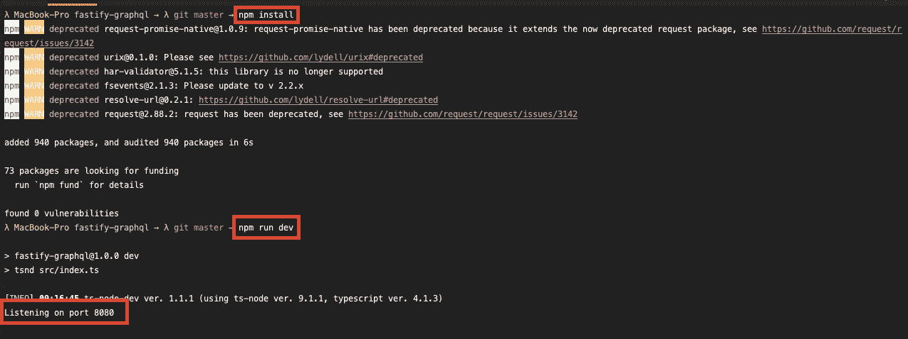
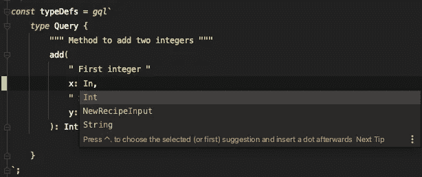
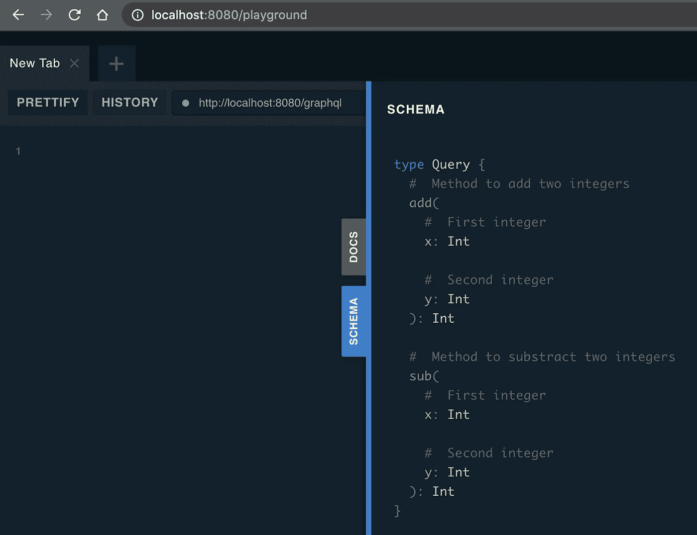
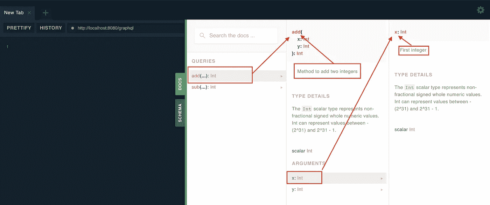
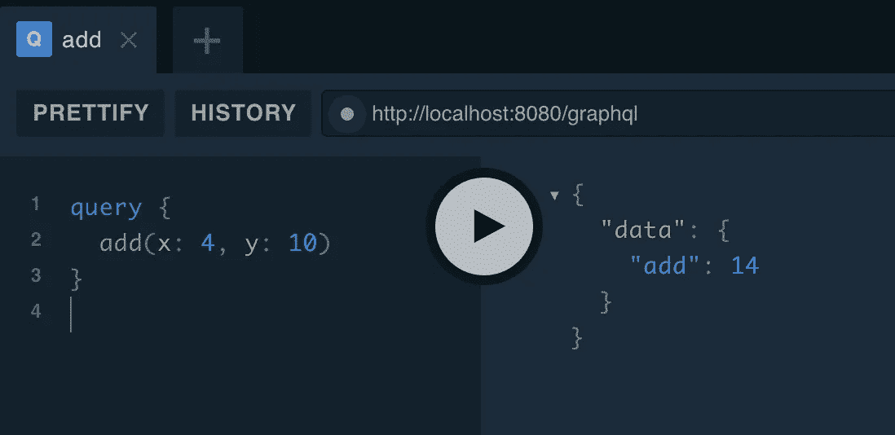
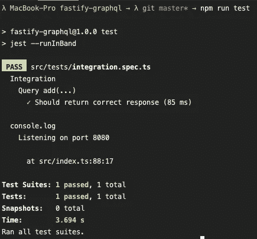

# 用 Fastify、mercurius、TypeScript 和自动化测试设置 GraphQL

> 原文：<https://javascript.plainenglish.io/set-up-graphql-with-fastify-mercurius-typescript-and-automated-testing-f4fc17420945?source=collection_archive---------4----------------------->

在这个简短的教程中，我想向您展示如何设置一个 [Fastify](https://www.fastify.io/) web 服务器，通过 [mercurius](https://github.com/mercurius-js/mercurius) 模块实现 [GraphQL](https://graphql.org/) ，并在使用 TypeScript 的同时使用 [supertest](https://github.com/visionmedia/supertest) 添加第一个自动化测试。


Photo by [Florian Olivo](https://unsplash.com/@florianolv) on [Unsplash](https://unsplash.com/)

为了给你将来的项目提供一些样板文件，并作为本文的参考，我创建了一个小的 GitHub 库，其中包含了本文中提到的所有代码，所以在阅读本文时，一定要克隆它并将其作为参考打开。

[](https://github.com/Abszissex/medium-fastify-graphql) [## abszisex/medium-fastify-graphql

### 使用 mercurius 开始 Fastify 和 GraphQL 的小样本。开始###安装所有模块 npm…

github.com](https://github.com/Abszissex/medium-fastify-graphql) 

首先，我们有一个非常简单的文件结构。在根级别，我们有自己的配置文件，如`tsconfig.json`、`.eslintrc.json`、`jest.config.js`和`package.json`。在我们的正下方只有我们的`src`、`dist`和`node_modules`文件夹，所以这里没有什么特别的东西。

整个源代码(在我们的例子中只有一个`index.ts`)位于`src`文件夹下，在它的正下方有一个包含我们的测试的`test`文件夹。当然，你完全可以根据自己的喜好随意改变结构。我个人喜欢在应该测试的实际实现文件下面有一个测试文件，尽管我在这里做了一点其他的事情。

## 设置项目并启动服务器

正如您已经在`README.md`文件中看到的，在本地机器上启动 Fastify 支持的、用 TypeScript 编写的 GraphQL 服务器非常容易。

只需运行`npm install`安装所有需要的模块，然后通过`npm run dev`启动服务器。在后台，`npm run dev`使用 [ts-node-dev](https://www.npmjs.com/package/ts-node-dev) NPM 包直接运行你的类型脚本文件`src/index.ts`，而不需要事先传输任何文件。



Installing node modules and start the server for the first time

## 其他有用的命令

除此之外，我还在`package.json`中添加了一些其他常用命令来帮助你快速入门:

## 类型定义

不过，关于一般工具/命令的东西已经说得够多了，让我们来看看一些代码。要了解全貌，请确保您已经克隆了存储库，或者至少在第二个窗口中打开了它，这样您就可以了解全貌，因为**我不会查看每个 LoC** 。

除了创建运行实际服务器的`FastifyInstance`之外，我们还需要定义我们的 GraphQL 规范。您可能知道，GraphQL 是基于模式的。使用`mercurius`，你可以直接定义它，也可以使用由`@graphql-tools/schema`模块提供的`makeExecuteableSchema`支持。在我的例子中，我选择了第二个。但这只是一种主观偏好。

对于我们的小型示例服务器，我们希望提供一些简单的`Query`，它公开了一些`add`方法，这些方法接受两个参数并返回两者的总和。

在下面的代码片段中，我们定义了我们的类型定义。此外，永远不要忘记向您的模式中添加适当的文档，以便其他团队(或者甚至是您，当您在几周/几个月后看到它时)知道查询是为了什么，以及期望从参数中得到什么。如果你也检查来自仓库的代码，你会看到我定义了两个变量，它们都包含了一个`type Query`的模式。当您的应用程序变得更大时，根据您当前正在实现的模块来拆分您的模式是一个很好的实践，所以我将很快向您展示如何简单地合并这两个类型定义变量。

模板字符串前面的`gql`是从`mercurius-codegen`包中导入的，它提供了正确的语法高亮显示、关于悬停的文档以及自动完成功能，这可以在下面的截图中看到(我在这里使用的是安装了`JS GraphQL`插件的 WebStorm IDE)。



Autocomplete inside the “gql” template string

## 设置解析器

在我们定义了我们的类型定义之后，我们还必须定义我们的解析器，它们被链接到所提供的模式。在下面的`Query.add`解析器中，我试图提供完整的类型，并且只使用了一个小箭头函数来返回两个提供值的总和。与类型定义一样，我定义了第二个解析器对象，包含第二个类型定义对象的解析器(在这个代码片段中不可见，但是在 repo 内部)。

## 将 GraphQL 添加到 Fastify

在我们为我们的服务器定义了 GraphQL 规范(类型定义+解析器)之后，我们现在必须把它们放在一起。

正如您在下一个片段中看到的，我们首先创建了 Fastify 服务器的一个新实例。您可能会注意到我们在这里使用了`export`,这并不常见，因为这个`app`实例是我们应用程序的主入口点，所以其他文件都不应该使用它。你是对的，但是通过这个简单的改变，我们以后可以很容易地编写我们的集成测试，因为我们可以简单地在测试代码中导入我们的实际服务器，但是稍后会有更多的介绍。

第二步，我们将`mercurius` GraphQL 适配器注册到我们的 Fastify 实例中。通过这样做，我们也在服务器上自动公开了路由`/graphql`,之后我们可以将我们的 GraphQL 查询发送到那里。

对于我们非常简单的用例，我们只设置了`options`对象的两个参数。首先，我们提供了`schema,`，这样我们的服务器就知道应该向外部公开什么(`typeDefs`)以及如何解决它(`resolvers`)。在这里你也可以看到我使用了一些由`@graphql-tools`模块提供的超级简洁的`mergeXXX`方法，这样我们就可以根据模块的结构轻松地拆分类型定义和解析器，然后再合并它们。除此之外，我还将`graphiql`属性设置为`'playground'`。将它设置为这个值告诉`mercurius`适配器我也想在`/playground`下托管 GraphQL Playground(稍后我将展示)。

## GraphQL 游乐场

> 不幸的是，GraphQL 游乐场在 2021 年 7 月 6 日通过以下合并被移除:[https://github.com/mercurius-js/mercurius/pull/453](https://github.com/mercurius-js/mercurius/pull/453)。感谢伯恩哈德·舍恩伯格指出这一点。

既然我们现在已经有了 GraphQL 规范，并且连接到了我们的服务器，那么在我们编写自动化测试用例之前，是时候做一些快速的手工测试了。

首先，让我们通过`npm run dev`启动本地服务器，然后在[http://localhost:8080/Playground](http://localhost:8080/playground)上查看我们的 GraphQL Playground。

查看操场页面的右侧，我们可以看到“文档”和“模式”部分。在“模式”一节中，我们可以对通过两个类型定义变量(包括我们的文档)定义的合并模式有一个简短的了解。



The full schema in the GraphQL Playground

尽管大多数时候使用操场上的“文档”区更方便。在这里，您可以使用一些搜索功能，或者直接选择您想要检查的查询/变异。在下一张图中，我选择了我们的`add`查询，然后选择了它的参数`x`。您可以看到，我们在类型定义中定义的文档字符串，在这里显示为方法和参数。所以，请务必在这里插入好的价值观，让每个人的生活变得更好，只要你好好照顾这里，你就不必写大文档，因为这已经是你自动生成的文档了😉



Full documentation of “query.add”

所以现在是时候快速检查我们的服务器是否真的做了我们期望他做的事情。为此，我们将来到操场的左侧，输入我们的查询，然后点击“Play”按钮。

```
# Example Query
query {
  add(x: 4, y: 10)
}
```

正如您在下图中看到的，服务器响应了我们的求和值(`4 + 10 = 14`)。



Test “query.add” on the GraphQL Playground

## 自动化测试

当然，我们希望我们的服务器将来也能正常工作，当我们或其他人做了一些更改，而没有在每个拉请求上手动检查所有可能的情况时。所以让我们从自动化测试用例开始。

在这种情况下，我不会进行单元测试(尽管我很喜欢单元测试)，而是简单地测试服务器的实际请求/响应。为此，我将使用`supertest`模块。

下面的例子非常简单。注意，我没有在这个代码片段中添加对`query.sub`的测试，因为它与`query.add`的情况非常相似，但是它可以在资源库中找到。

1.  我们创建了一个小助手，它简单地用一个名为`data`的属性将我们期望的响应包装在另一个对象中，因为 GraphQL 规范要求结果应该总是响应对象的`data`键值。
2.  我们添加了一个`beforeEach()`，在这里我们将一直等待我们的 Fastify 实例准备好响应请求。注意，我们从我们的`index.ts`文件中导入了`app`。还记得我在开始时提到过，我们必须导出应用程序，以便在测试中轻松使用它吗？它在这里😉
3.  我们添加一个`describe`块，它应该包含我们对`query.add`端点的所有测试，并添加一个测试用例，其中我们的端点应该返回一个正确的响应。
4.  我们的单一测试用例非常简单。我们创建希望发送到服务器的查询(再次使用`gql`)
5.  我们创造出预期的反应
6.  我们从 4 发送我们创建的查询。到我们在`/graphql`路线上的服务器
7.  我们检查服务器响应是否有状态码`200`，以及响应负载是否与我们的`exptectedResponse`匹配

现在我们已经定义了我们的测试用例，让我们通过简单地输入`npm run test`来运行它:



Passing tests of “integration.spec.ts”

## 结论

我希望我可以向您展示，将 GraphQL 添加到 Fastify 服务器并不复杂，并且我提供的小样本代码可以帮助您在创建一个新的 GraphQL web 服务器时有一个小小的开端，这个服务器已经包含了一些工作林挺和测试设置。

感谢您花时间阅读我的文章。

## 你想联系吗？

如果你想联系我，请在 LinkedIn 上打电话给我。

另外，请随意查看[我的书籍推荐](https://medium.com/@mr-pascal/my-book-recommendations-4b9f73bf961b)📚。

[](https://mr-pascal.medium.com/my-book-recommendations-4b9f73bf961b) [## 我的书籍推荐

### 在接下来的章节中，你可以找到我对所有日常生活话题的书籍推荐，它们对我帮助很大。

mr-pascal.medium.com](https://mr-pascal.medium.com/my-book-recommendations-4b9f73bf961b)