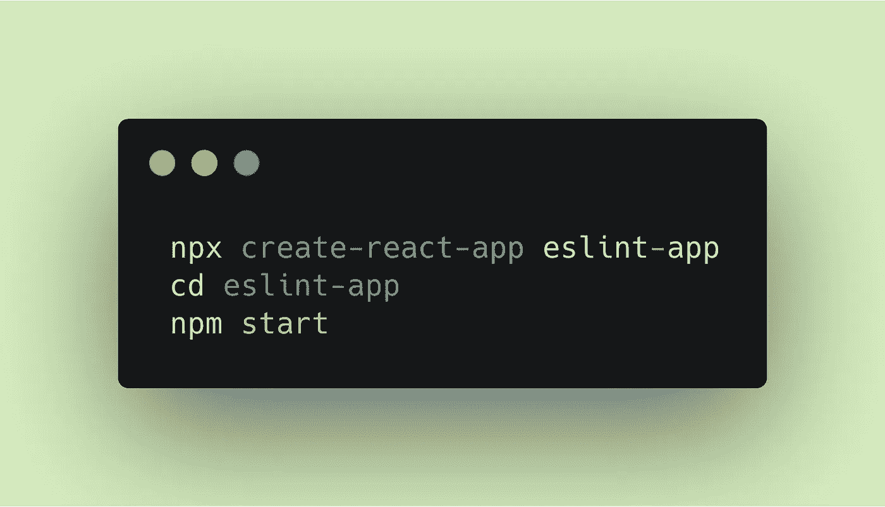
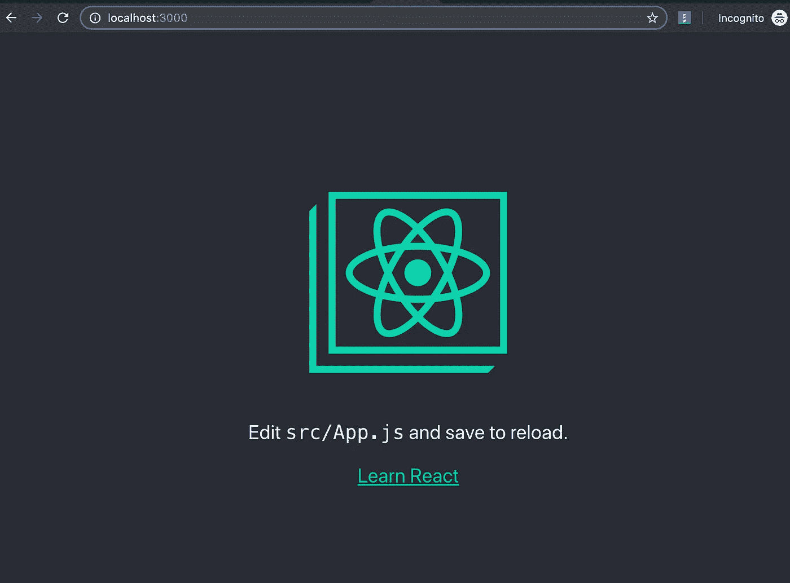
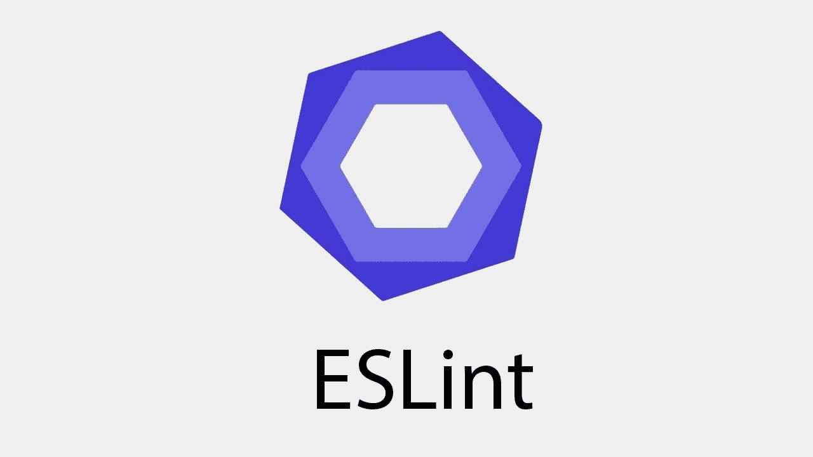
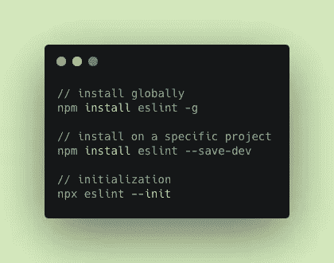
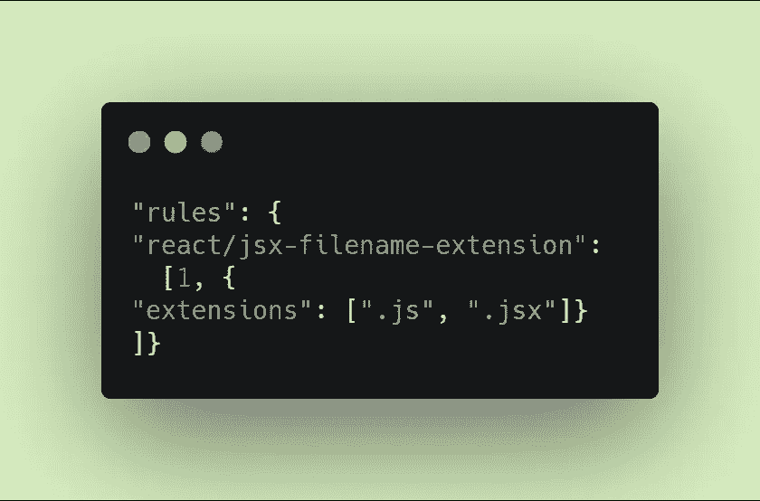
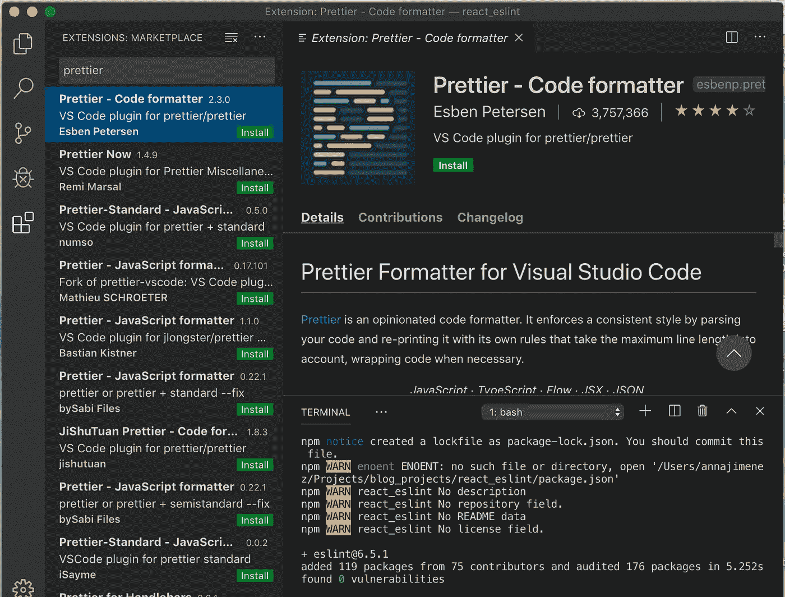
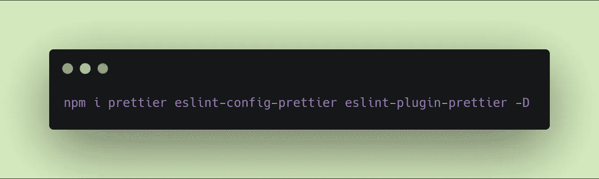
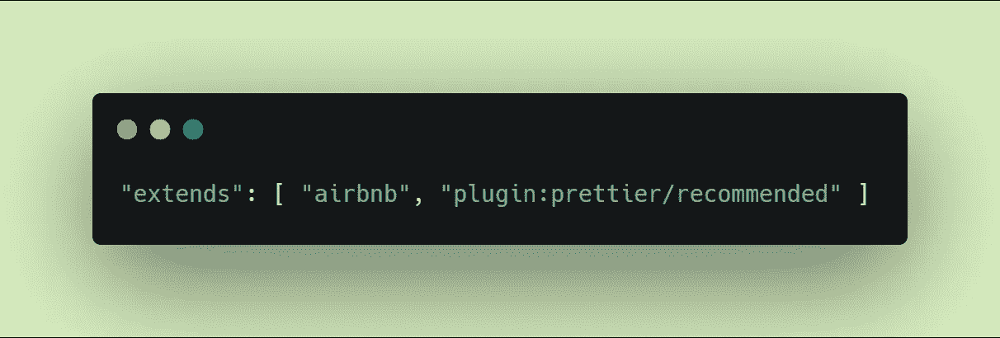
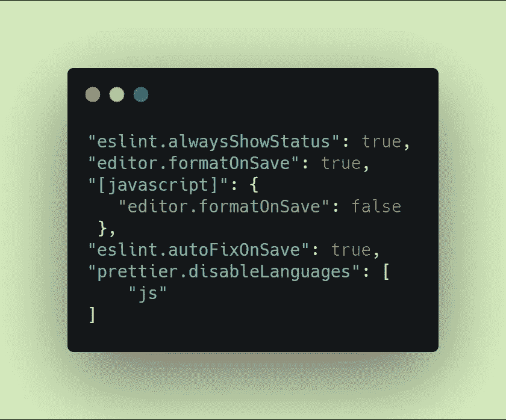
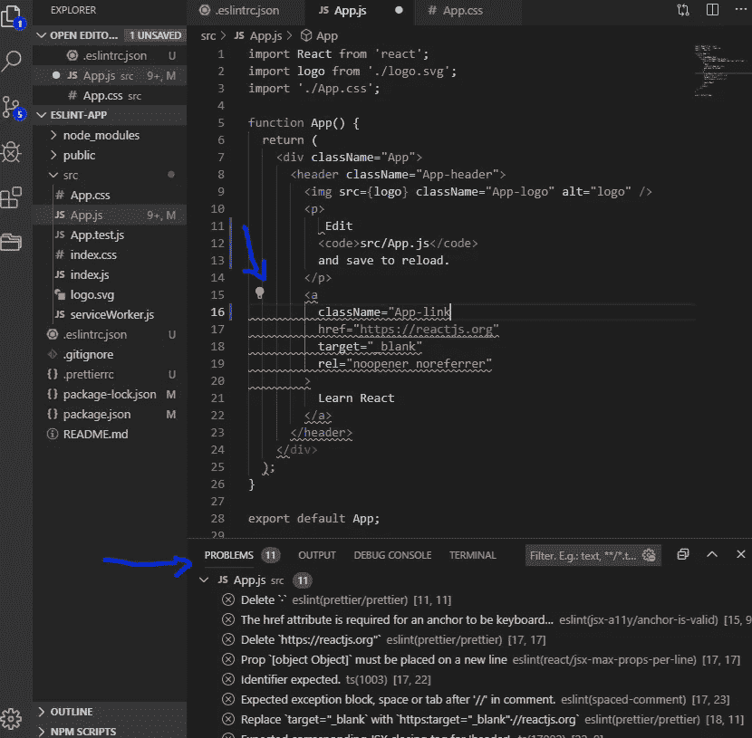

# 与 ESLint、Prettier 和 Airbnb 一起建立 React JS

> 原文：<https://javascript.plainenglish.io/set-up-react-js-with-eslint-prettier-and-airbnb-cc015363a7c7?source=collection_archive---------0----------------------->


改进代码最简单的方法之一就是使用 linter！

不仅提高了💪而且还统一了你团队的代码。每个开发人员都有他/她自己的风格，因此 linter 可以帮助您使您团队的代码对所有人都是可维护和可读的。


**Code Quality**

**但首先，什么是 Lint 或 Linter❓**
它是一个解析器/工具，检查代码并标记程序员输入中的错误、打字错误或任何潜在错误。👩‍💻👨‍💻我发现这对新人调整新代码库特别有帮助，开发人员可以发现他们的错误🐞更快并从中吸取教训。

JS 社区中最流行的 code 林挺工具是 Prettier 和 ESlint。在这个快速教程中，我们将创建一个 ReactJS 应用程序，并使它准备好与 VSCode 中的这些工具一起使用:

> 先决条件:你需要安装 [Visual Studio 代码](https://code.visualstudio.com/)和 [NodeJS](https://nodejs.org/en/) 。

# 创建反应堆应用程序

让我们创建 ReactJS 应用程序，并将其命名为“eslint-app”。我们将使用终端创建应用程序。

1.  打开您的终端，选择您想要安装应用程序的目录，并使用以下命令:

```
npx create-react-app eslint-app 
cd eslint-app 
npm start
```



2.因此，ReactJS 应用程序将出现在您的浏览器中



3.您可以使用 **Ctrl+c** 快捷键来停止您的应用程序运行

# 安装 ESLint



现在让我们用 Visual Studio 代码打开我们的应用程序。你可以通过点击 VSCode 的图标或者在你的终端中输入`code .`来打开它。

我通常更喜欢在 VSCode 内部使用终端。您可以通过进入**视图- >终端**或使用 **Ctrl+`** 快捷方式关闭命令行并在 VSCode 中打开终端。

你可以用两种不同的方式安装 ESLint(我更喜欢在特定的项目上):

1.  全球:`npm install eslint -g`
2.  具体项目:`npm install eslint --save-dev`

要初始化:

*   MAC : `npx eslint --init`
*   视窗:`[.\node_modules\.bin\eslint --init](http://eslint.org/docs/user-guide/command-line-interface)`



在初始化过程中，将会询问您几个问题来设置 eslint 配置文件。

```
 - **How would you like to use ESLint**? To check syntax, find problems, and enforce code style
- **What type of modules does your project use?** JavaScript modules (import/export)
- **Which framework does your project use?** React
Does your project use TypeScript? No
- **Where does your code run?** Browser
**How would you like to define a style for your project?** Use a popular style guide
**Which style guide do you want to follow?** Airbnb ([https://github.com/airbnb/javascript](https://github.com/airbnb/javascript))
**What format do you want your config file to be in?** JSON
```

> 在这个问题之后，eslint 会检查你是否有任何缺少的依赖项，如果有，它会建议你安装它们。就我而言，我错过了 eslint-plugin-react@⁷.14.3 eslint-config-Airbnb @最新 eslint@⁵.16.0 | | ^6.1.0 eslint-plugin-import @ 18.2 eslint-plugin-jsx-a11y@⁶.2.3 eslint-plugin-react-hooks @ 7.0

```
**Would you like to install them now with npm?** Yes
```

因此，您应该已经成功创建了. eslintrc.json 文件，并在您的目录中看到了它

4.通过在. eslintrc.json 中添加规则来覆盖 Airbnb 规则:

```
"rules": {"react/jsx-filename-extension": [1, {"extensions": [".js", ".jsx"]}
]}
```



# 安装更漂亮💅

> 你可以从 [**这里**](https://marketplace.visualstudio.com/items?itemName=esbenp.prettier-vscode) 安装更漂亮的，或者按照以下步骤操作:

1.  在 Visual Studio 代码中，转到视图->扩展。

2.搜索更漂亮的代码格式化程序

3.单击安装



4.现在回到您的终端，安装以下软件包:

```
npm i prettier eslint-config-prettier eslint-plugin-prettier -D
```



5.在您的中更新“扩展”。eslintrc 文件如下:

```
"extends": [ "airbnb", "plugin:prettier/recommended" ]
```



6.如果你不喜欢默认的更漂亮的配置，那么你可以在“ **eslint-app** ”目录下创建一个`.prettierrc`文件，例如:

```
{
  "singleQuote": true,
  "trailingComma": "es5"
}
```


# 每次保存文件时使 VSCode 自动格式化。

1.  使用 Ctrl+，快捷方式或转到文件->首选项->设置。
2.  向下滚动到 settings.json 中的 Edit。它将以 json 格式打开您的 ide 设置:

*   告诉 eslint 总是显示它的状态
*   禁用 js 文件中的格式(我们将通过 EsLint 格式化)
*   除了 JavaScript 之外，在所有文件格式上运行都更漂亮

```
"eslint.alwaysShowStatus": true,
"editor.formatOnSave": true,
"[javascript]": {
   "editor.formatOnSave": false
 },
"eslint.autoFixOnSave": true,
"prettier.disableLanguages": [
    "js"
]
```



现在我们用 ESLint，React，AirBnB 风格成功设置了 React JS app。打开 js 或 css 文件，尝试删除引号或添加额外的空格。你会立刻看到错误自动出现在问题窗口中，并且会有一个灯泡💡以及修复它或禁用该规则的建议。



# 恭喜你！

现在您已经用 ESLint、Prettier 和 Airbnb 风格设置了 ReactJS 项目，您可以保持一致和干净的代码。您还会收到关于林挺和格式问题的通知。

如果你想了解更多，这里有几个链接:

*   [Visual Studio 代码的更漂亮的格式化程序](https://github.com/prettier/prettier-vscode)
*   [Airbnb 风格指南](https://github.com/airbnb/javascript)
*   [ESLint](https://eslint.org/)
*   [漂亮与短绒](https://prettier.io/docs/en/comparison.html)

🌸希望这篇教程对你有所帮助，祝你编码愉快🌸