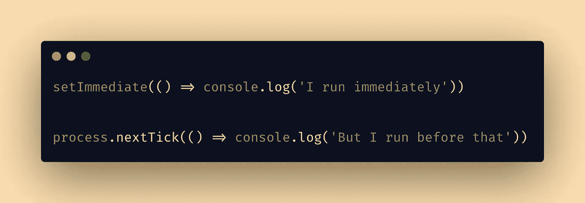
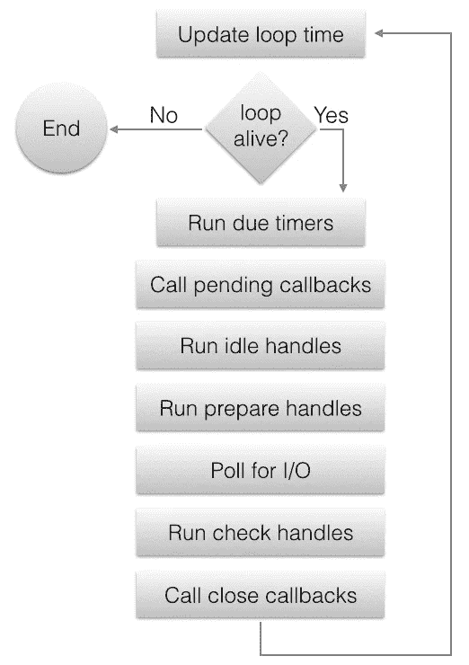

# setImmediate() vs 节点中的 process.nextTick()。射流研究…

> 原文：<https://javascript.plainenglish.io/setimmediate-vs-process-nexttick-in-nodejs-6fbfbebd60a3?source=collection_archive---------5----------------------->

## 理解 setImmediate()和 process.nextTick 的区别以及何时使用 what



Image created using [Carbon](http://carbon.now.sh/)

NodeJs 以其非阻塞、事件驱动的架构而闻名。在 node 中处理异步任务比其他任何服务器编程语言都要容易得多。Node 提供了几个处理异步任务的内置函数。

# 异步性

为了实现异步，节点使用事件循环。事件循环是一个单线程半无限循环，它使用一个事件队列对所有 io 和/或定时器回调进行排队，并按顺序逐个执行它们。事件队列不是单个队列，而是队列和堆的集合。



上图显示了事件循环的执行顺序。每个方框将被称为事件循环的一个阶段。

# 事件循环的阶段

事件循环由以下阶段组成。

*   **定时器** —在此阶段，使用`setTimeout`添加的过期定时器回调或使用`setInterval`添加的间隔功能被执行。
*   **待定回调** —执行延迟到下一次循环迭代的 I/O 回调。
*   **空闲处理程序** —执行一些 libuv 内部的东西，内部使用。
*   **准备处理程序** —在轮询 I/O 之前执行一些准备工作，供内部使用。
*   **I/O 轮询** —检索新的 I/O 事件；执行与 I/O 相关的回调。
*   **检查处理程序**——`setImmediate()`这里调用回调。
*   **关闭回调** —执行关闭处理程序

在本文中，我们将只讨论事件循环的**检查处理程序**阶段。如果你想详细了解事件循环，查看 Deepal 的[事件循环系列](https://blog.insiderattack.net/event-loop-and-the-big-picture-nodejs-event-loop-part-1-1cb67a182810)和官方 nodejs 文档[这里](https://nodejs.org/en/docs/guides/event-loop-timers-and-nexttick/)。

`setImmediate()`和`process.nextTick()`是两个允许我们在事件循环中控制代码执行顺序的函数。这两个函数都在事件队列中调度我们的回调处理程序。但是它们是在事件循环的不同阶段执行的。

# setImmediate()

`setImmediate(callback[, ...args])`获取一个`callback`并将其添加到事件队列(特别是立即队列)。

```
setImmediate(() => console.log('Queued using setImmediate'))
```

使用`setImmediate()`调度的回调将在事件循环的**检查处理程序**阶段执行。

```
console.log('Start')setImmediate(() => console.log('Queued using setImmediate'))console.log('End')
```

上述脚本的输出将是

```
Start 
End 
Queued using setImmediate
```

因为事件循环只有在调用堆栈为空时才开始处理，所以事件队列中排队的回调将在脚本运行完成后处理。

# process.nextTick()

`process.nextTick(callback[, ...args])`也会像`setImmediate()`函数一样带一个`callback`和可选的`args`参数。但是回调在“下一个节拍队列”中排队，而不是“立即队列”。

```
process.nextTick(() => console.log('Queued using process.nextTick'))
```

使用`process.nextTick()`安排的回调将在当前阶段执行后处理。也就是说，在事件循环的每个阶段之间处理下一个节拍队列。此外，一旦脚本运行完成，在事件循环开始之前，将处理下一个节拍队列。

```
console.log('Start')process.nextTick(() => console.log('Queued using process.nextTick'))console.log('End')
```

上述脚本的输出将是

```
Start 
End 
Queued using process.nextTick
```

# set immediate()vs process . next tick()

现在我们来看看`setImmediate()`和`process.nextTick()`的区别以及什么时候用哪个。

1.  `setTimeout()`在**检查处理程序**阶段处理，`process.nextTick()`在事件循环和事件循环各阶段之间的**开始时处理。**
2.  在任何给定的上下文中，`process.nextTick()`的优先级高于`setImmediate()`。

```
setImmediate(() => console.log('I run immediately'))process.nextTick(() => console.log('But I run before that'))
```

输出:

```
But I run before that 
I run immediately
```

3.如果在给定阶段调用了`process.nextTick()`，那么传递给`process.nextTick()`的所有回调都将在事件循环继续之前得到解决。如果`process.nextTick()`被递归调用，这将阻塞事件循环并产生 **I/O 饥饿**。

```
let count = 0const cb = () => {
    console.log(`Processing nextTick cb ${++count}`)
    process.nextTick(cb)
}setImmediate(() => console.log('setImmediate is called'))
setTimeout(() => console.log('setTimeout executed'), 100)process.nextTick(cb)console.log('Start')
```

输出:

```
Start
Processing nextTick cb 1
Processing nextTick cb 2
Processing nextTick cb 3
Processing nextTick cb 4
Processing nextTick cb 5
Processing nextTick cb 6
Processing nextTick cb 7
Processing nextTick cb 8
Processing nextTick cb 9
Processing nextTick cb 10
...
```

如您所见，对`process.nextTick()`的递归调用被连续处理，I/O 被耗尽。所以`setImmediate()`和`setTimeout()`回调不会被执行。

4.与`process.nextTick()`不同，对`setImmediate()`的递归调用不会阻塞事件循环，因为每次递归调用只在下一次事件循环迭代时执行。

```
let count = 0const cb = () => {
    console.log(`Processing setImmediate cb ${++count}`)
    setImmediate(cb)
}setImmediate(cb)
setTimeout(() => console.log('setTimeout executed'), 100)console.log('Start')
```

输出:

```
Start
Processing setImmediate cb 1
Processing setImmediate cb 2
Processing setImmediate cb 3
Processing setImmediate cb 4
...
Processing setImmediate cb 503
Processing setImmediate cb 504
setTimeout executed
Processing setImmediate cb 505
Processing setImmediate cb 506
...
```

在这里，即使`setImmediate()`被递归调用，它也不会阻塞事件循环，并且在指定的超时之后执行`setTimeout()`回调。

# 用例

作为官方文件，总是使用`setImmediate()`。

> 我们建议开发人员在所有情况下都使用 setImmediate()，因为它更容易推理。

那么什么时候用`process.nextTick()`？

考虑下面的代码片段。

```
function readFile(fileName, callback) { if (typeof fileName !== 'string') {
        return callback(new TypeError('file name should be string'))
    } fs.readFile(fileName, (err, data) => {
        if (err) return callback(err) return callback(null, data)
    })
}
```

这段代码的问题是`readFile()`可以根据输入参数同步或异步。这可能会导致不可预测的结果。

那么如何才能做到 100%异步呢？`process.nextTick()`这里可以帮到我们。

使用`process.nextTick()`我们可以像这样重写函数。

```
function readFile(fileName, callback) { if (typeof fileName !== 'string') {
        return process.nextTick(
            callback, 
            new TypeError('file name should be string')
        )
    } fs.readFile(fileName, (err, data) => {
        if (err) return callback(err) return callback(null, data)
    })
}
```

现在这个函数是完全异步的。现在，如果文件名不是字符串，它将抛出一个错误，只是在运行脚本完成之后，事件循环开始之前。

`process.nextTick()`在脚本运行完成后必须立即执行回调的其他情况下也很有用。

# 结论

`process.nextTick()`和`setImmediate()`允许用户在事件循环中安排回调。`process.nextTick()`在事件循环的每个阶段后处理，而`setImmediate()`仅在事件循环的检查处理程序阶段处理。

这两个函数的名称令人困惑。`process.nextTick()`在同一阶段立即触发，而`setImmediate()`在事件循环的下一次迭代或“滴答”时触发。

*原载于*[*https://jinoantony.com*](https://jinoantony.com/blog/setimmediate-vs-process-nexttick-in-nodejs)*。*