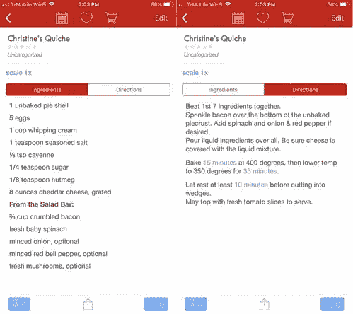

# 。setState()不起作用？浅层拷贝与深层拷贝& Lodash

> 原文：<https://javascript.plainenglish.io/setstate-not-working-shallow-copy-vs-deep-copy-lodash-55a015db80ff?source=collection_archive---------2----------------------->

在 React 和 Redux 中，当你试图更新状态时，有时它就是不起作用。也许它已经在其他案例中发挥了作用。当你通过[…预操作符]、Object.assign()和任何其他你能在互联网上找到的复制方法时，你开始质疑你的理智。不幸的是，问题不在于你的复制方法，而在于你的复制类型——你可能需要深层复制而不是浅层复制。

> 这里的例子具体到 React 和 Redux，但是理解浅层和深层副本是有价值的计算机科学知识，Lodash 可以用于任何 JavaScript 项目。

# 浅层拷贝与深层拷贝


如上图所示，浅层拷贝(或“克隆”)只引用原始对象内部的对象，但深层克隆也会克隆内部对象。换句话说，浅层克隆只复制对象的顶层。让我们将其与现实生活中的例子进行比较。

## 浅拷贝

假设你第一次有了自己的网飞账户，所以你没有喜欢的节目或电影。你向你最好的朋友寻求建议，你喜欢你朋友列表上的每一个网飞项目。(这比制作浅层克隆要多得多，所以忽略这部分。)现在你和你的朋友在网飞有了相同的“我的清单”。

你复制了你朋友的名单。它们是独立的，您可以在自己的列表中添加或删除节目，而不会影响其他人的列表。然而，它们是肤浅的，因为它们引用相同的对象——也就是说，如果网飞出于某种原因改变了列表中的某个对象，该对象也会在您的列表和您朋友的列表中被改变。你没有自己制作电影和电视剧的拷贝。


If you copy my Netflix, it is a shallow copy, because you are not making copies of each program. Changes to the shows and programs will also change your list.

## 深层拷贝

另一方面，大多数技术以外的例子都是深度拷贝。如果你复制了一份家庭食谱，你可以像上面的浅层副本一样添加和删除配料，但你也可以改变预先存在的配料而不影响食谱的其他副本。如果我决定我的胡萝卜蛋糕需要的葡萄干比我妈妈的少，改变我食谱上的葡萄干数量不会改变我妈妈的食谱上的数量。这是一份深度拷贝。



This recipe is a deep copy — changing the objects inside this recipe will not change the original recipe.

## 摘要

浅层副本包含引用，深层副本包含这些引用的自身副本。

# 为什么它很重要

在 React 和 Redux 中，您的应用程序只有在通过检测到状态变化时才会更新。setState()或 reducer。浅层拷贝可以在调用这两个状态之前改变状态*，所以当它们被调用时，旧的状态看起来等于新的状态，并且你的元素不会被更新。*

这就是为什么(您可能已经注意到了)，当您在更新状态时遇到问题时，在应该更新的状态*之前使用 console.log()会显示状态已经更改为您想要的更新。但是因为这发生在错误的时间，React 和 Redux 不会注意到它，您也不会在页面上看到结果。*

# 修复方法——洛达什


The Lodash Logo

Lodash 附带 React，但是如果它不在您的包 lock.json 中，您可以使用 NPM 轻松地添加它。

```
npm i -g npmnpm i --save lodash
```

如果这不起作用，试试 Lodash.com 的[或搜索互联网。接下来，定义](https://lodash.com/)

```
*var* _ = require('lodash');
```

在我的类组件中，我必须在类之外定义它。是的，变量名是“_”明白了吗？洛达什？这是一个低破折号！

最后，如果需要深度克隆，只需使用

```
_.cloneDeep(theObjectThatNeedsCloningHere)
```

# 结论

尝试一下这个函数，感受一下它是如何工作的。持续关注对象内部的对象在深层和浅层拷贝中的反应。总的来说，这种方法帮助我更快地写出成功的代码，并使我的代码更容易阅读。

编码快乐！