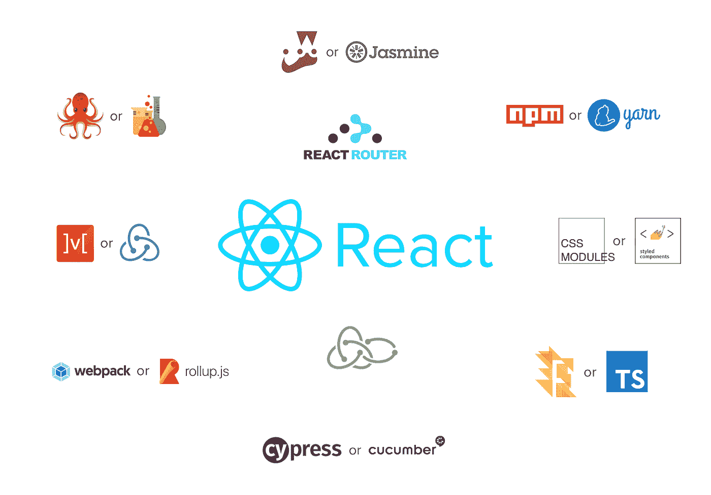

# 设置大规模的 React 应用程序

> 原文：<https://javascript.plainenglish.io/setting-up-a-large-scale-react-application-2d50bc8a5ddb?source=collection_archive---------0----------------------->



这篇文章基于系列文章:*用 React* 更新 jQuery 前端。如果你想更好地了解这篇文章的动机，我们建议你首先阅读我们的[初始文章](https://medium.com/@bensampaio/8598b252ceb3)。

如今，建立一个小的 React 应用程序，或者从头开始创建一个应用程序是非常容易的。尤其是如果你使用 [create-react-app](https://github.com/facebook/create-react-app) 的话。大多数项目可能只需要一些依赖项(例如，状态管理和国际化)和一个至少包含一个`components`文件夹的`src`文件夹。我猜大多数 React 项目都是这样开始的。然而，通常情况下，随着项目的增长，依赖项、组件、缩减器和其他共享工具的数量往往会以一种有时不受控制的方式增长。当不再清楚为什么需要一些依赖关系或者它们如何协同工作时，你会怎么做？或者当您有这么多组件时，很难找到您需要的组件？当你想找一个组件，但又不记得它的名字时，你会怎么做？

这些只是我们在 [Karify](https://www.karify.com/) 重建前端时遇到的一些问题的例子。我们知道依赖项和组件的数量最终将会失控。这意味着我们需要一个足够可扩展的计划来跟上未来的发展。这个计划包括为我们的文件和文件夹结构、代码质量以及整体架构定义约定。最重要的是，所有这些应该很容易被新开发人员掌握，而不需要他们对我们所有的依赖和代码风格有太多的了解。

在写作的时候，我们有大约 1200 个 JavaScript 文件，其中 350 个是单元测试覆盖率为 80%的组件。因为我们仍然相信我们创建的架构和约定，所以我们认为分享它们是个好主意。在接下来的部分中，我将介绍我们如何建立我们的项目，以及我们学到的一些经验。

# 如何整理文件和文件夹？

我们经历了多个阶段，直到我们想出如何组织我们的 React 前端。最初，我们考虑将它放在与 jQuery 前端相同的存储库中。然而，我们的后端框架强加的文件夹结构使得这个选项不受欢迎。接下来，我们考虑将它转移到一个单独的存储库中。这一开始工作得很好，但随着时间的推移，我们开始考虑创建其他前端，如 React 原生前端，这激发了对组件库的需求。这导致我们将这个新的存储库分成两个独立的存储库:一个用于组件库，另一个用于新的 React 前端。尽管这看起来是个好主意，但它导致了一个非常复杂的审查过程。两个存储库中的变化之间的关系变得不清楚。最后，我们选择将它们合并到一个存储库中，但这次是作为 monorepo。

我们选择 monorepo 是因为我们想在组件库和前端应用程序之间建立一个分离。我们的 monorepo 和其他 mono repo 的区别在于，我们不需要在它里面发布包。对我们来说，包只是作为模块化和关注点分离的一种手段。为每个不同的应用程序提供不同的包是非常有用的，因为我们可以为每个应用程序指定不同的依赖项和脚本。

我们使用 [yarn workspaces](https://classic.yarnpkg.com/en/docs/workspaces/) 在我们的 root `package.json`中设置了我们的 monorepo:

```
"workspaces": [
    "app/*",
    "lib/*",
    "tool/*"
]
```

现在你们中的一些人可能想知道为什么我们不像其他 monorepos 一样简单地使用 packages 文件夹。主要是因为我们想在应用程序和组件库之间建立一个分离。除此之外，我们也知道我们需要创建一些我们自己的工具。因此，我们提出了您在上面看到的文件夹，下面是对每个文件夹的解释:

*   **app** :这个文件夹里的所有包都指前端应用，比如我们的 Karify 前端，一些内部前端，还有我们的[故事书](https://storybook.js.org/)；
*   **lib** :这个文件夹中的所有包都向我们的前端应用程序公开共享的工具，并且尽可能与应用程序无关。这些包基本上构成了我们的组件库。一些例子将是我们的`typography`、`media`和`primitive`包；
*   **tool** :这个文件夹中的所有包都是 Node.js 特有的，或者公开我们自己创建的工具，或者是我们依赖的工具的配置和实用程序。例如 webpack 实用程序、linter 配置和文件系统 linter。

不管我们把它们放在哪里，我们所有的包总是有一个 **src** 文件夹，并且可选地有一个 **bin** 文件夹。我们的 **app** 和 **lib** 包的 **src** 文件夹可能包含以下一些文件夹:

*   **actions** :包含 action creator 函数，其返回值可以从`redux`或`useReducer`传递给 dispatch 函数；
*   **组件**:包含组件文件夹以及它们各自的定义、翻译、单元测试、快照和故事(如果适用的话)；
*   **常量**:保存在不同环境和不同工具中重用的常量值；
*   **fetch** :保存来自我们 API 的有效负载的类型定义，以及检索它们的相应异步操作；
*   **助手**:持有不适合任何其他类别的实用程序；
*   **减速器**:包含在我们`redux`店或`useReducer`使用的减速器；
*   **路线**:保存用于`react-router`组件或`history`功能的路线定义；
*   **选择器**:包含从我们的`redux`状态或我们的 API 有效载荷中读取或转换数据的辅助函数。

这种文件夹结构允许我们编写真正模块化的代码，因为它在由依赖关系定义的不同概念之间创建了清晰的关注点分离。这有助于在存储库中查找变量、函数或组件，而不管我们是否知道它们存在。此外，它还有助于将这些文件夹的内容保持在最少，从而使它们更容易处理。

这种新的文件夹结构的一个挑战是确保我们坚持它。人们很容易开始在不同的包中创建不同的文件夹，并在它们之间以不同的方式组织文件。虽然这可能不总是一个坏主意，但如果我们不坚持这样做，我们最终会陷入混乱。为了帮助解决这个问题，我们创建了一个文件系统 linter，我将在下一节更详细地描述它。

# 如何实施风格指南？

同样，我们希望有一个一致的文件和文件夹结构，我们也希望在我们的代码中有尽可能多的一致性。这一点我们在 jQuery 前端已经做得很好了，但是还可以改进，特别是在 CSS 方面。因此，我们试图从一开始就定义一个风格指南，并用 linter 来执行它。不能用 linter 指定的规则在代码审查期间被强制执行。

在 monorepo 中设置 linter 与在任何其他存储库中一样，这很好，因为您可以运行它一次来验证整个存储库。如果你不熟悉任何棉绒，我推荐你看看我们使用的 [ESLint](https://eslint.org/) 和 [Stylelint](https://stylelint.io/) 。

事实证明，JavaScript linter 对以下用例特别有用:

*   在它们的 HTML 对应物上强制使用可访问性感知组件:在设计过程中，我们为锚、按钮、图像和图标定义了几个可访问性指南。然后在代码中，我们希望实现那些指导方针，并确保我们在将来不会忘记它们。我们使用来自 [eslint-plugin-react](https://github.com/yannickcr/eslint-plugin-react) 的[react/banner-elements](https://github.com/yannickcr/eslint-plugin-react/blob/master/docs/rules/forbid-elements.md)规则来实现这一点。它看起来像什么的例子:

```
'react/forbid-elements': [
    'error',
    {
        forbid: [
            {
                element: 'img',
                message: 'Use "<Image>" instead. This is important for accessibility reasons.',
            },
        ],
    },
],
```

*   禁止从库包内部导入应用程序包，禁止从其他应用程序内部导入应用程序包:主要是为了避免 monorepo 中的包之间的循环依赖，并确保我们坚持我们创建的关注点分离。我们通过 [eslint-plugin-import](https://github.com/benmosher/eslint-plugin-import) 中的[import/no-restricted-paths](https://github.com/benmosher/eslint-plugin-import/blob/master/docs/rules/no-restricted-paths.md)规则禁止这种情况。

除了 JavaScript 和 CSS 林挺，我们还有自己的文件系统 linter。这就是我们如何确保我们坚持我们的文件夹结构。既然这个棉绒是我们的，如果我们决定改变结构，我们随时可以改变它。以下是我们的一些规则示例:

*   验证组件文件夹的结构:确保总有一个`index.ts`和一个`.tsx`文件与文件夹同名。
*   验证我们的`package.json`文件:确保每个包都有一个，并且设置为私有，以避免我们意外发布包。

# 使用什么类型的系统？

如今，以上问题的答案，大家大概都清楚了很多。简单地去找[打字稿](https://www.typescriptlang.org/)！不管你的项目有多大，在某些情况下它可能会降低你的速度，但是，在我们看来，它为你的代码增加的质量和严格性是值得的。

不幸的是，当我们开始这个项目时，使用[道具类型](https://github.com/facebook/prop-types)仍然非常普遍。开始的时候，这就足够了，但是随着项目的增长，我们真的开始错过了定义不仅仅是组件的类型的可能性。我们可以看到它们会增加的价值，例如，我们的缩减器和选择器功能。然而，添加不同的类型系统将需要大量的重构，以便达到整个代码库都有类型的程度。

最终，我们还是这样做了，但是我们犯了一个错误，首先尝试了[流](https://flow.org/)，因为它看起来更容易集成到我们的代码库中。虽然这是真的，但 Flow 也变得很难使用，因为它没有很好地与我们的 IDE 集成，它随机地不能发现一些类型错误，并且创建泛型类型是一场噩梦。出于这些原因，我们最终将所有东西都转移到了 TypeScript。如果我们当时知道我们现在所知道的，我们会从一开始就使用 TypeScript。

TypeScript 在过去几年中的发展方向有助于使这种转变更加容易。[对 TSLint 胜过 ESLint](https://medium.com/palantir/tslint-in-2019-1a144c2317a9) 的反对对我们特别有用。

# 使用什么样的测试方法？

当我们开始的时候，对我们来说使用什么样的测试工具并不十分明显。如今，我会说 [jest](https://github.com/facebook/jest) 和 [cypress](https://github.com/cypress-io/cypress) 分别是单元测试和集成测试的最佳选择。它们的配置有据可查，并不复杂。只可惜 cypress [不支持 Fetch API](https://github.com/cypress-io/cypress/issues/95) ，它的 API [也不支持 async /await](https://github.com/cypress-io/cypress/issues/1417) 。一开始我们花了一些时间才弄明白。希望这在不久的将来会有所改变。

起初，找出如何为我们的应用程序编写最佳单元测试是相当困难的。随着时间的推移，我们尝试了像[快照测试](https://jestjs.io/docs/en/snapshot-testing)、[测试渲染器](https://reactjs.org/docs/test-renderer.html)、[浅层渲染器](https://reactjs.org/docs/shallow-renderer.html)和[测试库](https://testing-library.com/)这样的东西。最终，我们决定坚持使用浅层渲染器来验证组件的输出，并使用测试渲染器来测试组件的内部逻辑。

在我们看来，测试库对于小项目来说很棒，但是它依赖于 dom 呈现器的事实对测试的性能有很大的影响。此外，我们认为[反对浅层渲染快照测试的论点](https://kentcdodds.com/blog/why-i-never-use-shallow-rendering)在组件层非常深的情况下没有意义。对我们来说，这些快照对于验证组件所有可能的输出非常有用。但是，保持它们的可读性是很重要的。这可以通过保持组件较小以及为与快照无关的对象属性定义`toJSON`方法来实现。

为了保持我们编写单元测试的动力，并且不忘记它们，我们还定义了一个[覆盖阈值](https://jestjs.io/docs/en/configuration#coveragethreshold-object)。使用 jest 时，这很容易配置。你不需要想太多。从全局阈值开始，并随着时间的推移不断改进。我们从 60%开始，随着时间的推移，随着覆盖率的增加，我们将阈值提高到 80%。对我们来说，这似乎是一个足够好的阈值，因为我们也不认为 100%的目标是现实的或必要的。

# 如何引导应用程序？

通常，启动一个 React 应用程序就像编写类似`ReactDOM.render(<App />, document.getElementById(‘#root’));`的东西一样简单。然而，当您还想支持 SSR(服务器端呈现)时，这就变得更加复杂了。此外，如果您还需要 React 之外的其他依赖项，它们可能需要客户端和服务器端的单独配置。例如，我们使用 [react-intl](https://github.com/formatjs/formatjs/tree/master/packages/react-intl) 进行国际化，使用 [react-redux](https://github.com/reduxjs/react-redux) 进行全局状态管理，使用 [react-router](https://github.com/ReactTraining/react-router) 进行路由，使用 [redux-sagas](https://github.com/redux-saga/redux-saga) 管理异步操作。这些依赖项需要一些设置，这很容易变得复杂。

我们对这个问题的解决方案基于[策略](https://sourcemaking.com/design_patterns/strategy)和[抽象工厂](https://sourcemaking.com/design_patterns/abstract_factory)设计模式。我们基本上创建了两个不同的类/策略:一个用于客户端配置，一个用于服务器端配置。它们都接收被引导的应用程序的配置，包括其名称、徽标、reducers、路由、默认语言、sagas 等。在我们的 monorepo 中，reducers、routes 和 sagas 可以来自不同的包。然后，这个配置用于创建 redux 存储、创建 sagas 中间件、创建路由器历史对象、获取翻译并最终呈现应用程序。举例来说，下面是我们两种策略签名的简化版本:

```
type BootstrapConfiguration = {
  logo: string,
  name: string,
  reducers: ReducersMapObject,
  routes: Route[],
  sagas: Saga[],
};class AbstractBootstrap {
  configuration: BootstrapConfiguration;
  intl: IntlShape;
  store: Store;
  rootSaga: Task;abstract public run(): void;
  abstract public render<T>(): T;
  abstract protected createIntl(): IntlShape;
  abstract protected createRootSaga(): Task;
  abstract protected createStore(): Store;
}// Strategy for client-side
class WebBootstrap extends AbstractBootstrap {
  constructor(config: BootstrapConfiguration);
  public render<ReactNode>(): ReactNode;
}// Strategy for server-side
class ServerBootstrap extends AbstractBootstrap {
  constructor(config: BootstrapConfiguration);
  public render<string>(): string;
}
```

我们发现这种分离很有用，因为根据环境的不同，我们的商店、传奇、国际化对象和历史对象的设置有一些不同。例如，客户端的 redux store 是使用来自服务器的预加载状态和 [redux devtools enhancer](https://github.com/zalmoxisus/redux-devtools-extension#usage) 创建的，而在服务器端则不需要这些。另一个例子是我们的内部化对象，它在客户端从 [navigator.languages](https://developer.mozilla.org/en-US/docs/Web/API/NavigatorLanguage/languages) 获取当前语言，而在服务器端从[Accept-Language HTTP header](https://developer.mozilla.org/en-US/docs/Web/HTTP/Headers/Accept-Language)获取当前语言。

值得注意的是，我们不久前已经提出了这个解决方案。当时，在 React 应用程序中使用类仍然非常普遍，而且对于 SSR 没有简单的解决方案。随着时间的推移，React 向功能性更强的风格转变，出现了像 [Next.js](https://nextjs.org/) 这样的解决方案。关于这一点，如果你正在寻找同样问题的解决方案，我们建议你也看看现在有什么可能，因为你可能会找到一个更简单和更有效的方法。

# 如何维护代码质量？

Linters、tests 和 types 对于提高代码质量很有用，但是在将一些更改合并到主分支之前，很容易忘记检查它们是否都是有效的。最好的解决方案是自动完成这项工作。有些人喜欢在每次提交时这样做，git 钩子阻止你提交，除非一切都通过。然而，我们认为这太麻烦了，因为你可能在一个分支上工作几天，直到它准备好。出于这个原因，我们使用 CI(持续集成)管道来验证我们的提交，CI 管道仅在分支与合并请求相关联时运行。通过这种方式，我们避免了运行预计会失败的管道，因为大多数情况下，我们只在认为代码准备就绪时才创建合并请求。

我们的管道从安装所有的依赖项开始，然后验证类型，运行 linters，运行单元测试，构建应用程序，运行 cypress 测试。几乎所有这些都是并行发生的。如果这些步骤中的任何一个失败了，那么管道就会失败，分支就不能被合并。下面是一个正在运行的管道的示例。


建立这条管道最困难的部分过去是，现在仍然是，保持它的速度。我们经历了许多优化阶段，目前它已经稳定运行在 20 分钟左右。我们也许可以通过并行运行一些 cypress 测试来改进这一点，但是目前来说，这是可以接受的。

# 结论

建立一个 React 大规模应用程序并不容易。你必须做出很多选择，配置很多工具。如何做到这一点，没有唯一正确的答案。

我们仍然对我们的设置很满意，我们希望它能激励其他正在努力设置自己的应用程序的人。但在你效仿我们之前，请确保这是适合你或你的公司的设置。最重要的是，只添加您需要的依赖项。不要把它过分复杂化。

如果你对这里的内容有任何问题、反馈或建议，我很乐意在下面的评论区听到你的意见。