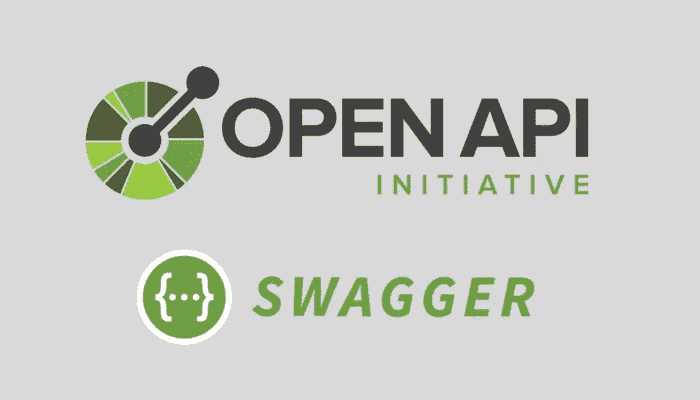

# 使用斯瓦格 3.0 设置快递服务

> 原文：<https://javascript.plainenglish.io/setting-up-an-express-service-using-swagger-3-0-89733aa1ab5d?source=collection_archive---------3----------------------->



这是一个使用 swagger 3.0 设置简单快递服务的快速教程。

如果你想直接进入代码，这是 Github 的报告:[https://github.com/nkhil/swagger-3-setup](https://github.com/nkhil/swagger-3-setup)。

注意:*如果你想知道为什么创建 API 定义可能是一个好主意，* [*这是一个很好的解读*](https://swagger.io/blog/api-development/why-you-should-create-an-api-definition/) *。*

我发现斯瓦格 3.0 最大的优势是:

*   现成的请求和响应验证
*   替换路由器的操作处理程序

# 请求和响应验证

假设我们的服务有一个名为`/healthcheck/ready`的 GET 路由，我们调用它来确定服务的就绪性。

我们不希望只有任何人调用这个路由，所以我们需要在头部有一个授权令牌。斯瓦格让我们自动检查头中的授权，并抛出 400(畸形的请求)，而不编写任何额外的代码。

同样，如果`/healthcheck/ready`路线对身体`{ "ready": true }`返回 200 响应，而我们错误地对`{ "status": "ready" }`做出响应，我们会自动捕捉到并抛出错误。

这也使得我们的服务在不编写样板验证代码的情况下更容易测试。

# 操作处理程序

代替传统的路由器，斯瓦格让我们直接在斯瓦格 yaml 文件中定义功能。向下滚动以查找示例

# 从基本的快递服务开始

这里[是您可以克隆的一个分支，它从基本快递服务](https://github.com/nkhil/swagger-3-setup/tree/express-scaffolding)开始。

# 添加霸气定义

在项目的根目录下添加一个`definitions`文件夹，并添加一个带有项目名称的`.yaml`文件——在这种情况下将是`swagger-three-setup.yml`。

让我们从第一条路线开始:`/healthcheck/ping`

这篇文章太长了，所以我把它放在了另外一个分支上:https://github . com/nkhil/swag-3-setup/blob/swag-begin/definitions/swag-3-setup . yml。

`paths`部分现在有了新的路线定义，接下来是`components`部分，包括`responses`、`parameters`和`schemas`。这基本上让我们可以重用我们的定义(保持我们的定义干燥)，也有助于保持招摇的可读性。

复制`swagger-three-setup.yaml`的内容并粘贴到[http://editor.swagger.io/](http://editor.swagger.io/)中，以查看您的定义的可视化表示。

我们的`/healthcheck/ping`路由要求`x-correlation-id`出现在报头中，并且它需要是一个 UUID ( [通用唯一标识符](https://en.wikipedia.org/wiki/Universally_unique_identifier))。

你会注意到在我们下面的路径定义中，我们有一个属性`x-eov-operation-id`和`x-eov-operation-handler`。我们很快会回到这个话题。

在`src/index.js`文件中，我们现在将安装`express-openapi-validator`包，它允许我们实时验证请求和响应。

在您的`./src`文件夹中创建一个名为`handlers`的文件夹，我们可以用它来添加处理程序。

下面是开放 API 验证器的设置代码(放在`./src/index.js`文件中):

注意我们是如何传入`apiSpec`的，这是我们的 swagger `.yml`文件的位置。`OpenApiValidator`接受我们的定义，并确保任何传入的请求和传出的响应与我们指定的定义相匹配。

好了，我们快到了。在之前创建的`./src/handlers`文件夹中设置一个名为`healthcheck.js`的文件，并将它添加到那里:

我们已经在前面指定了操作处理程序和 id:

```
/healthcheck/ping:
    get:
      description: Returns the readiness of the service
      operationId: ping
      x-eov-operation-id: ping
      x-eov-operation-handler: healthcheck
```

我们昂首阔步的`x-eov-operation-handler`叫做`healthcheck`，我们的`x-eov-operation-id`叫做`ping`。

`OpenApiValidator`意识到了这一点，并将所有传入`/healthcheck/ping`的请求自动路由到`ping`功能。

# 测试设置

1.  运行`npm run develop`,这会加速我们的服务器
2.  打开 Postman 向这个端点发送请求，并尝试向`localhost:8080/healthcheck/ping`发送一个`GET`请求

我们得到一个带有以下错误的`400 Bad Request`状态代码:

```
Bad Request: request.headers should have required property &#39;x-correlation-id&#39;<br> &nbsp; &nbsp;at Object.GET-/healthcheck/ping-not_provided (/Users/nikhil/Sandbox/swagger-3-setup/node_modules/express-openapi-validator/dist/middlewares/openapi.request.validator.js:92:31)

// note: This is only part of the error message
```

正如我们的 swagger 中所指定的，甚至在我们的请求命中`ping`函数之前，它就被验证是否匹配我们的 swagger 规范，如果不匹配，它会自动抛出一个`400 Bad Request`错误。

如果您的代码返回错误的结果，例如，如果请求是好的，但是我们的`ping`函数返回一个不匹配的结果。例如:

```
function ping(_, res) {
  res.status(200).json({ message: { message: 'OK' } });
}
```

产生的状态代码是一个带有消息的`500 Internal Server Error`:

```
Internal Server Error: .response.message should be string
```

我们现在可以使用 validator 对我们的代码进行快乐和不快乐路径场景的组件测试，例如:

*   当我的请求不正确时，我得到一个 400 响应代码
*   当我的请求正确时，我得到一个 200 响应代码
*   当我的响应不正确时，我会得到一个 500 响应代码

你可以在这里找到代码:[https://github.com/nkhil/swagger-3-setup](https://github.com/nkhil/swagger-3-setup)。