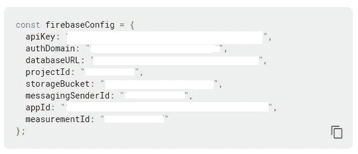
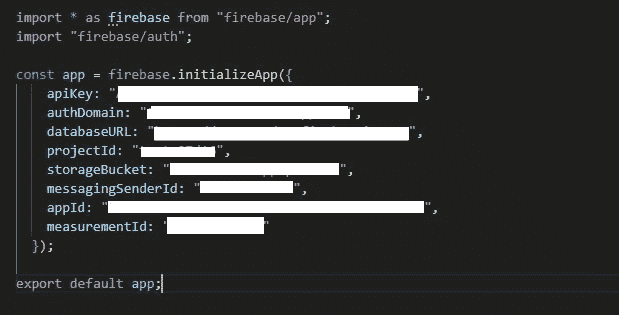
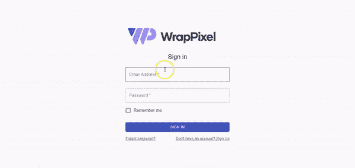

# 在 React 应用程序中设置 Firebase 身份验证

> 原文：<https://javascript.plainenglish.io/setting-up-firebase-authentication-in-react-application-c49f1df8b8ab?source=collection_archive---------8----------------------->


在本教程中，我们将使用 Firebase 和私有路由构建一个简单的授权 react 应用程序。在我们深入了解细节之前，我想提一下一些现成的最好的 [react dashboard 模板](https://www.wrappixel.com/templates/category/react-templates/)和 web 应用程序模板，它们带有 Firebase 身份验证。

你可以检查它们，并直接在你的项目中使用，以节省大量的时间和金钱，而且它们是由有经验的开发者开发的，所以你也有机会学到很多东西。

现在让我们转到我们的教程。

# 内容

*   介绍
*   先决条件
*   设置 React
*   在 React 中设置 Firebase
*   反应路由器
*   使用 Firebase 和 React 的身份验证上下文
*   React 中的私有路由
*   在 React 中创建视图组件
*   在 Firebase 注册
*   登录 Firebase
*   在 Firebase 中注销
*   结论

# 介绍

我们使用身份验证来识别用户的身份。在本文的最后，我们将构建一个简单的 React 应用程序，允许用户使用 Firebase 进行身份验证，并且我们将确保只有经过身份验证的用户才能访问该应用程序。

# 先决条件

*   具备 Javascript 的基本知识
*   确保您的计算机上的节点> =8.10，npm>=5.6，以获得更好的体验
*   对反应、上下文、钩子和路线有基本的了解。
*   熟悉命令行
*   文字编辑器
*   煽动性的报道

# 设置 React

要在 React 中创建项目，请运行下面的命令:

```
npx create-react-app react_firebase_auth
```

**npx** 是 npm 5.2+自带的包运行器工具。我们刚刚创建了一个名为**的项目。转到项目并启动它。**

```
cd react_firebase_auth
npm start
```

我们的应用程序需要一些依赖项，例如:

*   **react-dom** 包含 **React Router** 的 **DOM** 绑定，我指的是网站的 **router** 组件。

```
npm install --save react-router-dom
```

*   **material-ui** 实现 Google 的材质设计。

```
npm i @material-ui/core --save
```

我们的 react 应用程序设置成功。现在是时候设置火力基地了。

# 在 React 中设置 Firebase

让我们从创建一个新的 firebase 应用程序开始。请遵循以下步骤。转到[火焰基座控制台](https://console.firebase.google.com/)。

1.  按添加项目
2.  输入你的应用名称
3.  接受条款
4.  按创建项目
5.  等到 ap 创建完毕
6.  然后按继续
7.  转到身份验证点击
8.  单击设置登录方法
9.  选择电子邮件/密码并启用它。
10.  完成后，进入项目设置，向下滚动到平台列表。选择 Web。
11.  复制你的应用配置



在侧边栏菜单上点击**认证**，进入登录方式，启用**邮箱/密码**。

现在让我们在 react 应用程序中设置 firebase。在你的 **src** 文件夹中创建 **firebase.js** 文件。使用下面的命令安装 firebase dependecie:

```
npm install --save firebase
```

打开 **firebase.js** ，将你复制的 javascript 脚本粘贴到 firebase 控制台中。



如你所见，我们可以使用 firebase.initializeApp 初始化 firebase 应用程序，并将其导出为**应用程序**。这样做，我们可以完全访问我们的数据库。

# 反应路由器

现在，去你的 **App.js** 添加一些路由。

```
import React from 'react';
import "./App.css";
import { BrowserRouter as Router, Route } from "react-router-dom";
import Home from './Home'
import Login from './Login'
import SignUp from './Signup'
function App() {
  return (
    <Router>
        <div>
          <Route exact path="/" component={Home} />
          <Route exact path="/login" component={Login} />
          <Route exact path="/signup" component={SignUp} />
        </div>
      </Router>
  );
}
export default App;
```

我们将我们的布局包装到 **BrowserRouter** 中，为我们所有的应用程序提供浏览器上下文。基本上，它允许我们使用路由、链接、重定向和其他路由器功能。

现在，为了使用身份验证，我们需要存储我们的身份验证状态，无论您是否登录，并更新我们的组件树。为此，我们将使用 React 上下文 API。

# 使用 Firebase 和 React 的身份验证上下文

在你的 **scr** 文件夹中创建 **Authentication.js** 并通过这个:

```
import React, { useEffect, useState } from "react";
    import app from "./firebase.js";
    export const AuthContext = React.createContext();
    export const AuthProvider = ({ children }) => {
      const [currentUser, setCurrentUser] = useState(null);
      const [pending, setPending] = useState(true);
      useEffect(() => {
        app.auth().onAuthStateChanged((user) => {
          setCurrentUser(user)
          setPending(false)
        });
      }, []);
      if(pending){
        return <>Please wait...</>
      }
      return (
        <AuthContext.Provider
          value={{
            currentUser
          }}
        >
          {children}
        </AuthContext.Provider>
      );
    };
```

在这个文件中，我们必须从 firebase.js 导入 **app** ，在那里我们有我们的 firebase API，并且我们创建了一个上下文。react 中的上下文允许您将一些数据传播到整个 react 组件树。

我们创建了一个提供者组件，让您可以存储我们的**身份验证状态**。它持有一个用户，我们将更新我们的身份验证状态将在 firebase 每次变化。为此，我们使用钩子 **useEffect** 来注册对我们的 firebase 对象的更改，并且我们将一个空数组作为第二个参数传递给我们的 **useEffect** ，以便当组件 **AuthProvider** 将被挂载到我们的树中时，它将运行一次。

然后在我们的 **AuthProvider** 布局中我们使用了 AuthProvider。Provider，我们传递了在**上从 firebase 获得的当前用户。每次身份验证状态发生变化**，我们都将其作为一个值传递给我们的**身份验证提供者。提供者**，然后我们呈现传递给这个组件的**子组件**。

现在，回到 App.js，将我们的布局包装到 **AuthProvider** 中。

```
<AuthProvider>
      <Router>
        <div>
          <Route exact path="/" component={Home} />
          <Route exact path="/login" component={Login} />
          <Route exact path="/signup" component={SignUp} />
        </div>
      </Router>
    </AuthProvider>
```

因此，组件树中它下面的所有东西都可以通过上下文 API 访问当前用户。在我们的例子中，如果您登录，您将拥有包含所有用户描述的用户对象，如果您注销，您将拥有空或未定义状态的用户对象。

# React 中的私有路由

我们可以创建自己的私有路由，只允许经过身份验证的用户访问主页。

在你的 **scr** 文件夹中创建 PrivateRoute.js。

```
import React, { useContext } from "react";
import { Route, Redirect } from "react-router-dom";
import { AuthContext } from "./Authentication";
const PrivateRoute = ({ component: RouteComponent, ...rest }) => {
  const {currentUser} = useContext(AuthContext);
  return (
    <Route
      {...rest}
      render={routeProps =>
        !!currentUser ? (
          <RouteComponent {...routeProps} />
        ) : (
          <Redirect to={"/login"} />
        )
      }
    />
  );
};export default PrivateRoute
```

在这里，我们需要知道如果用户通过了身份验证，应该呈现什么组件。所以我们用 component 和其余的 props { component: RouteComponent，…rest }。PrivateRouter 基本上是常规航线上的包装器。所以我们传递其余的道具{…rest}，然后在我们的**路线呈现函数**中，根据我们是否有用户，我们将呈现我们的**路线组件**或**重定向到登录页面**。

返回到您的 **App.js** 并进行以下更改:

```
<AuthProvider>
      <Router>
         <div>
           <PrivateRoute exact path="/" component={Home} />
           <Route exact path="/signin" component={Signin} />
           <Route exact path="/signup" component={SignUp} />
        </div>
      </Router>
  </AuthProvider>
```

现在让我们创建视图组件。为此，我们将使用材质用户界面。要更深入地了解 Material-UI，你可以点击[这里](https://material-ui.com/)使用官方文档来完成。

# 在 React 中创建视图组件

我们将使用 materil-ui 作为我们的界面。确保您已经安装了 material-ui dependecie。

注意:在本文中，我们将讨论 Firebase 认证。因此，关于 **material-ui** 的更多细节，请访问[官方文档](https://material-ui.com/)。

在你的 **src** 文件夹中创建 **SignIn.js** 并通过下面的代码。

```
import React from 'react';
import Button from '@material-ui/core/Button';
import CssBaseline from '@material-ui/core/CssBaseline';
import TextField from '@material-ui/core/TextField';
import FormControlLabel from '@material-ui/core/FormControlLabel';
import Checkbox from '@material-ui/core/Checkbox';
import Grid from '@material-ui/core/Grid';
import Box from '@material-ui/core/Box';
import Typography from '@material-ui/core/Typography';
import { makeStyles } from '@material-ui/core/styles';
import Container from '@material-ui/core/Container';import { Link } from 'react-router-dom'
function Copyright() {
  return (
    <Typography variant="body2" color="textSecondary" align="center">
      {'Copyright © '}
      <Link color="inherit" href="https://pacoconsulting.co.mz/">
        PACO IT Consulting
      </Link>{' '}
      {new Date().getFullYear()}
      {'.'}
    </Typography>
  );
}
const useStyles = makeStyles((theme) => ({
  paper: {
    marginTop: theme.spacing(8),
    display: 'flex',
    flexDirection: 'column',
    alignItems: 'center',
  },
  avatar: {
    margin: theme.spacing(1),
    backgroundColor: theme.palette.secondary.main,
  },
  form: {
    width: '100%', // Fix IE 11 issue.
    marginTop: theme.spacing(1),
  },
  submit: {
    margin: theme.spacing(3, 0, 2),
  },
}));
export default function SignIn() {
  const classes = useStyles();
  return (
    <Container component="main" maxWidth="xs">
      <CssBaseline />
      <div className={classes.paper}>
        <Typography component="h1" variant="h5">
          Sign in
        </Typography>
        <form onSubmit={handleLogin}  className={classes.form} noValidate>
          <TextField
            variant="outlined"
            margin="normal"
            required
            fullWidth
            id="email"
            label="Email Address"
            name="email"
            autoComplete="email"
            autoFocus
          />
          <TextField
            variant="outlined"
            margin="normal"
            required
            fullWidth
            name="password"
            label="Password"
            type="password"
            id="password"
            autoComplete="current-password"
          />
          <FormControlLabel
            control={<Checkbox value="remember" color="primary" />}
            label="Remember me"
          />
          <Button
            type="submit"
            fullWidth
            variant="contained"
            color="primary"
            className={classes.submit}
          >
            Sign In
          </Button>
          <Grid container>
            <Grid item xs>
              <Link href="#" variant="body2">
                Forgot password?
              </Link>
            </Grid>
            <Grid item>
              <Link href="#" variant="body2">
                {"Don't have an account? Sign Up"}
              </Link>
            </Grid>
          </Grid>
        </form>
      </div>
      <Box mt={8}>
        <Copyright />
      </Box>
    </Container>
  );
}
```

在你的 scr 文件夹中创建 **SignUp.js** 。

```
import React from 'react';
import Button from '@material-ui/core/Button';
import CssBaseline from '@material-ui/core/CssBaseline';
import TextField from '@material-ui/core/TextField';
import FormControlLabel from '@material-ui/core/FormControlLabel';
import Checkbox from '@material-ui/core/Checkbox';
import Grid from '@material-ui/core/Grid';
import Box from '@material-ui/core/Box';
import Typography from '@material-ui/core/Typography';
import { makeStyles } from '@material-ui/core/styles';
import Container from '@material-ui/core/Container';
import { Link } from 'react-router-dom'
function Copyright() {
  return (
    <Typography variant="body2" color="textSecondary" align="center">
      {'Copyright © '}
      <Link color="inherit" href="https://material-ui.com/">
        Your Website
      </Link>{' '}
      {new Date().getFullYear()}
      {'.'}
    </Typography>
  );
}
const useStyles = makeStyles((theme) => ({
  paper: {
    marginTop: theme.spacing(8),
    display: 'flex',
    flexDirection: 'column',
    alignItems: 'center',
  },
  avatar: {
    margin: theme.spacing(1),
    backgroundColor: theme.palette.secondary.main,
  },
  form: {
    width: '100%', // Fix IE 11 issue.
    marginTop: theme.spacing(3),
  },
  submit: {
    margin: theme.spacing(3, 0, 2),
  },
}));
export default function SignUp() {
  const classes = useStyles(); return (
    <Container component="main" maxWidth="xs">
      <CssBaseline />
      <div className={classes.paper}>
        <Typography component="h1" variant="h5">
          Sign up
        </Typography>
        <form onSubmit={handleSignUp} className={classes.form} noValidate>
          <Grid container spacing={2}>
            <Grid item xs={12} sm={6}>
              <TextField
                autoComplete="fname"
                name="firstName"
                variant="outlined"
                required
                fullWidth
                id="firstName"
                label="First Name"
                autoFocus
              />
            </Grid>
            <Grid item xs={12} sm={6}>
              <TextField
                variant="outlined"
                required
                fullWidth
                id="lastName"
                label="Last Name"
                name="lastName"
                autoComplete="lname"
              />
            </Grid>
            <Grid item xs={12}>
              <TextField
                variant="outlined"
                required
                fullWidth
                id="email"
                label="Email Address"
                name="email"
                autoComplete="email"
              />
            </Grid>
            <Grid item xs={12}>
              <TextField
                variant="outlined"
                required
                fullWidth
                name="password"
                label="Password"
                type="password"
                id="password"
                autoComplete="current-password"
              />
            </Grid>
            <Grid item xs={12}>
              <FormControlLabel
                control={<Checkbox value="allowExtraEmails" color="primary" />}
                label="I want to receive inspiration, marketing promotions and updates via email."
              />
            </Grid>
          </Grid>
          <Button
            type="submit"
            fullWidth
            variant="contained"
            color="primary"
            className={classes.submit}
          >
            Sign Up
          </Button>
          <Grid container justify="flex-end">
            <Grid item>
              <Link to="/signin" variant="body2">
                Already have an account? Sign in
              </Link>
            </Grid>
          </Grid>
        </form>
      </div>
      <Box mt={5}>
        <Copyright />
      </Box>
    </Container>
  );
}
```

在你的 scr 文件夹中创建 **Home.js** 。

```
import React from 'react';
import { makeStyles } from '@material-ui/core/styles';
import AppBar from '@material-ui/core/AppBar';
import Toolbar from '@material-ui/core/Toolbar';
import Typography from '@material-ui/core/Typography';
import Button from '@material-ui/core/Button';
import IconButton from '@material-ui/core/IconButton';
import MenuIcon from '@material-ui/icons/Menu';
const useStyles = makeStyles((theme) => ({
  root: {
    flexGrow: 1,
  },
  menuButton: {
    marginRight: theme.spacing(2),
  },
  title: {
    flexGrow: 1,
  },
}));
export default function ButtonAppBar() {
  const classes = useStyles();
  return (
    <div className={classes.root}>
      <AppBar position="static">
        <Toolbar>
          <IconButton edge="start" className={classes.menuButton} color="inherit" aria-label="menu">
            <MenuIcon />
          </IconButton>
          <Typography variant="h6" className={classes.title}>
            News
          </Typography>
          <Button color="inherit">Login</Button>
        </Toolbar>
      </AppBar>
    </div>
  );
}
```

# 在 Firebase 注册

在 **SignUp.js** 文件中进行这些修改:

```
import React, { useCallback} from "react";
import { Link } from 'react-router-dom'
import app from "./firebase.js";
```

和

```
export default function SignUp({ history }) {
  const classes = useStyles();
  const handleSignUp = useCallback(async event => {
    event.preventDefault();
    const { email, password } = event.target.elements;
    try {
      await app
        .auth()
        .createUserWithEmailAndPassword(email.value, password.value);
      history.push("/");
    } catch (error) {
      alert(error);
    }
  }, [history]);
...
...
...
```

该组件正在从我们的路由上下文中获取**历史**对象。当我们点击那个按钮时，我们的**手柄**将会启动。在这个函数中，我们获取事件并调用 **preventDefault()** ，因为我们希望在用户点击注册按钮时重新加载页面。然后，我们从 **target.elements** 中获取电子邮件和密码输入，并从 firebase API 中调用**createuserwhemailandpassword()**，并传递我们的**电子邮件**和**密码**值:**createuserwhemailandpassword(email . value，password.value)** 。然后我们将我们的 **handleSignUp** 函数传递给表单的 **onSubmit** 回调函数。

# 登录 Firebase

在 **SignIn.js** 文件中，SignIn.js 进行这些导入:

```
import React, { useCallback, useContext } from 'react'; // add {useCallback, useContext}
import { withRouter, Redirect } from "react-router";
import app from "./firebase.js";
import { AuthContext } from "./Authentication.js";
```

在 **SignIn()** 功能中进行以下更改:

*   添加历史记录
*   添加 handleLogin 方法。

```
export default function SignIn({history}) {
const classes = useStyles();
const handleLogin = useCallback(
  async event => {
    event.preventDefault();
    const { email, password } = event.target.elements;
    try {
      await app
        .auth()
        .signInWithEmailAndPassword(email.value, password.value);
      history.push("/");
    } catch (error) {
      alert(error);
    }
  },
  [history]
);
const { currentUser } = useContext(AuthContext);
if (currentUser) {
  return <Redirect to="/" />;
}
```

注册页面有两个不同之处。这里我们使用**signingwithemailandpassword()**，并使用我们的认证上下文`const { currentUser } = useContext(AuthContext);`。您可能还记得，我们正在跟踪 firebase 用户，并使用我们的 auth 模型用 currentUser 字段更新我们的上下文。然后我们检查:如果我们有 currentUser，我们从 react 路由器呈现重定向组件。该组件在呈现时将只重定向到使用在**到**属性中设置的路径。

# 在 Firebase 中注销

基本上，在 **Home.js** 中，我们在注销按钮中从 **auth** 模块调用 **signOut()** 。

```
onClick={() => app.auth().signOut()}
```

恭喜你！！！测试你的应用。

```
npm start
```

# 结论



我们的申请准备好了。现在，您可以在 React 应用程序中使用 Firebase 身份验证了。

感谢阅读！