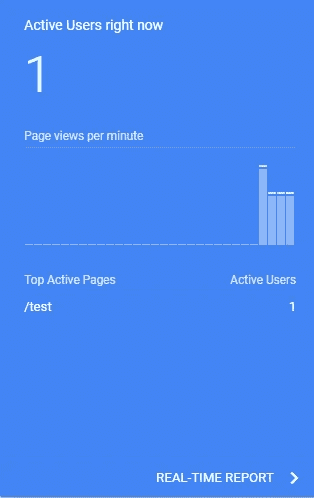
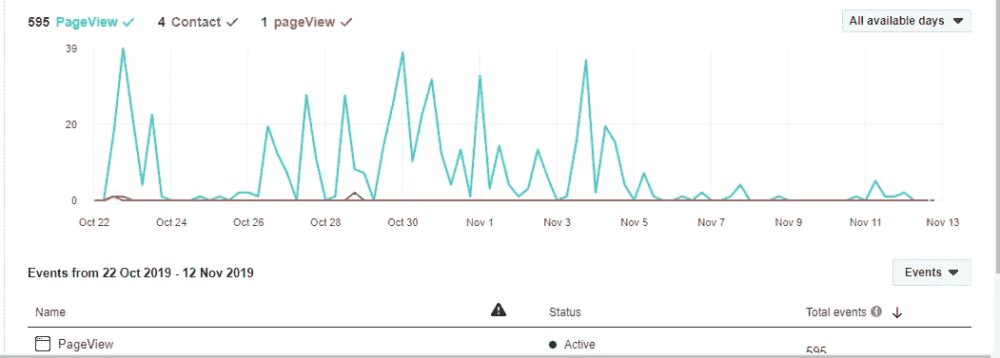

# 在 Angular 8 中设置谷歌分析和脸书像素

> 原文：<https://javascript.plainenglish.io/setting-up-google-analytics-and-facebook-pixel-in-angular-8-b934219991d4?source=collection_archive---------1----------------------->

谷歌分析是最常用的网站分析工具。它帮助开发者和网站管理员跟踪用户在他们网站上的活动，也为我们提供了许多功能来评估我们网站的性能。

Pixel 是脸书开发的一款追踪工具，可以帮助你追踪访客和他们在你的网站/应用中的活动。这也有助于你在脸书上做广告时锁定这些访问者。

Angular 应用程序是一个单页面应用程序(SPA ),因此谷歌分析和脸书像素不会有效地与它合作。

## 先决条件

1.  角度 CLI。
2.  Firebase CLI。
3.  一个 Firebase 项目(假设名称空间是 sample-app-xxxx)。
4.  一个谷歌分析和脸书商业帐户。

现在我们开始吧。

## 步骤 1:创建和配置角度应用程序

通过运行命令创建角度应用程序

> ng 新样本应用程序

当提示是否应该启用路由时，键入 *y* 并选择您喜欢的样式格式。

这将创建一个 Angular 应用程序“SampleApp”并在其中安装所有依赖项。

现在让我们添加一些页面，并在我们的应用程序中设置路由。我们正在创建两个组件，*主页*和*测试*。

键入以下命令创建 2 个组件

> ng g c home & & ng g c test

这将创建两个组件 *home* 和 *test* ，并且还将更新 *app.module.ts* 。

现在让我们在 *app-routing.module.ts* 中进行一些编辑

在编辑器中打开项目，并将 *app-routing.module.ts* 的内容更新为以下内容

我们已经成功地创建了一个 Angular 应用程序，添加了 2 个组件并设置了路由。

## 步骤 2:设置 Firebase 托管

运行以下命令来初始化 Firebase

> 火灾基地初始化

并选择以下选项

*您想使用的 CLI 功能:托管*

*公共目录:dist/SampleApp*

*配置为单页应用:是*

现在，我们在项目中初始化了 Firebase。

## 步骤 3:在谷歌分析中创建属性

1.进入[https://analytics.google.com](https://analytics.google.com)，点击左侧边栏底部的**管理**。

2.点击创建属性，选择网站，然后点击继续。

3.填写表格，从 firebase dashboard 复制 url。

4.单击 Create 并复制这里显示的代码。

## 步骤 4:在脸书上创建一个新的像素

1.转到[https://business.facebook.com/settings/pixels/](https://business.facebook.com/settings/pixels/)并点击添加像素。

2.给出一个名称，并从 Firebase dashboard 输入 url

3.复制 ID 以备后用。

## 步骤 5:在我们的应用程序中添加像素和分析代码

将步骤 3 的代码和下面的像素代码粘贴到我们应用程序的*index.html*中。

> ！function(f，b，e，v，n，t，s) {if(f.fbq)返回；n = f . fbq = function(){ n . call method？n.callMethod.apply(n，参数):n.queue.push(参数)}；如果(！f . _ fbq)f . _ fbq = n；n.push = nn.loaded=！0;n.version = ' 2.0n . queue =[]；t = b . createelement(e)；t.async=！0;t . src = v；s = b . getelementsbytagname(e)[0]；s.parentNode.insertBefore(t，s)}(window，document，' script '，' https://connect . Facebook . net/en _ US/FB events . js ')；fbq('init '，' { your-pixel-id-goes-here } ')；

所以我们的*index.html*会变成

别忘了用你的谷歌分析 ID 替换 *UA-{ID}* ，用你的像素 ID 替换*{ your-Pixel-ID-goes-here }*。

因此，我们在 Angular 应用程序中添加了谷歌分析和脸书像素。

**那么这里有什么问题呢？**

Angular 是一个单页应用程序。在路线之间导航时，页面不会重新加载。因此，分析和像素脚本不会检测到变化，并发送页面视图。

**怎么修？**

我们需要以编程方式发送页面视图。为此，我们需要在我们的 *app.component.ts* 中做一些改变

## 步骤 6:配置 SPA 以使用 Google Analytics

1.从 *@angular/router* 导入*路由器*和*导航和*

2.声明 *gtag* 和 *fbq* 为函数。 *gtag* 是 Google Analytics 使用的函数，函数定义从位于[https://www.googletagmanager.com/gtag/js](https://www.googletagmanager.com/gtag/js.)的远程脚本加载。
*fbq* 是脸书像素使用的函数，函数定义从[https://connect.facebook.net/en_US/fbevents.js](https://connect.facebook.net/en_US/fbevents.js)加载。
Typescript 检测不到。所以我们需要将它声明为一个函数。

3.订阅*路由器*的*导航和*事件，并将页面视图发送给谷歌和脸书。

所以 *app.component.ts* 的内容会变成

## 步骤 7:构建和部署

现在，通过运行以下命令，将应用程序构建并部署到 Firebase。

> ng 构建-产品- aot 和 firebase 部署

当人们通过路线导航时，我们的应用程序将向谷歌和脸书发送页面查看事件，我们可以在分析仪表板和事件管理器仪表板中跟踪他们

Google Analytics Real Time Report Section

Sample Screenshot of Facebook Pixel Events Manager Dashboard