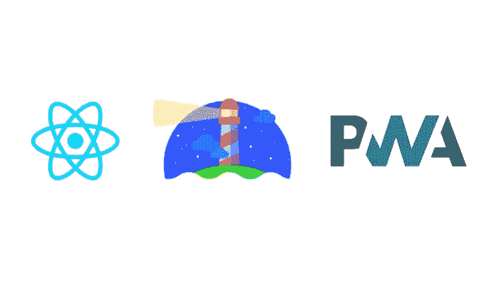

# 使用 Lighthouse Audit 为 PWA 设置 create-react-app。

> 原文：<https://javascript.plainenglish.io/setting-up-pwa-lighthouse-audit-with-create-react-app-40e17180ea6b?source=collection_archive---------7----------------------->



我想用 React 构建一个 PWA，但是`create-react-app`不允许你在构建过程中注入你自己的服务工作者，它会生成自己的服务工作者，所以我将向你展示如何配置你的项目，以便能够使用带有`create-react-app`的定制服务工作者构建一个 PWA，并对构建执行灯塔审计。

这是你可以用`create-react-app`构建 PWA 的样板文件

 [## 诺罗/CRA-PWA-样板文件

### 这个样板文件是为使用 create-react-app 开发 PWAs 而配置的。使用它作为一个项目创建与 CRA 只是使…

github.com](https://github.com/Noor0/CRA-PWA-Boilerplate) 

# 使用自定义 ServiceWorker

我们将安装一些依赖项，帮助我们在不退出项目的情况下修改 CRA 的 webpack 配置。继续安装`react-app-rewired`、`customize-cra`和`workbox-webpack-plugin`

```
yarn add -D react-app-rewired customize-cra workbox-webpack-pluginornpm i react-app-rewired customize-cra workbox-webpack-plugin --save-dev
```

`react-app-rewired`使用一个`config-overrides.js`文件来修改配置，并在项目的根目录下创建文件。现在我们只导出一个什么都不做的函数。

```
//config-overrides.js
module.exports = (config, env) => config
```

现在，我们将编写一个非常基本的服务工作者，它预先缓存我们的资产，并使用 workbox 从缓存中为它们提供服务。我们将这个服务工作者添加到`src/`文件夹中，`workbox-webpack-plugin`将使用这个服务工作者在我们的构建文件夹中生成新的服务工作者。

```
// src/service-worker.jsconsole**.**log('My Custom Service Worker');
workbox**.***precaching***.**precacheAndRoute(self**.***__precacheManifest*);
```

请注意，我们正在使用 workbox 和`__precacheManifest`而没有在任何地方导入或声明它，这是因为`workbox-webpack-plugin`将为我们完成这项工作，它将生成一个`precache-manifest.js`文件，并将该文件和 workbox 的导入添加到生成的服务工作器中。

是时候编写修改配置的代码了，我们将使用`customize-cra`来注入我们的插件。

我们将删除生成标准`create-react-app`服务工作者的插件，并添加使用我们的定制服务工作者的`InjectManifest`插件。

```
// config-overrides.js
const { override, addWebpackPlugin } **=** require('customize-cra');
const { InjectManifest } **=** require('workbox-webpack-plugin');module**.**exports **=** (**webpack**, **...args**) => { // remove GenerateSW plugin
  webpack**.***plugins***.**pop(); const overridenConf **=** override(
    addWebpackPlugin(
      **new** InjectManifest({
        swSrc: './src/service-worker.js',
        globDirectory: webpack**.***output***.***path*,
        globPatterns: ['*.{png,ico}'],
      }),
    ),   
  )(webpack, ...args); **return** overridenConf;
};
```

`globPatterns`会将那些没有经过 webpack 编译的文件添加到`precache-manifest.js`中，比如复制到构建文件夹中并且没有经过编译过程的图像和其他一些文件。我想缓存图标和图像，但`globPatterns` & `globDirectory`是可选的，你可以省略它们。

**注意:**即将到来的版本，即`workbox-webpack-plugin`的 v5，将通过 webpack 编译过程传递给我们的服务人员，不会创建`precache-manifest.js`文件，也不会为 workbox 添加导入，也不会支持 glob 属性，但从 v4 开始，它们受到支持，我们将使用它们。

现在打开`index.js`，把注销改为注册

```
-- serviceWorker**.un**register();
++ serviceWorker**.**register();
```

将`package.json`中的脚本改为使用`react-app-rewired`

```
 --   "start": "react-scripts start",
--   "build": "react-scripts build",
--   "test": "react-scripts test",
--   "eject": "react-scripts eject"++   "start": "react-app-rewired start",
++   "build": "react-app-rewired build",
++   "test": "react-app-rewired test",
++   "eject": "react-app-rewired eject"
```

恭喜，您已经设置了`create-react-app`来使用您的定制服务人员，现在运行`yarn start`或`yarn build`并查看您的 PWA 的所有荣耀。👀👀

# 灯塔审计

为了审计我们的构建，我们将使用`webpack-lighthouse-plugin`和`serve`。这里我已经在本地安装了`serve`，但是如果你已经在全球范围内安装了它，你就不需要这样做了。

```
yarn add -D webpack-lighthouse-plugin serveornpm install webpack-lighthouse-plugin serve --save-dev
```

继续在`package.json`中添加以下脚本。

```
"serve": "serve ./build",
"build:audit": "export LIGHTHOUSE_AUDIT=true; yarn serve & yarn build; kill -9 $!; kill -9 `lsof -t -i:5000`"
```

`build:audit`脚本将使用`serve`服务于我们的构建，使用 lighthouse 审计它，并终止服务器(该命令在 UNIX/Linux shell 中工作，如 zsh 和 bash)。我正在创建`LIGHTHOUSE_AUDIT`环境变量来决定是否应该执行审计。

添加插件`WebpackLighthousePlugin`，它只会在我们想要审计我们的构建时使用，否则它会被忽略。

```
// config-overrides.js
const { override, addWebpackPlugin } **=** require('customize-cra');
const { InjectManifest } **=** require('workbox-webpack-plugin');
++ const WebpackLighthousePlugin **=** require('webpack-lighthouse-plugin');module**.**exports **=** (**webpack**, **...args**) => { // remove GenerateSW plugin
  webpack**.***plugins***.**pop(); const overridenConf **=** override(
    addWebpackPlugin(
      **new** InjectManifest({
        swSrc: './src/service-worker.js',
        globDirectory: webpack**.***output***.***path*,
        globPatterns: ['*.{png,ico}'],
      }),
    ),
++    process**.**env**.**LIGHTHOUSE_AUDIT **===** 'true' ? addWebpackPlugin(
++      **new** WebpackLighthousePlugin({
++       url: 'http://localhost:5000'
++      }),
++    ) : null,
  )(webpack, ...args); **return** overridenConf;
};
```

现在运行`yarn build:audit`或`npm run build:audit`构建您的 react 应用程序，并使用 Lighthouse 审计构建。它将记录审计数据，并生成项目根的审计报告，您可以通过将这些报告放入您的`.gitignore`来忽略它们

```
# .gitignore
...
...*.report.html...
...
```

你可以按照这些步骤使用你自己的 create-react-app 服务人员，或者只是简单地复制我在本文开头链接的样板文件。

谢了。

## 用简单英语写的 JavaScript 的注释

我们已经推出了三种新的出版物！请关注我们的新出版物:[**AI in Plain English**](https://medium.com/ai-in-plain-english)[**UX in Plain English**](https://medium.com/ux-in-plain-english)[**Python in Plain English**](https://medium.com/python-in-plain-english)**—谢谢，继续学习！**

**我们也一直有兴趣帮助推广高质量的内容。如果您有一篇文章想要提交给我们的任何出版物，请发送电子邮件至[**submissions @ plain English . io**](mailto:submissions@plainenglish.io)**，使用您的 Medium 用户名，我们会将您添加为作者。另外，请让我们知道您想加入哪个/哪些出版物。****