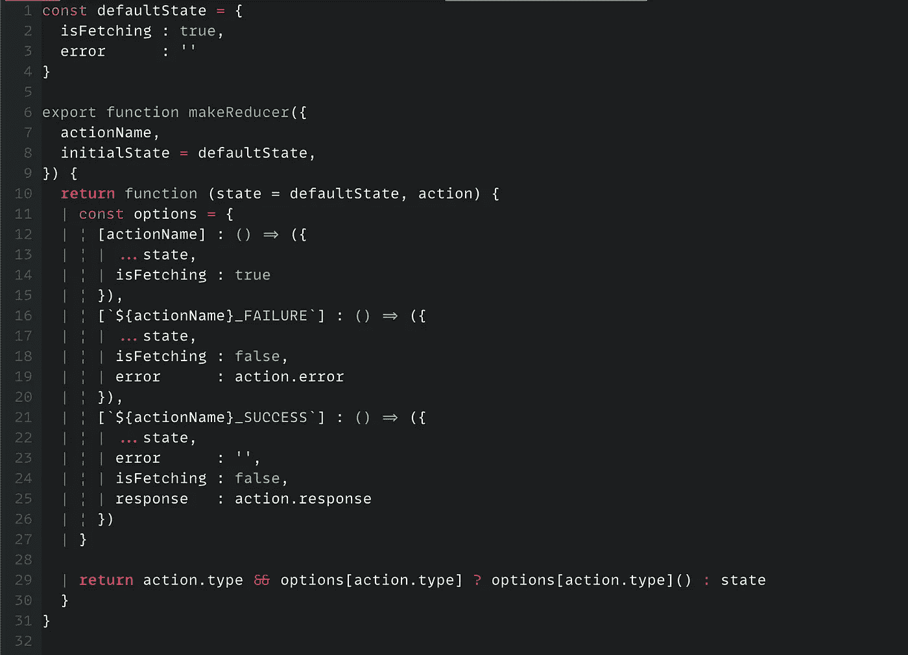
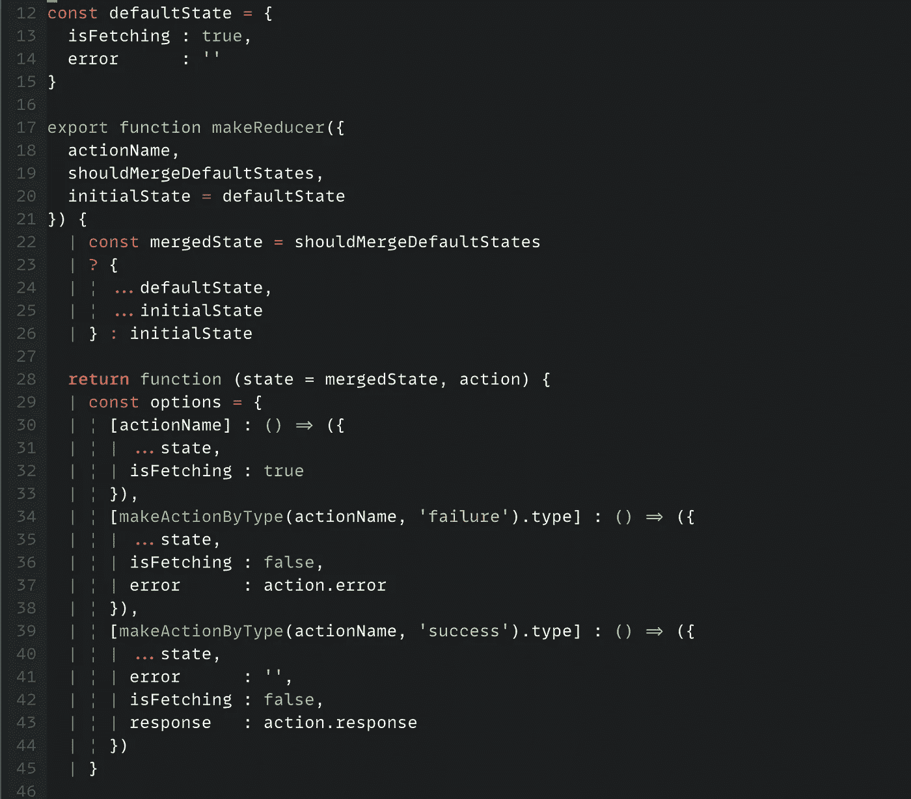
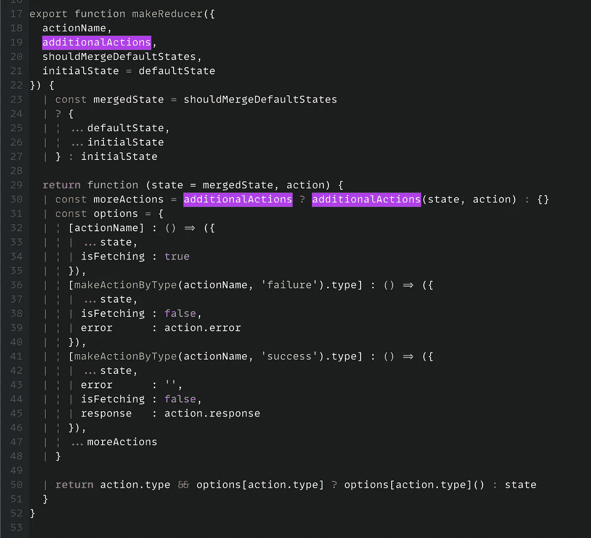
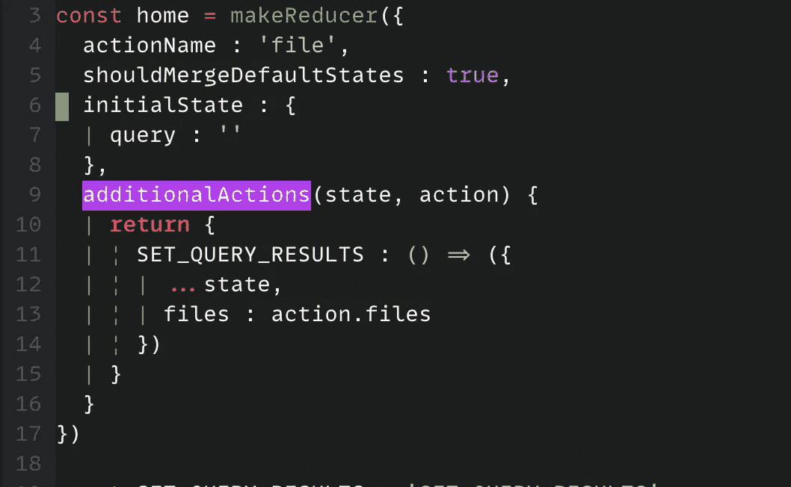
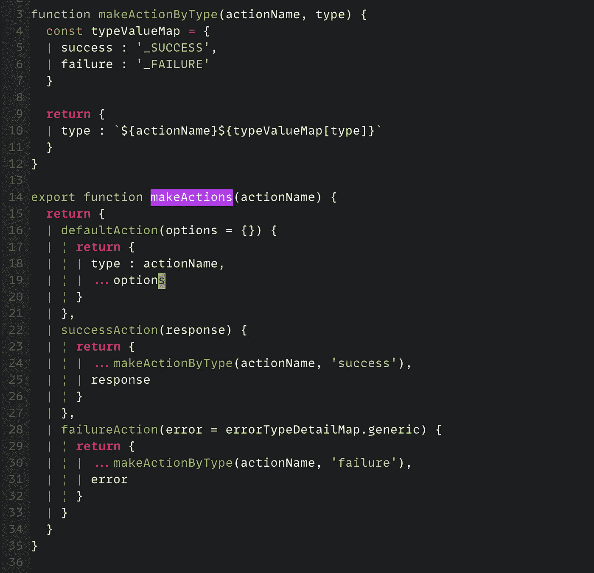
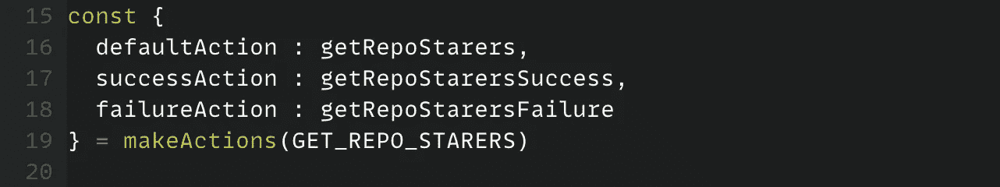

# 设置 Redux 以避免样板代码

> 原文：<https://javascript.plainenglish.io/setting-up-redux-to-avoid-boilerplate-code-33abf57a293b?source=collection_archive---------8----------------------->

## 生成 Reducer 函数和减小包大小的明确指南。

## 在 web 应用程序中编写 reducers 时，这是一种避免冗余和重复代码的好方法。

Photo by [Joshua Aragon](https://unsplash.com/@goshua13?utm_source=medium&utm_medium=referral) on [Unsplash](https://unsplash.com?utm_source=medium&utm_medium=referral)

好吧，如果你熟悉 React 和 Redux，我敢肯定你一定担心在很多地方编写重复和冗余的代码片段。

在进入实际的业务逻辑之前，您总是需要编写这些代码。虽然在你的 web 应用程序中有很多地方重复相同的编码模式，但我想谈谈我觉得我们都为反复编写相同类型的代码而感到沮丧的地方: **Redux Reducers** 。

由于干式编码原理建议我们应该减少重复的编码模式以提高质量和冗余度，所以让我们尝试修复 Reducer 模式。

## **添加一个生成 reducer 函数的抽象函数:**

简单地说，我们将创建一个返回另一个函数的函数，返回的函数将表现为一个 reducer 函数。在我们进入编码部分之前，这里有一些关于 Reducer 函数的要点:

*   它用 API 结果更新商店数据。
*   如果出现错误，它会相应地更新存储。
*   它可能有也可能没有异步操作。

因此，我们将创建一个抽象函数来处理:A)成功情况，b)失败情况，以及 c)从 API 获取数据时的“等待”情况。这些是 Reducer 函数最常见的用例。我们将牢记这些标准来编写我们的抽象。

我们开始吧！

## 返回 Reducer 函数的函数:

正如我们之前讨论的，我们的抽象函数必须返回 reducer 函数。并且缩减器需要具有:a)状态和 b)动作作为参数。它还应该有一个默认状态(可选):

Find the full code snippet at the bottom of the post.

这里，`makeReducer`函数是我们抽象的名字，它返回 reducer 函数。我使用`defaultState`变量为我们的缩减器提供一个默认状态。我们将在稍后的文章中添加一个自定义的默认状态功能。

## 进行不同类型操作的功能:

如您所见，我们在返回的 Reducer 函数中硬编码了成功和失败动作的名称。为了简单起见，让我们做一个通过类型返回动作的函数，我们称它为`makeActionByType`。该函数将返回一个带有关键字:`type`的对象，值将是动作类型名称:

find full code snippet at the bottom of the post.

当我们让动作创建者调度动作时，这个函数也会很有帮助。

## 抽象接受自定义初始状态:

我们还对减速器的默认初始状态进行了硬编码。如果有人想在最初将一个自定义状态传递给 Reducer，该怎么办？我们的抽象应该接受自定义状态:

find full code snippet at the bottom of the post.

这里需要注意的主要有两点:1)我们引入了一个新的参数:`shouldMergeDefaultStates`(第 19 行)？并且，我们现在将自定义状态与`defaultState`(第 22–26 行)合并。2)我们使用合并状态作为缩减器的初始状态(第 28 行)。参数`shouldMergeDefaultStates`将告诉我们的抽象函数是否将自定义状态与默认状态合并。这样，开发人员就不必一遍又一遍地传递多余的代码。

## 自定义操作呢:

到目前为止一切看起来都很好，但是如果有人想要将一个自定义操作传递给函数，该怎么办呢？我们没有任何方法将自定义动作添加到 Reducer 中。让我们想出一种方法来为我们的 Reducer 添加定制动作。从代码中我们知道，所有的动作都是对象变量的一部分:`options`。我们可以在抽象函数的参数中接受自定义操作，并在选项变量中扩展自定义操作对象:

find full code snippet at the bottom of the post.

新参数`additionalActions`(第 19 行)是一个函数，因为我们需要从 reducer 函数访问`state`和`action`变量。这个函数返回您想要添加到 Reducer 中的所有定制动作。下面是您传递自定义操作的方式:

这就是我们如何在 React-Redux web 应用程序的 Reducer 部分去掉无用的样板代码。

## 奖金:

虽然我们已经修好了减速器部分。但是如果你像我一样，使用动作创建器功能来调度动作。你知道它也可以被优化，因为那里也有很多重复的代码。因此，让我们创建一个函数，返回默认操作的创建者:

find full code snippet at the bottom of the post.

我们的`makeActions`函数返回三种类型的动作创建者:1)`defaultAction`:这是默认动作。假设您想从 API 获取数据。你想把抓取设置为真？您将使用这个动作创建器。2)`successAction`:用 API 返回的数据更新存储中的数据。3)`failureAction`:设置减速机状态的`error`字段的值。这可能是一个 API 错误，或者是当用户的行为不符合预期时，您可能想要通知用户的情况。以下是如何使用`makeActions`功能:

由于该函数返回非常通用的动作名称，所以我根据我的 Reducer 上下文对它进行了重命名。

这里是[完整代码](https://gist.github.com/iiisoni/9476de109fe1147fb56752f130590309)的链接。

# 关于作者:

自 2011 年以来，Bharat 一直是前端开发人员。他喜欢“前端开发经验”。他喜欢学习和教授技术。他喜欢和最可爱的女人以及两个珍贵的双胞胎在一起的生活。

总的来说是个好人。在[推特](https://twitter.com/iiisoni)、[推特](https://github.com/iiison)、[领英](https://www.linkedin.com/in/iiison/)上找到他。