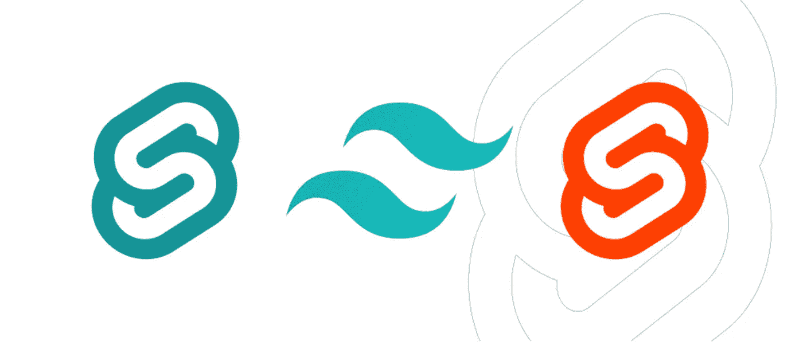

# 设置苗条&整合顺风 CSS

> 原文：<https://javascript.plainenglish.io/setting-up-svelte-integrating-tailwind-css-dde927edfb20?source=collection_archive---------4----------------------->

这篇文章是关于使用苗条身材系列文章的一部分。我们已经(或将)涵盖的主题和文章如下:

1.  [设置苗条&安装顺风 CSS 和后 CSS](https://jackwhiting.co.uk/posts/setting-up-svelte-and-integrating-tailwind-css)
2.  [用 Page.js 设置路由](https://jackwhiting.co.uk/posts/setting-up-routing-in-svelte-with-pagejs/#)
3.  针对大型应用优化我们的路由器(即将推出)
4.  *..还有更*



Svelte 在 JavaScript 框架中是一个可怕的失败者，由于它编译脚本和 HTML 的方式，它目前正在攀升。Svelte 本质上是一个编译器，你所有的组件文件都被编译成纯 JavaScript。你可以通过他们的[网站](https://svelte.dev/)了解更多关于 Svelte 的信息。

# 安装苗条

为了设置好 Svelte，我们需要安装 [Node.js](https://nodejs.org/en/) 和 [Degit](https://github.com/Rich-Harris/degit) 。我不会在本文中介绍如何设置这些，因为它需要一些节点和终端的知识，您可以事先在各自的站点上安装它们。

让我们创建一个由 Svelte 提供的基础模板的副本，并安装所有必要的库，如下所示。

```
npx degit sveltejs/template my-svelte-project 
cd my-svelte-project yarn # or npm install
```

为了测试一切是否正常，我们可以运行`yarn dev`，我们应该能够在 [https://localhost:5000](https://localhost:5000) 看到默认页面。如果你不能，你可能要确保设置没有出错。

## 设置顺风

我是 Tailwind 的超级粉丝，在大多数项目中都使用它，所以和 Svelte 一起工作也没什么不同。在我们安装 Svelte 的目录中，我们需要安装一些依赖项，创建一个新的`postcss.config.js`文件，最后修改几个现有的文件。

## 安装家属

使用以下命令安装必要的开发依赖项:

```
yarn add --dev postcss postcss-load-config svelte-preprocess tailwindcss
```

如果您想确保在生产时删除未使用的样式(保持我们的文件大小精简)，您还可以添加以下依赖项。

```
yarn add @fullhuman/postcss-purgecss
```

## 生成顺风配置

要覆盖 Tailwind 提供的默认样式，我们需要确保在我们的路径目录中有一个`tailwind.config.js`,我们可以在那里进行必要的调整。您可以通过运行以下命令来做到这一点。

```
npx tailwind init
```

如果您打开创建的文件，您应该看到它看起来类似于下面。

```
module.exports **=** {
  theme**:** {
    extend**:** {}
  },
  variants**:** {},
  plugins**:** []
}
```

## 创建我们的 PostCSS 规则

我们将需要告诉 Svelte 如何解释和编译我们必要的代码。我们可以通过在 route 目录中创建一个`postcss.config.js`文件来做到这一点。手动创建一个或在终端中运行以下命令。

```
touch postcss.config.js
```

在你最喜欢的编辑器中打开文件，复制下面的代码。

```
**const** purgecss **=** require('@fullhuman/postcss-purgecss')({
  content**:** ['./src/**/*.svelte', './src/**/*.html'],
  whitelistPatterns**:** [/svelte-/],
  defaultExtractor**:** content => content.match(/[A-Za-z0-9-_:/]+/g) **||** []
})

module.exports **=** {
  plugins**:** [
    require('tailwindcss'),
    ...(**!**process.env.ROLLUP_WATCH **?** [purgecss] **:** [])
  ]
}
```

为了稍微解释一下上面的内容，我们首先创建一个清除 CSS 的规则集，它将检查所有的 Svelte 和 HTML 文件，并删除任何不匹配的类。我们还将添加一个白名单模式，以确保任何生成的类不会被不必要的删除。

然后我们观察`process.env.ROLLUP_WATCH`是否等于真，如果不是，我们清除，如果是真，那么我们正在开发，我们只是编译顺风类。

## 与苗条相结合

我们需要在某个地方包含顺风助手，这样所有必要的样式都可以被引入。打开`src/`文件夹中的`App.svelte`文件，并在底部添加以下代码(替换已经存在的任何样式)。

```
<style global>
  @**tailwind** base;
  @**tailwind** components;
  @**tailwind** utilities;
</style>
```

然后我们需要确保 Svelte 在我们的`<style>`标签中的任何代码上运行预处理器。为此，我们需要在编辑器中打开`rollup.config.js`文件，并在文件顶部添加以下内容。

```
**import** sveltePreprocess from 'svelte-preprocess'
```

然后修改如下所示的部分

```
...
svelte({ 
  ... 
  preprocess: sveltePreprocess({ postcss: true }), 
  ... 
}) 
...
```

我们现在应该已经将顺风完全整合到了苗条中。如果您在终端中重新运行`yarn dev`,您应该看到它在页面加载之前编译了样式，并且您将有一个剥离后的页面可供跳转。

## 使用

你现在可以包含任何样式作为已经存在的值的类属性，如下所示，或者你可以通过使用`@apply`方法在你的瘦组件中集成。

```
<h1 class**=**"font-bold">Title</h1>
```

或者

```
<style>
h1 {
  @apply font-bold text-2xl;
}
</style>
```

*最初发表于*[*https://jackwhiting.co.uk*](https://jackwhiting.co.uk/posts/setting-up-svelte-and-integrating-tailwind-css/)*。你可以在我的网站上找到更多类似的文章或者关于 PHP、JavaScript、Vue、Svelte 或者自由职业的文章。*