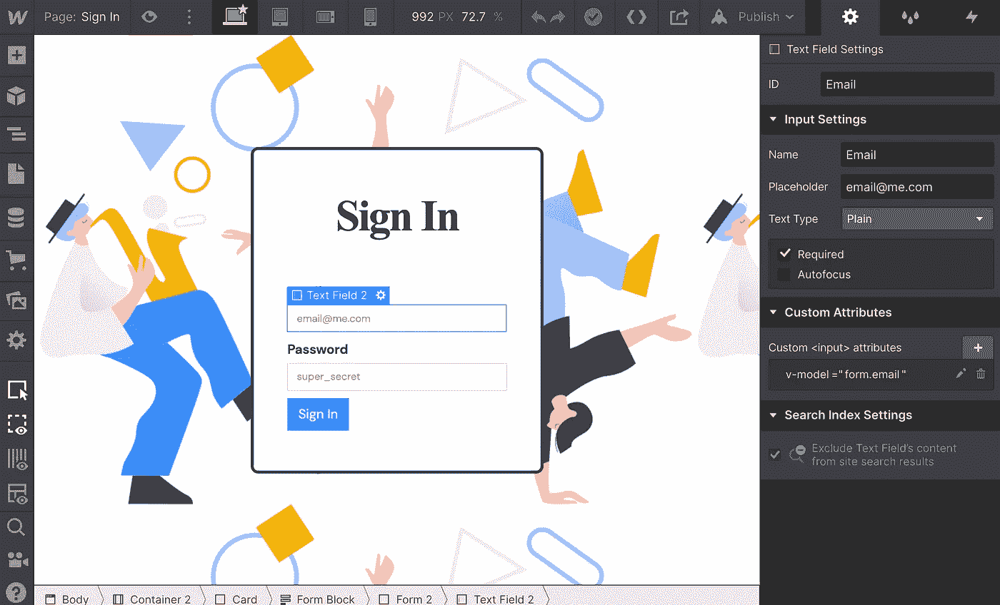
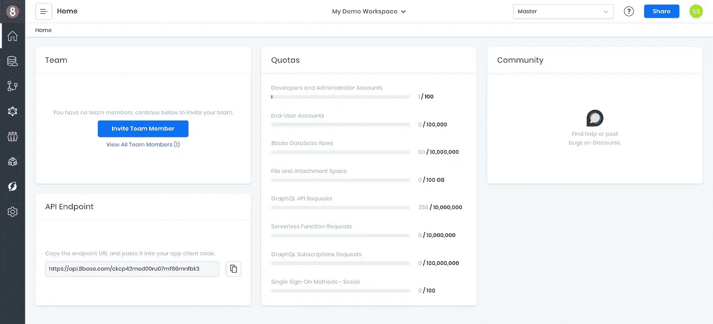
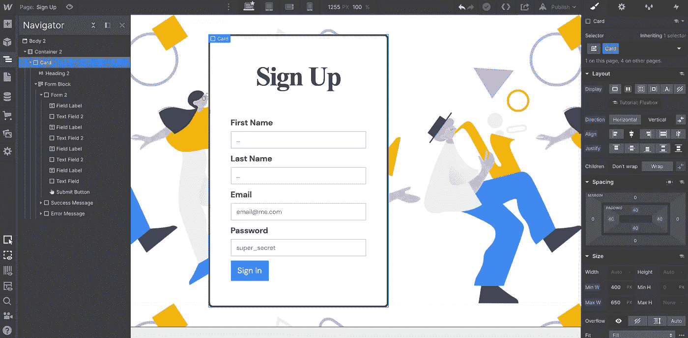
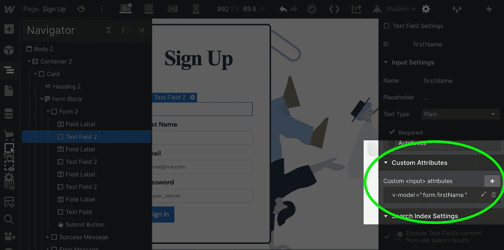
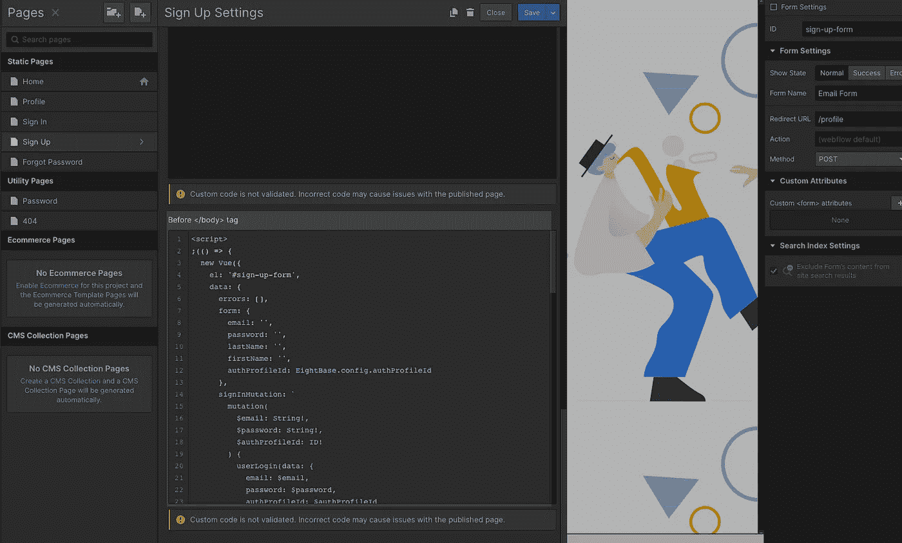

# 在 Webflow 上设置用户配置文件和身份验证

> 原文：<https://javascript.plainenglish.io/setting-up-user-profiles-and-authentication-on-webflow-dffcfbcbcaf6?source=collection_archive---------8----------------------->

## 使用定制 JavaScript 在 Webflow 上构建 Web 应用程序



如今有许多令人惊叹的低代码和无代码开发工具。无论是对于需要弥补技能差距的非技术人员，还是能够实现生产力提升的技术人员，这样的工具正在迅速重塑世界对软件开发的概念:谁是谁、T2 是什么、T4 是如何开发的。简而言之，更多拥有不同技能的人可以使用低代码和无代码开发工具来创建软件。

正如每个开发框架都有其独特的优点和缺点一样，低代码和无代码开发工具也是如此。虽然从设计的角度来看，一些工具可能过于局限，但其他工具在允许处理有意义的数据方面存在局限性。对于那些希望使用低代码和无代码开发工具而不是简单的营销网站来构建真实世界的应用程序的人来说，这是一个严重的障碍。

今天可用的大多数工具主要面向营销网站的前端开发(视觉界面设计)。在这一类别中，Webflow 是一个典型代表，也是最灵活的可视化网站构建者之一！而像 8base 这样的平台可以处理应用程序的整个后端。明白这是怎么回事了吗？

在本教程中，我们将探索如何利用 Webflow 这样的工具，通过使用后端即服务进行身份验证和创建自定义用户配置文件来构建真正的 web 应用程序，而不是网站。

# 您需要什么来开始

在开始之前，您需要设置一些东西。它们是:

1.Webflow 帐户—网站基本计划每月 15 美元

2.8 基本帐户—免费计划或开发者计划每月 25 美元

就这么简单！请按顺序完成教程的各个部分，因为它们相互依赖…

# 在 Webflow 上验证用户

身份验证是几乎所有应用程序的核心要求，也是大多数团队的核心难题！无论如何，在本教程中，我们将实现一个策略，让用户在 Webflow 中注册、登录、注销和恢复密码。此外，我们将在定制的 Webflow 页面上完成所有工作，以便您获得总体设计控制权。

首先，我们需要登录 Webflow 并创建一个新项目或使用初始项目。项目的造型不重要！所以，如果你愿意，随时都可以改变事物的样子。

新项目打开后，导航到*项目设置>自定义代码*选项卡，首先在“Head Code”部分添加下面的脚本标签。

```
<script src=”https://cdnjs.cloudflare.com/ajax/libs/vue/2.6.12/vue.min.js" crossorigin=”anonymous”></script>
```

Vue.js 是我们将要使用的一个非常轻量级的前端 JavaScript 框架。它将允许我们对我们的 Webflow 站点的某些部分进行动态控制。

接下来，我们将在“Head Code”中的最后一个脚本下添加另一个脚本。这是一个自定义脚本，我鼓励你通读，或者你可以复制并粘贴到——**中，除了配置部分！**本质上，它是将一个小模块初始化为，我们将能够在我们的 Webflow 站点上的任何地方访问它。

```
<script defer>
  /* Accessible globally on webflow site */
  window.EightBase = ((config) => {
    /**
     * Helper object for handling local storage. This will allow us
     * to easily set and retrieve user data and authentication data
     * in the browser's localStorage object.
     */
    const store = {
      /* Access value in localStorage */
      get: (key) => {
        return JSON.parse(localStorage.getItem(key));
      },/* Set value in localStorage */
      set: (key, value) => {
        localStorage.setItem(key, JSON.stringify(value));return value;
      },/* Remove Item from localStorage */
      remove: (key) => {
        localStorage.removeItem(key);
      },/* Clear values from localStorage */
      clear: () => {
        localStorage.clear();
      },/* Helper for determining if user is authenticated */
      isAuthenticated: () => {
        let auth = JSON.parse(localStorage.getItem("auth"));return Boolean(auth) && Boolean(auth.idToken);
      },
    };/**
     * Whenever a page loads, this piece of code will look for
     * whether the current route is private (as defined in the
     * config object). If it is private and the user is not
     * authenticated, it will redirect the user to the logoutRedirect
     * route (also defined in the config object).
     */
    let isProtectedRoute = config.routes.private.some((p) =>
      window.location.pathname.match(p)
    );if (isProtectedRoute && !store.isAuthenticated()) {
      window.location.replace(config.routes.logoutRedirect);
    }/**
     * API is a module that we'll use to execute calls to
     * the 8base API. Webflow includes jQuery by default,
     * and Ajaxs will work great for a graphQL Client.
     */
    const api = {
      request: (opts = {}) => {
        return $.ajax(
          Object.assign(
            {
              type: "POST",
              url: config.endpoint,
              contentType: "application/json",
              /**
               * Unless overridden, the idToken will get retrieved
               * from localStorage before ever request and set as
               * a bearer token.
               */
              beforeSend: (xhr) => {
                var { idToken } = store.get("auth");xhr.setRequestHeader("Authorization", "Bearer " + idToken);
              },
            },
            opts
          )
        );
      },
    };return {
      config,
      store,
      api,
    };
  })({
    /**
     * CONFIG!
     *
     * This object supplies some required info to the module.
     * You're  */
    endpoint: "<PUT_YOUR_8BASE_API_ENDPOINT>",
    authProfileId: "<PUT_YOUR_8BASE_AUTH_PROFILE_ID>",
    routes: {
      loginRedirect: "/profile",
      logoutRedirect: "/sign-in",
      private: ["/profile"],
    },
  });
</script>
```

在脚本的最后一部分，您将看到两个值，分别是`**<PUT_YOUR_8BASE_API_ENDPOINT>**`和`**<PUT_YOUR_8BASE_AUTH_PROFILE_ID>**`。我们将用 8base 中的值替换它们。 **routes** 对象中的值都是可定制的，尽管出于本教程的考虑，我建议让它们保持原样。

让我们从 8base 中快速获取这两个值。登录 8base 控制台，打开一个现有的或新的工作区。在工作区的仪表板上，您会看到一个包含 API 端点的卡片。复制并粘贴到配置对象中的`**<PUT_YOUR_8BASE_API_ENDPOINT>**`值。



8base workspace console for API Endpoint URL

接下来，导航到 8base 中的*应用服务>认证*页面，并创建一个新的*认证配置文件*。选择默认的“8base 认证”选项以及“对所有人开放”。最后，在*角色*部分选择“Guest”并点击 create。

我们在这里配置的是我们的用户将如何进行身份验证。关于具体[设置的更多信息可以在这里](https://docs.8base.com/docs/8base-console/authentication)找到。然而，有了这些设置，我们说 1)任何有电子邮件地址的人都可以注册；以及 2)当用户注册时，他们被分配“客人”角色。


Setting up an authentication profile in 8base

创建身份验证配置文件后，它将在表格的最左侧显示一个想法。复制粘贴到 Webflow 头代码脚本的 config 对象中的`**<PUT_YOUR_8BASE_AUTH_PROFILE_ID>**`值！

确保保存在 Webflow 中所做的更改，现在我们已经准备好进入身份验证页面了！

# 构建 Webflow 用户注册页面



Webflow sign up page

所以我们现在要做的是建立一个注册页面。你可以随心所欲地设计发型。如果你看上面的图，那就是我的样子。也就是说，要实现这一点，还需要做一些非常重要的事情。

为了利用 Vue.js，我们将向表单元素添加一些自定义属性。这些属性本质上将被映射为值，这些值将我们的表单元素绑定到 Vue 组件上的数据。如果那句话没有意义，不用担心！我们还是会成功的。‍



Custom field attributes on Webflow form

我们需要向表单元素添加自定义属性——如上图所示。在这个注册表单上，我们将要求用户提供他们的名字、姓氏、电子邮件和密码。请确保这些表单域具有以下自定义属性，如下面列表中所述。

**名**

*   属性名称:虚拟模型
*   属性值:form.firstName

**姓氏**

*   属性名称:虚拟模型
*   属性值:form.lastName

**电子邮件**

*   属性名称:虚拟模型
*   属性值:form.email

**密码**

*   属性名称:虚拟模型
*   属性值:表单.密码

配置好所有表单字段后，我们还将向表单的 submit 按钮添加一个自定义属性。这将用于使用自定义方法生成按钮的 click 事件，而不是提交表单。

**提交按钮**

*   属性名称:v-on:click
*   属性值:注册

好的，目前为止干得不错。如果您不熟悉 JavaScript，不要让下一部分吓倒您！这非常简单，我们将介绍一下发生了什么。

首先，我们需要给刚刚创建的表单一个惟一的 ID。所以在表单元素的设置中，将 ID 输入更新为`sign-up-form`。我们需要这样做的原因是，我们需要告诉 Vue 组件安装在哪里，这将使它能够看到和控制子元素(所有嵌套在表单中的输入)。

一旦 ID 被更新，我们将使用 body 标签之前的脚本更新整个页面。脚本在下面，截图显示了脚本需要去的地方。



Sign up body tag script

继续将下面的脚本复制并粘贴到页面的`**Before </body> tag**`输入字段中。如果您愿意，可以阅读脚本的代码注释，以便更好地理解发生了什么。然而，一旦你保存和发布，我们将有一个工作注册页面！

```
<script>
  (() => {
    new Vue({
      // Mounts component on the element with ID sign-up-form
      el: "#sign-up-form",
      data: {
        errors: [],
        // We'll store our data in a object with the key "form"
        form: {
          email: "",
          password: "",
          lastName: "",
          firstName: "",
          authProfileId: EightBase.config.authProfileId,
        },
        // This mutation is what the gql api will use to signIn the user after signUp
        signInMutation: `
        mutation(
          $email: String!,
          $password: String!,
          $authProfileId: ID!
        ) {
          userLogin(data: {
            email: $email,
            password: $password,
            authProfileId: $authProfileId
          }) {
            success
            auth {
              idToken
              refreshToken
            }
          }
        }
      `,
        // This mutation is what the gql api will use to sign up the
        signUpMutation: `
        mutation(
          $authProfileId: ID!
          $password: String!
          $firstName: String
          $lastName: String
          $email: String!) {
          userSignUpWithPassword(
            authProfileId: $authProfileId,
            password: $password
            user: {
              firstName: $firstName
              lastName: $lastName
              email: $email
            }
          ) {
            id
            createdAt
          }
        }
      `,
      },
      methods: {
        handleError(error) {
          console.log(error);
        },
        // If there are no errors after signUp, this method logs in the user
        login(result) {
          if (result.errors.length) {
            this.errors = result.errors;
            return;
          }/* Submit request to API */
          EightBase.api.request({
            data: JSON.stringify({
              query: this.signInMutation,
              variables: this.form,
            }),
            success: (result) => {
              EightBase.store.set("auth", result.data.userLogin.auth);
              window.location.replace(EightBase.config.routes.loginRedirect);
            },
            error: this.error,
            /* Skips auth */
            beforeSend: null,
          });
        },// This is the method we bound to our form button, which executes the sign up request.
        signUp(event) {
          if (event) event.preventDefault();
          if (event) event.stopPropagation();console.log("Logging in user...");/* Submit request to API */
          EightBase.api.request({
            data: JSON.stringify({
              query: this.signUpMutation,
              variables: this.form,
            }),
            success: this.login,
            error: this.handleError,
            /* Skips auth */
            beforeSend: null,
          });return false;
        },
      },
      watch: {
        errors(errors) {
          errors.forEach(console.log);
        },
      },
    });
  })();
</script>
```

在这一点上，注册页面在技术上是有效的。然而，我们没有必要的登录页面，忘记密码，或只为认证用户的个人资料页面。因此，让我们继续构建其余的页面。 **‍** ‍

# 构建 Webflow 用户登录页面


User sign in page for Webflow site

您会看到上面的登录页面。它实际上是注册页面，没有名称字段。因此，要快速移动，只需复制页面或将注册页面复制并粘贴到一个名为“登录”的新页面。

从表单中删除名字和姓氏输入。在此页面上，我们将在电子邮件和密码输入上保持相同的自定义属性，因此不需要进行任何更改。但是，我们需要更新表单按钮上的自定义属性。

**电子邮件**

*   属性名称:虚拟模型
*   属性值:form.email

**密码**

*   属性名称:虚拟模型
*   属性值:表单.密码

**提交按钮**

*   属性名称:v-on:click
*   属性值:登录

对于表单元素，将表单 ID 更新为“登录表单”。这将是组件寻找的唯一 ID，就像上次一样。

现在，我们将使用与上次非常相似的脚本来更新页面。将下面的代码放到页面设置的**中< /body >标签**输入之前。

```
<script>
  (() => {
    new Vue({
      // Component mounts on the element with the ID sign-in-form
      el: "#sign-in-form",
      data: {
        errors: [],
        // Our form data gets updated with the form input values
        form: {
          email: "",
          password: "",
          authProfileId: EightBase.config.authProfileId,
        },
        // This mutation is the login mutation that will return an auth token
        query: `
        mutation(
          $email: String!,
          $password: String!,
          $authProfileId: ID!
        ) {
          userLogin(data: {
            email: $email,
            password: $password,
            authProfileId: $authProfileId
          }) {
            success
            auth {
              idToken
              refreshToken
            }
          }
        }
      `,
      },
      methods: {
        handleError(error) {
          console.log(error);
        },// On a successful login, we save the auth token in the store and then go to the login route
        handleSuccess(result) {
          if (result.errors && result.errors.length) {
            this.errors = result.errors;
            return;
          }EightBase.store.set("auth", result.data.userLogin.auth);
          window.location.replace(EightBase.config.routes.loginRedirect);
        },// The login method is tied to the click event on our form's button
        login(event) {
          if (event) event.preventDefault();
          if (event) event.stopPropagation();/* Submit request to API */
          EightBase.api.request({
            data: JSON.stringify({
              query: this.query,
              variables: this.form,
            }),
            success: this.handleSuccess,
            error: this.handleError,
            /* Skips auth */
            beforeSend: null,
          });return false;
        },
      },
      watch: {
        errors(errors) {
          errors.forEach(console.log);
        },
      },
    });
  })();
</script>
```

# 构建 Webflow 用户忘记密码页面

最后，我们有我们的忘记密码页！如上所示…我们现在只剩下 1 个输入。因此，让我们像处理最后几页那样向前看。将表格复制到名为“忘记密码”的新页面。

下面是我们需要添加到表单元素中的自定义属性。此外，我们希望将该页面上的表单 ID 更新为`forgot-password-form`。

**电子邮件**

*   属性名称:虚拟模型
*   属性值:form.email

**提交按钮**

*   属性名称:v-on:click
*   属性值:handleSubmit

这是最简单的形式。提交它将发送一封密码重置电子邮件。然而，为了让所有的奇迹发生，我们需要添加我们的脚本！因此，让我们将下面的代码添加到页面设置的**中的< /body >标签**输入之前。

```
<script>
  (function () {
    new Vue({
      // Component mounts on the element with the ID sign-in-form
      el: "#forgot-password-form",
      data: {
        errors: [],
        form: {
          email: "",
          authProfileId: EightBase.config.authProfileId,
        },
        // The gql mutation to trigger the reset password email
        query: `
        mutation($authProfileId: ID!, $email: String!) {
          userPasswordForgot(data: {
            email: $email,
            authProfileId: $authProfileId
          }) {
            success
          }
        }
      `,
      },
      methods: {
        handleError(error) {
          console.log(error);
        },// If the call was successful, we navigate back to the logoutRedirect route
        handleSuccess(result) {
          if (result.errors && result.errors.length) {
            this.errors = result.errors;
            return;
          }window.location.replace(EightBase.config.routes.logoutRedirect);
        },// The submit handler attached to our form button.
        handleSubmit(event) {
          if (event) event.preventDefault();
          if (event) event.stopPropagation();/* Submit request to API */
          EightBase.api.request({
            data: JSON.stringify({
              query: this.query,
              variables: this.form,
            }),
            success: this.handleSuccess,
            error: this.handleError,
            /* Skips auth */
            beforeSend: null,
          });return false;
        },
      },
      watch: {
        errors(errors) {
          errors.forEach(console.log);
        },
      },
    });
  })();
</script>
```

# 在 Webflow 上完成用户身份验证

干得好！我们已经在 Webflow 站点上成功设置了登录、注册和忘记密码页面。这包含了一个非常完整的认证流程。那么，我们如何测试它呢？

快速创建一个名为“个人资料”的新页面并发布它。如果你记得在本教程的开始，我们添加了私有路由`**“/profile”**`到我们的配置对象。如果你想浏览这个页面。你会发现这个网站不允许你访问它。浏览器会不断将您重定向到登录页面。这是因为它知道你没有被认证。

所以现在请继续，要么注册，要么登录。成功认证后，您将被重定向到个人资料路径！

我们如何建立一个很棒的个人资料页面并让用户注销？即将推出…

*原载于*[*https://www.8base.com*](https://www.8base.com/blog/setting-up-user-profiles-and-authentication-on-webflow)*。*