# 为 Front_End_Development 设置 Visual Studio 代码！

> 原文：<https://javascript.plainenglish.io/setting-up-vs-code-for-front-end-development-f2c8b87d656?source=collection_archive---------1----------------------->


Photo by [Luca Bravo](https://unsplash.com/@lucabravo?utm_source=medium&utm_medium=referral) on [Unsplash](https://unsplash.com?utm_source=medium&utm_medium=referral)

***免责声明:*** *本文并非由 Visual Studio 代码社区赞助。*

# 为什么选择 Visual Studio 代码？？

> wVS _ Code 是什么？&为什么这么受欢迎？

Visual Studio Code (Vs-Code)是由微软开发的源代码编辑器，可以在世界上所有主要的操作系统(Windows、MacOS 和 Linux)上运行。
它是免费的、开源的，提供了对调试的支持，以及内置的 Git 版本控制、语法亮点、代码片段等等。Vs-code 的 UI 是高度可定制的，因为用户可以切换到不同的主题、键盘快捷键和偏好。

Vs-code 最初于 2015 年作为一个开源项目在 GitHub 上发布，一年后发布到网络上。从那以后，微软的代码编辑器越来越受开发人员的欢迎。

在 Stack Overflow 2018 开发者调查中，Vs-code 被评为最受欢迎的开发环境，超过 100，000 名受访者中约有 35%的人使用了它。更令人震惊的是，这个数字在 web 开发领域约为 39%。

通过每月更新，用户可以期待享受更好的体验——错误修复、稳定性和性能提升频繁推出。

# **主题:**

> 颜色主题和图标主题

## **颜色主题**

1.  [***钴 2 主题***](https://github.com/wesbos/cobalt2-vscode)*{ {*最佳主题* }}*

*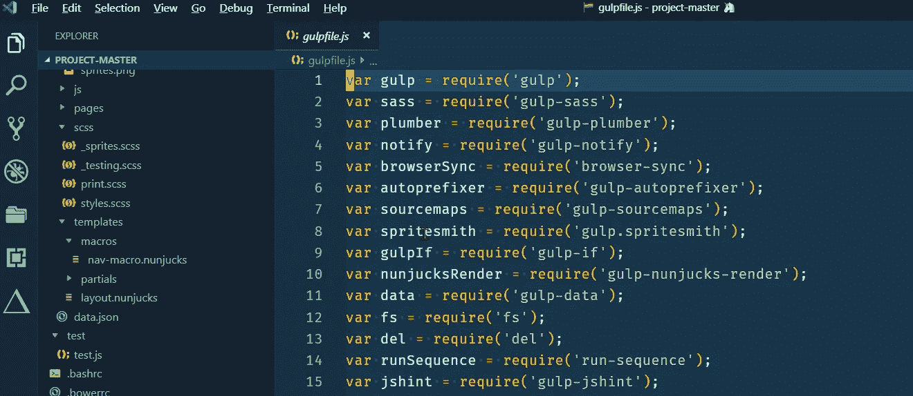*

*Cobalt2-Theme*

> *当你打开上面的链接时，这个主题需要一些配置，然后它会显示一些推荐的设置，我们在我们的设置中已经介绍过了，所以如果你已经阅读了这篇文章，你就不需要单独配置了。*
> 
> *但是我们需要设置 ***CSS hacks 来额外平滑编辑*** 这也需要一些配置，所以我们会先安装名为*{ {*[***vs code-custom-CSS***](http://be5invis/vscode-custom-css)*} }*的插件，安装完插件后 您需要在根目录{ { Windows***C:/Users/{ { Pc _ Username } }/AppData/Roaming/Code/User/. vscodestyles . CSS***} }中创建一个文件{ {**. vscodestyles . CSS***}，并从[***cobalt 2-Custom-hacks . CSS***](https://github.com/wesbos/cobalt2-vscode/blob/master/cobalt2-custom-hacks.css)中复制代码**

**2. [***仙女牙线***](https://github.com/sailorhg/fairyfloss)*{ {*紫色背景主题* }}***

***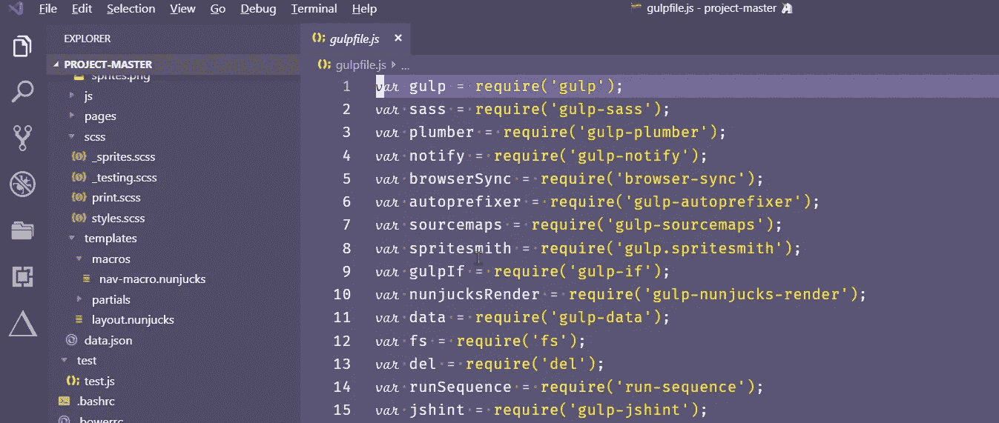***

***Fairy Floss***

***3. [***德古拉官方***](https://draculatheme.com/) {{ *黑暗背景主题* }}***

***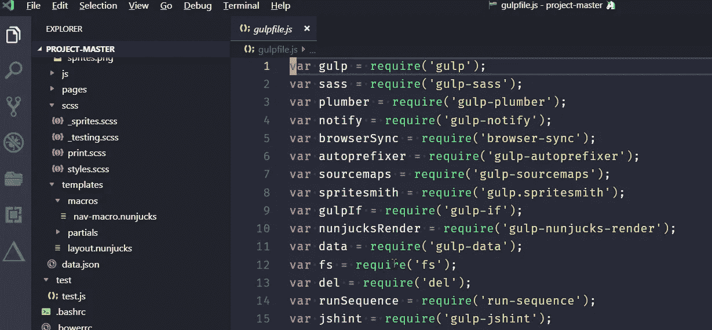***

***Dracula***

***4. [***夜猫子***](https://github.com/sdras/night-owl-vscode-theme)*{ {*主题为夜猫子(微调为我们这些喜欢编码到深夜的人)* }}****

***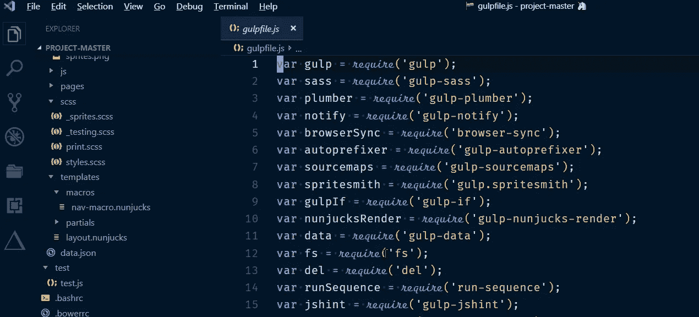***

***Night Owl***

***5.[***Monokai Pro***](https://www.monokai.pro/)*{ {*深棕色背景基础主题* }}****

> ***但是一些开发者建议你安装一个 Monokai 主题，而不是这个主题，因为 Monokai 是 Monokai 和黑暗主题的结合。***

***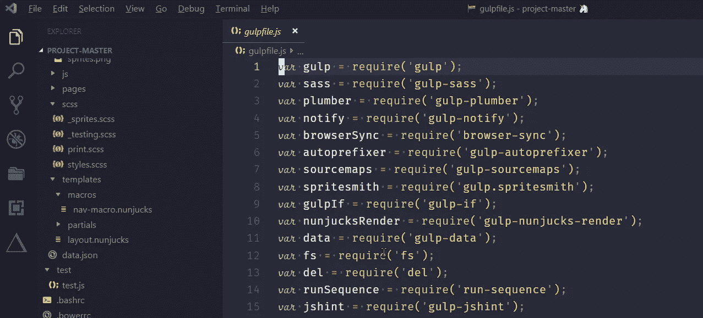***

***Monokai Pro***

***6. [***大洋下***](https://marketplace.visualstudio.com/items?itemName=naumovs.theme-oceanicnext)***

***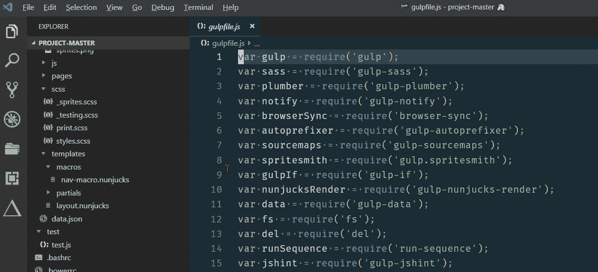***

***Oceanic Next***

> ***{{我的设置主题:钴 2 }}***

## *****文件图标主题*****

1.  ***[***材质图标主题***](https://marketplace.visualstudio.com/items?itemName=PKief.material-icon-theme)***
2.  ***[***VS-代码图标***](https://marketplace.visualstudio.com/items?itemName=vscode-icons-team.vscode-icons)***

> ***{{我的设置主题:材料图标主题}}***

# ***字体***

> ***在你的系统中安装 ttf 文件，并在编辑器中设置“选定字体”***

1.  ***[***FIRA code iScript***](https://github.com/kencrocken/FiraCodeiScript)***

******

***FiraCode iScript***

***2.[](https://github.com/tonsky/FiraCode)***

********

****Fira Code****

****3. [***操作员-单眼***](https://github.com/kiliman/operator-mono-lig)****

***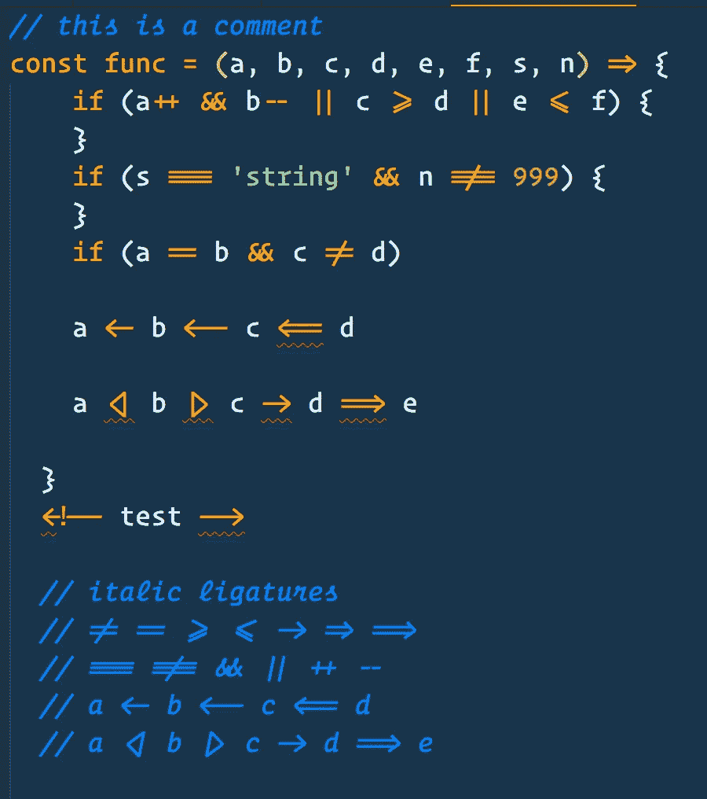***

***Operator-mono-lig***

***4. [***菲里科***](https://github.com/kosimst/Firicico)***

***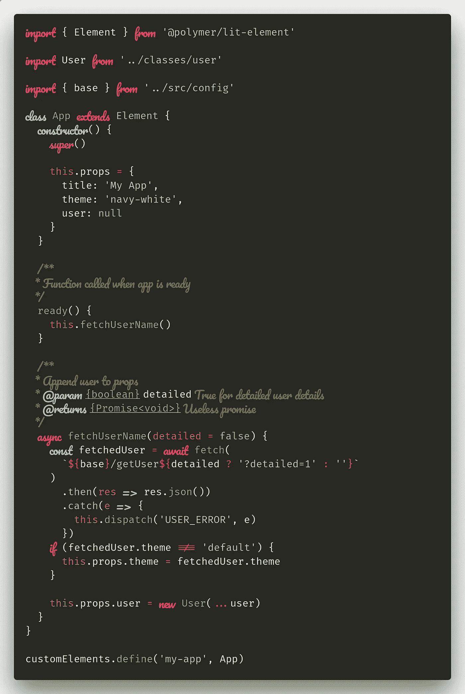***

***Firicico***

> ***{{我的设置字体:FiraCode iScript }}***

# ***编辑器的配置***

> ***Visual Studio 还允许我们编辑底层的 **Settings.json** 配置文件。
> 文件首选项设置然后点击“花括号”打开 Settings.json***

## ***编辑器设置:***

*   ***设置字体大小= 16，行高= 25，字体粗细= 400，设置 Tab_Size =两个空格，光标宽度= 5，光标 _ 闪烁=实心，光标 _ 样式=块，字母间距= 0.5，标尺= 100，100。***
*   ***Font _ Ligatures =在编程语言中，我们使用许多运算符和符号，但它们仍然表示单个符号，因此 vs 代码支持字体连字，并可用于改善源代码在屏幕上的呈现。***
*   ***Format_on_Save =要保存单个文件，请使用新的“不格式化保存”命令，这比在保存时全局打开和关闭格式更容易。***
*   ***Format_on_Paste =复制时会保留格式。***
*   ***Minimap =在屏幕右侧显示代码的概述。***
*   ***Rounded_Selection =将圆形边框应用于选择。***
*   ***Auto _ Closing _ 括号=自动关闭括号。***
*   ***Auto_Indent =编辑器应该在用户输入、粘贴或移动行时自动调整缩进。***
*   ***Scroll_Beyond_Lastline =这将防止编辑器滚动到最后一行之外。***
*   ***Word_Wrap = Lines 应该换行{{不要超出屏幕}}，所以您不需要向右滚动。***
*   ***Match_Brackets =选中其中一个括号时，突出显示匹配的括号。***
*   ***显示空白字符。***
*   ***Smooth_Scrolling =使用动画滚动。***
*   ***Show_Folding_Controls =向代码显示折叠选项(-，+)。***
*   ***Light_Bulb =在编辑器中禁用代码动作灯泡。***
*   ***Quick_Suggestion_Delay =当快速建议出现时，会延迟几毫秒。***
*   ***Snippet_Suggestion =代码段是一些模板，可以使输入重复的代码模式变得更加容易。***
*   ***Color_Decorators = Editor 应该呈现内联颜色装饰器和颜色选择器。***
*   ***Parameter_Hints =禁用在我们键入时显示参数文档和类型信息的弹出窗口。***
*   ***token _ Color _ Customizations = Overides 编辑器和字体样式来自当前选定的颜色主题。***

```
***{
    "editor.fontFamily": "Fira Code iScript",
    "editor.formatOnSave": false,
    "editor.formatOnPaste": true,
    "editor.fontSize": 16,
    "editor.lineHeight": 25,
    "editor.fontWeight": "400",
    "editor.tabSize": 2,
    "editor.cursorWidth": 5,
    "editor.letterSpacing": 0.5,
    "editor.fontLigatures": true,
    "editor.minimap.enabled": false,
    "editor.roundedSelection": false,
    "editor.autoClosingBrackets": true,
    "editor.cursorBlinking": "solid",
    "editor.renderIndentGuides": false,
    "editor.renderWhitespace": "all",
    "editor.accessibilitySupport": "off",
    "editor.scrollBeyondLastLine": false,
    "editor.useTabStops": true,
    "editor.cursorStyle": "block",
    "editor.wordWrap": "on",
    "editor.autoIndent": true,
    "editor.detectIndentation": false,
    "editor.insertSpaces": true,
    "editor.showFoldingControls": "always",
    "editor.find.seedSearchStringFromSelection": true,
    "editor.matchBrackets": true,
    "editor.snippetSuggestions": "top",
    "editor.minimap.showSlider": "always",
    "editor.colorDecorators": true,
    "editor.hideCursorInOverviewRuler": false,
    "editor.lightbulb.enabled": false,
    "editor.smoothScrolling": true,
    "editor.scrollBeyondLastColumn": 0,
    "editor.minimap.renderCharacters": false,
    "editor.quickSuggestionsDelay": 500,
    "editor.parameterHints.enabled": false,
    "editor.tokenColorCustomizations": {
      "textMateRules": [{
          "scope": [
            //following will be in italic (=FlottFlott)
            "comment",
            "entity.name.type.class", //class names
            "keyword", //import, export, return…
            "constant", //String, Number, Boolean…, this, super
            "storage.modifier", //static keyword
            "storage.type.class.js", //class keyword
          ],
          "settings": {
            "fontStyle": "italic"
          }
        },
        {
          "scope": [
            //following will be excluded from italics (VSCode has some defaults for italics)
            "invalid",
            "keyword.operator",
            "constant.numeric.css",
            "keyword.other.unit.px.css",
            "constant.numeric.decimal.js",
            "constant.numeric.json"
          ],
          "settings": {
            "fontStyle": ""
          }
        }
      ]
    },
    "editor.rulers": [
        100,
        100
      ],***
```

## ***工作台设置:***

*   ***Statusbar_Visible =工作台底部状态栏的可见性。***
*   ***Show_Tabs =打开的编辑器是否应该显示在标签中。***

```
 ***"workbench.statusBar.visible": true,
      "workbench.activityBar.visible": true,
      "workbench.colorTheme": "Cobalt2",
      "workbench.iconTheme": "vscode-icons",
      "workbench.colorCustomizations": {
          "statusBar.background": "#333333",
          "statusBar.noFolderBackground": "#333333",
          "statusBar.debuggingBackground": "#263238",
          "activityBarBadge.background": "#616161",
          "list.activeSelectionForeground": "#616161",
          "list.inactiveSelectionForeground": "#616161",
          "list.highlightForeground": "#616161",
          "scrollbarSlider.activeBackground": "#61616150",
          "editorSuggestWidget.highlightForeground": "#616161",
          "textLink.foreground": "#616161",
          "progressBar.background": "#616161",
          "pickerGroup.foreground": "#616161",
          "tab.activeBorder": "#616161",
          "notificationLink.foreground": "#616161"
          },
      "workbench.editor.showTabs": true,
      "workbench.commandPalette.preserveInput": false,
      "workbench.editor.enablePreviewFromQuickOpen": false,
      "workbench.editor.enablePreview": true,***
```

## ***其他配置:***

> ***这包括终端设置、文件设置和插件设置。
> **注** :
> 1。在窗口标题中你需要复制你最喜欢的表情符号{记得删除它周围的括号} &粘贴，这些表情符号显示有你的文件名。
> 2。如果已经安装了 [**zsh**](https://ohmyz.sh/) 终端，在终端外壳中选择**zsh**T13，否则选择 bash。***

***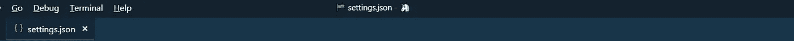***

***Window.Title Settings***

```
 ***"files.trimTrailingWhitespace": true,
      "files.autoSave": "onFocusChange",
      "files.exclude": {
         "**/.git": true,
         "**/.svn": true,
         "**/node_modules": true,
         "**/.hg": true,
         "**/CVS": true,
         "**/.DS_Store": true,
         "**/.next": true
        },
      "files.hotExit": "onExitAndWindowClose",
      "files.insertFinalNewline": true,
      "files.defaultLanguage": "javascript", "indentRainbow.includedLanguages": ["javascript",
          "html", "css","python"],
      "indentRainbow.colors": [
             "rgba(16,16,16,0.1)",
             "rgba(16,16,16,0.2)",
             "rgba(16,16,16,0.3)",
             "rgba(16,16,16,0.4)",
             "rgba(16,16,16,0.5)",
              "rgba(16,16,16,0.6)",
             "rgba(16,16,16,0.7)",
             "rgba(16,16,16,0.8)",
             "rgba(16,16,16,0.9)",
             "rgba(16,16,16,1.0)"
            ], "breadcrumbs.enabled": true,
      "css.validate": false,
      "diffEditor.renderSideBySide": false,
      "extensions.ignoreRecommendations": true,
      "explorer.openEditors.visible": 0,
      "explorer.confirmDragAndDrop": false,
      "extensions.autoUpdate": true,
      "emmet.syntaxProfiles": {
          "javascript": "html"
           },
      "emmet.includeLanguages": {
            "javascript": "javascriptreact"
           },
      "explorer.sortOrder": "default",
      "git.enableSmartCommit": true,
      "git.autofetch": true,
      "git.enableCommitSigning": true,
      "git.ignoreMissingGitWarning": true,
      "html.format.enable": true,
      "html.format.preserveNewLines": true,
      "html.format.wrapLineLength": 0,
      "javascript.updateImportsOnFileMove.enabled": "always",
      "less.validate": false,
      "npm.enableScriptExplorer": true, "material-icon-theme.activeIconPack": "react", "window.zoomLevel": 0,
      "window.openFilesInNewWindow": "off",
      "window.openFoldersInNewWindow": "off",
      "window.restoreWindows": "all",
      "window.title": "[[EMOJI]]  ${activeEditorShort}${separator}${rootName} [[EMOJI]]", "prettier.eslintIntegration": true,
      "prettier.singleQuote": true,
      "prettier.jsxBracketSameLine": false,
      "prettier.bracketSpacing": true,
      "prettier.tabWidth": 2,
      "prettier.semi": false, "scss.validate": false,
      "search.location": "sidebar",
      "sync.autoDownload": false,
      "sync.autoUpload": false,
      "sync.forceDownload": false,
      "sync.quietSync": false,
      "sync.askGistName": false,
      "sync.removeExtensions": false,
      "sync.syncExtensions": true, "terminal.integrated.shell.linux": "/bin/zsh",
      "terminal.integrated.cursorStyle": "line",
      "terminal.integrated.shell.osx": "/bin/zsh",
      "terminal.external.osxExec": "Hyper.app",
      "terminal.integrated.copyOnSelection": true, "typescript.validate.enable": false,
      "javascript.validate.enable": false,
      "editor.autoClosingQuotes": "always",
      "workbench.editor.highlightModifiedTabs": true,
      "debug.allowBreakpointsEverywhere": true,
      "debug.inlineValues": true,
      "better-comments.highlightPlainText": true,
      "bracketPairColorizer.highlightActiveScope": true,
      "docthis.includeAuthorTag": true,
      "docthis.includeDateTag": true,
      "docthis.includeDescriptionTag": true,
      "html.format.indentInnerHtml": true,
      "less.lint.boxModel": "warning",
      "less.lint.duplicateProperties": "warning",
      "material-icon-theme.showWelcomeMessage": false, "vscode_custom_css.imports": ["file:///C:/Users/{{PC_USERNAME}}/AppData/Roaming/Code/User/.vscodestyles.css"],
      "vscode_custom_css.policy": true,}***
```

***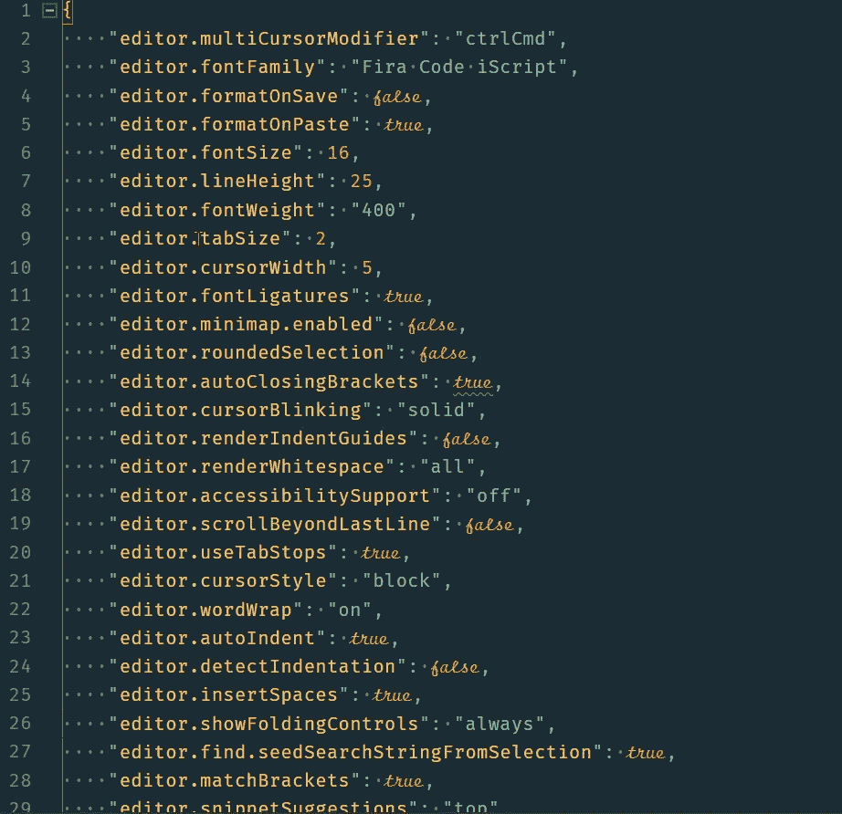***

***Settings.json***

# ***扩展:***

1.  ******自动关闭标记*** **{{** *自动添加 HTML/XML 关闭标记，与 Visual Studio IDE 或 Sublime Text 一样。* **}}*****
2.  ******自动重命名标记*** **{{** *自动重命名成对的 HTML/XML 标记，与 Visual Studio IDE 一样。* **}}*****
3.  ******Babel JavaScript*****{ {***JavaScript 语法高亮为 ES201x，React JSX，Flow 和 GraphQL。* **}}*****
4.  ******美化*{***美化* `*javascript*` *，* `*JSON*` *，* `*CSS*` *，* `*Sass*` *，* `*HTML*` *在 Visual Studio 代码中。* **}}*****
5.  ******更好的注释*** **{{** *更好的注释扩展将帮助您在代码中创建更人性化的注释。
    有了这个扩展，你可以将你的注释分类为:
    警告、查询、待办事项、高亮显示、注释掉的代码也可以进行样式化，使代码不应该出现在那里，你想要的任何其他注释样式都可以在设置* s **}}** 中指定***
6.  ******括号对上色器* {{** *这个扩展允许匹配的括号用颜色来标识。用户可以定义匹配哪些字符，使用哪些颜色。* **}}*****
7.  ******Carbon-now-sh*{***A VS 代码扩展打开当前编辑器内容*[***Carbon . now . sh***](https://carbon.now.sh/)***。*** **}}*****
8.  ******Change-case*{ {***A wrapper about*[***node-Change-case***](https://github.com/blakeembrey/node-change-case)*for Visual Studio 代码。快速更改当前选择或当前单词的大小写。* **}}*****
9.  ******检查 NPM 包的更新* {{** *Visual Studio 代码扩展，检查* `*dependencies*` *和* `*devDependencies*` *段中的所有包是否都是最新的* `*package.json*` *文件。* **}}*****
10.  ******颜色高亮* {{** *本扩展样式 css/web 颜色在您的文档中找到。* **}}*****
11.  ******颜色选择器* {{** *助手，带 GUI 生成颜色代码，如 CSS 颜色符号。并且，发出* `*Convert Color*` *命令来改变颜色符号。* **}}*****
12.  ******Css 格式化程序* {{** *给 Css****} }****添加格式****
13.  *******自定义 Css 和 Js 加载器* {{** *在钴 2 主题中使用* **}}******
14.  ******Chrome 的调试器* {{** *一个 VS 代码扩展，用来调试你在谷歌 Chrome 浏览器中的 JavaScript 代码，或者其他支持* [*Chrome DevTools 协议*](https://chromedevtools.github.io/debugger-protocol-viewer/) *的目标。* **}}*****
15.  ******Document This*{ {***“Document This”是一个 Visual Studio 代码扩展，可以自动为 TypeScript 和 JavaScript 文件生成详细的 JSDoc 注释。* **}}*****
16.  ******【DotENV】*{***[*的一个端口 DotENV*](https://github.com/zaynali53/DotENV) *为 vscode。* **}}******
17.  ******复制选择*{****这个扩展向 vscode 添加一个动作来复制当前选择。* **}}******
18.  ******editor config For VS Code*{ {****该插件* *试图用* *覆盖用户/工作空间设置，这些设置在* `*.editorconfig*` *文件中找到。* **}}******
19.  ******ES7 React/Redux/graph QL/React-Native/Js Snippets*{ {****该扩展为您提供了 ES7 中的 JavaScript 和 React/Redux snippets 与 Babel plugin 的特性*[*VS Code*](https://code.visualstudio.com/)***} }*******
20.  *******{ {*****将 sublime-expand-region 移植到可视化代码* **}}*******
21.  ******文件模板* {{** *这允许我们基于定义的模板快速创建新文件。* **}}*****
22.  ******文件工具* {{** *创建、复制、移动、重命名、删除文件和目录的便捷方式。* **}}*****
23.  ******文件图标* {{** *名家 VS 代码文件图标* **}}*****
24.  ******查找相关文件* {{** *根据用户自定义的配置规则查找与当前文件相关的文件。* **}}*****
25.  ******Git 历史******
26.  ******hex-rgba 转换器*{ {***hex 到 rgba 的颜色代码转换器。* **}}*****
27.  ******HTML tag wrap*{ {****在 HTML 标记中包装您的选择。可以将行内选择和跨多行的选择换行。* **}}******
28.  ******{ {*****这个扩展将在编辑器中内联显示导入包的大小。* **}}******
29.  ******缩进彩虹* {{** *这个扩展为你的文本前面的缩进着色。* **}}*****
30.  ******JavaScript Console utils*{ {***轻松插入和删除 console.log 语句* **}}*****
31.  ******语言-手写笔* {{** *在 Visual Studio 代码中为手写笔文件添加语法突出显示和代码完成功能。* **}}*****

33.  ********MDX*{**{*为。md 文件*}**}*******
34.  ********多行技巧* {{** *这个插件支持将文本升华到 VSCode 的行选择和结束行多光标行为。* **}}*******
35.  ********{ {*****Now . sh 实现* **}}********
36.  ********Npm* {{** *该扩展支持运行* `*package.json*` *文件中定义的 Npm 脚本，并根据* `*package.json*` *中定义的依赖关系验证已安装的模块。* **}}*******
37.  *******Npm 智能感知 *******
38.  ********在浏览器中打开*{***预览* ***浏览器中的 html*** *文件、****Firefox****&****谷歌 chrome*** *&* **}}*******
39.  ********粘贴&缩进********
40.  ********路径自动完成* {{** *为 visual studio 代码提供路径完成功能。* **}}*******
41.  ********路径智能感知* {{** *自动完成文件名* **}}*******
42.  ********Polacode*{ {***你已经花了无数个小时寻找完美的* [*JavaScript 语法*](https://marketplace.visualstudio.com/search?term=javascript%20grammar&target=VSCode&category=All%20categories&sortBy=Relevance) *，为其搭配一个* [*造型优美的 VS 代码主题*](https://marketplace.visualstudio.com/search?target=VSCode&category=Themes&sortBy=Downloads) *，尝试所有的* [*最佳编程字体*](https://www.slant.co/topics/67/~best-programming-fonts) *。* **}}*******
43.  ********PostCSS 语法* {{** *为 PostCSS 文件提供语法高亮显示。*T52)} }*****
44.  ********更漂亮—代码格式化器* {{** *VS 代码包使用* [*更漂亮*](https://github.com/prettier/prettier) *格式化您的 JavaScript / TypeScript / CSS。* **}}*******
45.  ********项目经理* {{** *轻松切换项目* **}}*******
46.  ********quokka . Js*{ {***Js***} } { { * * * } }*******
47.  ********设置同步* {{** *推荐* **}}*******
48.  ********save Backup*{ {***保存***}**时备份文件*****
49.  *******切换引号 *******
50.  ********Turbo Console 日志* {{** *这个扩展通过自动化编写有意义的日志消息的操作，使调试变得更加容易。* **}}*******
51.  ********范德莱 JavaScript********
52.  ********版本镜头* {{** *显示* [*Visual Studio 代码*](https://github.com/microsoft/vscode) *编辑器中 npm、jspm、bower、dub 和 dotnet 核心的包版本信息。* **}}*******
53.  ********浏览器中的视图********
54.  ********VS-Code HackerTyper*{ {****非常适合现场编码演示，给你的朋友留下深刻印象，或者只是想看起来工作繁忙，Hacker Typer 允许我们记录你的自我编程* **}}********
55.  ********vs code-styled-components*{ {***语法高亮和 IntelliSense for*[*-styled-components*](https://github.com/styled-components/styled-components)*。* **}}*******
56.  ********Waka time*{ {***从您的编程活动中自动生成的度量、洞察和时间跟踪。* **}}*******
57.  ********wallaby . js*{ {***用于测试 Javascript 代码* **}}*******

# *****VS-代码图标*****

> *****[dhanishgajjar](https://github.com/dhanishgajjar)/[vs code-icons](https://github.com/dhanishgajjar/vscode-icons)*****

*****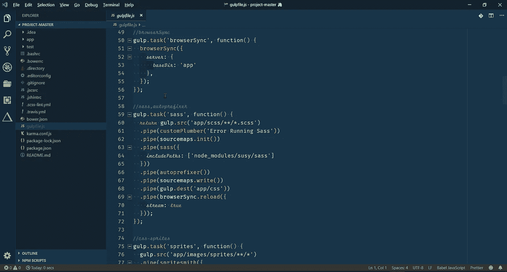*****

*****My-VS-Code Setup*****

*****找到有用的东西了？按住👏来支持和帮助别人找到这篇文章。感谢阅读！！*****

******在 Instagram 上关注我*[***@ hypnosiss _ _***](https://www.instagram.com/hypnosisss___/?hl=en)*&推特*[***@ akash _ Raj vanshi***](https://twitter.com/Akash_Rajvanshi)*****

*****查看我的其他生产力工具帖子:*****

*   *****[***循序渐进指南推送你在 GitHub 上的第一个项目！！*T82**](https://hackernoon.com/step-by-step-guide-to-push-your-first-project-on-github-fec1dce574f)*****
*   *****[***每个程序员都应该知道的终极 JavaScript 资源！！*T88**](https://hackernoon.com/ultimate-javascript-resources-that-every-programmer-should-know-9889d4fd691)*****
*   *****[***从零开始设置 Manjaro Linux！！***](https://hackernoon.com/setting-up-manjaro-linux-from-scratch-d9bdaa806596)*****