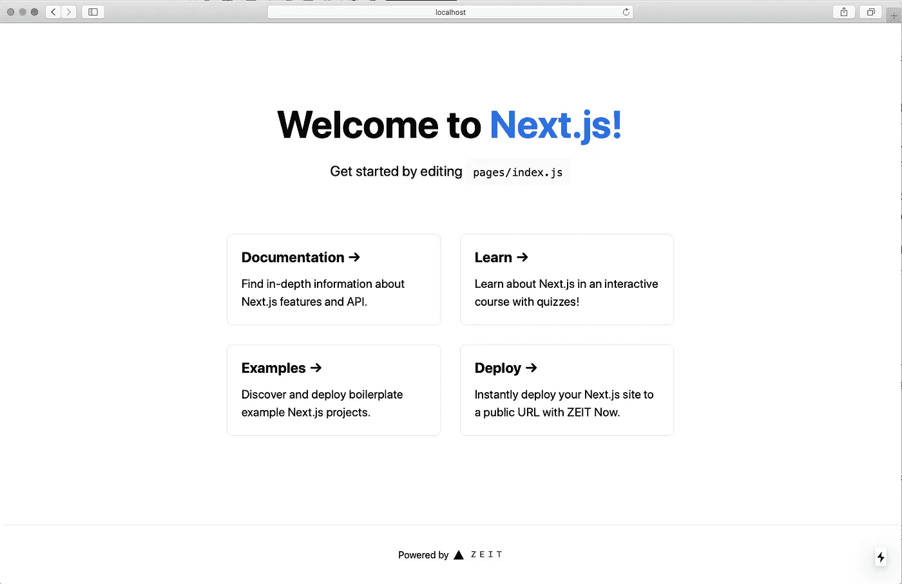
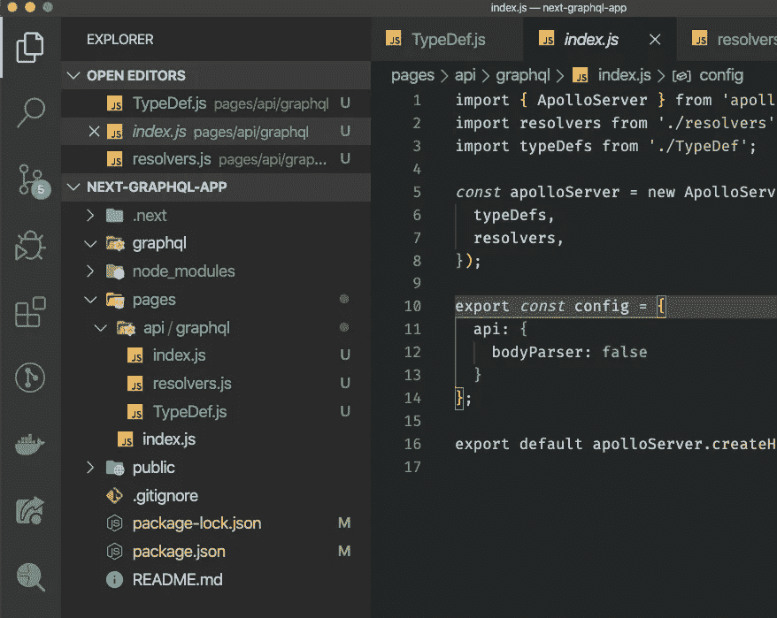
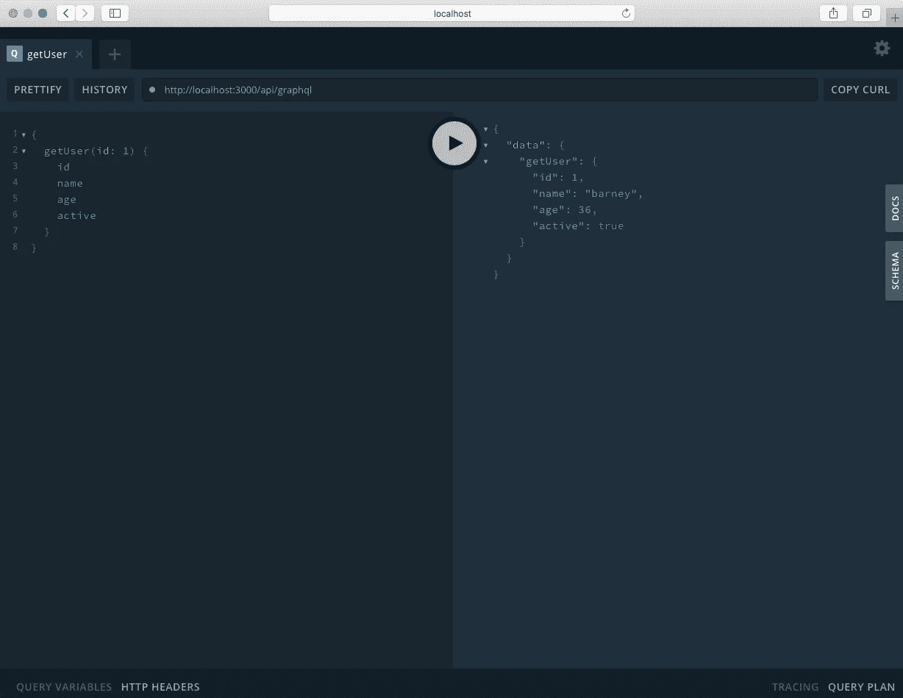

# 如何在 Next.js 中设置 Apollo GraphQL

> 原文：<https://javascript.plainenglish.io/setting-upapollo-graphql-in-next-js-a1b36726c836?source=collection_archive---------7----------------------->


# Next.js 是目前的热门

我说“当前”,是因为我们都知道在网络世界中——技术发展速度极快！在撰写本文时，Next.js 是最热门的 React 框架之一，这是有充分理由的。它提供服务器端渲染，并且开箱即用。它还包括自动代码分割、基于文件系统的路由和“零设置”热代码重载等等。我不会在这里详细介绍，因为有大量的文章强调了 Next.js 的好处。

# 适合这项工作的工具

最近，我有幸与 Next.js 合作了一个项目。当涉及到设计技术堆栈时，归结起来就是理解需求并为工作选择正确的工具。我的项目的要求非常简单。

*   构建一个管理员门户，管理员可以在其中查看客户详细信息、订单历史和库存。
*   该应用程序将是小型轻量级的——支持少数管理员

基于这些简单的需求，在选择使用哪种技术时，它会敞开大门。因为应用程序将是小而轻的，我们不需要一个成熟的独立后端服务器。使用 Next.js，我们可以在一个应用程序中同时提供客户端和服务器端代码。下面是这个项目选择 Next.js 的其他几个原因。

## 几乎没有设置

开箱即用——next . js 为我们提供了一个熟悉的 React 框架，它很简单，因此我们可以立即开始开发，最大限度地减少配置和设置时间。

## 开箱即用的快速服务器

Next.js 的一个非常酷的特性是，它运行一个开箱即用的 Express 服务器，因此您可以开始编写 api 路径。我选择在这个项目中实现 Apollo GraphQL，我将带您了解如何设置。

## 出色的文档和支持

当涉及到选择特定的技术时，文档是非常重要的。有时，当涉及到文档和支持时，使用最新和最好的是一把双刃剑。但是在 Next.js 的例子中，文档是丰富的并且易于浏览。

# 我们开始吧

我假设您已经安装了 Next.js。在撰写本文时，Next.js 的最新版本是 9.3.0。让我们通过运行 **npm init next-app** 创建一个新的 Next.js 项目，并将该项目命名为 **next-graphql-app** 。

```
npm init next-app
```

接下来，切换到目录并启动 Next.js 应用程序，并验证一切正常。

```
➜  ~  cd next-graphql-app
➜  next-graphql-app git:(master) npm run dev
```



# 设置 GraphQL

## 安装项目依赖项

首先，让我们安装依赖项。我们将使用 **apollo-server-micro** 包。在这个演示中，我们还将使用 **lodash** 。打开您喜欢的终端并运行以下命令来安装依赖项。

```
npm i apollo-server-micro lodash
```

## 文件夹结构

让我们在 VSCode 中打开项目，并创建几个新文件。

*   /next-graph QL-app/pages/API/graph QL/index . js
*   /next-graph QL-app/pages/API/graph QL/resolvers . js
*   /next-graph QL-app/pages/API/graph QL/typedefs . js



You folder structure should look similar to this at this point in time

## 设置 GraphQL API 路由

让我们使用 **index.js** —这是我们的 api 入口点，我们将在这里设置 GraphQL。将下面的代码复制到 index.js 文件中。

## TypeDefs

修改 typeDef.js 文件，如下所示:

## 下决心者

同样，修改 resolvers . js——这里我们有一个 3 个用户的数组。 **getUser** 查询将通过 **id** 找到一个用户，并返回用户的对象。

# 测试我们的 GraphQL 端点

让我们启动 Next.js 应用程序，如果它还没有运行的话。

```
npm run dev
```

一旦应用程序准备就绪，打开你最喜欢的浏览器，进入[http://localhost:3000/API/graph QL](http://localhost:3000/api/graphql)

如果一切都正确挂钩，这应该会拉起 GraphQL 操场，我们可以测试我们的查询。



# 结论

我们做到了！良好的..那很容易。我们现在有了一个带有 Apollo GraphQL 后端的 React 应用程序。这就是我喜欢 Next.js 的原因，它减少了配置的时间，所以你可以专注于重要的事情，代码和应用程序本身。Apollo GraphQL 的启动和运行只需要 3 个文件和几行代码。我希望这篇文章对您有所帮助——快乐编码！

我在业余时间写这些文章是为了消遣。如果你喜欢这篇文章，请在下面留下你的喜欢和评论！可以关注我上 [*中*](https://medium.com/@this.kevinluu) *和* [*推特*](https://twitter.com/kluu_10) *。感谢支持！*