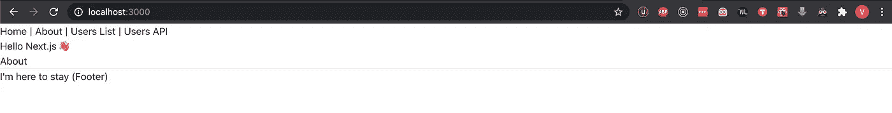

# 使用 TypeScript 和 Chakra UI 设置 Next.js 应用程序

> 原文：<https://javascript.plainenglish.io/setup-a-next-js-app-with-typescript-and-chakra-ui-f3a6c39dec48?source=collection_archive---------1----------------------->

## 还要加入 ESLint 和 beauty


Photo by [Blake Connally](https://unsplash.com/@blakeconnally?utm_source=unsplash&utm_medium=referral&utm_content=creditCopyText) on [Unsplash](/s/photos/code?utm_source=unsplash&utm_medium=referral&utm_content=creditCopyText)

## 更新

自从我发表这篇文章以来，Next.js 的团队已经使开始使用 Chakra 和 Typescript 变得简单多了。您可以简单地使用下面的命令:

```
// Using npx
npx create-next-app --example with-chakra-ui-typescript with-chakra-ui-typescript-app
// or yarn
yarn create next-app --example with-chakra-ui-typescript with-chakra-ui-typescript-app
```

这是一个关于我如何用 Chakra UI 设置 Next.js 应用程序的简单演练。我将使用 yarn 作为我的软件包管理器的选择，所以如果你还没有安装 yarn，你可以在这里找到安装说明。

# 使用 TypeScript 设置 Next.js

让我们从创建一个 Next.js 应用程序开始。我们将使用 Next.js 团队提供的 *with-typescript* 示例。你可以在这里找到[提供的所有例子的更多细节。](https://create-next-app.js.org/get-started-with-examples)

一旦安装了所有的依赖项，您就可以进入您的项目并启动 dev 服务器，如下所示。

```
// Create a new next.js app
create-next-app my-app --example with-typescript// Jump into the app folder
cd my-app// Start the dev server
yarn dev
```

我把这个应用程序叫做`my-app`，你可以用任何你喜欢的名字来代替它。

这将构建您的应用程序，您可以在浏览器中的 [http://localhost:3000/](http://localhost:3000/) 上查看它。它应该是这样的:


Source: Author

这就是你开始使用 Next.js 和 TypeScript 所需要的一切。

# Chakra UI

Chakra UI 是一个相对较新的 UI 库，我决定将其用于我的项目。能够轻松定制主题和黑暗模式的兼容性是吸引我尝试 Chakra 的主要原因。你可以在这里了解更多信息[。](https://chakra-ui.com/getting-started)

为了将 Chakra 添加到我们的应用程序中，我们必须使用以下命令将所有依赖项添加到我们的应用程序中:

```
yarn add @chakra-ui/core @emotion/core @emotion/styled emotion-theming
```

Next.js 使用`App`组件来初始化页面。我们需要覆盖`App`组件来整合脉轮。要覆盖默认的`App`，创建文件`./pages/_app.tsx`并添加下面的代码:

The name of the file has to be _app.tsx

> 确保该文件被命名为`_app.tsx`，并被放置在`./pages`文件夹中

在上面的代码中，我们用 Chakra 提供的 ThemeProvider 和 CSSReset 包装了默认的 next 应用程序。这允许我们将组件从 Chakra UI 导入并使用到我们的应用程序中。

要检查 Chakra 是否设置正确，您可以重启应用程序，查看 Chakra 中的默认风格是否已添加，主页如下所示:



Source: Author

# 配置 ESLint 和更漂亮

有许多不同的方法来为你的项目设置 ESLint 和 Prettier。如果你独自工作，你可以简单地下载插件，并启用你喜欢的林挺规则。如果你与其他开发人员合作，这种方法是不可行的，所以我更喜欢创建一个`.eslintrc.json`文件，让项目中的每个人都遵循相同的规则。这有助于保持格式和风格的一致性。

为了完成这个任务，我们将从下载所有的依赖项到我们的项目开始，并在项目的根目录下创建`.eslintrc.json`文件。

```
// Download ESLint related dependencies
yarn add eslint @typescript-eslint/parser @typescript-eslint/eslint-plugin eslint-plugin-react --dev// Download Prettier related dependencies
yarn add prettier eslint-config-prettier eslint-plugin-prettier --dev// Create the .eslintrc.json file
touch .eslintrc.json
```

一旦下载了所有的依赖项，您就可以在您选择的编辑器中打开您的`.eslintrc.json`文件，并添加以下代码:

> 确保`plugin:prettier/recommended`是`extends`阵列中的最后一个配置。

这些是我在项目中使用的默认设置。您可以根据自己的喜好添加和修改规则。

# 修复 ESLint 问题

在添加并修改了`.eslintrc.json`文件后，你会发现突然之间你的许多文件显示错误，因为我们文件中的代码不符合林挺规则。处理这个问题的一个有效方法是在您的`package.json`脚本中添加以下命令。

```
"scripts": {
  "lint": "eslint '*/**/*.{js,ts,tsx}' --quiet --fix"
}
```

现在您可以运行命令`yarn lint`，它将修复所有可以自动修复的 ESLint 错误，任何其他错误都将在命令行中打印出来。

这是用 Chakra UI、TypeScript、ESLint 和 beauty 设置 Next.js 应用程序的最简单方法。你可以在这里找到这篇博客[中提到的样板文件。](https://github.com/VarunRustomji/next-chakra-boilerplate)

*更多内容看* [***说白了。***](https://plainenglish.io/)

*报名参加我们的* [***免费周报***](http://newsletter.plainenglish.io/) *。关注我们关于*[***Twitter***](https://twitter.com/inPlainEngHQ)，[***LinkedIn***](https://www.linkedin.com/company/inplainenglish/)*，*[***YouTube***](https://www.youtube.com/channel/UCtipWUghju290NWcn8jhyAw)*，以及* [***不和***](https://discord.gg/GtDtUAvyhW) ***。***

***有兴趣缩放你的软件启动*** *？检查* [***电路***](https://circuit.ooo?utm=publication-post-cta) *。*

# 进一步阅读

[](/typescript-made-easy-a-guide-to-your-first-type-safe-app-with-next-js-wundergraph-and-prisma-e197a59e2b30) [## 轻松编写类型脚本:使用 Next.js、WunderGraph 和 Prisma 编写第一个类型安全应用程序的指南

### 是时候抛开恐惧，学习 TypeScript 了。让我们给你第一次“发现！”瞬间通过建立一个完整的…

javascript.plainenglish.io](/typescript-made-easy-a-guide-to-your-first-type-safe-app-with-next-js-wundergraph-and-prisma-e197a59e2b30)