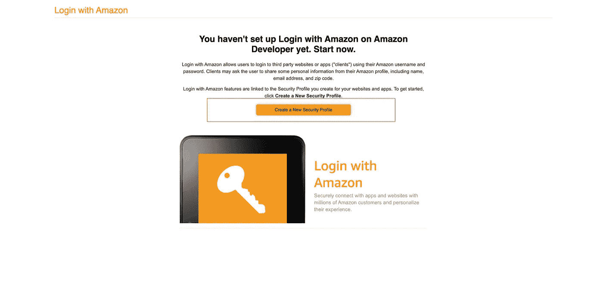
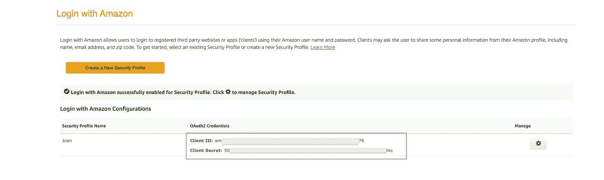
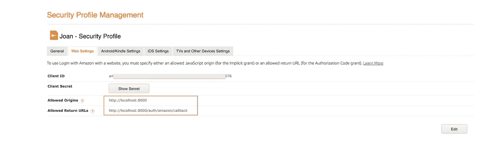

# 用节点和 Passport JS 设置 Amazon OAuth

> 原文：<https://javascript.plainenglish.io/setup-amazon-oauth-with-node-and-passport-js-26686f972c15?source=collection_archive---------11----------------------->


Cover

在这篇博客中，我将演示如何用 Node 和 Passport JS 实现 Amazon OAuth。为了实现这一点，我们将使用一个名为 Passport JS 的第三方库。Passport JS 是 Node 和 Express JS 的认证中间件。Passport JS 可以与任何 Express JS 应用程序一起使用。Passport JS 提供 500 +策略。

[](http://www.passportjs.org/packages/passport-amazon) [## 护照-亚马逊

### 使用 OAuth 2.0 API 向 Amazon 认证的 Passport 策略。此模块允许您使用以下方式进行身份验证…

www.passportjs.org](http://www.passportjs.org/packages/passport-amazon) 

目录

1.  [初始化一个节点 JS 项目](#8692)
2.  [创建 amazon OAuth 客户端 ID](#20ba)
3.  [配置亚马逊 OAuth](#b955)
4.  [保护路由并添加注销](#8e6d)

1.  **初始化一个节点 JS 项目**

首先，让我们创建一个新的 Node js 项目。下面的命令创建一个新文件夹，然后初始化我们项目的节点。

```
mkdir amazon_passport
cd amazon_passport/
npm init -y
touch index.js
```

现在安装所需的软件包:

```
npm i express cookie-session passport passport-amazon
```

安装后，将下面的代码复制到您的`index.js`文件中。

`index.js`

```
const express = require('express')
const app = express()app.get('/',(req,res)=>{
  res.send('Hello world')
})app.listen(8000,()=>{
  console.log('Serve is up and running at the port 8000')
})
```

现在使用`node index.js`启动服务器。然后导航到 [http://localhost:8000/](http://localhost:8000/) 。您应该会看到浏览器中显示“Hello world”。

2.**创建一个亚马逊 OAuth 客户端 ID**

在使用 passport 的亚马逊认证策略之前，您应该已经在亚马逊注册了您的应用程序或网络应用程序。为此，请遵循以下步骤。

导航到链接:

[](https://developer.amazon.com/loginwithamazon/console/site/lwa/overview.html) [## 登录

### 编辑描述

developer.amazon.com](https://developer.amazon.com/loginwithamazon/console/site/lwa/overview.html) 

该链接会将您导航到 Amazon 开发人员的仪表板。点击创建新的安全性配置文件按钮。输入应用的名称。



Creating a new App

创建时，您将被导航到一个控制面板，在那里您可以看到客户端 ID 和客户端密码。把它记下来。



Creating OAuth Client ID

现在，导航到应用程序的设置页面，添加返回或回拨网址。



Callback

3.**配置亚马逊 OAuth**

现在让我们开始将 Amazon 身份验证集成到我们的项目中。为此，我创建了一个名为`passport.js`的新文件，它保存了我们从 Amazon 的 OAuth 页面创建的凭证。

`passport.js`

```
const passport = require('passport');
const AmazonStrategy = require('passport-amazon').Strategy;passport.serializeUser(function(user, done) {
    done(null, user);
});
passport.deserializeUser(function(user, done) {
    done(null, user);
});
**passport.use(new AmazonStrategy({
  clientID: "am********************************************0076",
  clientSecret: "5077******************************************1d4e",
  callbackURL: "http://localhost:8000/auth/amazon/callback"
},**
function(accessToken, refreshToken, profile, done) {
  return done(null, profile);
}
));
```

将以下代码复制并粘贴到您的`index.js`文件中。

route `/auth/amazon`将客户端重定向到亚马逊的登录页面。

route `/auth/amazon/callback`将充当回调 URL，如果 Amazon 认证成功，将调用该 URL。

如果在 Amazon 验证过程中出现任何错误，将调用路线`/ath/error`。

`index.js`

```
const express = require('express')
const app = express()
const cookieSession = require('cookie-session')
const passport = require('passport');
require('./passport')app.use(cookieSession({
  name: 'amazon-auth-session',
  keys: ['key1', 'key2']
}))
app.use(passport.initialize());
app.use(passport.session());app.get('/',(req,res)=>{
res.send(`Hello world ${req.user.displayName}`)
})**app.get('/auth/error', (req, res) => res.send('Unknown Error'))****app.get('/auth/amazon',passport.authenticate('amazon',{scope: ['profile', 'postal_code']}));****app.get('/auth/amazon/callback',passport.authenticate('amazon', { failureRedirect: '/auth/error' }),
function(req, res) {
    res.redirect('/');
});**app.listen(8000,()=>{
    console.log('Serve is up and running at the port 8000')
})
```

现在导航到[http://localhost:8000/auth/Amazon](http://localhost:8000/auth/amazon)。你将被重定向到亚马逊的登录页面。登录您的亚马逊帐户后，您将被重定向回我们的网页，您将看到您的亚马逊用户名显示在我们的网页上。

4.**保护路由和添加注销**

现在让我们添加中间件，看看用户是否已经登录。为此，我在中间件文件夹中创建了一个名为`auth.js`的文件。

`Middleware/auth.js`

```
const isLoggedIn = (req, res, next) => {
  if (req.user) {
    next();
  } else {
    res.status(401).send('Not Logged In'); 
  }
}module.exports = isLoggedIn
```

完成后，将中间件传递给路由`/`。现在自动导航至网址`[http://localhost:8000/](http://localhost:8000/auth).`，您将被重定向至`/auth/amazon`路线。

现在让我们创建一个注销函数。只要调用函数`req.logout()`你就可以从亚马逊账户注销。

`index.js`

```
const isLoggedIn = require('./Middleware/auth')app.get('/',**isLoggedIn**,(req,res)=>{
    res.send(`Hello world ${req.user.displayName}`)
})app.get('/logout', (req, res) => {
  req.session = null;
  req.logout();
  res.redirect('/');
})
```

导航到[http://localhost:8000/logout](http://localhost:8000/logout)。您将被注销。

如有任何疑问，请随时联系我。电子邮件:sjlouji10@gmail.com。领英:[https://www.linkedin.com/in/sjlouji/](https://www.linkedin.com/in/sjlouji/)

我的 GitHub 上的完整代码:

[](https://github.com/sjlouji/Passport-Strategies---Medium/tree/master/Amazon_OAuth) [## sjlouji/Passport-策略-中等

### 护照策略。在 GitHub 上创建一个帐户，为 sjlouji/Passport-Strategies-Medium 开发做出贡献。

github.com](https://github.com/sjlouji/Passport-Strategies---Medium/tree/master/Amazon_OAuth) 

编码快乐！