# 在 5 分钟内设置 Firebase 并部署 React 应用程序

> 原文：<https://javascript.plainenglish.io/setup-firebase-and-deploy-a-react-app-under-5-minutes-520aa6925451?source=collection_archive---------4----------------------->


在花了这么多时间在我的副业项目上之后，我想展示一下我构建的东西，而最好的方式就是 Firebase，主要是因为它是免费的！Firebase 是一个开发平台，它提供了启动和运行项目的必要工具。

在本指南中，我将介绍在 Firebase 上托管一个简单的 react 应用程序的过程。

## **步骤 1:在 Firebase 上创建一个项目**

去 www.firebase.google.com[的](http://www.firebase.google.com)

点击主页上的**开始**按钮或者右上角的**转到控制台**按钮。

使用您的 Google 帐户登录。

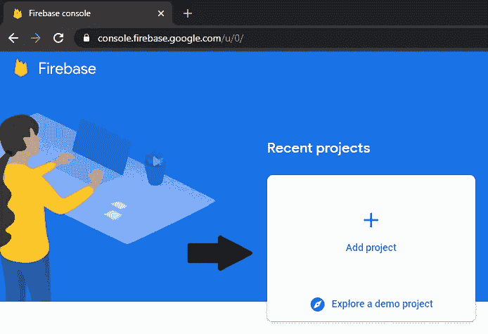

## **步骤 2:安装 Firebase 命令行界面(CLI)**

在开始之前，请确保您的计算机上安装了 Node.js。Firebase 命令行需要 node . js 8 . 0 . 0 版或更高版本。若要检查计算机上 Node.js 的当前版本，请运行以下命令。

```
node --version
```

然后，您可以安装 Firebase CLI。

```
npm install -g firebase-tools
```

## **第三步:登录 Firebase**

既然已经安装了 CLI，您必须登录到您的 Firebase 帐户。

```
firebase login
```

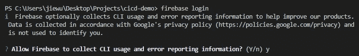

注意:如果您使用的是 Windows，在运行 firebase init 命令时可能会出现以下错误，也可能不会。要消除此错误，请转到 firebase.ps1 所在的路径，删除 firebase.ps1 文件，然后重新运行 login 命令。

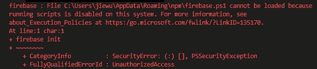

您将被定向到浏览器上的身份验证页面。

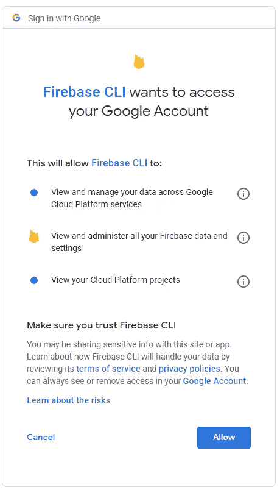

单击 allow，然后您应该会看到以下页面。

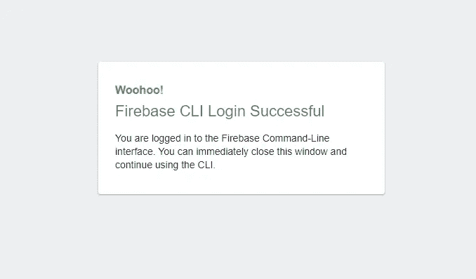

## **步骤 4:初始化 Firebase**

现在，回到终端来初始化项目中的 firebase。

```
firebase init hosting
```

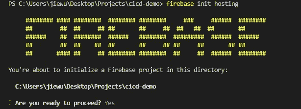

确保您选择了在 Firebase 控制台中创建的项目。

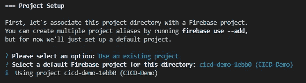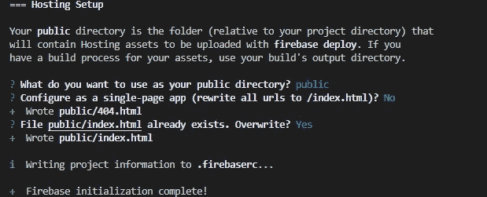

由于这是一个 React 应用程序，我们希望 Firebase 使用 build 文件夹，而不是 public 文件夹。为此，在 firebase.json 文件中，将“public”更改为“build”。

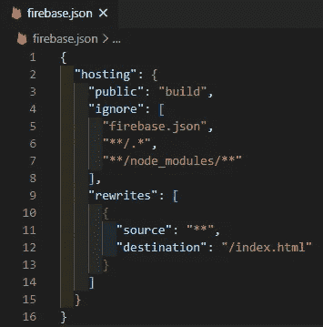

## **第五步:部署项目**

```
firebase deploy
```

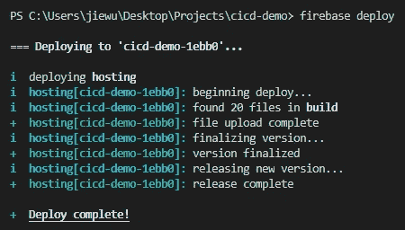

要查看网站，您可以使用托管 URL 或转到项目控制台，单击托管选项卡，然后选择其中一个 URL。

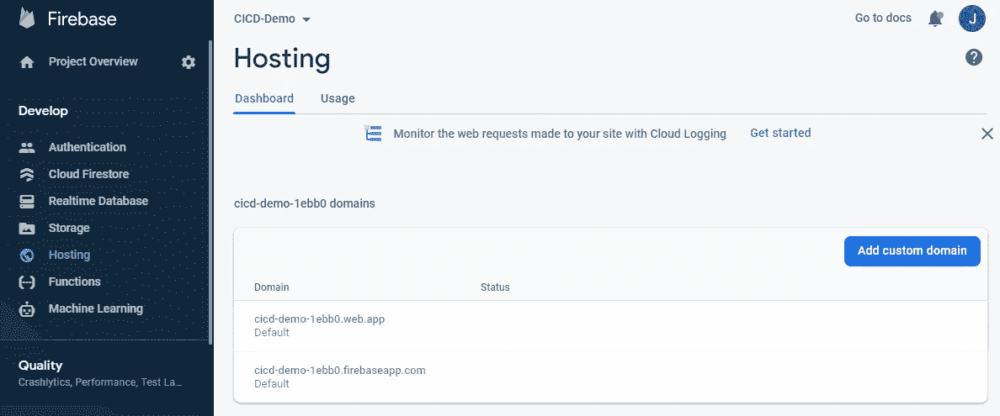

完成部署后，您可以从 Firebase 中注销。

```
firebase logout
```

**参考文献**

1.  [https://firebase.google.com/docs/cli](https://firebase.google.com/docs/cli)

## **简明英语 JavaScript**

你知道我们有三份出版物和一个 YouTube 频道吗？在[**plain English . io**](https://plainenglish.io/)找到一切的链接！