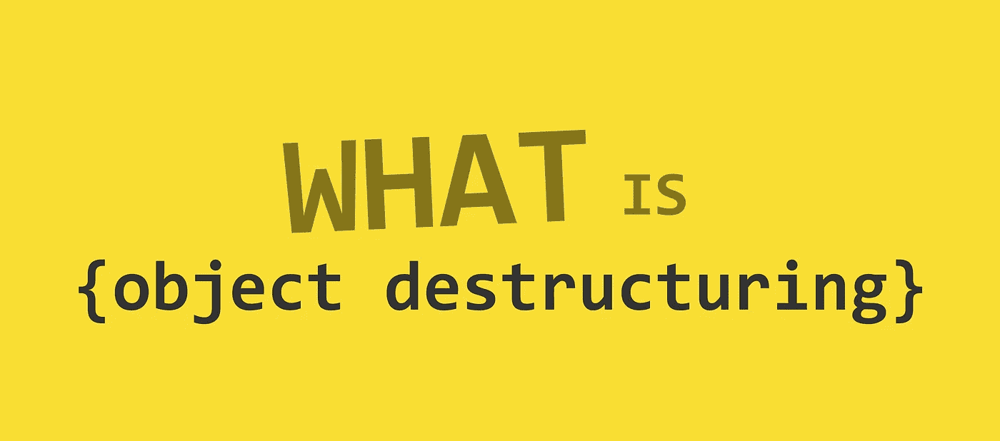

# 关于 ES6 中的对象析构，你应该知道的七件事

> 原文：<https://javascript.plainenglish.io/seven-things-you-should-know-about-object-destructuring-in-es6-699a1bce3595?source=collection_archive---------3----------------------->



# > 1:基本分配

```
const {p, q} = {p: 42, q: true}
p --> 42
q --> true
```

# > 1.1:奇点:小心使用` let '

下面的代码不起作用

*   JavaScript 将主代码流中的`{...}`(不在另一个表达式中)视为一个代码块(提醒:`let`有一个块范围)

**> >修正 1**

**> >修正 2**

# > 2:别名

属性可以从对象中解包，并赋给与对象属性名称不同的变量

```
// {sourceProperty: targetVariable (Alias) }p --> foo
q --> bar
```

# > 3:默认值

如果从对象中解包的值是`undefined`(未提供)，则变量可以被赋予默认值

```
const {a = 10, b = 5} = {a: 3, b: undefined (Not provided) }**Therefore,** a (3 | 10) --> 3
b (undefined | 5) --> 5
```

# > 4:结合 2 和 3；别名和默认值

```
const {a: aa = 10, b: bb = 5} = {a: 3, b: undefined}**Therefore,****- Step1** a (3 | 10) --> 3
b (undefined | 5) --> 5**- Step2** // {sourceProperty: targetVariable (Alias) }
a --> aa
b --> bb
```

# > 5:函数参数析构

```
userId(user) // passing **user Object**function userId({id}) === {id: 42, displayName: 'jdoe', fullName: {...}Therefore,
**id** inside **userId** function becomes 42
```

*   `user`对象`id`的财产被破坏所以变成`{id: id}`

# > 5.1:奇点:小心默认参数

**> >修正 1**

提供`{}`作为参数对象的默认值

**> >修正 2**

使`{}`成为整个参数对象的默认值

# > 6:嵌套对象函数参数析构

*   `displayName`的结构与 **> 5:** 相同
*   用户对象的`firstName`嵌套属性被析构两次

```
**// destructuring fullName (1st depth)**
const user = { fullName : { ... } } **// {fullName}****// destructuring firstName (2nd depth)**{fullName: {firstName}} **// {firstName}****// firstName alias to name**{fullName: {firstName: name}} **// name**
```

# > 7:在对象析构中扩散

Rest / spread 属性收集剩余的自己的可枚举属性键，这些键还没有被析构模式挑选出来

```
let {a, b, ...rest} = {a: 10, b: 20, c: 30, d: 40}a --> 10
b --> 20
rest --> {c: 30, d: 40} // what's left
```

> 编码快乐！！

## **用简单英语写的 JavaScript 的注释:**

我们已经推出了三种新的出版物！请关注我们的新出版物:[**AI in Plain English**](https://medium.com/ai-in-plain-english)，[**UX in Plain English**](https://medium.com/ux-in-plain-english)，[**Python in Plain English**](https://medium.com/python-in-plain-english)**——谢谢，继续学习！**

****

**Photo by [Jamie Street](https://unsplash.com/@jamie452?utm_source=medium&utm_medium=referral) on [Unsplash](https://unsplash.com?utm_source=medium&utm_medium=referral)**