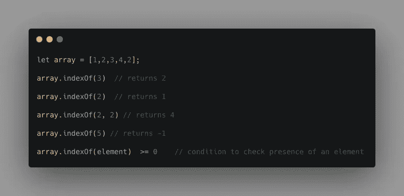
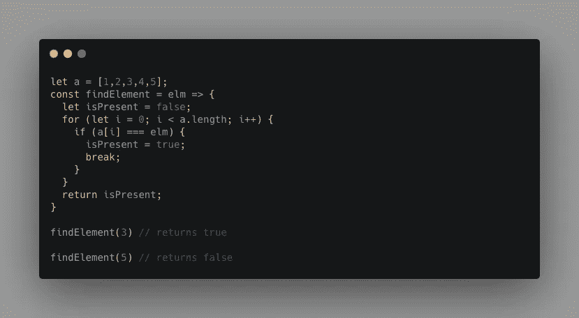
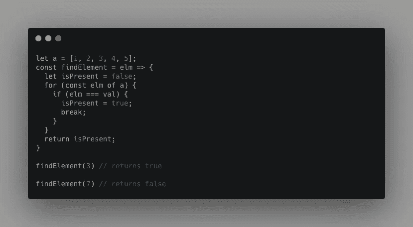
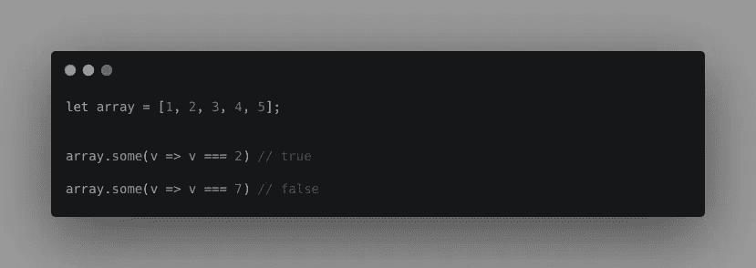
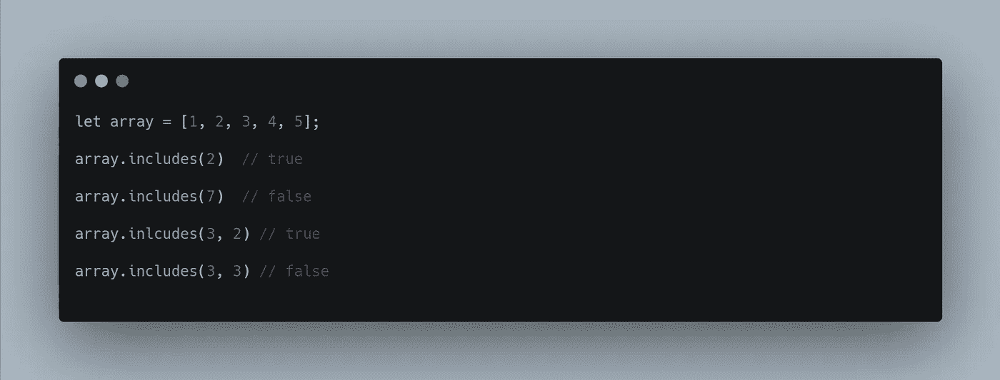
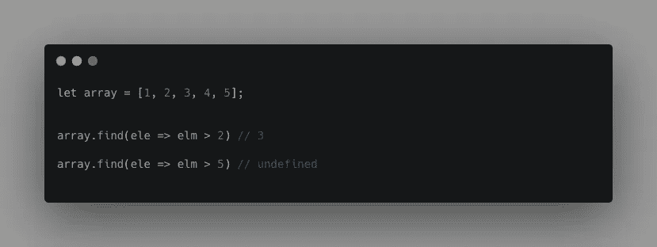
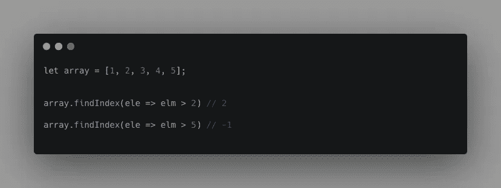
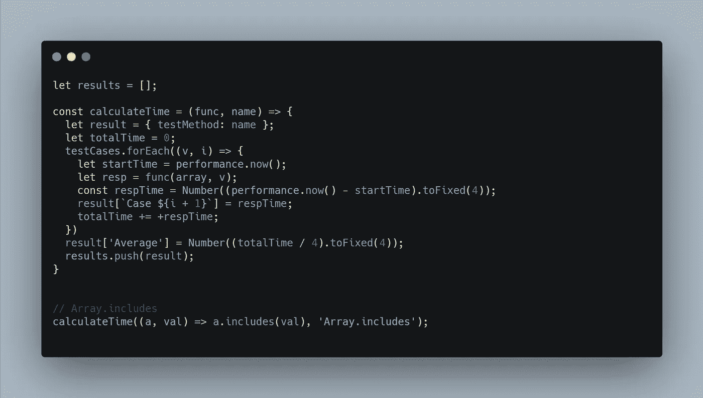
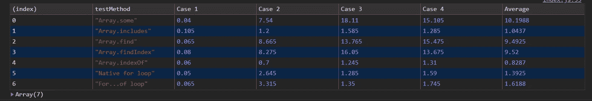
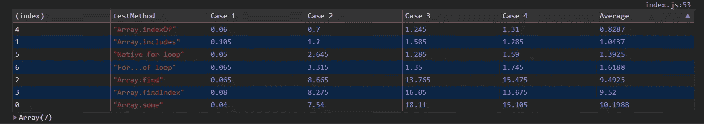

# 用性能指标评测检查数组中元素存在性的七种不同方法

> 原文：<https://javascript.plainenglish.io/seven-ways-to-check-existence-of-an-element-in-javascript-array-with-performance-benchmarks-a7f9312c8904?source=collection_archive---------1----------------------->


[Image credit](https://unsplash.com/photos/g1uBcKvRIs4)

在 JavaScript 中查找数组中的元素时，有几种不同的方法。这就带来了下一个问题:使用什么，哪种性能更好。在这篇文章中，我将列出所有七种不同的方法，并进行一些测试，看看哪种方法更好。

# **七种不同的方式:**

我们先详细讨论一下每种方法。

1.  **Array.indexOf 方法**

`Array.indexOf`接受一个元素和一个可选的从索引开始。当 start-from-index 被传入时，该算法寻找从该索引开始的元素。该方法返回第一个元素出现的索引，如果没有找到，则返回`-1`。



Array.indexOf example

2.**本机 for 循环**

通过递增索引直到索引小于数组长度，循环直到找到所需的元素。在任何找到元素的情况下，我们将把我们的局部变量`isPresent`设置为`true`并中断循环。



3. **for…of loop**

来自 https://developer.mozilla.org/的文件:

> `**for...of**` **语句**创建一个遍历可迭代对象的循环，包括:内置`[String](https://developer.mozilla.org/en-US/docs/Web/JavaScript/Reference/Global_Objects/String)`、`[Array](https://developer.mozilla.org/en-US/docs/Web/JavaScript/Reference/Global_Objects/Array)`、类数组对象

为了简单起见，我们将坚持使用数组。

与 native-for-loop 相同，一旦发现元素 buy 打破循环，我们就可以退出循环。



for….of example

4.**数组. some**

`Array.some()`接受一个`callback`函数，并对数组中的每个元素执行一次该函数，直到找到一个`callback`返回一个*真值*的元素。



Array.some example

5.**数组.包含**

Array.includes 方法接受一个元素和一个可选的 start from index，如果我们想从一个特定的索引开始搜索并返回一个布尔值。



Array.includes example

6. **Array.find**

`**find()**`方法返回所提供数组中满足所提供回调函数的**第一个元素**的**值**。如果没有找到元素，则返回`undefined`。



Array.find example

7. **Array.findIndex**

`Array.findIndex`接受一个回调函数，它对每个元素执行该函数，直到找到一个在执行回调时返回 *truthy* 值的元素。类似于`Array.indexOf`，如果没有找到元素，它返回`-1`。



Array.findIndex example

现在，我们已经介绍了寻找元素存在的所有方法。现在让我们做一些测试，看看这些方法的性能如何。

# **测试用例:**

让我们创建一个包含一百万条记录的数组，起始值从 1 到 1000000。

```
**let array = new Array(1000000).fill(0).map((_v, i) => i + 1);**
```

以下是我们的四个测试案例:

```
**const testCases = [1, 500000, 1000000, 1000010];**
```

`testCases`数组包括`array`中的第一个值、中间值(500000)、最后一个值(1000000)和一个不存在的值。

让我们创建一个 util 函数，它接受一个回调函数来对每个方法执行这些测试。



A simple util function which takes in a callback function and executes all the test cases on it

上面的 util 函数接受一个回调函数和 name 函数的名称作为输入，并使用不同的输入调用回调函数，同时监视和更新`result`对象中每个场景所用的时间。一旦所有的测试用例都运行了，平均花费的时间就被计算出来，并添加到以`Average`作为专有名称的对象中。上图中还添加了一个简单的用例，说明我们如何使用这种方法。类似地，我们可以用上面列出的其他类型的方法调用 util 方法。

这是完整的代码

这些测试用例在 windows 机器上的 chrome 开发工具中运行。这里是所有情况下的性能指标



Performance metrics



Sorted by average time asc

通过观察平均时间，似乎`Array.indexOf`对于原始情况更有性能。

# **结论:**

有许多不同的方法来检查数组中元素的存在

对于原语，`Array.indexOf`，`Array.includes`似乎是正确的候选者，因为它们对于具有 1 mill 元素的不同测试用例都花费了大约 1ms。

感谢阅读！关注我更多有趣的文章。