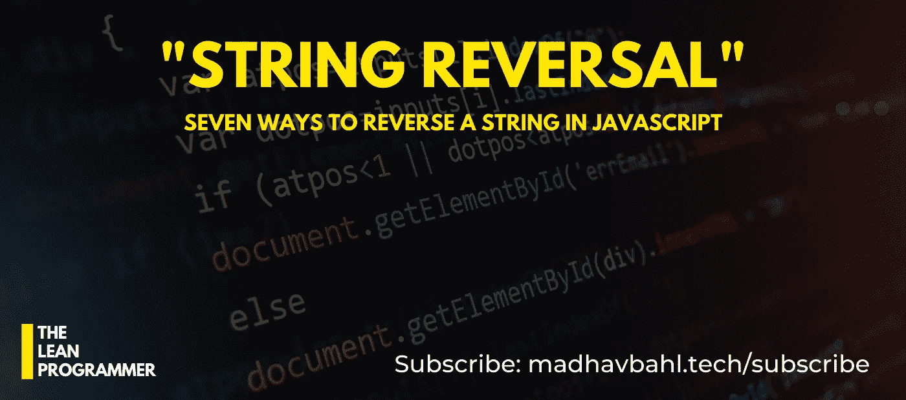

# JavaScript 中反转字符串的七种方法

> 原文：<https://javascript.plainenglish.io/seven-ways-to-reverse-a-string-in-javascript-4dbd79664a5f?source=collection_archive---------5----------------------->

## 好吧，我有一点空闲时间，我开始觉得无聊，所以我写了一个基本的博客！



> 哇！？真的吗？串反转？

哈哈，别惊讶，我知道“串反转”这个问题很基础，那我为什么要写这个呢？

## 嘘…不要告诉他

现在(写这篇博客的时候)，我在等人，他告诉我他会在 5 分钟后回来，他已经离开 15 分钟了，他还没有回来(､)

五分钟前，我的想法是—

> 现在，我不知道他什么时候回来，所以我不太知道现在的空闲时间做什么，我真的不想这样浪费时间。

当我思考这些的时候，我不知道我是从哪里得到这个想法的—

> 让我们看看有多少种方法可以解决弦反转问题，ヽ(͡◕ ͜ʖ ͡◕)ﾉ

所以，是的，现在，在等他的时候，我正试图用尽可能多的方法来解决著名的“串反转”问题。

> 但是等等，就这些吗？这是我写这篇博客的唯一原因吗？

当然，不，还有一个原因，我想告诉你们，在计算机科学的世界中，一个单一的问题可以用无数种方法解决，手头的问题总是存在不止一个解决方案，这就是计算机科学的魅力。

# 艺术

> 写一个函数来反转给定的字符串

# 艺术家

在你继续下一步之前，试着自己做这件事，试着想出尽可能多的解决方案，然后让我们看看谁能想出更多的解决方案！

好吧，我已经警告过你了，在你尝试之前，看不到解决方案:)

# 解决方案#1

好的，让我想想，我现在能想出四五个解决方案，让我们看看我应该先提出哪一个。

好吧，让我们做第一个ヽ(͡◕ ͜ʖ ͡◕)ﾉ

## 步伐

```
Step 1: Declare an empty string, say reverse = ''
Step 2: Run a loop from 0 to length of string
Step 3: For each letter of original string, concatenate reverse with it. (concatenate each element of string with reverse string, such that element gets concatenated before the current reverse string)
```

## 解决办法

# 解决方案 2

好的，第一个很简单，让我们把第二个变得有点难理解(͡ ͜ʖ ͡)

好了，这个解决方案是专门针对 JavaScript 的。在这方面，我们将编写一行程序来解决这个问题。

## 步伐

```
Step 1: Split the given string into array
Step 2: Reverse the array using reverse() function
Step 3: Join the reversed array to form a string
```

## 解决办法

# 解决方案 3

现在让我们通过多使用一个 JS ( ͡~ ͜ʖ ͡)的帮助方法来让你理解起来稍微困难一点

同样，这将是一行程序。

# 步伐

```
Use the reduce helper :)
```

## 解决办法

我希望你不要被这些俏皮话弄得不知所措。

> 啊，等等，这家伙回来了！他为什么让我等这么久！？
> 
> 现在我会让他等着，我哪儿也不去，直到我写完这个博客，你等着瞧吧！

好吧，我们说到哪了？是的，我希望您不会被这些一行程序弄得不知所措，但是如果您被这些一行程序弄得不知所措，那么这里有一个好消息，其余的解决方案将会很容易。

# 解决方案#4

让我们看看应该是第一个解决方案，当我们谈到弦反转(‾ ʖ̫ ‾)时，这个通常首先出现在我们的脑海中

## 步伐

```
Step 1: Strings are immutable (in JavaScript), hence convert it into array.
Step 2: Run a loop from 0 to (size of array)/2 and interchange the element at i index with element at position size-1-i 
Step 3: Join the array to form a string
```

## 解决办法

这个很简单！

# 解决方案 5

这里来个转折吧！对于后三种方法，我不会给你确切的步骤，我只会给你一个提示(ᴗ ͜ʖ ᴗ)

## 暗示

```
*Read in reverse order and store in an array.*
```

## 解决办法

好的，下一个将会非常相似。

# 解决方案 6

正如我说的，这个几乎是一样的，但是我们要用一个数组方法。

## 暗示

```
*Use push() method*
```

## 解决办法

好吧，现在我能想到解决这个问题的另一种方法。

# 解决方案 7

我真的希望你已经明白我要说什么了。(嘶。提示—使用堆栈)

## 暗示

```
*Using stack push/pop operations*
```

## 解决办法

好吧，这是我能想到的所有方法了。但是，我并不是说没有其他可能的方法，只是我不能想得更多，因为这个家伙不断地告诉我来，我不想为这个简单的串反转问题想更多可能的解决方案(͡~ ͜ʖ ͡~)

但是，如果你有除此之外的任何解决方案，请给我发邮件，我会添加到这篇文章中。当然，我会给你同样的学分:)

## 给你的作业

现在我们知道了这么多反转字符串的方法，尝试不同的方法来检查一个回文。

(来吧，你只需要反转字符串并检查等式)

不要偷懒，做一些编码(͡ ͜ʖ ͡)

就是这样！希望这篇文章对你有所帮助。如果你喜欢这个博客，请留下一些掌声。


如果你想讨论什么，随时联系我，:D

如果您能给我反馈、建议或询问，我会非常高兴。此外，我喜欢交新朋友，我们可以成为朋友，只要给我发邮件。

> 非常感谢你一直读到最后。如有需要可以联系我以防万一:
> 邮箱:theleanprogrammer@gmail.com
> 网页:[*http://madhavbahl.tech/*](http://madhavbahl.tech/) *Github:*[*https://github.com/MadhavBahlMD*](https://github.com/MadhavBahlMD) *LinkedIn:*[*https://www.linkedin.com/in/madhavbahl/*](https://www.linkedin.com/in/madhavbahl/) *insta gram:*[*https://www.instagram.com/theleanprogrammer/*](https://www.instagram.com/theleanprogrammer/)

用简单英语写的 JavaScript 的注释:我们总是对帮助推广高质量的内容感兴趣。如果你有一篇文章想用简单的英语提交给 JavaScript，用你的中级用户名发邮件到 submissions@javascriptinplainenglish.com[给我们，我们会把你添加为作者。](mailto:submissions@javascriptinplainenglish.com)