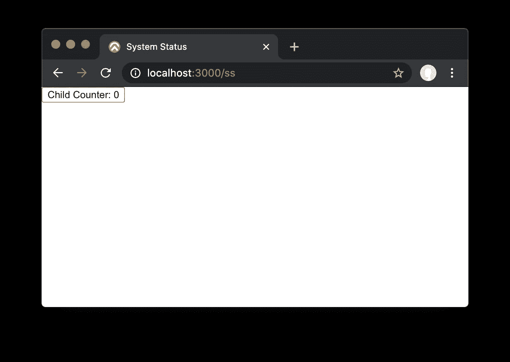
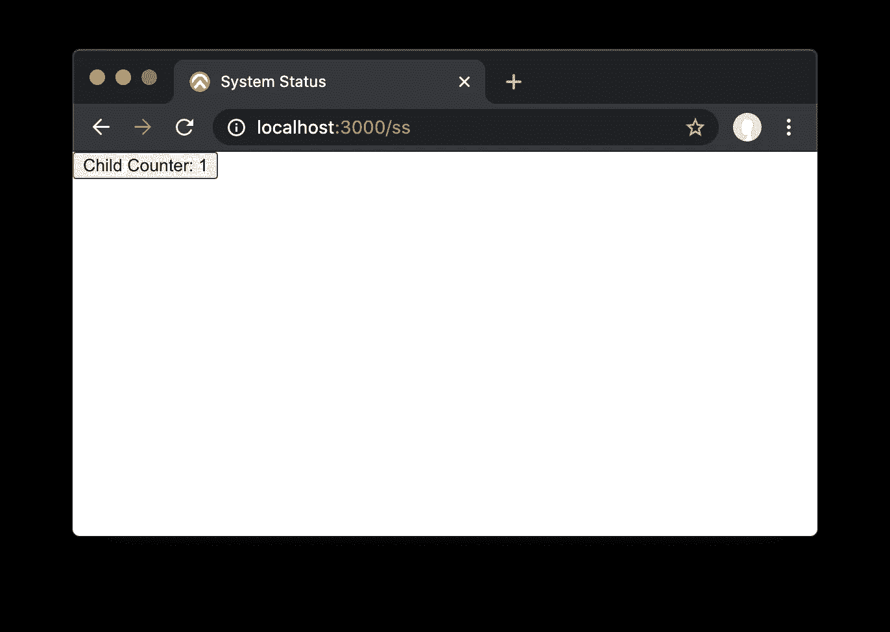
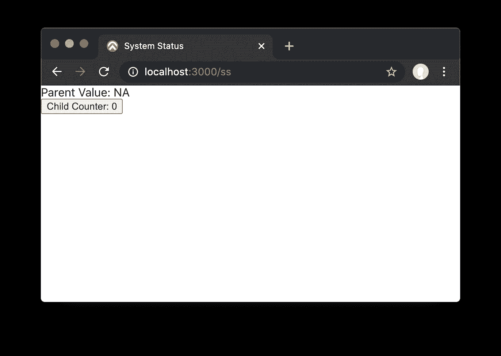
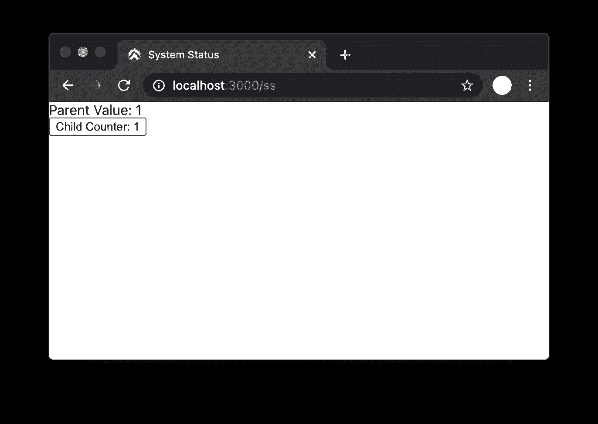

# 如何在 React 组件之间共享状态

> 原文：<https://javascript.plainenglish.io/sharing-state-between-react-components-8c138c505e36?source=collection_archive---------12----------------------->


React 是一个非常棒的编写应用程序的平台。随着 React 挂钩和 JavaScript 改进的引入，编写更复杂的 React 应用程序变得更加容易。我最近发现了一个在 React 组件之间共享状态的好模式，我想我应该分享一下:)

让我们从一个带有子组件的简单应用程序开始:

```
import Child from './Child';

export default function App(props) {
  return <Child />;
}
```

子组件将只公开一个按钮来增加计数器，状态保存在子组件中:

```
import React, { useState } from 'react';

export default function Child1(props) {
  const [counter, setCounter] = useState(0);
  return <button onClick={() => setCounter(counter + 1)}>
    Child Counter: {counter}
  </button>;
}
```

这个应用程序非常简单，只是一个增加计数器的按钮:



点击按钮，计数器递增:



假设父母想要访问计数器。这可以通过使用由子组件管理的全局状态来实现。`reactn` NPM 模块提供了`setGlobal`和`useGlobal`方法来使数据全球化。(React 允许通过上下文实现这一点，但是使用起来非常复杂，所以我们使用`reactn`。

让我们更改 Child 以将计数器存储为全局。

```
import React, { useEffect } from 'react';
import { useGlobal, setGlobal } from 'reactn';

setGlobal({});

export default function Child1(props) {
  const [child, setChild] = useGlobal('child');
  useEffect(() => (child ? true : setChild({ ...child, counter: 0 })), [child, setChild]);
  return <button onClick={() => setChild({ ...child, counter: child?.counter + 1 })}>Child Counter: {child?.counter}</button>;
}
```

这段代码的输出和以前一样，除了计数器现在可以作为全局变量使用。注意，需要 useEffect 来初始化`child`全局对象。为了保持简洁，我使用的符号非常简洁，它只是初始化代码，所以让我们将其最小化。

注意`child?.counter`的使用。`?.`操作符是一个非常方便的新 JavaScript 操作符。第一次渲染 child 1`child`会是`undefined`。`?.`短路评估，因此`counter`成员不被访问，以防止运行时错误...因试图访问`undefined.counter`而导致。

现在，让我们在另一个组件中使用这个计数器。为了简单起见，我们只从父组件中访问它。从子组件的对等组件或子组件中访问也同样容易。

```
import { useGlobal } from 'reactn';
import Child from './Child';

export default function App(props) {
  const [child] = useGlobal('child');
  return (
    <div>
      <div>Parent Value: {child?.counter ? child.counter : 'NA'}</div>
      <Child />
    </div>
  );
}
```

`child`在点击按钮之前是未定义的，因此初始屏幕如下所示:



单击按钮增加子代中的计数器，并更新父代中的计数器:



这看起来很简单，事实也的确如此。使用钩子和`reactn`可以减少至少 80%的代码量。唯一棘手的事情是处理由于父组件在它使用的子组件之前被挂载而导致的竞争情况。幸运的是，令人敬畏的`?.`现在可以最大限度地减少处理类似`undefined`的东西所需的代码，无论如何，这是一种短暂的情况。

*原载于 2020 年 11 月 20 日*[*【https://focusedforsuccess.com】*](https://focusedforsuccess.com/sharing-state-between-react-components/)*。*