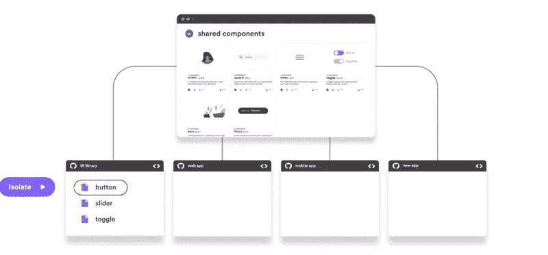
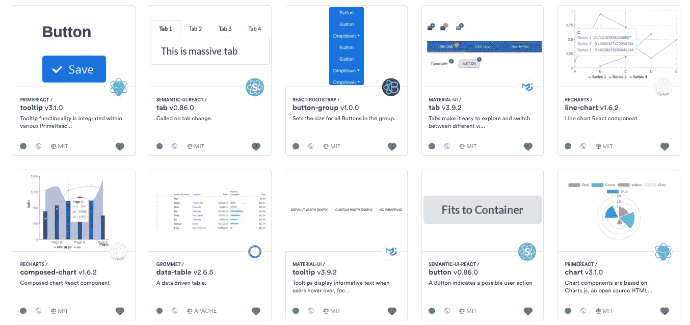
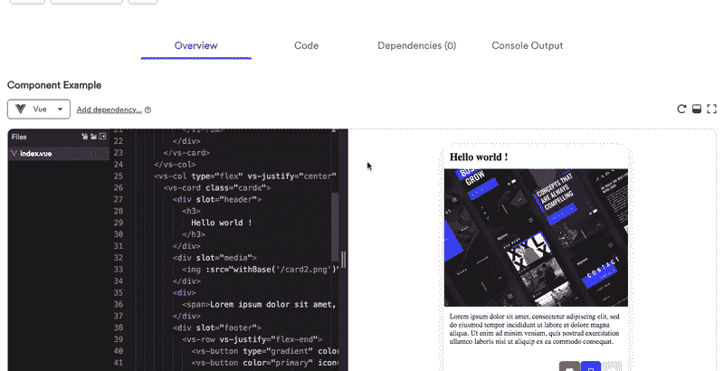

# 共享 UI 组件以更快地构建一致的 UI

> 原文：<https://javascript.plainenglish.io/sharing-ui-components-to-build-consistent-uis-faster-5e60141ca855?source=collection_archive---------4----------------------->

## 如何使用 [bit.dev](https://bit.dev) 共享真正可重用的组件，以保持用户界面的一致性并加快构建速度。

[](https://bit.dev)

The Bit workflow: Build, reuse and sync UI components

在当今的应用程序开发世界中，UI 组件(React、Vue、Angular、Stencil 等)是我们应用程序 UI 的模块化构建模块。

作为模块化单元，[我们的组件可以而且应该在不同的项目(和团队成员)之间共享](https://blog.bitsrc.io/sharing-components-at-the-enterprise-12f9e5f1bb67)以加速开发，减少错误，使我们的代码更易于维护，并为不同屏幕和应用程序的用户提供一致的体验。

但是，[共享可重用的 UI 组件](https://bit.cloud/blog/how-to-reuse-react-components-across-your-projects-l3bhezsg)说起来容易做起来难，没有合适的工具和知识来完成这项工作。因此，我收集了一些有用的方法来共享 UI 组件并在应用程序间重用它们。希望这有所帮助，有什么问题请随意评论和提问。干杯。

**内容**:

*   **为什么 UI 组件很难打包复用？**
*   **用 Bit 检查组件的可重用性。**
*   **将文件作为组件跟踪+自动定义依赖关系。**
*   **应用可复用编译器+孤立构建。**
*   **版本化+导出组件。**
*   **复用和更新组件。**
*   逐步建立你的用户界面库。

# 为什么组件很难打包和重用？

[](https://bit.dev/collections)

A component collection shared to bit.dev

到目前为止，打包组件迫使开发人员经历传输、捆绑、遗留浏览器支持、大小、映射、类型检测和无数其他优化。这足以阻止这个想法。

传统上，打包组件以供重用必须涉及将组件从您的应用程序拆分到不同的存储库中。每个组件都必须作为一个包进行样板化，包括手动定义依赖关系等。您还必须为每个组件配置构建和测试步骤，以便它可以在项目之外运行。每一个改变都需要重构你共享的每一个组件的配置。这是大量的工作。

今天，有一个新的共享 UI 组件叫做[**Bit**](https://bit.dev)([**GitHub**](https://github.com/teambit/bit))。Bit 帮助您逐渐使您现有的组件可重用，自动化大部分过程并帮助您了解还需要什么，并在您的团队可以共享和重用它们的模块化集合中共享它们。

然后，它帮助您分发可重用的组件，以便人们可以在他们的代码中轻松地找到、尝试和使用您的组件。最后，它让每个人都可以从他们自己的项目中建议对组件的更新，这样采用组件就成了一个简单的选择。

下面我将简要回顾一下这个工作流程，您可以随意继续[并亲自尝试一下](https://bit.dev)。不管你有没有 UI 库，这个工作流程都是一样的，因为 Bit 并不“关心”你从哪个 repo 共享你的组件。

# 让你的 UI 组件真正可重用

[](https://bit.dev)

Bit 通过为您提供工具来帮助您**构建更多可重用的组件**:

使用自动依赖定义和易于应用的构建配置等特性，自动化打包组件的大部分工作。

通过让你在项目之外真正隔离地测试、构建和呈现每个组件，了解每个组件可重用性的真实状态。

## 短设置

首先，你需要[安装位](https://docs.bit.dev/docs/installation#install-via-npm-yarn)并[为你的项目工作空间](https://docs.bit.dev/docs/workspace#bit-workspace)初始化它。这非常简单，只需使用几个 CLI 命令:

```
$ npm install bit-bin --global
$ cd project-directory
$ bit init
```

然后，前往 bit.dev 和[快速创建一个免费账户](https://bit.dev)。然后，创建一个集合来承载您的共享 UI 组件。最后，运行`bit login`向您的 bit.dev 集合验证您的 CLI:

```
$ bit login
```

## 定义和跟踪可重用组件

现在，让我们使用 Bit 来使用`bit add`命令跟踪我们项目中作为组件的一组文件。这将“告诉”Bit 开始跟踪你的工作空间中的组件。它还会“告诉”Bit 来分析每个组件的依赖关系，并自动为每个组件创建一个`package.json`。很酷，对吧？

## 例子

让我们假设下面的 app 结构只有一个`hello-world`组件。

```
. 
├── package.json 
└── src     
    ├── hello-world.js     
    └── index.js
```

让我们使用`bit add`来跟踪 hello-world 组件，告诉它哪些文件是这个组件的一部分:

```
$ bit add src/hello-world.js src/index.js --id hello/world 
tracking component hello/world:     
    added src/hello-world.js     
    added src/index.js
```

现在运行一个快速的`bit status`来查看组件是否被跟踪，并且不需要项目中的任何附加文件:

```
$ bit status 
new components      
     > hello/world... ok
```

我们现在看到，该组件打包了执行所需的所有文件。但是，它还没有配置构建步骤(编译/传输),如果我们希望它在项目之外运行，这是必要的。

## 应用可重用的编译器

让我们对组件应用一个编译器，这样它就可以在我们的创作项目的上下文之外作为一个独立的单元进行构建。Bit 为[预制的编译器](https://bit.dev/bit/envs)提供了实现可重用 UI 组件的最佳实践。

让我们使用 Bit 将 [React 标准编译器](https://bit.dev/bit/envs/compilers/react)导入到我们的工作空间中，并将其应用到组件中，以便它可以在任何地方构建和运行。如果使用 React TypeScript，只需[选择匹配的编译器](https://bit.dev/bit/envs/compilers/react-typescript)，依此类推。

```
$ bit import bit.envs/compilers/react --compiler 
the following component environments were installed 
- bit.envs/compilers/babel@0.0.7
```

酷毙了。现在运行`bit build`,确保组件可以在真正独立于项目环境的情况下构建，从而使其可重用。

```
$ bit build 
```

该组件作为一个独立的单元构建，我们现在知道它可以在任何新项目中开箱即用，使用它自己定义的构建配置。

该组件现在可以进行版本控制和共享了！🎊

# 版本控制和导出组件

接下来，让我们为组件标记一个版本。Bit 跟踪工作空间中所有组件之间的关系，并允许您对单个组件及其受影响的从属组件进行版本控制和更新。

在这种情况下，让我们为`hello-world`组件设置一个 0.0.1 版本:

```
$ bit tag hello/world 
1 components tagged | 1 added, 0 changed, 0 auto-tagged
added components:  hello/world@0.0.1
```

太棒了。现在运行一个快速的`bit status`来查看组件是否被版本化并准备好导出。

> 注意:您可以为组件添加 docuemntation，它将自动提取并出现在您的 bit.dev 集合中。[在此了解更多信息](https://docs.bit.dev/docs/documenting-components)。

最后，让我们将组件导出(发布)到您的 bit.dev 集合中！

```
$ bit export user-name.collection-name 
1 component exported to collection user-name/collection-name
```

现在去看看你的收藏，看看组件。您可以将示例保存在组件的渲染沙箱中，[如这里所解释的](https://docs.bit.dev/docs/tutorials/bit-react-tutorial#preview-the-react-component)。

# 重用共享的 UI 组件

[](https://bit.dev)

当您将一个组件共享给 [bit.dev](https://bit.dev) 时，它可以通过两种方式使用。第一步是[使用标准的 npm/yarn 客户端，像安装 bit.dev 包注册表中的任何其他包一样安装组件](https://docs.bit.dev/docs/installing-components)。


Example: installing a hero component using npm from the bit.dev registry

请注意，您将只为特定的组件安装(并获取更新),因此您可以保持应用程序的捆绑包大小更轻，开发速度更快。

第二种方式是将`[bit import](https://docs.bit.dev/docs/sourcing-components)` [的构件变成一个项目](https://docs.bit.dev/docs/sourcing-components)。这将引入组件的源代码，同时作为一个组件被逐位跟踪。

这个工作流的最大优点是您现在可以直接从消费项目(！idspnonenote)中修改组件的源代码。)以便更容易采用该组件。然后，您可以将更改标记为新版本，并将它们导出(给定权限)回您的集合——以便其他项目可以获取更改并合并组件的版本。

# 逐步构建你的用户界面库

通过这个工作流程，您不仅可以更容易地隔离、打包和重用组件。你也可以逐步建立自己的模块化 UI 库，而不必失去对交付的关注并为此大做文章:)

您可以不断地使应用程序中的组件可重用，在一个简短的反馈循环中迭代，看看每个组件是否可以独立于项目进行构建、测试和渲染，并将它们共享到您的 bit.dev 集合中。

下次您或您的团队成员需要某个组件时，您可以快速检查它是否在那里，准备好被重用或更新。如果没有，只需编写组件并将其导出到您的共享 UI 组件集合中。

在很短的时间内，你应该能够[增加你的 ui](https://blog.bitsrc.io/building-a-consistent-ui-design-system-4481fb37470f)的一致性，同时通过重用加速交付。您还会发现附加的价值，比如通过模块化使维护变得更简单，让新的团队成员更容易加入等等。请随意尝试。

感谢阅读，干杯！🍻