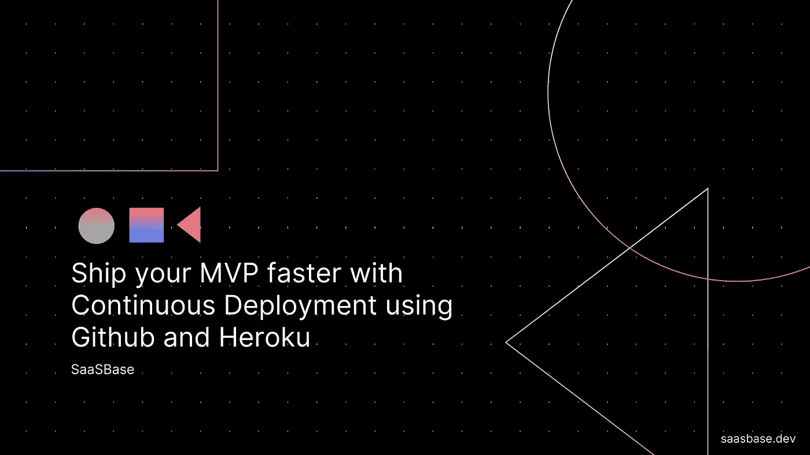
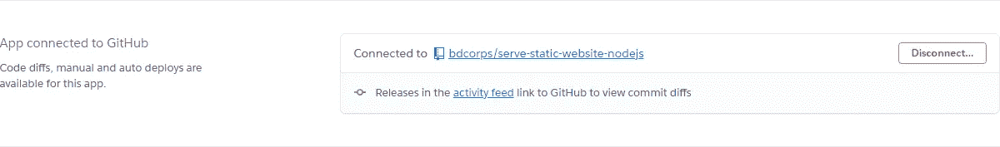
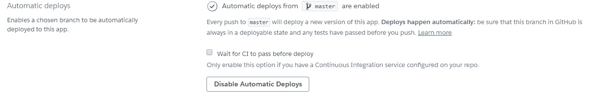
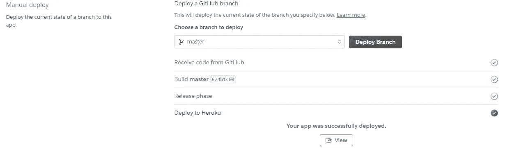
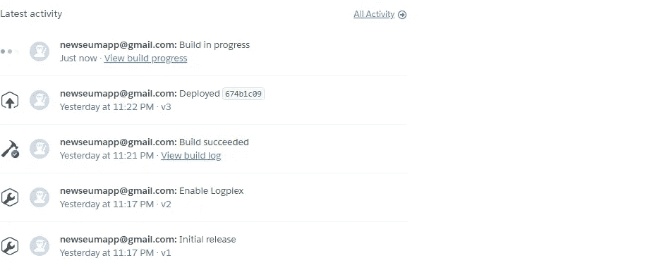

# 使用 Github 和 Heroku 通过持续部署更快地运送您的 MVP

> 原文：<https://javascript.plainenglish.io/ship-your-mvp-faster-with-continuous-deployment-using-github-and-heroku-db46d3861696?source=collection_archive---------8----------------------->

## 持续部署



持续部署非常棒，因为你可以忘记开发的基础设施部分，只关注代码。Heroku 让使用 Github 和自动部署来设置它变得非常容易。

# 创建新项目

在这里分叉简单的 Nodejs 项目[。](https://github.com/bdcorps/serve-static-website-nodejs)

使用以下命令在本地运行它，

```
npm install
node app.js
```

转到 [localhost:3000](https://saasbase.dev/how-to-set-up-continuous-deployment-on-nodejs-app-using-heroku-and-github/localhost:3000) “再见世界”应该会出现在屏幕上。

# 建立一个 Heroku 帐户

登录您的 [Heroku 账户](https://dashboard.heroku.com/)。

点击新建-> [创建新应用](https://dashboard.heroku.com/new-app)。给它起个名字。单击创建应用程序。

在部署方法下，单击连接到 Github。搜索并连接存储库。



选择您想要部署的分支。如果不确定，默认为主。

启用`Automatic Deployments`。



准备好进行初始部署后，单击手动部署部分下的部署分支。



它将尝试使用 Node.js buildpack 运行项目。如果成功，将出现“您的应用已成功部署”消息。如果部署失败，请尝试从第 1 步重新启动。

点击“查看”打开你的应用程序。输出应该还是“Hello World”。



# 部署更改

我们的渠道已经建立了。是时候拿出来试驾了。

对`index.html`做一个小改动

```
<!DOCTYPE html> <html> <body> <h1>Goodbye World</h1> </body> </html>
```

提交和推送更改，

```
git add . git commit -m "change text" git push
```

一旦推送成功，Heroku 上就会触发自动构建。请转到 Heroku 仪表板的 Overview 选项卡进行确认。在最新的活动下，将会有`Build in progress`。


一旦状态更改为已部署，点击`Open App`，您的更改现在应该生效。

在 [Twitter](https://twitter.com/sssaini_) 上找到我，我们聊聊:)