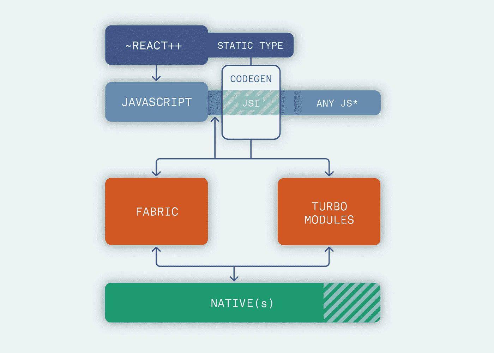

# 对于我的新企业项目，我应该使用 React-Native 还是 Flutter in 2020？

> 原文：<https://javascript.plainenglish.io/should-i-rather-use-react-native-or-flutter-in-2020-for-my-new-enterprise-projects-310351f80575?source=collection_archive---------2----------------------->

## 框架决策

## 哪个框架最适合您的下一个企业级项目？事实上，这个选择真的重要吗？

👋🏻*这篇文章讲的是企业级的项目，风险很高，期限很紧。在接下来的几周里，我会用一种更具实验性的方法为附带项目制作另一个影响和利害关系更少的项目。*

自 2016 年以来，由于我在@ [Kaliop](https://medium.com/u/bc4d66204c48?source=post_page-----310351f80575--------------------------------) 担任技术主管的经历，我有机会制作漂亮的 **React 原生**应用，特别是为官方等重大活动🎾*戴维斯杯戴维斯国际网球锦标赛 app* 。我学到了很多，我有很多机会将这项技术与著名的快速发展的 **Flutter** 进行比较。

此外，我在 Kuzzle 的朋友们，尤其是 Luca Marchesini 给了我一些关于 Flutter 项目的反馈。我们是同事，我们使用不同的框架，因为我们总是喜欢尝试新事物。鉴于我们可以进行相关的比较。

这里有一个关于 3 个要点的简短介绍，可以帮助您利用合适的技术来满足您的需求。

# React 本地无线更新(OTA)

在我写这些代码行的时候，主要的区别在于 react-native 使用脚本而不是编译语言的特性。

由于这一点，我们可以将 Javascript 代码序列化为一个字符串(又名 stringify)并将其托管在远程服务器上！目前，还没有一个健壮的解决方案可以提供 Flutter，它目前在构建时被编译成本机代码。

**这个特性是 RN 和 Flutter 之间真正的游戏规则改变者。**

移动开发最重要的指标之一是**留存**，这是一个应用程序保持用户使用它并减少卸载的能力。

## ❓标准的本地应用发布行为有什么问题？

你不能保证用户从应用商店更新。你可以祈祷，你也许可以尝试使用推送通知来触发它们，但如果它们没有，祝你好运…享受应用商店上的坏消息吧。

一般来说，更新是在晚上进行的，只在 Wi-Fi 上，希望是在家里而不是在国外，但情况并不总是这样…

> 当有人离开并卸载你的应用程序时，你可以 90%确定该用户不会再回来。

使用 OTA，你可以让你的应用表现得像一个网站,并向一部分或全部用户群即时发布新版本和补丁。

OTA 也有一些优点:

*   您可以在生产中维护较少的版本，或者可能只有一个版本。这是移动开发的一个主要缺陷，它要求后端向后兼容您的应用程序的以前版本。
*   更少的版本意味着需要管理的代码更少，这导致了更好的可维护性。
*   快速制作修补程序，在短期限应用程序上享受安全的渐进部署，例如为短时间活动设计的活动应用程序。

OTA 是由许多工具驱动的云(也许未来不会)服务，但使用最多的服务是 [**微软 Codepush**](https://github.com/microsoft/react-native-code-push) 和 [**Expo.io**](https://docs.expo.io/versions/latest/guides/configuring-ota-updates/) 。

你绝对应该试一试。

# 🧘🏻‍♀️的采用、可维护性和稳定性

react-native 很酷的一点是它继承了 react-web 生态系统和实践。React Native 利用 web 最佳实践，将 UI 代码拆分成某种样式表(或 CSS-in-JS 样式)。

React 与设计和业务逻辑有明确的分离，在设计和业务逻辑中，Flutter 与基于 git 的服务(如 pull requests)一起使用可能会很复杂，这些服务目前不像 ide 那样提供帮助。

虽然 Flutter 窗口小部件又大又难读，但 JSX 接近 HTML 标记，易于阅读。

在 Kaliop，大多数开发人员都有 web 背景，使用 React native，我们可以根据需要轻松地在项目中添加/删除开发人员，**即使他们从未做过移动开发。**这是可以做到的，因为我们公司的大多数开发人员已经熟悉了 Javascript 和 Web 实践。

此外，**Javascript 在就业市场上的份额比 Dart** 大，如今 Javascript 开发人员很普遍，而且**找人力资源不会有大问题。**

Flutter 还很年轻，会不断进步，尤其是在模式和库方面。静态编译也是一件很棒的事情，因为您将在上游捕获错误，其中某些类型的错误可能会在 Typescript 中持续存在。此外，在颤振性能更好。

您可能还会看到我从真实项目体验的角度进行的详细比较:

 [## React Native 与 Flutter:从真实项目经验的角度进行比较

### 除了基础知识之外，如何反应 native 和 Flutter 是不同的，事实是人们不知道哪一个…

medium.com](https://medium.com/javascript-in-plain-english/react-native-vs-flutter-a-comparison-from-real-project-experience-perspective-1e7fbd56f217) 

# 🔮将来的

Javascript 社区和生态系统是强大而有弹性的，许多伟大的公司都在使用 react-native 进行生产应用:**微软**，**优步**，**特斯拉**， **Discord** ， **Instagram 或脸书。**

React 原生架构将在 2020 年推出新版本。这种新模式将提高性能，是脸书为解决这种跨平台移动解决方案的一些长期问题所做的巨大努力。

New React Native Architecture, read more at [https://formidable.com/blog/2019/react-codegen-part-1/](https://formidable.com/blog/2019/react-codegen-part-1/)

**Dart 和谷歌是谷歌 Fuschia** 的下一步，新的谷歌移动操作系统。他们肯定会优化 Flutter 来玩它。

此外，Flutter 正在经历 Web 支持，React native 已经做到了这一点。

**两个平台都将是新一年的两只乳齿象。**

# 🚛外卖/TLDR；📦

除了 OTA 更新的东西和成熟度，这是这两个工具之间的主要区别，你应该根据你的团队偏好和技能选择框架。

**如果你有网络背景，已经有一个网络团队，特别是像 ReactWeb** 这样的前端框架，你肯定会在 React Native 上有很大的优势。您还可以以一种简单的方式带来增强，因为对于大多数项目来说，单个 react 原生开发人员(或原生开发人员)就足以处理 React 原生团队中专注于移动的特性，如通知或原生代码异常。

Flutter 在一些设备上可以达到 120 FPS，即使它的目标是 60 FPS，因为它经过了更好的优化。

**但是 react-native 的表现不好吗？**

**—不！神话！他们没有。**他们接近原生和几乎全时 60 FPS 的良好优化。

如果你来自本地背景，喜欢开箱即用的静态类型，那么 Flutter 可能是个不错的选择。它也更具性能，导航完全是本地的。你不必问自己它在两个平台上都有效吗？它只是开箱即用。

有许多经验丰富的公司已经专门从事 react-native，并且有一个很好的社区可以提供支持。在颤振的情况下，这是相当新的。