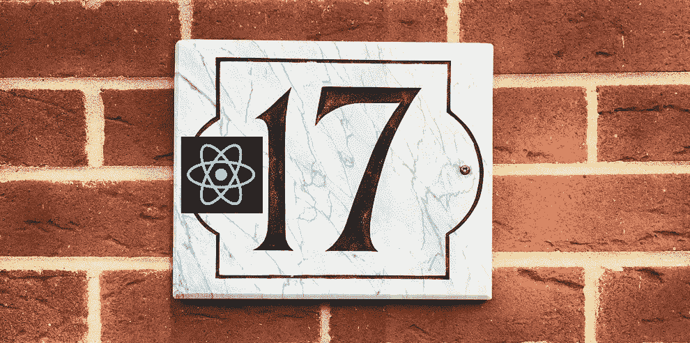

# 我应该升级到 React 17 吗？

> 原文：<https://javascript.plainenglish.io/should-i-upgrade-to-react-17-92aac7e7eb0d?source=collection_archive---------0----------------------->

## 你现在可以做些什么来准备你的应用程序

Original Photo by [Simon Harmer](https://unsplash.com/@only1simonharmer?utm_source=medium&utm_medium=referral) on [Unsplash](https://unsplash.com?utm_source=medium&utm_medium=referral)

React 最新、最闪亮的版本即将推出！React 刚刚发布了版本 17 的候选版本，并有一个博客描述了它的新特性。你可以在这里阅读全部内容[。你可能有的疑问是:*我该不该升级到 17 版本？还是坚持 16 版，我们都知道，都喜欢？*](https://reactjs.org/blog/2020/08/10/react-v17-rc.html)

**简答:**对，升级！

**长回答:** React 17 将是 React 的新标准和基础。你可以认为它类似于 Windows 10 新的功能将建立在它的基础上，而不需要更新你的整个系统，因为 17 以后的所有版本都将完全向后兼容 17(但不是 16)。这意味着您可以升级到 17，然后根据需要将部分应用程序更新到更高的版本。但是在大多数情况下，你可以高枕无忧，不用担心在很长一段时间内破坏改变。

拥有大型应用程序的团队可能会犹豫是否做出更改，但是您等待的时间越长，更新就越困难。更不用说，你会错过很多即将推出的很酷的功能。

为了使过渡更容易，我建议创建一个新的 React-17 升级史诗，根据 [React 博客](https://reactjs.org/blog/2020/08/10/react-v17-rc.html)中概述的变化在您的待办事项中创建一些故事，并告诉您的团队在接下来的几个月中解决它们。我不会在博客中重复所有内容，因为它已经写得非常好了，但我会回顾一些潜在的重大影响:

- [不安全的方法](#461d)
-[on scroll](#5d97)
-[forward ref 和 memo](#793a)
- [事件监听器](#df8b)
- [并发模式](#a0cf)

# 不安全的方法

对于那些使用基于类的组件的人来说:这些生命周期方法正准备被弃用:`*componentWillRecieveProps*`、`*componentWillMount*`和`*componentWillUpdate*`。您仍然可以在 17 中使用它们，但是您必须添加`*UNSAFE_*`前缀。

**创建简单的故事:**确定所有使用这些方法的位置，并进行简单的全部替换，以添加`*UNSAFE_*`前缀。

**创建更好的故事:**不要在你创建的任何新组件上使用这些方法；建议使用替代功能(即`*getDerivedStateFromProps*` 代替`*componentWillRecieveProps*`)。或者更好的是，您可以开始使用功能组件，这些组件可以复制您可能需要的所有功能。对于这两种方法，您都可以找到大量的指南来帮助您进行改进。

但是不要担心，你不必一下子改变你的整个应用程序；我建议使用新的生命周期方法，或者对您创建的任何 **new** 组件使用 Functional React，以将未来影响降至最低。然后，您可以逐步对现有组件进行更改。(别忘了:你可以在你的应用中混合使用基于类的组件和功能组件)

# OnScroll

我已经知道这对我的团队来说是一个巨大的变化。目前，如果你在一个元素上定义了一个`*onScroll*` 回调函数，它会在子元素滚动时执行。这是无意的，会造成很多混乱，所以 React 17 修复了这一点。然而，在很多情况下，您可能(无意中)期望回调在向下滚动一两级元素时执行，并且可能认为该功能是理所当然的。

**要创建的故事:**识别应用程序中的所有`*onScroll*` 回调，并确保您实际上没有跟踪子元素的变化。

# 转发参考和备忘录

这个非常简单:如果这些函数返回 undefined，React 将抛出一个错误。你只需要确保在使用这些函数时，你实际上是在返回* 某个东西，而不是意外地让它们返回未定义的东西。

**要创建的故事:**确定`memo`和`forwardRef`的所有用法，并确保它们返回某个东西(或`*null*` ，如果需要的话)而不是`undefined`。

# 事件监听器

为了完全理解这一点，我必须阅读一篇关于冒泡和捕获的解释。当 JavaScript 事件发生时，它从文档向下到达目标，然后返回到文档。在向上传播(冒泡)阶段，任何监视该事件的元素都将执行任何已定义的代码。

通常在 JavaScript 中，如果您在一个元素上调用`*event.stopPropagation()*`，它会停止将该事件向上传播到上面的任何元素，这些元素可能正在等待执行基于该事件的动作。如果在普通元素(如按钮或 div)上调用，您可能希望事件在到达文档级之前停止。但是在 React 16 中，所有事件处理程序都附加到文档级。因为事件从那里开始，`*stopPropagation*`只停止向上传播到文档之上的任何地方，这不是您所期望的。

在 React 17 中，事件处理程序将被附加到根元素(你附加你的应用程序的最顶层的根 div)，所以`*stopPropagation*` 将在到达文档级之前正确地停止事件。*(补充说明:这实际上会让您在同一个应用程序中运行多个版本的 React，因为事件并不都在文档级别绑定，太酷了！)*

要使这与 16 的工作方式相同，您需要告诉您的定制事件侦听器使用捕获阶段，这意味着它们在事件的初始向下传播时执行回调(它将总是在文档级执行，因为它从那里开始)。这是通过在自定义`*addEventListener*` 函数中添加第三个参数`*{ capture: true }*` 来实现的

**要创建的故事:**确定*停止传播*与应用程序中**手动** 创建的`*document.addEventListener(…)*` 回调交互的所有情况，并查看将事件处理程序附加到根的新方法是否会破坏预期的功能；如果是这样，使用捕获阶段。

# 并发模式

React 17 会有一个实验特性叫做[并发模式](https://reactjs.org/docs/concurrent-mode-intro.html)。以前，重新呈现一个组件是 **not** 可中断的，这意味着如果在呈现时发生了一个事件，浏览器将不得不等待(并且可能会降低相当多的速度，就像在文本框中键入内容导致状态更新和页面重新呈现的情况)。

在并发模式下，重新渲染发生在内存中，并且是可中断的，所以如果在重新渲染的过程中发生了新的事件，它会被放弃并重新开始。这解决了许多浏览器变慢的情况。

这种模式仍然不被完全支持，但它最终会允许一些新功能，如[悬念](https://reactjs.org/docs/concurrent-mode-suspense.html)，它让你在显示组件之前等待组件中的所有数据加载，防止部分呈现，并使加载指示器变得轻而易举。

**故事打造:**熟读[并发模式](https://reactjs.org/docs/concurrent-mode-intro.html)和[悬疑](https://reactjs.org/docs/concurrent-mode-suspense.html)；如果你雄心勃勃，创建一个概念应用程序，并尝试它们。*注意:您必须明确选择使用并发模式，因为默认情况下它是禁用的*

你对 React 17 的最初想法是什么？下面评论！就我个人而言，我认为它建立的基础和它将启用的新功能(如悬念)令人难以置信地兴奋；我等不及要试用它们了！