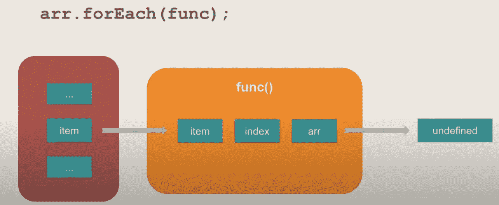
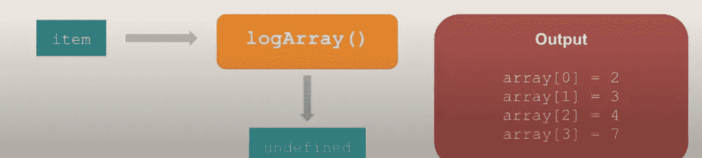
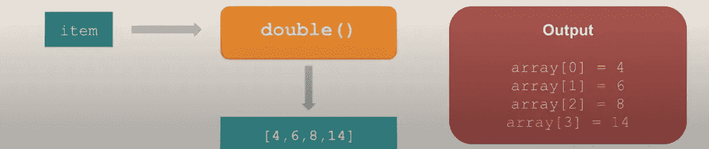

# JavaScript 中应该用 map()还是 forEach()。

> 原文：<https://javascript.plainenglish.io/should-i-use-map-or-foreach-in-javascript-af9da3b4adc3?source=collection_archive---------6----------------------->

## 了解何时使用哪种类型的数组方法


Photo by [Daniel Gonzalez](https://unsplash.com/@overlyawesome?utm_source=medium&utm_medium=referral) on [Unsplash](https://unsplash.com?utm_source=medium&utm_medium=referral)

我确信你在使用 **JavaScript 时可能遇到过`map()`和`forEach()`。**如果你曾经使用过**数组**，但是我有一些关于这两个函数的新细节，我们可能会忽略掉，让我们试着在这篇文章的帮助下复习一下基础知识。

# forEach()的功能

理解`forEach()`的工作很简单，它是一个定义在`[array.prototype](https://developer.mozilla.org/tr/docs/Web/JavaScript/Reference/Global_Objects/Array/prototype)`上的函数，因此适用于所有的 JavaScript 数组。

**对于每个**，这是一个我们可以在任何**数组对象上调用的函数。**它接受另一个函数作为输入。当 forEach 被调用为数组时，JavaScript 逐个获取数组项，并为每个数组项调用该函数。



Functionality of ForEach Function.

我们大多数人都没有注意到这一点，虽然 JavaScript 在调用每个项的函数时也传递了那个数组项的**索引**和**原始数组**，但大多数时候我们只对该项的**值**感兴趣。该函数对每一项都执行，然后将最终的未定义写给调用者，这就是全部。

在这个例子中，我们试图调用**的 forEach 函数**并且我们传递给它一个 logArray 函数，这个 logArray 函数除了`Console.log`的每个数组元素的值之外什么也不做，因为它利用了传递给它的元素和索引值。

```
newArr = [2,3,4,7].forEach(logArray){
console.log('array[' + index + '] = ' + element);
}
```



Result of Example, Step By Step.

请注意，当 **forEach 循环**完成运行时， **newArr** 变量将获得未定义的值**，因为这就是 **ForEach 每次运行时返回的值**。**

# ForEach():要记住的事情！

在处理 forEach 循环时，我们需要记住以下几点。

*   第一件事是，默认情况下，如果我们试图查看传递给 forEach 的函数内部的`this`变量指向什么，它总是**未定义**。如果我们想让`this`变量指向其他值，我们可以将它作为函数后的第二个参数传递。
*   第二件事是，循环的范围是在第一次迭代 **forEach** 之前决定的，所以在第一次迭代之后向数组添加任何新元素并不意味着它将为新添加的元素运行。
*   第三，如果某个特定索引的数组项被删除，forEach 会跳过该索引的函数执行，这与普通的 for 循环不同，for 循环会对所有索引执行该函数。

而且不管我们从函数内部返回什么， ***forEach 总是返回一个未定义的给调用者。***

# 地图的功能()

与`**forEach**`类似的`map()`功能也存在于`array.prototype`上。

将一个函数传递给 **Map** ，然后将为数组中的每一项调用该函数。**项**、**索引、**和**原始数组**将在每次调用时传递给函数。


Photo by [Sushobhan Badhai](https://unsplash.com/@sushobhan?utm_source=medium&utm_medium=referral) on [Unsplash](https://unsplash.com?utm_source=medium&utm_medium=referral)

唯一的区别是 ***Map 返回给我们一个新的数组*** ，它由数组中每个项的函数执行结果所返回的值组成。

我们用这个例子来了解一下**地图功能**，

```
let oldArray= [2, 3, 4, 7]const newArray = oldArray.map(double);// pass a function to map
function double(element, index, array){
console.log('array[' + index + ']=' + element*2);
return element*2;
}
console.log(oldArray)//[2, 3, 4, 7]
console.log(newArray)//[4, 6, 8, 14]
```

在这里，我们在这个数字数组上调用它，并向它传递一个 double 函数，作为对每个数组项执行该函数的结果，我们得到的输出与 **forEach** 非常相似，但最后，我们还会返回一个**新数组**，它由该函数每次迭代返回的值组成。



Map Function Example

正如你所看到的，我们每次都从函数中返回元素的 double 值，因此，新数组由相应数组项的 double 值组成。

# Map():要记住的事情！

*   Map 的行为在几个方面类似于 **forEach** ，即`this` 上下文变量的传递与 forEach 非常相似。`arr.forEach(function, thisArgument)`
*   甚至，执行范围是在第一次迭代之前确定的，就像在第一次迭代之前范围是固定的一样。
*   主要的区别是我们返回一个项目数组给调用者。请注意，如果没有返回任何内容， *undefined 将被添加到新数组中。*

另外，*每次都返回一个新数组，*不像 forEach 总是返回未定义的。

# 最后

这是对我们在 **JavaScript 编程**中日常使用的 `map`和`forEach`概念的快速回顾。理解这些在核心水平上是如何运作的，对于预测它们在异常情况下的行为是很重要的。

例如，以这段代码为例。如果您已经正确理解了本文中的概念，请告诉我们，newArr 的价值是什么？这段代码执行后。

```
let oldArray= [1,2,3,4,5,6]
let newArray = oldArray.map(doubleEven);// pass a function to map
function doubleEven(element, index, array){
if(element%2 === 0)
return element*2;
}
```

这是个棘手的问题——试一试。如果你觉得这篇文章很有帮助，请看看我的另一篇文章，并在评论部分为我们未来的文章提出更多的主题，我很高兴收到你的来信。继续学习，继续编码！👩‍💻

[](https://medium.com/javascript-in-plain-english/hectic-javascript-interviews-questions-8fdf7ddd0e53) [## 忙乱的 JavaScript 面试问题！

### JavaScript 是异步的还是同步的？JavaScript 是如何工作的？

medium.com](https://medium.com/javascript-in-plain-english/hectic-javascript-interviews-questions-8fdf7ddd0e53) [](https://medium.com/illumination/react-vs-angular-what-should-i-choose-10ef98613d06) [## 反应 vs 角度？我应该选择什么？

### React 与 Angular 的比较仍然是一个热门话题，我敢肯定你一直在学习 JavaScript

medium.com](https://medium.com/illumination/react-vs-angular-what-should-i-choose-10ef98613d06) 

## 简单英语的 JavaScript

喜欢这篇文章吗？如果有，通过 [**订阅获取更多类似内容解码，我们的 YouTube 频道**](https://www.youtube.com/channel/UCtipWUghju290NWcn8jhyAw) **！**