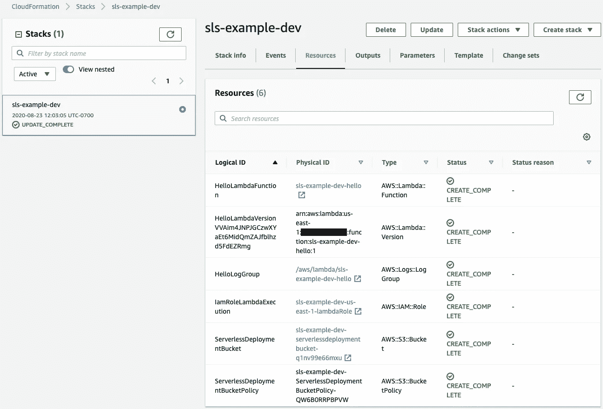
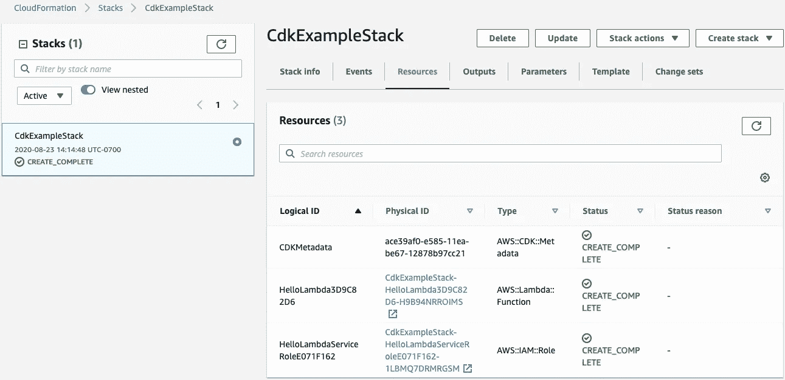
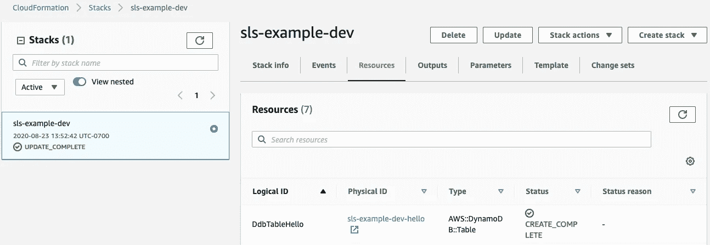
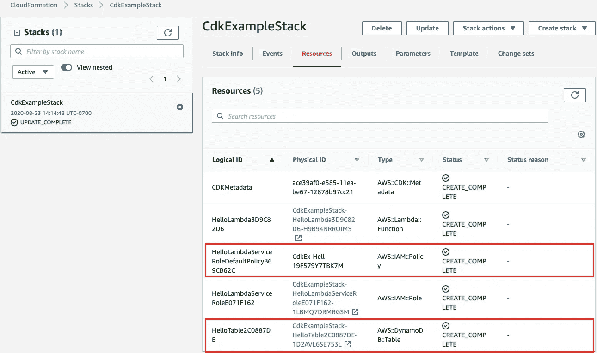

# 无服务器框架和 AWS CDK 之间的五大区别

> 原文：<https://javascript.plainenglish.io/should-you-ditch-serverless-for-aws-cdk-fc5ac904688a?source=collection_archive---------6----------------------->


Photo by [Luca Bravo](https://unsplash.com/@lucabravo?utm_source=medium&utm_medium=referral) on [Unsplash](https://unsplash.com?utm_source=medium&utm_medium=referral)

[无服务器框架](https://www.serverless.com/)是构建无服务器应用最流行的框架，但是它与新的 AWS CDK 相比如何呢？2019 年 7 月， [AWS 公布了自己的框架云开发工具包](https://aws.amazon.com/about-aws/whats-new/2019/07/the-aws-cloud-development-kit-aws-cdk-is-now-generally-available1/)。 [AWS CDK](https://aws.amazon.com/cdk/) 是一个部署无服务器应用和任何 AWS 资源的框架。AWS CDK 以类似于 [AWS CloudFormation](https://aws.amazon.com/cloudformation/) 和 [Terraform](https://www.terraform.io/) 的代码形式帮助您实现基础设施。

这篇文章将从不同方面比较无服务器框架和 AWS CDK:框架易用性、可扩展性和安全性。到最后，你应该能够决定是继续使用无服务器还是采用 CDK。

# 框架概述

AWS CDK(我们称之为“CDK”)和无服务器框架(我们称之为“无服务器”)都是 JavaScript 框架，您可以通过 [npm](https://www.npmjs.com/) 或 [yarn](https://yarnpkg.com/) 将其作为命令行界面(CLI)脚本进行安装。两者都支持 AWS，但是它们的用途不同。

# 什么是无服务器框架？

无服务器允许您将无服务器应用程序部署到多个云提供商。无服务器支持以下[提供商](https://www.serverless.com/framework/docs/providers/):

*   自动警报系统
*   蔚蓝的
*   腾讯云
*   谷歌云
*   Knative
*   阿里云
*   云耀斑
*   【数学】函数
*   一无所有
*   OpenWhisk
*   现场测试

无服务器配置文件(名为“serverless.yml”)对大多数提供者使用类似的格式，这允许您相当容易地在提供者之间切换心理上下文。“serverless.yml”文件将使您能够使用 [YAML](https://yaml.org/) 语法指定您的配置，并放置您的函数源代码，如 JavaScript、Python、Go 和云提供商支持的任何其他语言。Serverless 将反序列化“serverless.yml”并将其转换为云提供商的底层格式(例如，AWS CloudFormation 模板)。

# 什么是亚马逊网络服务(AWS)云开发工具包(CDK)？

CDK 允许您使用 TypeScript、JavaScript、Python、Java 和. NET 在 AWS 中部署资源。您的源代码定义了资源和这些资源需要的文件(例如， [AWS Lambda](https://aws.amazon.com/lambda/) 函数源代码)。CDK 将综合源代码，以创建适当的 AWS CloudFormation 模板。

# 让我们比较一下这两者

# 1.设置基本项目

我们将回顾如何在 AWS 上为这两个框架建立一个项目。

我假设你已经有一个 AWS 帐户，并且知道如何创建适当的 [IAM 凭证](https://www.serverless.com/framework/docs/providers/aws/guide/credentials/)或临时凭证来部署 AWS 资源。

我假设您的机器上已经安装了 Node.js、npm 和您想要的编程语言。

**无服务器框架项目设置**

要安装无服务器，请使用 npm:

```
npm install -g serverless
```

这允许您将“无服务器”或“sls”用作 CLI 命令。

要创建新的无服务器项目，请使用“无服务器”或“sls”命令，并按照屏幕提示进行操作:

```
sls
```

您将在新项目中找到以下启动文件。

```
$ ls sls-example/
handler.js    serverless.yml
```

我倾向于使用“sls”命令，并选择 Node.js JavaScript(或 TypeScript)作为 Lambda 函数语言。

**AWS CDK 项目设置**

我们需要安装 AWS 命令行界面和 CDK。

要安装 AWS CLI，请遵循 [AWS CLI 安装说明](https://docs.aws.amazon.com/cli/latest/userguide/cli-chap-install.html)，因为它们因操作系统而异

要安装 CDK，请使用 npm:

```
npm install -g aws-cdk
```

要创建一个新的 cdk 项目，请使用“CDK”命令。

```
mkdir cdk-example
cd cdk-example
cdk init app --language=javascript
```

您将在新项目中找到以下启动文件。

```
$ ls
README.md    lib                  package.json
bin          node_modules         test
cdk.json     package-lock.json
```

我更喜欢 Node.js JavaScript 作为 Lambda 函数语言。我建议你考虑使用 TypeScript 而不是 JavaScript，因为 CDK 是用 TypeScript 构建的。我选择节点来与无服务器进行比较。

**比较**

两者都很容易建立基本的项目结构。

# 2.易用性

我认为每个框架都相对容易使用。根据您是否喜欢编写代码以及您对 AWS 的理解和知识，您可能更喜欢一个框架而不是另一个。

# 2.1.部署 Lambda 函数

我们将从一个简单的用例开始。

**无服务器框架**

假设您只想部署一个 Lambda 函数。前面的项目设置已经准备好部署一个 Lambda 函数。

```
# serverless.yml
# automatically created file
# no code changes madeservice: sls-exampleprovider:
  name: aws
  runtime: nodejs12.xfunctions:
  hello:
    handler: handler.hello
```

无服务器将假设您想要一个`dev`阶段和`us-east-1`区域。

```
/* handler.js */
/* automatically created file */
/* no code changes made */'use strict';
module.exports.hello = async event => {
  return {
    statusCode: 200,
    body: JSON.stringify(
      {
        message: 'Go Serverless v1.0! Your function executed successfully!',
        input: event,
      },
      null,
      2
    ),
  };
};
```

现在我们只需要部署配置。

```
sls deploy --aws-profile my_aws_profile
```

无服务器将创建一个部署以下项目的云信息模板:

*   包含无服务器配置文件和适当的 S3 存储桶策略的 S3 存储桶
*   一个λ函数
*   最新的 Lambda 函数版本
*   一个 CloudWatch 日志日志组，用于捕获函数日志
*   Lambda 函数将用于访问任何 AWS 服务和资源的 IAM 角色



“serverless.yml”文件中的少量行部署了“handler.js”功能代码，并设置了所有必要的支持资源。此外，资源命名约定遵循一种命名模式。还不错！

**AWS CDK**

我们之前创建的项目(即 app)结构没有资源。我们将需要添加所需的资源。

我们需要安装一个额外的包来定义我们的应用程序中的 Lambda。

要安装附加软件包，请运行以下 npm 命令:

```
npm i --save [@aws](http://twitter.com/aws)-cdk/aws-lambda
```

我们现在可以通过修改现有代码在应用程序中定义一个 Lambda 函数。

我们不需要对`bin/cdk-example.js`文件进行修改。

```
#!/usr/bin/env node/* bin/cdk-example.js */
/* automatically created file */
/* no code changes made */const cdk = require('[@aws](http://twitter.com/aws)-cdk/core');
const { CdkExampleStack } = require('../lib/cdk-example-stack');const app = new cdk.App();
new CdkExampleStack(app, 'CdkExampleStack');
```

我们需要将 Lambda 函数添加到`lib/cdk-example-stack.js`文件中。

```
/* lib/cdk-example-stack.js */
/* automatically created file */
/* code changes made */'use strict';const cdk = require('[@aws](http://twitter.com/aws)-cdk/core');/* addition */
const lambda = require('[@aws](http://twitter.com/aws)-cdk/aws-lambda');
const fs = require('fs');
/* end addition */class CdkExampleStack extends cdk.Stack {
  /**
   *
   * [@param](http://twitter.com/param) {cdk.Construct} scope
   * [@param](http://twitter.com/param) {string} id
   * [@param](http://twitter.com/param) {cdk.StackProps=} props
   */
  constructor(scope, id, props) {
    super(scope, id, props);
    /* addition */
    const helloSrc = fs.readFileSync('handler.js').toString();
    const helloLambda = new lambda.Function(this, 'HelloLambda', {
      runtime: lambda.Runtime.NODEJS_12_X,
      handler: 'handler.hello',
      code: new lambda.InlineCode(helloSrc, {
        encoding: 'utf-8',
      }),
    });
    /* end addition */
  }
}module.exports = { CdkExampleStack };
```

我们将使用无服务器示例中的同一个`handler.js`文件，并将其添加到`cdk-example`文件夹中。

我们准备好部署了。让我们运行 CDK CLI 命令。

```
# check for errors
cdk synth
# deploy
cdk deploy --profile my_aws_profile
```

CDK 将使用 AWS CLI 配置中的默认区域，如果没有默认区域，则使用`us-east-1`。

CDK 将创建一个云形成模板，部署以下项目:

*   CDK 元数据
*   一个λ函数
*   Lambda 函数将用于访问任何 AWS 服务和资源的 IAM 角色



无服务器部署的 S3 桶、S3 桶策略、最新 Lambda 函数版本和 CloudWatch Logs 日志组发生了什么变化？

CDK 使用 CDK 元数据，而不是将 CloudFormation 模板和无服务器所需的其他资源上传到 S3 存储桶并创建适当的存储桶策略。我们获得了**安全奖励**，因为我们无法从 AWS 控制台访问 CDK 配置。不错！

无服务器假设您在更新 Lambda 函数时需要它的一个版本。这可能是一个有用的特性，但是，在大多数情况下，您可能只需要最新的版本。CDK 不会为你做这样的假设。如果您想要版本化的函数，您需要指定它。

当 Lambda 第一次触发时，AWS 将自动创建一个 CloudWatch Logs 日志组。因此，我们不需要在应用程序中指定它。但是，在删除堆栈时，CDK 或 CloudFormation 将**而不是**自动删除日志组，因为它不是配置的一部分。如果我们希望这样，我们需要在 lib/cdk-example-stack.js 文件中添加日志组。

CDK 假设您想要使用最佳实践和可信模式。因此，它为该函数创建了 IAM 角色。

**比较**

无服务器使得创建 Lambda 函数和支持资源变得非常简单。但是，它确实创建了一个新的 S3 存储桶来存放无服务器配置。

CDK 需要一点额外的努力，因为它没有一个样本 Lambda 函数。我必须阅读 [API 参考](https://docs.aws.amazon.com/cdk/api/latest/docs/aws-lambda-readme.html)来决定如何添加一个 Lambda。此外，它没有部署我想要的所有资源(例如，CloudWatch Logs 日志组)。但是，它限制了资源的数量，给了我更多的控制权。

# 2.2.添加 DynamoDB 表

Lambda 函数很可能需要从数据库中获取数据。我们将使用 DynamoDB，这是一个无服务器的数据库表服务。

**无服务器框架**

无服务器不支持开箱即用的某些资源(例如，DynamoDB 表和 S3 桶)。因此，我们需要借助云形成来创建它们。

我们将把 CloudFormation 模板代码附加到现有的`serverless.yml`配置文件中。

```
# serverless.yml# additions
resources:
  Resources:
    TableUsers:
      Type: AWS::DynamoDB::Table
      Properties:
        TableName: ${self:service}-${self:provider.stage}-users
        AttributeDefinitions:
          - AttributeName: PartitionKey
            AttributeType: S
          - AttributeName: SortKey
            AttributeType: S
        KeySchema:
          - AttributeName: PartitionKey
            KeyType: HASH
          - AttributeName: SortKey
            KeyType: RANGE
        ProvisionedThroughput:
          ReadCapacityUnits: 1
          WriteCapacityUnits: 1
# end additions
```

当我们再次部署时，我们将看到 DynamoDB 表的新资源。



我们希望我们的 Lambda 函数能够从表中读取数据。我们需要将 IAM 策略添加到`serverless.yml`文件中。

```
# serverless.yml# addition
  iamRoleStatements:
    - Effect: "Allow"
      Action:
        - "dynamodb:GetItem"
      Resource:
        Fn::Join:
          - ""
          - - "arn:aws:dynamodb:"
            - "Ref" : "AWS::Region"
            - ":"
            - "Ref" : "AWS::AccountId"
            - ":table/"
            - "Ref" : "DdbTableHello"
# end addition
```

当我们部署它时，不会看到任何新的资源。我们可以转到`IamRoleLambdaExecution` IAM 角色资源，看到它有我们刚刚添加的 IAM 策略。

```
 {
            "Action": [
                "dynamodb:GetItem"
            ],
            "Resource": "arn:aws:dynamodb:us-east-1:123456789012:table/sls-example-dev-hello",
            "Effect": "Allow"
        }
```

添加 DynamoDB 表并授予 Lambda 函数从其中获取一个项目的权限相当费力。

**AWS CDK**

我们需要添加一个额外的包来将 DynamoDB 添加到我们的应用程序中。

```
npm i --save [@aws](http://twitter.com/aws)-cdk/aws-dynamodb
```

我们需要更新`lib/cdk-example-stack.js`文件来添加 DynamoDB 资源。我将限制显示的代码，只关注变化。

```
/* lib/cdk-example-stack.js */
/* automatically created file */
/* code changes made */'use strict';const cdk = require('[@aws](http://twitter.com/aws)-cdk/core');/* addition */
/* end addition *//* addition 2 */
const dynamodb = require('[@aws](http://twitter.com/aws)-cdk/aws-dynamodb');
/* end addition 2 */class CdkExampleStack extends cdk.Stack {
  constructor(scope, id, props) {
    super(scope, id, props);
    /* addition */
    /* end addition *//* addition 2 */
    const helloTable = new dynamodb.Table(this, 'HelloTable', {
      partitionKey: {
        name: 'PartitionKey',
        type: dynamodb.AttributeType.STRING,
        billingMode: dynamodb.BillingMode.PROVISIONED,
      },
      sortKey: { name: 'SortKey', type: dynamodb.AttributeType.STRING },
      readCapacity: 1,
      writeCapacity: 1,
    });
    helloTable.grantReadData(helloLambda);
    /* end addition 2 */
  }
}module.exports = { CdkExampleStack };
```

当我们综合和部署时，我们会发现两种新资源:

*   一张 DynamoDB 桌子
*   一个 IAM 策略



IAM 策略将显示以下内容:

```
{
    "Version": "2012-10-17",
    "Statement": [
        {
            "Action": [
                "dynamodb:BatchGetItem",
                "dynamodb:GetRecords",
                "dynamodb:GetShardIterator",
                "dynamodb:Query",
                "dynamodb:GetItem",
                "dynamodb:Scan"
            ],
            "Resource": [
                "arn:aws:dynamodb:us-east-1:123456789012:table/CdkExampleStack-HelloTable2C0887DE-1D2AVL6SE753L"
            ],
            "Effect": "Allow"
        }
    ]
}
```

您可能会注意到，这个 IAM 策略比我们使用无服务器创建的策略具有更多允许的操作。我们用 Serverless 创建的 IAM 策略只包含我们在 serverless.yml 文件中定义的策略。然而，我们使用方便的 grantReadData 函数来自动创建该函数需要的所有读取权限。我们可以手动创建 IAM 策略并将其添加到角色中。虽然我们与 CDK 一起创建的 IAM 策略在技术上不是最低特权，但其意图是最低特权。尽管如此，通过获取一个项目与获取多个项目进行读取仍然是一种读取。如果我们想要实际的最小特权，我们需要向文件中添加更多的代码。

**比较**

无服务器没有简化 IAM 策略中 DynamoDB 表的创建。我们将附加分配给 Lambda 函数的 IAM 角色策略。我们不得不求助于使用本机 CloudFormation 模板代码和 IAM 策略声明。

CDK 用几行代码简化了 DynamoDB 和 IAM 策略的创建，并且不需要了解 CloudFormation 模板代码和 IAM 策略声明。我们获得了 Lambda 函数执行读取所需的所有特权。尽管如此，如果我们真的想让函数只读取一次，那么它可能不是最小特权。然后，我们需要添加更多的代码来添加适当的 IAM 策略，这样就失去了它的简洁性。

# 3.展开性

在本节中，我们将回顾 CDK 和无服务器的可扩展性。

**CDK**

CDK 使用结构，并在三个层次上定义它们。级别 1 允许您直接使用云形成。第二层提供抽象和人类可读的代码；参见上面的例子。第 3 级将使您能够将第 1 级和第 2 级构造与构建可重用模式结合起来(例如，部署一个 S3 桶和 CloudFront 发行版来托管一个静态网站)。

AWS 已经构建了几个 3 级结构来解决许多常见的模式。他们以他们的 [AWS 解决方案结构](https://docs.aws.amazon.com/solutions/latest/constructs/welcome.html)发布。例如，您可以安装他们的构造来部署 S3 bucket 和 CloudFront 发行版。

```
npm i --save [@aws](http://twitter.com/aws)-solutions-constructs/aws-cloudfront-s3
```

我们将创建一个“lib/cloudfront-s3.js”文件来定义我们的新堆栈。

```
/* lib/cloudfront-s3.js */
/* new file */'use strict';const cdk = require('[@aws](http://twitter.com/aws)-cdk/core');
const {
  CloudFrontToS3,
} = require('[@aws](http://twitter.com/aws)-solutions-constructs/aws-cloudfront-s3');class CloudFrontS3Stack extends cdk.Stack {
  /**
   *
   * [@param](http://twitter.com/param) {cdk.Construct} scope
   * [@param](http://twitter.com/param) {string} id
   * [@param](http://twitter.com/param) {cdk.StackProps=} props
   */
  constructor(scope, id, props) {
    super(scope, id, props);
    new CloudFrontToS3(stack, 'cloudfront-s3', {});
  }
}module.exports = { CloudFrontS3Stack };
```

现在，我们将堆栈添加到我们的应用程序中。

```
#!/usr/bin/env node
/* bin/cdk-example.js */
/* automatically created file */
/* code changes made */'use strict';const cdk = require('[@aws](http://twitter.com/aws)-cdk/core');
const { CdkExampleStack } = require('../lib/cdk-example-stack');
const { CloudFrontS3Stack } = require('../lib/cloudfront-s3-stack');const app = new cdk.App();
new CdkExampleStack(app, 'CdkExampleStack');
new CloudFrontS3Stack(app, 'CloudFrontS3Stack');
```

当我们部署时，CDK 自动创建 S3 桶、CloudFront 分发版和 CloudFront origin 访问身份，允许 CloudFront 分发 S3 对象。我们需要将文件上传到 S3 存储桶，并创建一个 CloudFront 失效来清除 CloudFront 缓存。我们仍然需要为 CloudFront 发行版创建 Route 53 托管区域、证书管理器证书和 Route 53 A 别名记录，以拥有一个完整的工作网站。

CDK 也支持构建和使用插件。插件修改 CDK 部署过程，而构造允许我们构建可重用的模式。例如，前面的第 3 级构造允许我们部署多个 CloudFront-S3 模式。相比之下，[CDK-multiple-profile-plugin](https://www.npmjs.com/package/cdk-multi-profile-plugin)将使我们能够使用多个 AWS 概要文件(可能是多个 AWS 帐户)进行部署。

**无服务器**

Serverless 有许多[开源插件](https://github.com/serverless/plugins)，它们扩展了部署过程，甚至允许我们扩展它如何处理 serverless.yml 文件。

例如，我们可以部署一个静态网站。 [fullstack-serverless](https://github.com/MadSkills-io/fullstack-serverless) 插件允许我们部署 S3 桶、CloudFront 发行版和 CloudFront origin 访问身份，运行网站的构建命令，并将文件上传到 S3 桶。

我们安装插件。

```
npm install --save-dev fullstack-serverless
```

我们将配置添加到`serverless.yml`文件中。

```
# serverless.yml
# only some of the options are displayedplugins:
  - fullstack-serverlesscustom:
  fullstack:
    domain: my-custom-domain.com
    certificate: arn:aws:acm:us-east-1:...
    bucketName: my-website
    distributionFolder: websiteDir/dist
    indexDocument: index.html
    errorDocument: error.html
    singlePageApp: true
    compressWebContent: true
    clientCommand: npm run build
    clientSrcPath: websiteDir
```

当我们部署时，我们将完成许多步骤。我们仍然需要为 CloudFront 发行版创建 Route 53 托管区域、证书管理器证书和 Route 53 A 别名记录，以拥有一个完整的工作网站。

**对比**

CDK 和无服务器都支持插件。CDK 提供了第三级构造来构建模式。相比之下，Serverless 除了制作一个允许您修改指定构建模式的 serverless.yml 文件的插件之外，没有这个概念。Serverless 是一个稳定且完善的框架，有多个插件。CDK 成立才一年多一点，它的一些二级结构和三级结构仍然处于试验阶段。实验性的构造可能会在未来的版本中引入突破性的变化。当然，不能保证无服务器插件不会引入重大变化，因为它们不受无服务器公司的控制。

# 4.稳定性

我认为无服务器和 CDK 都是稳定的。无服务器公司管理无服务器，他们遵循既定的软件开发流程。AWS 管理 CDK，并遵循既定的软件开发流程。

无服务器框架是稳定的，并且它们提供了与当前 V1 及其次要版本的向后兼容性。CDK 本身是稳定的，我所评论的所有 1 级构造也是如此。这意味着您可以使用 CloudFormation 设置可靠地构建一个 CDK 应用程序，而不用担心会出现重大更改。

如前所述，一些 CDK 2 级和 3 级结构是实验性的，无服务器插件可能是也可能不是稳定的。本质上，突破性变更的潜力来自于利用构建在基本功能之上的便利性。CDK 相对于无服务器的优势在于，AWS 正在构建和维护 2 级和 3 级结构，这使得 AWS 在整个生态系统中更加稳定。相比之下，无服务器不能直接控制插件。

# 5.安全考虑

# 5.1.部署所需的 AWS 资源

无服务器需要包含无服务器配置文件的 S3 存储桶。如果您部署一个无服务器配置，并且在 serverless.yml 文件中没有指定任何资源，它仍然会创建该 S3 存储桶。

CDK 确实创建了一个 S3 存储桶来存放其配置数据。如果部署空的 CDK 应用程序，它将生成无法通过 AWS 控制台或 CLI 访问的 CDK 元数据资源。

# 5.2.资源配置

Serverless 假定您可能需要一些资源(例如，Lambda 版本控制、CloudWatch 日志日志组和一个 IAM 角色用于您的所有功能)。该存储桶不可通过互联网访问，但未配置为专用存储桶。

CDK 尽量不承担你想要的资源，并给你大部分的控制权(例如，它不会创建 Lambda 版本控制和 CloudWatch Logs 日志组，也不会为你的所有功能创建一个 IAM 角色)。假设你指定一个 Lambda 函数需要一个包含它所有依赖项的包。在这种情况下，它将自动创建将包部署到 Lambda 函数所需的 S3 桶。尽管如此，它还是将其配置为一个私有桶。正如你在上面的例子中看到的，CDK 没有创建 S3 桶，因为 Lambda 函数代码是内联代码而不是包。

# 5.3.最小特权原则

CDK 2 级构造提供了使用“grant”函数授予特权的便利。这些“授予”功能创建适当的最低特权 IAM 角色(例如，它添加允许在两个特定资源之间进行读取访问的所有 IAM 策略语句，但不添加任何创建/删除/更新权限)。

无服务器假设您希望所有功能都有一个 IAM 角色。当每个栈只有一个函数时，这样做很好，但是当你添加更多的函数时，可能会违反最小特权原则。您将需要一个插件来帮助您为每个函数定义 IAM 角色，或者避免使用内置的 IAM 角色，并使用“serverless.yml”文件的“resources”部分中的 CloudFormation 模板来手动定义它们。

# 我们只使用 AWS。我们应该使用哪个？

无服务器和 CDK 最终都建立了一个云形成模板，但它如何创建模板有所不同。在某些方面，无服务器使部署无服务器应用程序更容易，而在其他方面，它需要更多的工作。CDK 要求对 AWS 有更好的理解，并给你更多的控制权。当涉及到部署 Lambda 函数以外的资源时，CDK 比无服务器需要更少的代码(除非你使用无服务器插件)。

如果您不熟悉 AWS 和无服务器计算，并且希望尽快开始部署，我建议从无服务器开始。

假设你是 AWS 新手，想学习 AWS 的工作原理。那样的话，我建议看 YouTube 上关于 [AWS 认证云从业者](https://aws.amazon.com/certification/certified-cloud-practitioner/)认证考试的视频来了解 AWS。当您对 AWS 的工作原理有了基本的了解后，无服务器可能仍然是最好的起点。尽管如此，你将有足够的知识开始使用 CDK。

假设您对 AWS 有中级到高级的了解。在这种情况下，CDK 将为您提供更多的控制，以实现您希望实现的任何简单或复杂的部署。无服务器也将帮助您实现相同的结果，但您可能需要构建自己的 AWS CloudFormation 模板。如果您喜欢 YAML 配置的简单性，您可能希望使用无服务器。

假设你更多的是 DevOps 工程师，而不是软件开发者。在这种情况下，您可能倾向于无服务器，但是为 CDK 编写源代码可能不是您力所不及的。

在[https://github . com/Miguel-a-calles-MBA/sec juice/tree/master/CDK-vs-SLS](https://github.com/miguel-a-calles-mba/secjuice/tree/master/cdk-vs-sls)查看源代码。

# 作者的笔记

加入我的邮件列表来接收关于我写作的更新。

参观[**miguelacallesmba.com/subscribe**](https://miguelacallesmba.com/subscribe)并报名。

保持安全，米格尔

## 关于作者

Miguel 是首席安全工程师，也是“[无服务器安全](https://ServerlessSecurityBook.com)”一书的作者。作为一名开发人员和安全工程师，他参与了多个无服务器项目，为开源无服务器项目做出了贡献，并以各种工程角色参与了大型军事系统。

*本帖最初发表于*[*https://www.secjuice.com/aws-cdk-vs-serverless-framework/*](https://www.secjuice.com/aws-cdk-vs-serverless-framework/)*。*