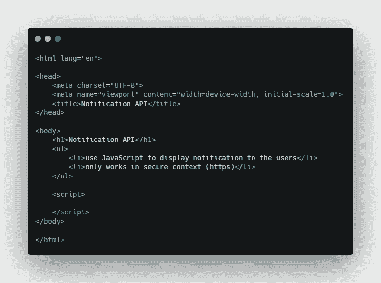
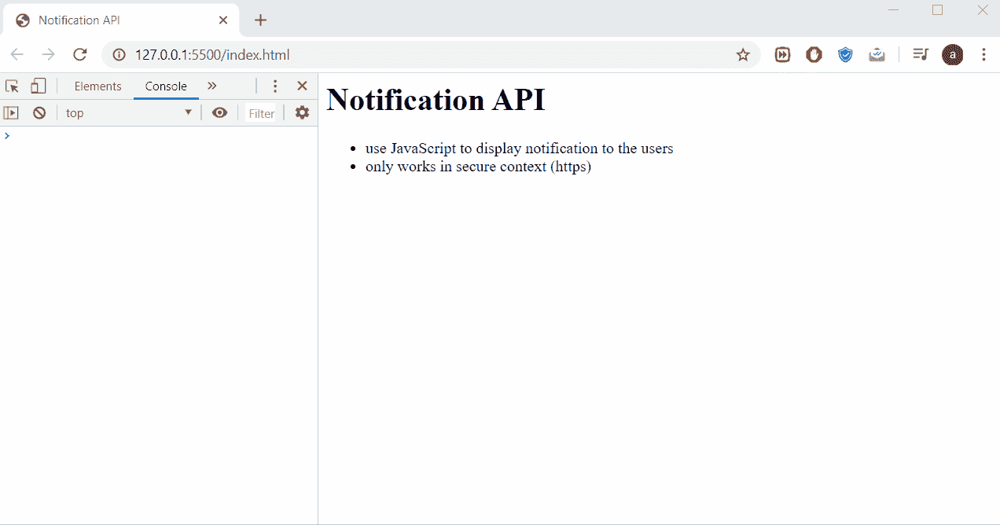
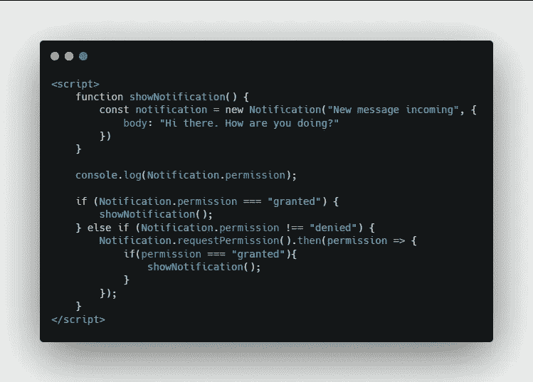
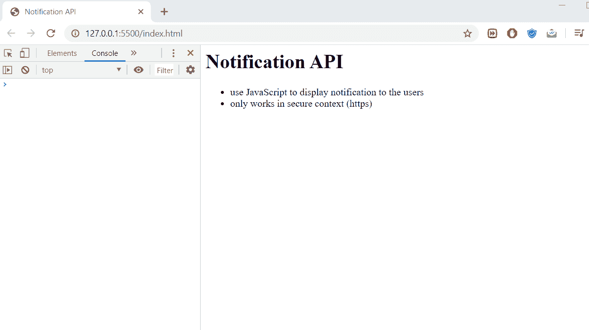
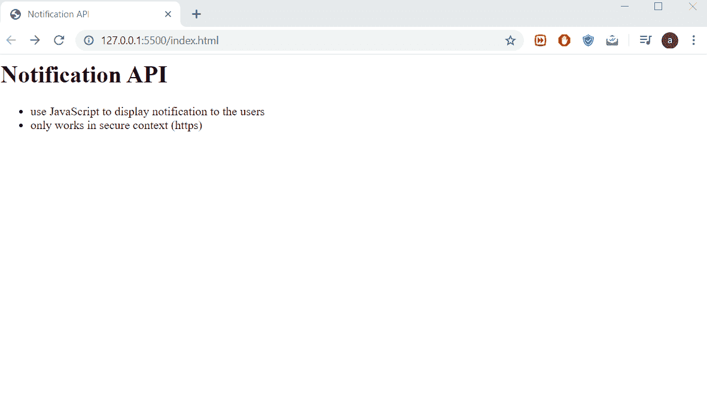

# 用 JavaScript 显示桌面通知

> 原文：<https://javascript.plainenglish.io/show-desktop-notifications-with-javascript-d554a28f0b87?source=collection_archive---------1----------------------->

## 使用 JavaScript 通知 API 获取桌面通知


Photo by [Glenn Carstens-Peters](https://unsplash.com/@glenncarstenspeters?utm_source=medium&utm_medium=referral) on [Unsplash](https://unsplash.com?utm_source=medium&utm_medium=referral)

通知 API 允许您使用浏览器中运行的纯 JavaScript 显示桌面风格的通知。请记住，这只适用于安全的环境。基本上，只有当你的网站支持 HTTPS 时，它才会起作用，但除此之外，它很容易做到，只需要几行 JavaScript 代码。

# 开始

下面是一个示例代码。



Sample Code

在 JavaScript 标记内添加以下代码。

```
<script>
   console.log(Notification.permission); if (Notification.permission === "granted") {
      alert("we have permission");
   } else if (Notification.permission !== "denied") {
      Notification.requestPermission().then(permission => {
         console.log(permission);
      });
   }
</script>
```

第一步是向用户请求许可，第二步是显示许可。

该权限有 3 个可能的值。

1.  **默认值** —默认值。用户还没有说是或不是。
2.  **授予** —允许显示通知。
3.  **拒绝** —拒绝显示通知。

从上面的代码来看，如果我们选择了“是”来允许通知，我们将显示带有消息的警报。但是如果我们没有说是或否，我们将请求许可并显示许可。

**结果**



Result

# 显示通知

假设我们已经给予了许可。现在我们实际上已经准备好显示通知了。

创建一个新函数来显示通知。



showNotification()

我们创建一个新的通知实例，作为第一个参数，我们把我们的标题。然后我们放一些期权。这里我们放入通知的 body 属性。如果许可被授予，或者在用户同意显示通知后，我们将调用该函数。

**结果**



Display notification

# 在通知中添加图标

我们还可以在通知中添加图标。为此，请在通知实例中添加 icon 属性。

```
function showNotification() {
   const notification = new Notification("New message incoming", {
      body: "Hi there. How are you doing?",
      icon: "yourimageurl.png"
   })
}
```

# 点击通知

我们可以做的另一件事是在我们点击通知后添加动作。

```
function showNotification() {
   const notification = new Notification("New message incoming", {
      body: "Hi there. How are you doing?"
   }) notification.onclick = (e) => {
      window.location.href = "https://google.com";
   };
}
```

这里我们将网页重定向到 google.com。它非常灵活，你可以做任何你想做的事情。

**结果**



Click on notification

## **用简单英语写的 JavaScript 笔记**

我们已经推出了三种新的出版物！为我们的新出版物献上一点爱心吧，请跟随他们:[**AI in Plain English**](https://medium.com/ai-in-plain-english)，[**UX in Plain English**](https://medium.com/ux-in-plain-english)，[**Python in Plain English**](https://medium.com/python-in-plain-english)**——谢谢，继续学习！**

**我们也一直有兴趣帮助推广高质量的内容。如果您有一篇文章想要提交给我们的任何出版物，请发送电子邮件至[**submissions @ plain English . io**](mailto:submissions@plainenglish.io)**，使用您的 Medium 用户名，我们会将您添加为作者。另外，请让我们知道您想加入哪个/哪些出版物。****