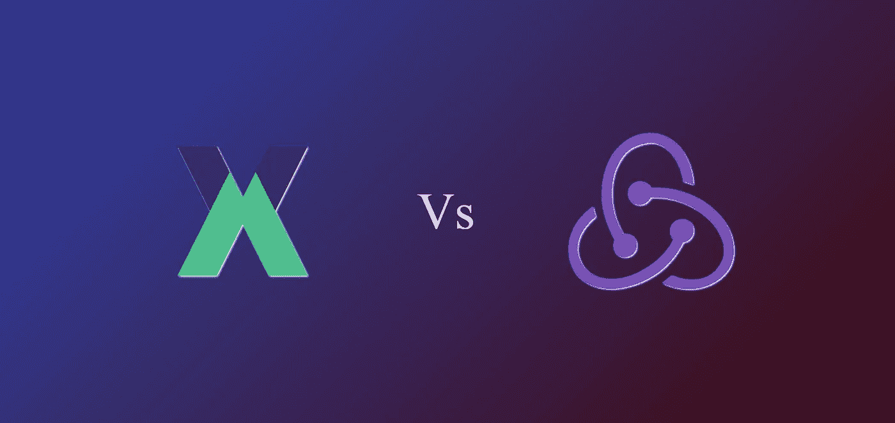
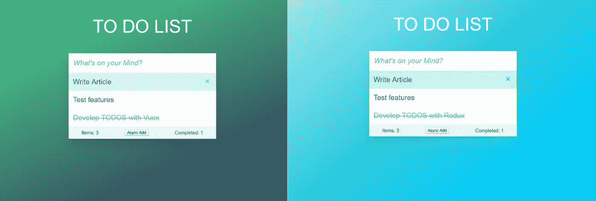

# 通过开发应用程序比较 Vuex 和 Redux

> 原文：<https://javascript.plainenglish.io/similarities-and-differences-between-vuex-and-redux-by-developing-an-application-be3df0164b22?source=collection_archive---------0----------------------->



## 我使用 Vue 和 React 已经有一段时间了。

作为 JavaScript 开发人员，我们有机会在多个框架和各种状态管理系统上工作。因为我是一名自由职业的 web 开发人员，所以我根据项目需求同时使用 React 和 Vue。在这个故事中，我将比较两个非常流行的状态管理系统 Vuex 和 Redux 的工作方式。虽然两者都受到 Flux 架构的启发，但它们遵循不同的方式来实现结果。

在学习新框架时，将一个框架的特性与以前学习的框架或库进行比较是一种自然的趋势。这提供了一个容易理解和记忆的方法，因为我们知道它在另一个世界是如何运作的。

# 所以这里有一篇文章是关于比较 Vuex 和 Redux 是如何用不同的方式做同样的事情的。

*注意:我不是在比较核心框架，也不是试图告诉你哪一个更好，我只是专注于* ***Vuex*** *和****Redux****的特性，以及它们如何以不同的方式实现结果。*



# HTML

两个应用程序的标记现在完全相同，稍后我们将使用 Vue 中的指令和 React 中的渲染函数来修改它们。

# 入门指南

让我们首先向您展示如何开始使用这些状态管理库和它们的基本样板代码。

## **Vuex**

Vuex 与 VueJS 紧密耦合，因此 Vuex 开始使用的样板代码较少。

## **Redux**

Redux 是框架不可知的，它不特定于 React。因此，我们需要导入一些其他的库来让它工作。

# 存储和状态

Vuex 和 Redux 都有一个维护所有应用程序状态变量的 store 对象，让我们看看如何在 store 中创建状态变量。

## **Vuex 是如何做到的**

Vuex 状态是可变的，因此我们可以直接创建状态变量并给它们赋值。

**它是如何还原的**

Redux 使用**减速器、**减速器，其中是取前一个状态和动作并返回下一个状态的纯函数。我们将在下面详细讨论这一点。

Redux uses Reducers to create and manage a set of states.

# 在我们的应用中使用这些状态

现在我们已经能够创建一个带有一个硬编码 TODO 项的状态，让我们看看如何在我们的应用程序中使用它。

## **Vuex 是怎么做到的**

Vue 有一个`mapState()`助手函数，用于将状态从 Vuex 存储映射到组件。这些映射的变量可以像正常的状态变量一样被直接访问，尽管我们不能直接修改这些变量。

如果我们需要对我们的状态变量执行一些操作，并获得计算出的值以在各种组件中使用，我们可以在模板中使用 Vuex 的`getters`:

```
<li v-for="(item, index) in **todoList**" 
  :key="item.id" 
  :class="{ completed: item.completed}"
>
```

## 【Redux 是怎么做到的

Redux 有`mapStateToProps()`方法，该方法被传递给由`react-redux`库提供的更高阶组件`connect`。这些状态现在可以作为我们组件中的道具来访问。

```
//component
import { **connect** } from 'react-redux';const **mapStateToProps** = (state) => {
  return { todos: state };
}export default connect(**mapStateToProps**)(App);
```

Redux 没有提供任何与`getters`相似的特性，我们可以在一个单独的文件中编写我们自己的实用方法，并通过在模板中使用它在任何需要的地方导入它们:

```
renderList() {
return **this.props.todos**.map(item => {
  return (
    <li key={item.id}
      className={"todo " + (item.completed ? "completed" : "")}
      onClick={() => this.props.**toggleCompletion**(item.id)}>
    </li>
  )
})
}
```

# 修改状态

不应直接修改状态变量。我们使用特殊的方法来修改/更新它们，以便可以正确地跟踪它们。

## **Vuex 是如何做到的**

真正改变 Vuex 存储状态的唯一方法是提交一个**突变**。Vuex 突变与事件非常相似；每个突变都有一个字符串类型和一个处理程序。处理函数是我们执行实际状态修改的地方，它将接收状态作为第一个参数。

```
//store.js **mutations**: {
    **addItem**(state, payload) {
      state.todos.push({id:GLOBAL_ID++, title: payload, completed:   false});
    },
    **togglecompletion**(state, id) {
      state.todos.forEach( item => {
        if(item.id === id) 
          item.completed = !item.completed;
      })
    },
    **removeItem**(state, index) {
      state.todos.splice(index, 1);
    }
  }
```

突变也把有效载荷作为可选的第二个参数，如果我们必须传递更多的数据，那么我们可以在有效载荷中发送数组或对象。

## **Redux 是怎么做到的**

在 Redux 中，状态修改方法也是用 reducers 编写的。

```
//reducer/index.jsconst todos = (state = initialState, action) => {
  switch (action.type) {
    case "**ADD_ITEM**":
      return [
        ...state,
        {
          id: GLOBAL_ID++,
          title: action.title,
          completed: false
        }
      ];
    case "**TOGGLE_COMPLETION**":
      console.log('action', action);
      return state.map(todo =>
        todo.id === action.id ? { ...todo, completed: !todo.completed } : todo
      );
    case "**REMOVE_ITEM**":
      return state.filter(todo => todo.id !== action.id);
    default:
      return state;
  }
};
```

减速器维护状态及其修改方法，这些方法由**调度动作**调用。这些动作还需要有效负载将数据从我们的应用程序发送到我们的 Redux 存储。**(记住，在 Redux 状态下是不可变的)**

```
//actions/index.jslet nextTodoId = 0;export const **addItem** = title => {
  return {
    type: "**ADD_ITEM**",
    id: nextTodoId++,
    title
  };
};export const **toggleCompletion** = id => {
  return {
    type: "**TOGGLE_COMPLETION**",
    id
  };
};export const **removeItem** = id => {
  return {
    type: "**REMOVE_ITEM**",
    id
  }
};
```

我们还创建了一个新的文件来存储我们所有的动作，这并不是强制性的，但是它让我们的代码看起来更有条理。与其在代码的后半部分做，不如现在就做。

# **从我们的组件修改状态**

## **Vuex 是如何做到的**

Vuex 提供了一个助手方法`mapMutations()`来访问组件中的突变。

```
methods: {
 ...mapMutations([
  'addItem', 
  'togglecompletion',
  'removeItem',
 ])
}
```

在映射之后，这些方法可以像普通的组件方法一样被访问，方法是在我们的组件中使用这些突变:

```
<button class="destroy" @click.stop="removeTodo(index)"></button>removeTodo: function(index) {
  this.**removeItem**(index);
}
```

## **Redux 是怎么做到的**

类似于`mapStateToProps()` Redux 为我们提供了另一个名为`mapDispatchToProps()`的助手传递给我们的 HOC。

```
const **mapDispatcherstoProps** = dispatch =>  {
  return {
    toggleCompletion: (id) => dispatch(**toggleCompletion**(id)),
    removeItem: (id) => dispatch(**removeItem**(id)),
    addItem: (title)=> dispatch(**addItem**(title)),
    addItemFromWeb: ()=> dispatch(**addItemFromWeb**())   
  }
}export default connect(mapStateToProps, **mapDispatcherstoProps**)(App);
```

这个方法将`dispatch`作为一个参数，这个调度方法用于提交我们的动作。这些动作现在被映射到通过 props 可用的本地方法，如下所示:

```
<button className="destroy" 
    onClick={() => **this.props.removeItem**(item.id)}
/>
```

现在，我们的待办事项应用程序功能齐全，我们可以添加项目，检查已完成的项目和删除项目。

# 进行异步呼叫

扩展我们的待办事项列表应用程序，假设我们想要加载存储在服务器中的用户列表，我们不能直接从我们的 Vuex 突变或 Redux 操作调用服务器，因为它们是同步方法。我们需要特殊的方法来实现这一点。

## **Vuex 是如何做到的**

突变是纯粹的同步功能，我们不能在突变中引起副作用。要进行异步调用，Vuex 有`actions`。动作类似于突变，但是动作`commit`突变而不是状态突变。

```
//store.js
actions: {
    addItemFromWeb(context) {
      axios.get('[https://jsonplaceholder.typicode.com/todos/1'](https://jsonplaceholder.typicode.com/todos/1'))
      .then((response) => {
        console.log(response);
        **context.commit**('**addItem**', response.data.title)
      })
      .catch((error) => console.log(error));
    }
  }
```

在上面的例子中，我们利用`axios` 库进行 HTTP 调用。

为了在我们的组件中使用这些动作，Vuex 为我们提供了`mapActions()` helper 方法。

```
<button @click="addItemFromWeb"> Async Add </button>methods: {
    ...mapActions([
      'addItemFromWeb'
    ])
}
```

## **Redux 是怎么做到的**

Redux 不像 Vuex 那样提供任何开箱即用的解决方案，因此我们需要**中间件**来进行异步调用。

为了实现这一点，我们使用了一个叫做`redux-thunk.`的中间件，这个中间件非常简单，它检查动作是否是一个函数。如果是，则使用`dispatch.`调用该函数；如果不是，则直接调用缩减器。

```
import { **applyMiddleware** } from 'redux';
import thunk from '**redux-thunk**';const store = createStore(
   reducer,
   **applyMiddleware(thunk)**,
);
```

现在在`actions.js`中，我们创建了我们的异步函数:

```
export const **addItemFromWeb** = () => {
    return **dispatch** => {
        axios.get('[https://jsonplaceholder.typicode.com/todos/1'](https://jsonplaceholder.typicode.com/todos/1'))
        .then((response) =>{
            console.log(response);
            **dispatch**(**addItem**(response.data.title));
        })
        .catch((error) => {
            console.log(error);
        })
    }
}
```

# 应用管理和扩展

随着应用程序的增长，我们需要管理更多的状态，我们不能只为 Vuex 准备一个 `store.js`文件或为 Redux 准备一个`reducer.js`文件，我们需要模块化我们的应用程序。

## **Vuex 是如何做到的**

Vuex 允许我们把店铺分成`modules`。每个模块可以包含自己的状态、突变、动作、getters，甚至嵌套模块。

```
const **moduleA** = {
  state: { ... },
  mutations: { ... },
  actions: { ... },
  getters: { ... }
}

const **moduleB** = {
  state: { ... },
  mutations: { ... },
  actions: { ... }
}

const store = new Vuex.Store({
  modules: {
    a: **moduleA**,
    b: **moduleB**
  }
})

store.state.a // -> `moduleA`'s state
store.state.b // -> `moduleB`'s state
```

在模块的变异和获取器中，收到的第一个参数将是模块的**本地状态**。

每个`module`可以写入单独的文件，这些文件可以导入到`store.js`中

## **Redux 是怎么做到的**

我们可以将 root reducer 拆分成多个 reducer，然后将它们组合在一起。每个缩减器将负责管理其中的状态。

```
**import** { combineReducers } **from** 'redux' 
**import** todos **from** './todos' 
**import** counter **from** './counter'

**let reducers =** **combineReducers**({
todo: **todos**,
ctr: **counter**
})const store = createStore(reducer);ReactDOM.render(<Provider store={store}><App /></Provider>, document.getElementById('root'));
```

Redux 库为我们提供了一个名为`combineReducers`的特性，将我们所有的减速器组合成一个单独的减速器。**(注意，我们不能直接访问一个 reducer 中的状态)**reducer 所需的数据应该由组件通过动作传递。

# 结论

我们比较了两个非常流行的状态管理库，它们都受 Flux 架构的启发，都有相同的最终目标，但采用了不同的途径来实现它。

我希望您发现这很有用。如果是这样，一定要留下很多掌声！👏

*如果你对比较* ***Vue*** *和* ***React*** *感兴趣，我推荐你查一下* [*这篇*](https://medium.com/javascript-in-plain-english/i-created-the-exact-same-app-in-react-and-vue-here-are-the-differences-e9a1ae8077fd) *由* [*苏尼尔【桑德胡】*](https://medium.com/u/a7b125868703?source=post_page-----be3df0164b22--------------------------------) *。*

## **现场演示**

[Vue + Vuex](https://vuex-todo-preetish.netlify.com)

[React + Redux](https://redux-todo-preetish.netlify.com)

## **演示 App 源代码**

[Vuex TODO Github](https://github.com/preetishhs/vuex-todos)

[Redux TODO Github](https://github.com/preetishhs/redux-todos)

## **我目前也可以从事自由网页开发工作。有什么项目给我吗？请务必在**给我发一封电子邮件，地址是 contact@preetish😃