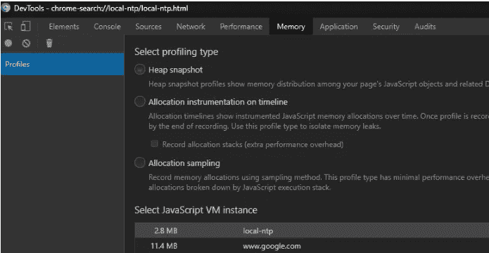

# 提高 JavaScript 性能的技巧，用户会喜欢的

> 原文：<https://javascript.plainenglish.io/simple-and-practical-tips-for-javascript-performance-892e0d3f951d?source=collection_archive---------0----------------------->

## 你的用户会喜欢的 12 个技巧


Speed car panel

## 索引:

*   使用局部变量
*   使用浏览器缓存
*   缓存 DOM
*   避免递归调用
*   使用 XMLHttpRequest、Fetch 或类似的
*   实施事件委托
*   将代码最小化并组合成模块
*   使用顶级等待功能
*   小心添加不必要的依赖项
*   让网络工作者从事高强度工作
*   使用 Javascript 文件捆绑工具
*   检测问题的工具
*   结论

## 使用局部变量

当我们声明一个全局变量时，它会在整个生命周期中保留在内存中。但是，如果我们在局部上下文中用例如 let 或 const 关键字声明变量，则应用块范围，并且在块执行后从内存中删除变量。如果我们在全局变量中保存长文本字符串或 JSON 数据，浏览器会很快耗尽内存，这可能会恶化或阻塞页面。

尝试总是在您的作用域内使用一个变量是一个简单而良好的实践，可以显著提高整体性能。

在下一个例子中，我们可以看到 var 关键字声明的变量是如何作用于直接函数体(函数作用域)的。相反，let 变量的作用域是由{}表示的直接封闭块(块作用域)。

```
function foo() {
  var v1 = "Variable 1";
  let v2 = "Variable 2";
  console.log(v1, v2);

  {
    let v3 = "Variable 3";
    console.log(v3);
  }console.log(v3); 
  //Uncaught ReferenceError: v3 is not defined
}
foo();
```

在顶层，由 var 关键字声明的变量确实在全局对象上创建了一个属性，但是对于由 let 关键字声明的变量，不会出现这种情况:

```
//globally scoped
var var1= "I'm in the global object";//globally scoped
let var2= "I'm not in the global object";console.log(window.var1); 
//I'm in the global objectconsole.log(window.var2); 
//Undefined
```

## 使用浏览器缓存

我们可以使用 HTTP 协议缓存快速实现这一点，将所有 javascript 放入以*结尾的文件中。在静态 URI 位置或使用服务人员发现的 js。这告诉浏览器在接下来的执行中利用本地缓存的脚本或数据副本。

## 缓存 DOM

访问 DOM 非常慢。如果你打算多次使用一个元素的内容，那么把它保存在一个局部变量中并使用它是一个好主意。当您删除 DOM 的值时，该变量应该不会导致任何内存泄漏。

## 避免递归调用

调用堆栈是一种有限的资源，如果我们递归地调用函数而不小心，很容易发生堆栈溢出。最小化这种情况的一种方法是使用 ES6 尾部调用优化。使用尾部调用优化，如果函数中的最后一个表达式是对另一个函数的调用，则引擎会优化调用堆栈以防止其增长。

尾部调用优化的问题是它没有标准化，所以最重要的是，如果你需要一个递归函数，在创建它的时候要小心。在大多数情况下，可以不使用递归，而是将递归调用转换为循环。

## 使用 XMLHttpRequest、fetch 或类似的

Ajax 请求有助于减少来自服务器的内容量，并避免在页面加载之间重新创建脚本环境对性能的影响。

## 实施事件委托

使用[事件委托](https://javascript.info/event-delegation)，您可以使用单个事件处理程序来管理整个页面的一类事件。没有它，web 应用程序会因为太多的事件处理程序和内存不足而陷入停顿。事件委托的优势包括:需要管理的功能更少，Dom 和代码之间的联系更少，因此需要使用的内存更少。

## 将代码最小化并组合成模块

我们可以将应用的组件捆绑到*。js 文件，并通过一个 javascript minimizer 工具(如 uglify-js)传递它们，该工具从源代码中删除所有不必要的字符，而不改变它们的功能。缩小极大地提高了网站的速度和可访问性。它对通过有限的数据计划或低带宽访问您网站的用户也很有用。

例如，如果你通过像 [javascript-minifie](https://javascript-minifier.com/) r 这样的在线最小化器传递下面的代码，你可以得到下面的代码:

```
var myValues= [];
for (var i = 0; i < 5; i++) {
  myValues[i] = i + 10;
  console.log("You have" +  i  +"items");
}//Minified code
for(var myValues=[],i=0;i<5;i++)myValues[i]=i+10,console.log("You have"+i+"items");
```

例如，JQuery 3.4.1 库的[原始版本](https://code.jquery.com/jquery-3.4.1.js)和[缩小版本](https://code.jquery.com/jquery-3.4.1.min.js)之间有 187kb 的差异:


Jquery file original and minified version size.

如果你使用的是静态文件捆绑工具，比如 WebPack，在他的流程中包含一个最小化器是一个很好的做法。

## 使用顶级等待功能

使用顶级 Await，ECMAScript 模块可以等待资源或选择何时加载它们，这使它成为一个有助于提高整体应用程序性能的优秀特性。在我的文章“新的顶级 Await 特性如何在 JavaScript 中工作”中阅读更多关于这个新特性的内容

## 小心添加不必要的依赖项

有了像 npm 或 yarn 这样的包管理器，我们可以轻松地下载和使用一千个公共包。但是我们经常包含我们不需要的库或者包含我们不需要的东西的库。要解决这个问题，请分析您的包以检测未使用的代码。然后移除未使用和不需要的库。

## 让网络工作者从事高强度工作

Web Workers 允许您生成新的线程并将任务委派给这些线程，以提高性能。这样，通常会阻塞其他作业的开销任务被传递给一个工作线程，主线程可以运行而不会被开销任务阻塞。

## 使用 Javascript 文件捆绑工具

Javascript 捆绑是一个过程，它将不同的文件分组，以减少加载页面所需的 HTTP 请求数量，并缩短请求加载时间。捆绑是当今“基于模块”的开发中常用的方法。你有像 [Webpack](https://webpack.js.org/) 这样的工具来帮助你自动捆绑你的脚本。

## 检测问题的工具

有许多工具可以帮助您识别网页中的问题。在 Chrome 中，你可以使用主菜单中的选项:更多工具-开发者工具选项来查看每个选项卡的内存、网络和性能。此外，在 Chrome 中，你可以使用“审计”选项卡来帮助你识别和修复影响网站性能、可访问性和用户体验的常见问题。像 [PageSpeed Insights](https://developers.google.com/speed/pagespeed/insights/) 这样的在线工具也可以帮助你分析你的网站。



Chrome DevTools image

如果您正在使用像 Node 这样的包管理器，您可以使用 npm audit 命令来检测您正在使用的包的问题，或者使用 [NodeSource 平台](https://nodesource.com/products/pricing)来研究应用程序的性能。

## 结论

优化代码是至关重要的，但不要忘记，保持可读性通常更重要。因此，当您应用优化时，不要忘记代码不仅要由机器读取，而且要小心重新发明轮子，因为在许多情况下，大多数问题都有有效的解决方案。

如果你喜欢这篇文章，可以考虑通过我的[个人资料](https://kesk.medium.com/membership)订阅 Medium。谢谢大家！