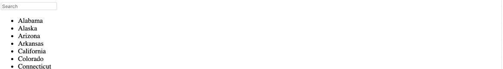

# 带有 JavaScript 的简单异步搜索栏

> 原文：<https://javascript.plainenglish.io/simple-async-search-bar-with-javascript-13652c90485e?source=collection_archive---------1----------------------->


这是一个如何建立搜索栏的快速指南。我将使用 50 个州的列表，作为一个例子，呈现为一个无序列表。但是，通过更改变量和标签，您可以对应用程序的任何内容或任何部分使用相同的搜索。



首先看一下样本 HTML。

```
<ul id="stateList">
  <li>Alabama</li>
  <li>Alaska</li>
  <li>Arizona</li>
  <li>Arkansas</li>
  <li>California</li>
  <li>Colorado</li>
  <li>Connecticut</li>
  <li>Delaware</li>
  <li>Florida</li>
  <li>Georgia</li>
  <li>Hawaii</li>
  <li>Idaho</li>
  <li>Illinois</li>
  <li>Indiana</li>
  <li>Iowa</li>
  <li>Kansas</li>
  <li>Kentucky</li>
  <li>Louisiana</li>
  <li>Maine</li>
  <li>Maryland</li>
  <li>Massachusetts</li>
  <li>Michigan</li>
  <li>Minnesota</li>
  <li>Mississippi</li>
  <li>Missouri</li>
  <li>Montana</li>
  <li>Nebraska</li>
  <li>Nevada</li>
  <li>New Hampshire</li>
  <li>New Jersey</li>
  <li>New Mexico</li>
  <li>New York</li>
  <li>North Carolina</li>
  <li>North Dakota</li>
  <li>Ohio</li>
  <li>Oklahoma</li>
  <li>Oregon</li>
  <li>Pennsylvania</li>
  <li>Rhode Island</li>
  <li>South Carolina</li>
  <li>South Dakota</li>
  <li>Tennessee</li>
  <li>Texas</li>
  <li>Utah</li>
  <li>Vermont</li>
  <li>Virginia</li>
  <li>Washington</li>
  <li>West Virginia</li>
  <li>Wisconsin</li>
  <li>Wyoming</li>
</ul>
```

为搜索栏添加的第一件事是…搜索栏。

`<input type="text" placeholder="Search">`

我们需要给它添加一个 id，这样我们就可以用 JavaScript 来识别它。

`<input type="text" id="myInput" placeholder="Search">`

我们还需要添加一个事件监听器，并调用我们的 JavaScript 函数(即将推出！)有几个是可行的——我将使用 onKeyUp，它在用户键入一些内容后被触发。

`<input type="text" id="myInput" onkeyup="mySearchFunction()" placeholder="Search">`

现在让我们把 JavaScript 放在一起。在我们搜索栏的 HTML 中，调用了一个函数——让我们来构建它。为了让它运行起来，下面是编写代码的步骤:

1.  声明变量、用户输入(在搜索框中输入的内容、过滤器(因此我们可以忽略大小写)、列表、列表中的每一项。
2.  像对待数组一样对待我们的列表——使用索引遍历每个条目，将内部文本或内部 html 与输入进行比较。
3.  显示匹配的列表项，如果不匹配，则不显示任何内容。

```
function mySearchFunction() {
  var input, filter, ul, li, item, i, txtValue;
  input = document.getElementById("myInput");
  filter = input.value.toUpperCase();
  ul = document.getElementById("stateList");
  li = ul.getElementsByTagName("li");  for (i = 0; i < li.length; i++) {
    item = li[i];
    txtValue = item.textContent || item.innerText;
    if (txtValue.toUpperCase().indexOf(filter) > -1) {
      li[i].style.display = "";
    } else {
      li[i].style.display = "none";
    }
  }
}
```

这里有一个[代码笔](https://codepen.io/rachelhawa/pen/vYBjQMY)来看看这是怎么回事。