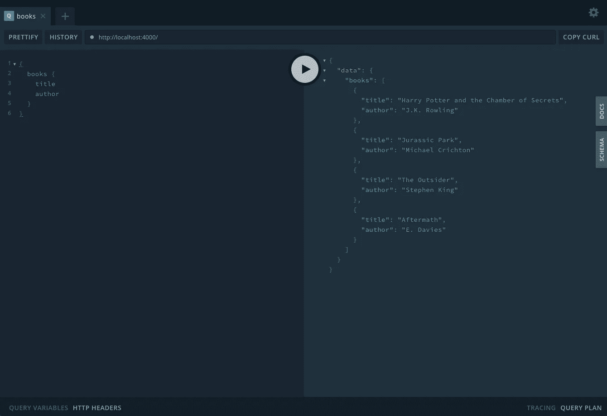
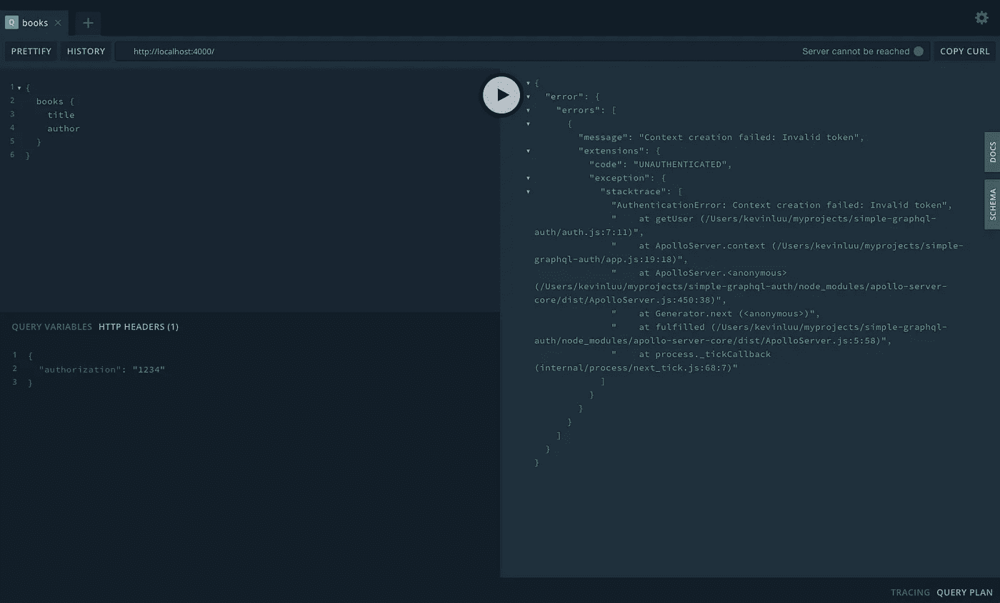
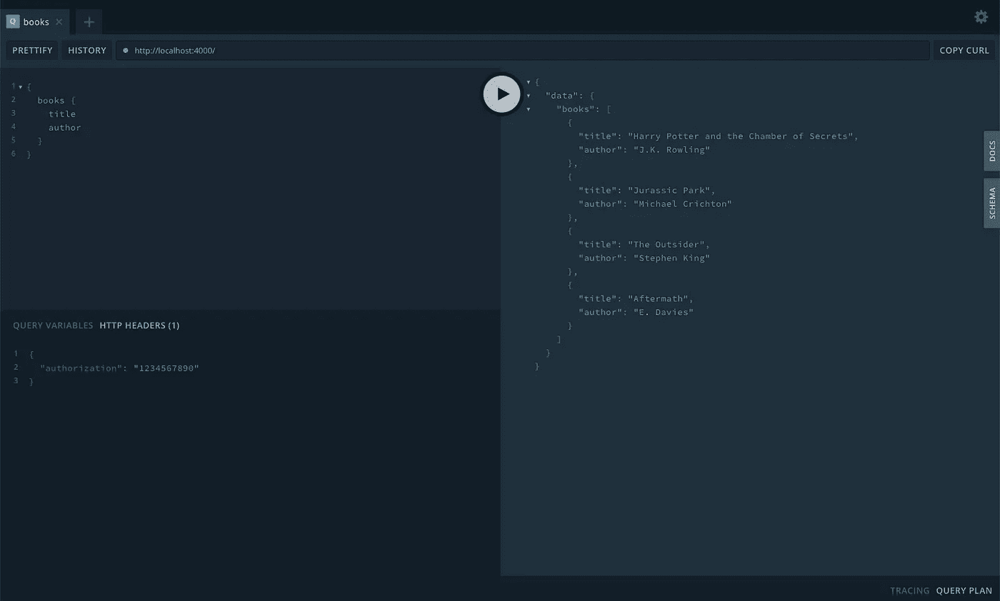
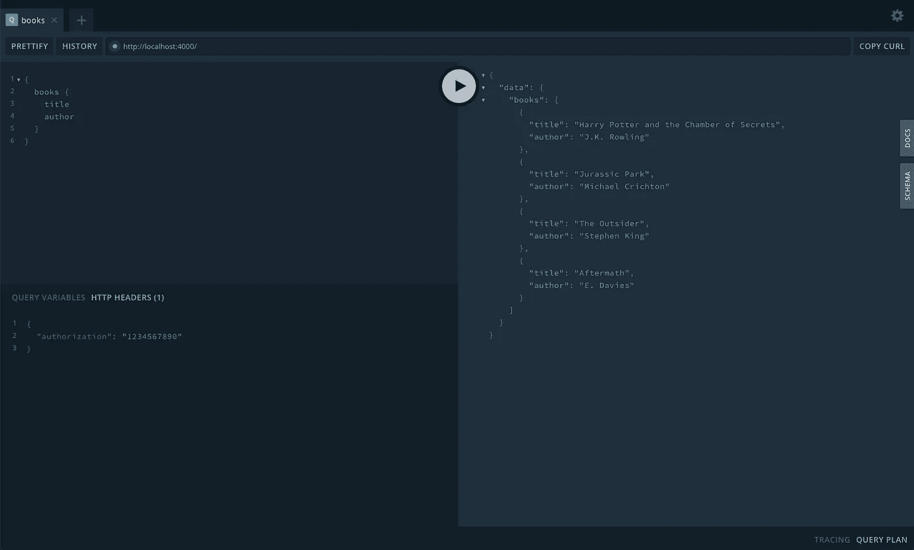
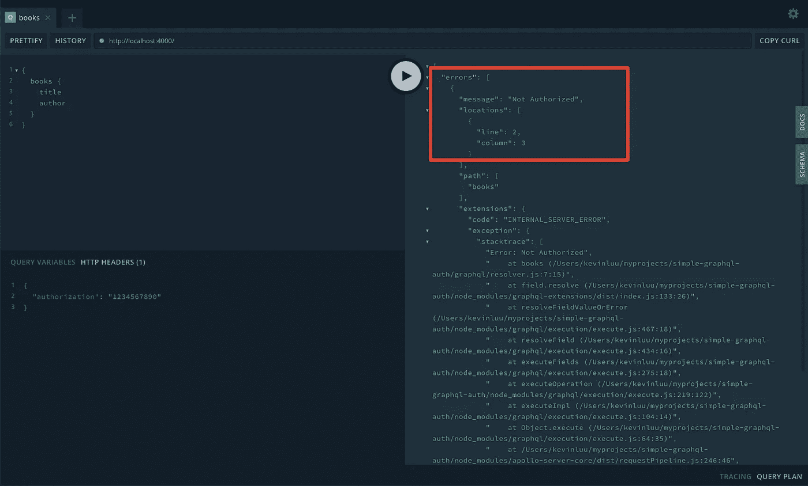

# GraphQL 中的简单认证和授权

> 原文：<https://javascript.plainenglish.io/simple-authentication-and-authorization-in-graphql-5293c0458fc?source=collection_archive---------8----------------------->

## 在 GraphQL 中实现身份验证和授权的简单方法


Photo by [Dominik Schröder](https://unsplash.com/@wirhabenzeit?utm_source=medium&utm_medium=referral) on [Unsplash](https://unsplash.com?utm_source=medium&utm_medium=referral)

# 介绍

有句谚语说“GraphQL 不关心如何实现身份验证或授权”。这可能会导致很多混乱，因为有很多方法可以处理它。

在本教程中，我将向您展示如何以最简单的方式在 GraphQL 中实现身份验证和授权——通过在构建`context`对象时对用户进行身份验证，并在解析器上实现授权。

`context`对象是传递给每个解析器的对象。这使得它成为执行身份验证的逻辑位置。我们开始吧！

# 项目设置

我提供了起始代码，所以我们可以专注于实现身份验证部分，跳过设置 GraphQL 服务器。

[](https://github.com/kluu1/simple-graphql-auth) [## kluu1/simple-graphql-auth

### 如何以简单的方式实现 GraphQL 身份验证- kluu1/simple-graphql-auth

github.com](https://github.com/kluu1/simple-graphql-auth) 

让我们拉下这个项目并安装依赖项。

```
git clone [https://github.com/kluu1/simple-graphql-auth](https://github.com/kluu1/simple-graphql-auth)
cd simple-graphql-auth
npm install
```

接下来，我们可以开始这个项目，并验证一切都正常。运行`npm run dev`命令启动开发服务器。

```
npm run dev
```

访问 [http://localhost:4000/](http://localhost:4000/) 查询`books`得到`title`和`author`。



Verified everything is working

# 实现身份验证

如前所述，我们将在构建`context`对象时对用户进行身份验证。让我们看看如何使用`context`功能。

在代码编辑器中打开项目，修改`app.js`文件。

在第 9 行，我们添加了一个函数来构建我们的`context`对象。我们从请求中提取`req`对象，并从请求头中获取令牌。

在第 14 行，我们检查令牌是否存在，如果不存在，我们抛出`AuthenticationError`，这是阿波罗服务器提供给我们的。

在第 19 行，我们调用`getUser`函数并传入令牌。我将`getUser`函数分离到一个名为`auth.js`的文件中。请注意，这是根据您使用的身份验证解决方案执行身份验证的地方。例如，如果使用 AWS cognitio，则需要调用 AWS Cognito API 来对用户进行身份验证。

为了使本教程简单，我们只检查令牌是否等于`1234567890`。如果没有，我们抛出`AuthenticationError`表示‘无效令牌’。如果令牌有效，则返回`user`对象。

一旦认证成功并且检索到用户，我们就可以返回`user`对象并将其添加到`context`中。现在所有解析器都可以访问`user`对象，所以我们可以在下一节中执行授权。

让我们启动应用程序备份，并测试我们的更改。首先，在不设置任何 HTTP 头的情况下进行查询。我们会收到一个错误“所需的令牌丢失”。


Missing authorization headers

接下来，让我们传入一个无效的令牌。在`HTTP HEADERS`中，将`authorization`设置为`1234`。我们应该会看到“无效令牌”引发的错误。



Passing in an invalid token

然后，传入我们的有效令牌`1234567890`。我们应该期待我们的查询现在通过！



Passing in a valid token

# 在解析器上实现授权

现在让我们修改`books`解析器，这样只有具有“管理员”角色的用户才能访问。

解析器中的第三个参数是`context`对象。我们从`context`中破坏`user`并简单地检查用户的角色是否等同于“管理员”。如果没有，我们抛出一个“未授权”错误

现在重启应用程序，测试我们的查询。一切都应该如预期的那样运行，因为我们当前的用户有“管理员”的角色。



让我们在`auth.js`文件中修改我们的用户，并将角色更改为`nonadmin`。

让我们重新启动应用程序，再次测试我们的查询。我们应该会看到“未授权”的错误。酷！



# 摘要

在本文中，我们介绍了如何在 GraphQL 中轻松实现身份验证和授权。当我第一次自己学习 GraphQL 时，我发现了许多不同的方法来实现身份验证和授权，并且不确定选择哪种方法。我发现这个解决方案是最简单的方法，它满足了我的所有要求。GraphQL 的一个好处是，每当您遇到错误时，消息通常都会很有帮助，并且您可以快速找到问题所在。话虽如此，我希望你喜欢这篇文章，并对你有所帮助！

*我在业余时间写这些文章是为了好玩。如果你喜欢这篇文章，请在下面留下你的喜欢和评论！你可以在* [*中*](https://medium.com/@this.kevinluu) *和* [*推特*](https://twitter.com/kluu_10) *上跟随我。谢谢你的支持！*