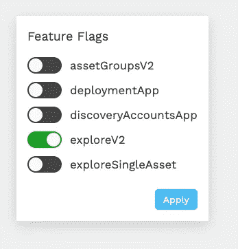

# React 应用程序中的简单特征标志

> 原文：<https://javascript.plainenglish.io/simple-feature-flags-in-a-react-app-1fd77acd96dd?source=collection_archive---------4----------------------->

需求是为新开发的页面和特性设置特性标志，这样我们就可以在不暴露新特性的情况下将代码部署到产品中，但仍然可以通过其他方式访问它们。

基本上，“功能标志”为 QAs 或其他人在真实环境中测试我们的应用程序提供了一种方法，而无需删除以前的 UI。

有像[launch crystally](https://launchdarkly.com/)这样的第三方服务，但我只是需要一些简单和免费的东西。解决方案是创建一个名为 **feature-flags.js** 的共享文件，该文件导出一个包含可用标志的对象，该对象将存储在 localStorage 中。该对象是扁平的，带有一个以页面名称为前缀的 camel case 键，并带有所切换的特性标志的后缀。《出埃及记》

```
const featureFlags = {
  deploymentApp: getFlagState('IS_DEPLOYMENT_APP', 'deploymentApp'),
  exploreV2: getFlagState('IS_EXPLORER_V2', 'exploreV2')
};
```

可以从查询参数、本地存储或环境变量中设置功能标志。下面是`getFlagState`在代码中的样子:

[https://gist.github.com/mannyyang/32b290f9f6375706bda2ba5903fc2e20](https://gist.github.com/mannyyang/32b290f9f6375706bda2ba5903fc2e20)

现在它们可以使用了，我需要一种方法来打开/关闭它们。每次通过控制台编辑本地存储都是一件痛苦的事情。对此的解决方案是提供一个隐藏的/dev 页面，通过切换来打开某些特性标志。



Feature Flag Widget

开发页面和功能标志小部件按钮的示例代码。“应用”按钮重新加载页面。

[https://gist.github.com/mannyyang/e5293afe498dd0490535a40bee4008e4](https://gist.github.com/mannyyang/e5293afe498dd0490535a40bee4008e4)

然后我们可以导入并在需要的地方使用它。

```
async function load() {
  if (featureFlags.exploreV2) {
    return import('explore')
      .then((*app*) => { apps.explore = app; });
  } return import('explore/legacy')
    .then((*app*) => { apps.explore = app; });
}
```

简单和甜蜜，并保持您的功能旗帜组织。

**来源:**

*   [https://github . com/jayf/JavaScript-feature-flags/blob/master/readme . MD](https://github.com/jayf/javascript-feature-flags/blob/master/README.md)
*   [https://featureflags.io/](https://featureflags.io/)