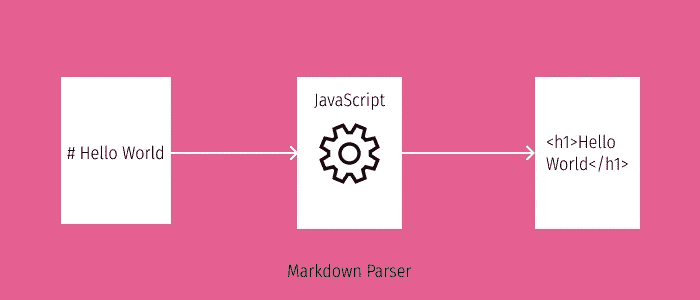

# 带有 JavaScript 和正则表达式的简单 Markdown 解析器

> 原文：<https://javascript.plainenglish.io/simple-markdown-parser-with-javascript-and-regular-expressions-f0c8d53449a4?source=collection_archive---------3----------------------->

## 在本文中，您将学习构建一个 Markdown 解析器，它可以用 JavaScript 和正则表达式编译成 HTML

Markdown 是一种类似 HTML 的标记语言。编写博客、自述文件和文档在开发人员中非常流行。一些支持富文本的流行网站，如 Reddit、GitHub、concept 等，允许你写 Markdown。我用 Markdown 把我的博客从 Markdown 文件转换成 HTML 网页。降价很简单，但非常强大。在这篇博客中，我将讲述如何构建一个简单的 Markdown 解析器，使用正则表达式用 JavaScript 将 Markdown 转换成 HTML。

Markdown Parser

# 降价文本看起来是什么样的

如果你打开一个 markdown 文件，你会看到下面的语法。

Markdown text example

从这张[降价备忘单](https://github.com/adam-p/markdown-here/wiki/Markdown-Cheatsheet)中了解更多信息。

# 正则表达式

正则表达式是一个字符序列，它帮助我们捕捉文本中的模式。我们可以用它来验证用户输入，查找和替换文本，是的，你猜对了，构建我们的 Markdown 解析器。😉

不同的语言有不同的方式来表示正则表达式。下面是 JavaScript 是如何实现的。

Markdown example in JavaScript

当我们到达那个部分时，我将解释我们在解析器中使用的模式。但是，如果你想了解更多关于正则表达式的内容，请访问 [https://javascript.info](https://javascript.info/regular-expressions) 。

# 降价分析器

我打算构建的 Markdown 解析器是一个将 Markdown 文本作为输入并返回 HTML 的函数。

Markdown parser function

这里，我们想在`markdownText`中找到某个模式，并执行替换操作。

# 字符串替换功能

我们的 Markdown 解析器很简单。它从作为`markdownText`参数传递给函数的 Markdown 字符串中捕获一个模式，并用某个 HTML 模式替换它。

下面是字符串替换函数的工作原理。

Working of replace function

*注意:这里的* ***i 标志表示不区分大小写*** *和* ***g 标志表示全局*** *，这意味着它匹配字符串上的所有模式，而不仅仅是第一个匹配。*

# 在正则表达式中捕获组

正则表达式允许我们捕获文本模式，并使用类似索引的东西引用它们。我们可以在替换操作中使用该索引。为了表示一个组，我们可以简单地用圆括号`()`把它括起来。

Capturing groups in Regular Expression

这里，我们将开始的 hello 存储在一个组中。然后，在我们的替换操作中，可以使用 **$1** 引用该组。

# 回到解析器

现在，我们想解析 Markdown 文本并用 HTML 替换它。

下面是我们将在解析器中使用的正则表达式及其解释。

**标题**
对于标题，我们需要一个以散列(es)开头的字符串，并捕获这些字符之后的所有内容。

RegEx for h3

这里第一个克拉`^`代表行开始，m 标志代表多行和通过做。*我们正在捕捉那里存在的一切(字母、数字、特殊字符)。

**Blockquote**
对于 Blockquote，我们想要一个以`>`开头的行，并捕获该字符之后的所有内容。

Blockquote RegEx

注意:\ >代表转义>字符。这意味着，不要把>当作特殊正则表达式字符的一部分，而是当作文本本身的一部分。

**加粗文本**
对于加粗文本，我们要捕捉两个星号之间的文本。

RegEx for Bold text

**斜体文本**
对于斜体文本，我们要捕捉一个星号之间的文本。

RegEx for Italics

**图像、链接和换行符**

RegEx for Image, Link and Line break

# 把所有的都组装起来

至此，您可能已经掌握了理解这些概念所需的所有背景知识。让我们把到目前为止我们所学的所有东西整合起来，构建解析器。

测试解析器的时间到了。

Testing the parser

应打印:

Output

我们的 Markdown 解析器现在已经完成。它没有涵盖 Markdown 支持的所有内容。尝试实现它们，并通过 twitter 与我分享解决方案。

*原载于*[*https://www . big omega . dev*](https://www.bigomega.dev/markdown-parser)*。*