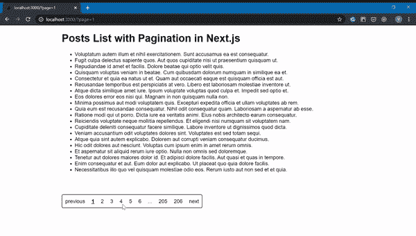

# 使用 react-paginate 在 Next.js 中进行简单分页

> 原文：<https://javascript.plainenglish.io/simple-pagination-in-next-js-using-react-paginate-562830c00279?source=collection_archive---------0----------------------->


Next.js 项目中分页的开发可能比较复杂。像 CRA 那样构建分页的常见方式在 Next.js 中不会是最好的选择，它不会是 SEO 友好的。

我将向您展示如何在 Next.js 项目中构建一个 SEO 友好分页的帖子列表。对于分页 UI，我将使用包 react-paginate。我将从[服务](https://gorest.co.in/)的 API 中获取测试数据

生成的项目如下所示:



Pagination Demo in Next.js Project

# 后端 API 的先决条件

要在 Next.js 中开发分页，您需要准备好后端 API。您的后端 API 响应应该提供项目、当前页面和页面项目的总数。理想情况下，你还需要有一个总页数。

带有分页的后端 API 的响应示例。

此外，您的后端需要支持获取某个页面的项目。例如`[https://api.yourapp.com/posts?page=3](https://api.yourapp.com/posts?page=3)`

# 项目设置

在下面的例子中，我使用了一个使用 create-next-app 创建的 next.js 项目。我安装了获取 API 的包`axios`和分页 UI 的包`react-paginate`。

您可以使用以下命令安装这些软件包

```
npm i axios react-paginate
```

项目的所有代码都包含在`pages/index.js`中

让我们仔细检查每一段代码。

# 抓取帖子

我们从通过 API 获取帖子开始。我们在一个`getIntialProps`钩子中获取它们，这个钩子在第一次运行和以后的导航中在服务器端触发。它在预呈现期间填充页面。在这个钩子中获取数据将使我们的页面 SEO 友好。

# 呈现帖子和分页

根据加载状态，我们呈现文本`Loading…`或帖子列表。

下面我使用包`react-paginate`中的组件 ReactPaginate。我们可以通过 props 配置为分页元素设置什么类名。项目的样式在 styles.scss 中全局定义。

页数和初始页面索引也是通过 props 设置的。`onPageChange` 接收一个分页处理函数，该函数在用户每次选择新页面时触发。

# 页面选择处理程序

当用户选择一个页面时，`pagginationHandler` 函数以所选的页面索引作为参数触发。

我们在`getIntialProps`中获取数据。而`getIntialProps` hook 在页面更改期间触发，并读取查询参数`page` 以从后端 API 获取特定数据。

因此，我们需要用一个新的查询参数`page` 来改变路由，该参数将包含一个页面索引来触发 posts 获取和组件重新呈现。

# 装载指示器

为了改善用户体验，我添加了一个加载指示器。

我们的帖子获取发生在页面更改期间，我们需要依靠路由器事件来切换加载状态。我创建了状态和两个函数来切换它。

然后在组件安装完成后，我设置了事件`routeChangeStart` 和`routeChangeComplete`的处理程序。

当组件被卸载时，我从这些事件中移除处理程序以避免内存泄漏。

就是这样。我希望这个例子能帮助您理解如何在 Next.js 项目中构建分页。

# 项目代码

[https://github.com/VladymyrPylypchatin/nextjs-pagination](https://github.com/VladymyrPylypchatin/nextjs-pagination)

**感谢阅读！:)**

我是自由软件工程师和网页开发者 Vova Pilipchatin。

如果你喜欢这篇文章，请关注我的 [**推特**](https://twitter.com/VPilipchatin) **。**

**你还可以在我的博客上找到更多帖子，分享我对** [**网络应用开发和启动 SaaS 项目**](https://vpilip.com/blog/) 的了解

## 用简单英语写的 JavaScript 的注释

我们总是有兴趣帮助推广高质量的内容。如果你有一篇文章想用简单的英语提交给 JavaScript，用你的中级用户名发邮件到[**submissions@javascriptinplainenglish.com**](mailto:submissions@javascriptinplainenglish.com)给我们，我们会把你添加为作者。

我们还推出了三种新的出版物！请关注我们的新出版物，表达对它们的爱:[**AI in Plain English**](https://medium.com/ai-in-plain-english)，[**UX in Plain English**](https://medium.com/ux-in-plain-english)，[**Python in Plain English**](https://medium.com/python-in-plain-english)**—谢谢，继续学习！**