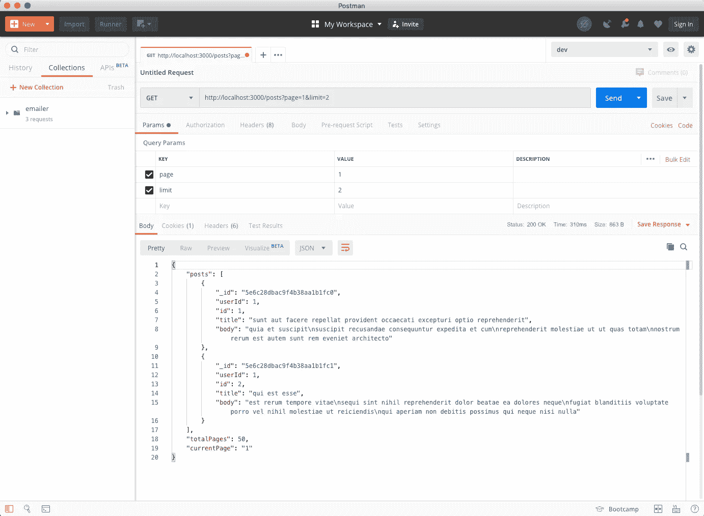

# 使用 Node.js、Express 和 Mongoose 进行简单分页

> 原文：<https://javascript.plainenglish.io/simple-pagination-with-node-js-mongoose-and-express-4942af479ab2?source=collection_archive---------0----------------------->

Photo by [Alexander Sinn](https://unsplash.com/@swimstaralex?utm_source=medium&utm_medium=referral) on [Unsplash](https://unsplash.com?utm_source=medium&utm_medium=referral)

# 用分页保持简单

您是否希望限制每次请求从 MongoDB 返回的文档数量？我们以前都看过，分页拯救！实现分页有很多方法，但我将向您展示最简单的方法(在我看来)来完成它。

这种方法允许客户端在请求中提供两个查询参数:**页面**和**限制**。页面是指您正在请求的当前页面。限制是您希望检索的文档数量。

# 我们开始吧

现在，我假设您已经掌握了使用 Node.js、Express 和 Mongoose 的基本知识。下面，我们有一个简单的 express 服务器运行在端口 3000 上，使用 mongoose 连接。我们还导入了一个猫鼬模型**帖子**，这样我们就可以在路由处理器中使用它。

在上面的代码中，当我们向“/posts”发出 GET 请求时，我们将检索集合中的所有文档。让我们修改路由以合并分页。

我们来分解一下。当对“/post”路由发出请求时，我们将从请求查询中析构**页面**和**限制**。如果没有提供默认值，我们也会为它们提供默认值。如果提供了它们，它们将覆盖默认值。

现在，让我们看看 mongoose 查询。Limit 是我们要检索的文档数。Skip 是我们在检索文档之前希望跳过的文档数量。对于 skip，我们取**页**减去 1，然后乘以**极限**。在第 10 行，我们获取全部文档并将其存储在变量 **count** 中，这样我们就可以通过将计数除以限制来计算总页数。最后，我们返回文章、总页数和当前页面。我们将所有东西包装在一个 try/catch 中，以捕捉任何异常。

# 测试我们的简单分页解决方案

为了测试我们的简单分页解决方案，让我们使用 Postman 向“/posts”发出 GET 请求，将查询参数 **page** 设置为 1，将 **limit** 设置为 2。

维奥拉。你有它！我们现在不是检索所有文档，而是检索第 1 页，共 50 页，限制为 2 页。

# 结论

我想再次强调，实现分页的方法不止一种。如果您是使用分页的新手，我发现这是最简单的解决方案。在不久的将来，我将介绍游标分页，它为特定的记录提供了惟一的标识，并且在处理非常大的数据集时性能更好。我希望这篇文章对您有所帮助，并且您能够将它应用到您正在从事的任何项目中。

我在业余时间写这些文章是为了娱乐。如果你喜欢这篇文章，请在下面留下你的喜欢和评论！可以关注我上 [*中*](https://medium.com/@this.kevinluu) *和* [*推特*](https://twitter.com/kluu_10) *。感谢支持！*