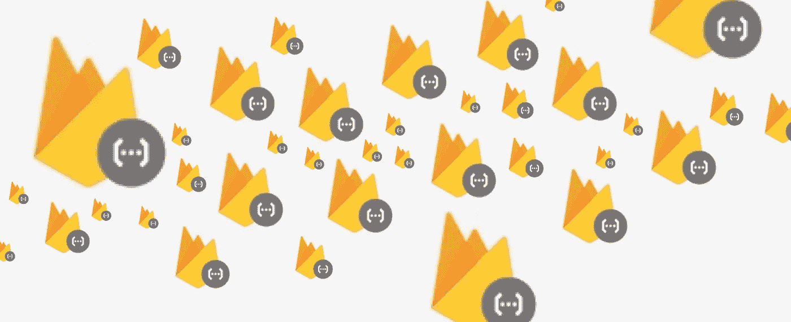
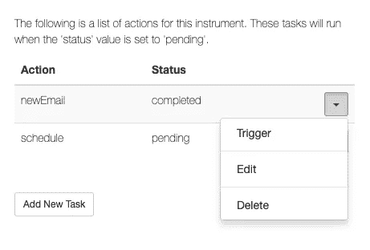
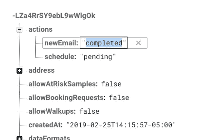

# 通过 Firebase 函数实现简单的任务和队列解决方案

> 原文：<https://javascript.plainenglish.io/simple-queue-via-firebase-functions-4a69ca6e33a9?source=collection_archive---------1----------------------->

使用具有简单模式模式的 Firebase 函数可以使常见任务的排队解决方案对于大量常见应用程序任务来说非常容易；S3 存储、图像大小调整、Slack & Twilio 消息和 Hubspot 联系人同步。

根据最近的统计，在我们的生产[meen ta . io](https://meenta.io)[firebase](https://firebase.google.com)应用程序中运行着超过 120 个不同的 Firebase 函数。这些功能可以完成各种任务，从调整图像大小、跨路径更新数据、向 HubSpot 和 Slack 发送电子邮件和推送消息。

管理这种不断增长的功能让我们学到了许多关于如何思考和扩展微服务使用的经验教训。首先，我们的每个功能都是一个微服务，有自己的范围、依赖关系和工作。第二，我们希望将任务从 UI 中分离出来，并相互分离。发送电子邮件、消息传递松弛以及为给定订单设置 S3 存储桶不需要有任何相互依赖性。

# 服务和共享资源

我们确实有一套共享服务，允许我们集中访问配置变量；SendGrid、S3、Hubspot 等。

我们(目前)没有使用任何 ODM 来允许我们跨函数共享类或方法。Mongoose for MongoDB 是这种 ODM 特性如何帮助模式管理、钩子、模式和方法的一个很好的例子。但是在 firebase functions 环境中，这种方法对于我们的需求来说太沉重了，并且会导致复杂和交织的代码库。

我们开发的模式之一是“行动”的概念。当 firebase 中的给定路径被创建时，我们发现触发器需要是离散的和可重用的。例如，当一个新订单被创建时，我们需要做许多工作；*将用户账户链接到订单，通过 SendGrid 发送收据电子邮件，通知 Slack 频道我们有订单，更新用户的订单计数，并向 Twilio 的可编程聊天推送欢迎消息。*

在单个代码块中完成所有这些工作会导致问题。如果这些外部服务中的一个没有响应，那么我们就会被需要重新运行的任务所困扰。发送重复的电子邮件或消息不是一个好的用户体验。而且 firebase 日志很复杂，难以阅读，回调路径也很复杂。

# 我们的解决方案

我们的解决方案是使用 firebase 函数和数据库触发器构建一个简单的任务系统。所以现在我们用一个`actions`元素来设置我们的 firebase 路径。该元素包含键值，键值作为动作，值作为状态。

使用这种方法，我们创建函数来观察`actions`元素中的特定值。键名告诉我们所需的操作(时差、电子邮件、短信等)，值告诉我们该操作的状态(挂起、失败或已完成)。当一个功能运行时，它只需要执行它的特定任务(电子邮件、时差、s3 等)，然后它需要设置它的状态消息；已完成”、“失败”或“挂起”。当`failed`或`completed.`时，该代码将停止执行

*   /invite/{ id }/actions/**twi lio**/待定
*   /invite/{ id }/actions/**电子邮件**/待定
*   /invite/{ id }/actions/**hub spot**/待定

# 赞成的意见

**独立** —任务状态、数据库触发、任务数据都位于同一位置/路径。使用“parent.parent”允许函数的代码沿着参考线向上走，得到它需要的数据。这意味着该函数不需要从其他路径获取数据，这使得代码更容易管理，回调更少。

**较小的工作块** —这种模式有助于我们的团队理解给定特征或数据块的状态变化。它使单个代码块更小，更易于代码检查和重用。

**可扩展** —该功能如预期使用 firebases 函数和数据库触发器。谷歌提供了一系列监控任务、报告和跟踪执行时间的工具。

> 我们系统中没有任何任务是相互依赖的。每一个都是独立的工作块，有自己的报告系统、内存和逻辑。

# **缺点**

**动作在路径中**——动作对象位于路径中，这意味着它与所有请求一起被发送下去。所以用户界面会看到这些数据。由于操作位于路径内，并且我们知道它是可见的，所以我们不存储任何历史或堆栈跟踪信息。我们必须深入研究日志，了解特定任务失败的原因。

**调度**——当我们需要在一天中的给定时间或在给定的时间间隔触发给定的动作时，这种方法不是很好。有一些项目引入了 CRON 特性，但是我们避免使用它们，因为这意味着我们将函数用于长期运行的活动。

# 操作的管理用户界面

我们已经围绕这个模式构建了我们的管理用户界面。由于`actions`是人类可读的，并且是实体数据本身的一部分，我们的用户界面能够在上下文中显示动作。当我们进入管理用户界面来管理一个新的订单或用户帐户时，用户界面代码具有显示每个操作的状态和提供 CRUD 特性所需的信息。这种方法意味着管理员用户不需要监控或管理单独的系统，并且系统管理变得自我记录。

我们已经设置了 UI (Angularjs ),允许我们放入 UI 元素来列出和管理在`ref/actions.` 中发现的任何内容。如果其中一个任务失败，我们会通过 Google monitoring services 得到通知，我们可以提取 firebase 日志并调试问题，或者通过将值设置为`pending`来简单地触发操作再次运行。

Screenshot for our invite admin UI.

我们考虑过添加错误消息等，但随着时间的推移，我们发现我们监视我们的功能，所以真的不需要在数据库中存档失败状态。

此外，由于我们将`actions`元素绑定到一个 [Angularfire 数组](https://github.com/firebase/angularfire/blob/master/docs/reference.md#firebasearray)，UI 会随着任务的执行而更新。

在特性开发过程中，我们发现从 Firebase 数据库控制台触发单独的操作很有帮助。

# **安全顾虑**

值得注意的是，数据库规则需要配置为强制用户权限，因此只有选定的用户可以编辑键/值和触发功能。我们还将所有堆栈信息保留在 UI 之外，因为日志消息和堆栈信息可能会造成问题。

# 总结

基本上，这只是任务/排队解决方案，它使用数据库触发器的能力，不需要设置和管理 CRON 作业、工作进程和重试参数。是可怜的芒 [AWS SQS 服务](https://aws.amazon.com/sqs/)。我们所有的代码都在 git repo 中管理。每个功能都是轻量级的，我们可以在本地测试这些功能，在功能的基础上部署到不同的 firebase 应用程序。

# 下一个:函数组

Google 和 firebase 团队已经为管理功能添加了越来越多的 CLI 选项。我们已经开始将我们的功能分组，这样我们就可以部署更小的代码块。此外，我们发现我们喜欢将函数组织到文件夹中，文件夹名反映了数据库路径的根。

例如:`/userInvites/{uid}/{id}/actions/email => {…}`存储在/functions/user invites/onWrite . js 中，它告诉我们`ref`和数据库事件(on write、onDelete 等)。当数据库触发器被更深地绑定到对象中时，我们添加文件名的路径；这有助于我们从文件夹或文件名中读取映射。