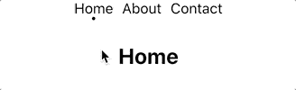

# 简单反应路由器导航条

> 原文：<https://javascript.plainenglish.io/simple-react-router-nav-bar-17167beeb742?source=collection_archive---------3----------------------->

[*阅读本*](https://www.blog.karenying.com/posts/nav-bar-with-dots) *在*[*【blog.karenying.com】*](https://blog.karenying.com/)*的黑暗模式下。*


我最喜欢的东西之一是简单的 UI 状态指示器。我的个人[网站](https://karenying.com/)上的导航条利用链接下的圆点来传达悬停和活动状态。它简约而有效:


*Miss me with the dark blue/purple visited links 🤮*

在本教程中，我们将介绍如何编写这个导航条。

# 履行

## 先决条件

本教程假设您对 JavaScript 和 React 有所了解。一切都好吗？我们开始吧👍🏼

# 0.入门指南

我们将使用 [Create React App](https://create-react-app.dev/docs/getting-started/) 来创建、捆绑和运行项目:

```
$ npx create-react-app nav-bar-dot
$ cd nav-bar-dot
$ npm start
```

# 1.添加页面

让我们添加三个页面:主页、关于和联系人。我们将保持简单，只呈现每个的标题:

# 2.路由页面

现在我们需要路由它们。我们将使用 [React 路由器 Dom](https://reactrouter.com/web/guides/quick-start) :

```
npm install react-router-dom
```

根据快速入门教程，我们将所有的`Route`包装在一个`Router`组件中。我们将把根 URL 和`/home`路由到`Home`组件。

如果我们运行应用程序，并手动访问[http://localhost:3000/about](http://localhost:3000/about)，我们应该会看到 About 页面。

# 3.正在创建导航栏

然后我们创建一个名为`Header.js`的新文件，并在其中创建一个名为`HeaderLink`的新组件。每个`HeaderLink`将路由到它所传递的页面:

这里我们用 React 路由器的`Link` [组件](https://reactrouter.com/web/api/Link)。`to`属性接受一个路径字符串。在我们的例子中，它将是`'home'`、`'about'`或`'contact'`。

现在，我们将创建名为`Header`的父组件，它将调用所有页面的`HeaderLink`:

如果我们把我们的`HeaderLink`组件放到`App.js`中，我们应该会看到一个超级简单的导航条，它像预期的那样工作:


*Bare bones nav bar*

让我们来设计一下:

我们应该有更好的东西:


*Slightly styled nav bar*

耶，我们刚刚创建了一个功能齐全的导航条。现在我们可以进入有趣的部分了:添加一个悬停和选中状态。

# 4.添加悬停/选定指示器

为了知道用户当前正在访问哪个页面，我们使用 route params。

为了呈现`Header`组件，我们没有设置固定的路径，而是将我们的`page` param(变量名)附加到一个冒号上。这让 React Router 知道`page`是路径的变量名。

我们将这个新的`Route`添加到`App.js`中:

为了在我们的`Header`组件中获取这个`page`变量，我们使用了`useParams` [钩子](https://reactrouter.com/web/api/Hooks/useparams)。

`useParams().page`将返回我们的`page`变量的值，也是根 URL 后面的 slug。有了这些信息，我们可以将一个`selected`道具传递给`HeaderLink`:

以便`HeaderLink`知道其链接是否被选择。

我们目前有一个小问题。如果我们访问根 URL(通常是 [http://localhost:3000](http://localhost:3000/) )，导航条不会显示。为什么？因为`page`为空，所以`path={'/:page'}`不适用。

我们可以通过硬编码`Header`来显示根路径来捕捉它:

由于在这种情况下`useParams()`不会返回任何内容，我们必须调整`Header.js`中的`page`变量，使其默认为`'home'`:

太好了，有了这些，我们终于可以设计我们的悬停和选择状态了！

让我们给我们的`HeaderLink`组件添加一些 CSS 类:

以及它们各自的属性:

这个 CSS 允许圆点在`headerlink-title`悬停时显示出来。`.headerlink-dot`的`transition`属性让外观看起来更平滑。

如果我们使用新样式的导航条，我们应该会看到这个:



它看起来如此漂亮和光滑😊

最后一个细节:我们不希望当前选中页面的`cursor: pointer`或`HeaderLink`发生任何点击事件。

我们可以通过添加另一个类来轻松解决这个问题:

我们正式结束了🎉

# 结论

在本教程中，我们学习了如何用 React 路由器设置导航条。然后我们添加了一个悬停/活动状态作为对用户的视觉反馈。

如果你在路上迷路了，看看我的 GitHub [repo](https://github.com/karenying/nav-bar-with-dots) 。你也可以在这里看到现场版的。

如果你决定用 [Netlify](https://www.netlify.com/) 部署你的 React 应用，在这里阅读关于在 Netlify 上启用重定向来修复 spa 的客户端路由[。](https://www.blog.karenying.com/posts/404-react-page-not-found)

感谢阅读。黑客快乐！