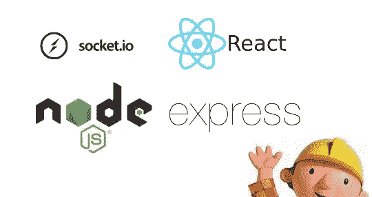
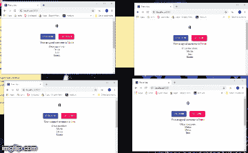

# 如何在 React 中构建实时聊天应用程序(使用 node、socket.io 和 express)

> 原文：<https://javascript.plainenglish.io/simple-real-time-web-socket-app-using-node-express-socket-io-react-da73a2685b6a?source=collection_archive---------3----------------------->



“what will we use to build our app”

## 你有没有想过有些网站怎么这么快就给你实时更新？

脸书的 Messenger 会在消息发出后立即发送，你甚至可以通过慢速网络接收这些消息。问题的答案很简单。**网络套接字**。

这篇文章将教你如何在真实的应用程序中使用 web sockets。这篇文章不会教你网络套接字是如何工作的，但是如果你对此感兴趣，你可以在这里[阅读更多。](https://www.tutorialspoint.com/html5/html5_websocket.htm)

在我们的演示中，服务器将处理连接并为每个连接分配一个用户名。这些连接共享一个“锅”。如果有人投入，彩池的价值就会增加，如果有人点击“获得一个”按钮，彩池的价值就会减少。如果有人参与或有人得到一个通知，每个有联系的人都会得到通知！通知是实时的，并且底池的值也会更新。你可以在这里找到完成的源代码。

完成后的应用程序看起来会像下面的 GIF。



“what will we build”

*你可以点击* [*这里*](https://jvkv22w5mv.codesandbox.io/) *查看这个演示的现场版。*

*提示:确保打开两个或更多具有相同链接的浏览器，以查看应用程序如何实时更新。*

# 从🕹️开始

我们将使用 create-react-app 来搭建我们的应用程序。让我们通过在命令行中键入以下命令来实现这一点:

```
create-react-app websockets_app
```

让我们先快速清理一下。删除 src 文件夹中的以下文件:

```
App.css
App.test.js
index.css
logo.svg
```

然后，将 **App.js** 的内容修改为:

然后，从 **index.js:** 中删除这一行代码

```
import './index.css';
```

现在，我们的 React 应用程序已经启动并运行。我们可以开始按照自己的意愿修改它。

让我们安装一些我们的应用程序将使用的依赖项。在命令行中键入以下内容。

```
npm install --save @material-ui/core chance concurrently cors express nodemon redux socket.io socket.io-client react-reduxnpm
```

然后，将 **App.js** 的内容改为如下。我不会深入描述 UI 代码，因为本文主要关注堆栈的 web socket 部分。

然后，我们要配置 **index.js** 文件。这里是我们设置套接字客户端和 redux 存储的地方。将其更改为如下所示:

现在，我们创建我们的减速器。这将处理我们的 redux 操作，并管理我们的客户端应用程序的整体状态。

现在，我们将配置客户端的 web 套接字。这是让我们的应用程序与服务器进行双向数据流的代码。(这就是神奇的地方)。

因此，继续创建一个新文件， **socket.js** ，并将以下内容放入其中:

现在，一切沉重的东西都不碍事了。我们只打算添加一些辅助代码，让我们的 web 应用程序有一种更加用户友好的感觉。

首先让我们添加 **usernames.js** ，它给每个客户一个唯一的用户名。

最后，小吃店通知将让我们的用户看到，如果有人“投入”或“得到一个”从锅外。

# 是时候修复服务器了🔧

我们只有一个文件来处理我们的服务器端 web 套接字。

继续在我们的根目录下创建一个 **server.js** :

最后，我们将同时使用，这样我们就不必分别启动后端和前端。转到您的 **package.json** 文件，在“scripts”键下将“start”更改为以下内容:

```
"start": "concurrently \"react-scripts start\" \"node server.js\""
```

保存文件，然后输入`npm start`，我们就可以开始了！转到您的浏览器，键入指定的本地主机，然后开始使用您的新 web socket 实时 web 应用程序！

# 最后💭

Web sockets 是一个非常强大的工具，能够为 Web 的客户端和服务器端实现快速可靠的实时数据交换。这篇文章就是为了展示这一点而创作的。我希望这篇文章能让您更好地理解 web 套接字的概念，以及如何将其与当前的 JavaScript 库集成。

如果您有任何问题，欢迎在此回复或发电子邮件至[jelorivera08@gmail.com](http://jelorivera08@gmail.com)联系我。干杯！