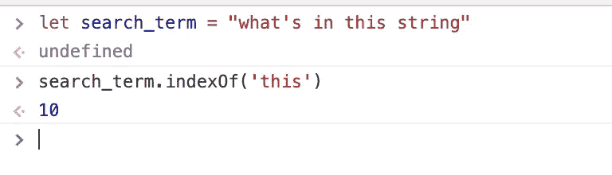
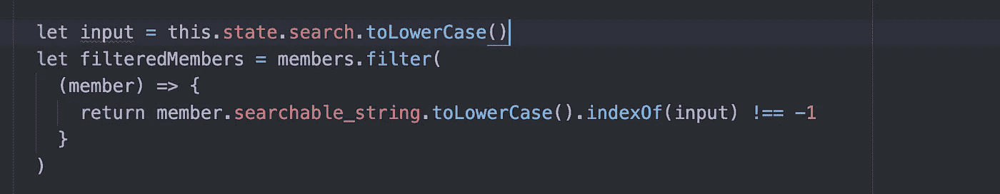
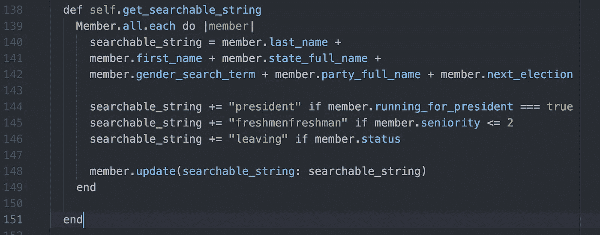
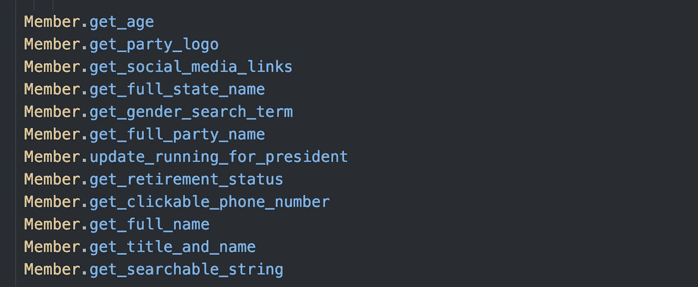
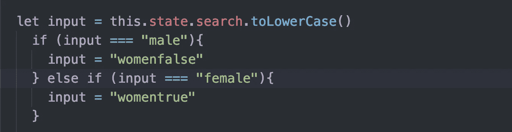
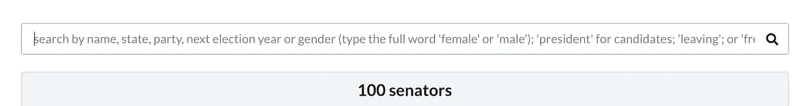
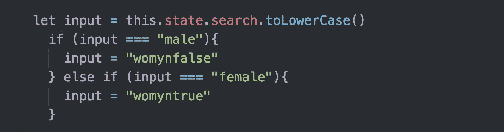
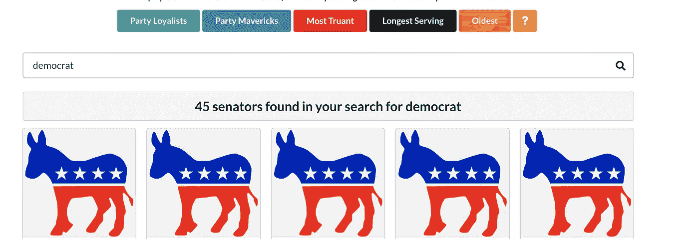
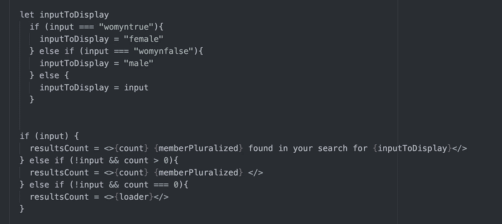
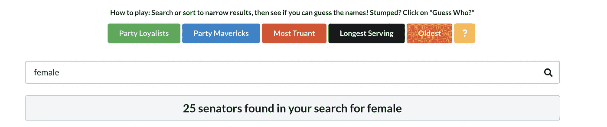

# React on Rails 的简单搜索栏

> 原文：<https://javascript.plainenglish.io/simple-search-bar-for-react-on-rails-6935c8bb8f?source=collection_archive---------3----------------------->

*filter() + indexOf() +为数据库中的每条记录定制搜索字符串的艺术*

你见过那些实时过滤搜索吗，你开始时有一个很长的列表，随着你在搜索栏中键入每个字符，它变得越来越短？

这就是我想建立的[国会名人录应用程序。](https://congress-front-end.herokuapp.com/)我想让用户从一个列表开始，比如说，所有 100 名参议员，然后输入姓名、州或许多其他属性中的任何一个，如性别、州以及他们是否正在竞选总统。

但是这个想法让我有点不舒服。我想象了很多很多“如果”语句，就像这样:

```
let results = []if (member.name) === input {
  results.push(member)
} else if (member.gender === input) {
  results.push(member 
} else if //.... //etc
```

如果有更好的方法，通常是有的。JavaScript 的过滤方法明显减少了痛苦。

```
let filteredMembers = members.filter(
      (member) => {
        return member.name === input || member.gender === input || member.chamber === input || member.status === input || member.running_for_president === input //gasp ....//etc }
    )
```

这更短，但是仍然很难操作，特别是因为在我的例子中，成员有很多很多属性，所以上面可能会变成一条漫长而曲折的道路。


它不会按照我想要的方式运行。上面的代码检查精确匹配。如果输入正好等于成员的姓氏或州名，它将返回这些成员。因此，如果我要寻找来自宾夕法尼亚州的候选人，输入“Pennsylvani”将一无所获。

# 让我们退后一步…

我需要备份并将问题分解成更小的问题，而不是直接钻研代码。为了构建我的搜索功能，我需要两样东西:

1.  要搜索的内容
2.  查看用户输入是否在要搜索的内容中的方法。

通常我会尝试按顺序解决问题，但这种方法有局限性。确定第一步的格式会限制我对第二步的选择。例如，我的第一反应是在数据库中搜索成员属性。这使我产生了精确搜索的想法，即当用户的输入与成员属性完全匹配时返回结果。

但是如果我先考虑第二步呢？

# 索引 Of()

在 JavaScript 中，可以使用 [indexOf()](https://www.geeksforgeeks.org/javascript-string-prototype-indexof-function/) 搜索字符串。下面是语法:

```
**str.indexOf(searchValue , index)**
```

其中 searchValue 是要搜索的内容，index(可选的第二个参数)是要开始搜索的索引。如果将其留空，则从字符串的开头开始搜索。



‘this’ is at the 10th index of the string

如果用户的输入不在 search_term 中，该方法将返回`-1`

所以如果`search_term.indexOf(input) != -1`

这意味着您的搜索词包含了输入。


found!

所以现在我有了一个很棒的搜索功能:



don’t forget to force both the search term and the string you are searching to the same (in my case, lower) case!

在上面的代码中，输入是用户在搜索栏中键入的内容；筛选的成员是其搜索词包含输入的所有成员。

现在我所需要的就是寻找一些东西。

*注:关于如何使用 indexOf()在 React 中构建搜索栏，请参见这个优秀的* [*关卡升级教程视频*](https://www.youtube.com/watch?v=BvtQMxekmH0) *。请继续阅读，了解如何定制自己的搜索字符串…*

# 如何为数据库中的每条记录(您想要搜索的)创建一个自定义的可搜索字符串

好吧，那么这个神奇的搜索字符串是从哪里来的，我该如何为每个国会议员创建一个呢？

我的成员有很多特质。我所要做的就是找出我想要搜索的属性(是的，按名称搜索；不，不要用身份证号搜索…等等)。这是我想到的:



让我们打开它。在上面的代码中，我遍历每个成员，获取我想要搜索的每个属性，并将其连接成一个名为`searchable_string`的长搜索字符串。

并不是所有我想搜索的东西都是属性。一些(见第 144-146 行)是我的模型上定制方法的结果。例如，如果我的方法 running_for_president 为该成员返回 true，我将“president”添加到字符串中。顺便说一下，方法如下:


正如我对其他定制模型方法所做的那样，我在种子文件的底部调用了 Member.get_searchable_string(以及其他许多定制模型方法)…



下面是我重新植入数据库后的 searchable_string 的样子(这个字符串还不包括性别搜索词；这是下一个)。

`searchable_string: “GillibrandKirstenNew YorkDemocrat2024`

我的新搜索功能非常好用！例如，键入搜索词“Democ”的一部分而不是“Democrat ”,会返回所有民主党人。

# 男人和女人的问题

酪(总有但是)。很难确定在我的性别字符串中添加什么搜索词。起初，我用“男人”和“女人”这两个词。

我搜索“women”返回的是女性成员。但是我搜索“男人”会返回所有的成员。你能看出为什么吗？


‘男人’这个词是‘女人’这个词的子串！(更不用说‘men’是很多单词的子串，也可能包含在成员的名字中，等等。)

令人惊讶的是(我一定是缺少咖啡)，我试图用一个稍微长一点的搜索词来解决这个问题:“男性”和“女性”(双 d'oh — —同样的问题……)。

我最终妥协了。对于性别搜索词，我添加了一个精确的搜索要求:



然后，在前端，我将这些术语更改为“womenfalse”和“womentrue”。(我希望性别术语长且独特，即不太可能包含在成员的姓名或州名中，等等。)

在后端，我用新的术语更新了我的性别搜索方法:


记住，我的可搜索字符串还包括 gender_search_term。

我还修改了搜索栏中的说明:



# 谁听从指示？

不幸的是，用户并不总是按照指示去做。任何搜索“女性”的人最终都会找到所有成员，因为所有搜索字符串都包括“女性”或“女性入口”。他们很可能会得出结论，我的应用程序按性别搜索的功能被破坏了，而不是重新阅读说明书。

所以我再次更改了搜索词，这次是“womyn false”或“womyn true”(想想看，“wom3n”和“m3n”会更好，因为它们都更短、更独特)。

这样，搜索词“女人”将不会返回任何东西，这将有望激励读者重新阅读说明书。



# **展示什么？**

然后我注意到一个..呃…小问题。因为我已经设置了我的搜索栏，上面有一个包含结果数量和实际搜索词的结果横幅:



与此同时，对女性的搜索又回来了:

# 25 名参议员在你寻找女人的过程中被发现

这并不是我希望我的用户看到的，因为“womyn”经常被用作一个政治术语，并且我的网站是无党派的。所以我添加了一些逻辑来改变基于输入显示的内容:



奏效了。



[您可以在这里看到正在运行的应用。](https://congress-front-end.herokuapp.com/senate)

谢谢你的阅读！这里有一个链接到[我的在线文件夹](https://joan-s-portfolio.firebaseapp.com/projects)以防你好奇或者你想雇佣我！！！

版权所有琼·印第安纳·琳斯 2019