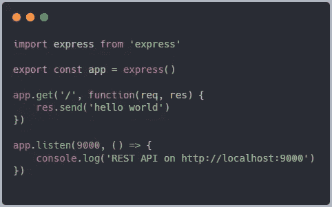
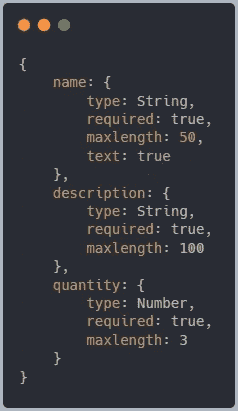
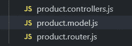

# 使用 Node.js 和 React 的简单商店应用程序

> 原文：<https://javascript.plainenglish.io/simple-shop-app-using-node-js-and-react-d7b4f50e26c?source=collection_archive---------2----------------------->


Photo by [Mr.Autthaporn Pradidpong](https://unsplash.com/@autthaporn?utm_source=medium&utm_medium=referral) on [Unsplash](https://unsplash.com?utm_source=medium&utm_medium=referral)

我做前端开发已经快 6 年了，在这段时间里，我意识到对一个项目的后端和前端都有一个清晰的印象将有助于对它有一个整体的理解。几个月前，我决定学习一些后端技能，主要是因为我想成为一名更独立的开发人员，并对我可能参与的任何项目的业务逻辑有更好的理解。

我从 Scott Moss 主持的一个关于 frontendmasters 的课程开始，在这个课程中，他详细解释了如何使用 Express(一个 Node.js 框架)创建一个简单且可测试的 API，以及一些最佳实践，还有一些特定的技术，比如 jwt 和 Mongo。

[](https://frontendmasters.com/courses/api-design-nodejs-v3/) [## 学习用 Express 和 MongoDB 在 Node.js - Model 数据和 REST APIs 中构建 API

### 使用 Express 在 Node.js 中构建一个 REST API——处理 REST API 动词方法来创建、读取、更新和删除资源…

frontendmasters.com](https://frontendmasters.com/courses/api-design-nodejs-v3/) 

我将解释一些初始步骤，并更深入地研究对我来说也是新的东西。

为了创建一个节点应用程序，我们将创建一个新文件夹，并在终端中为该文件夹运行`npm init`,并按照初始步骤进行设置。

完成这些步骤后，创建一个名为`index.js`的新文件，我们将在其中编写代码。使用 Express 启动一个简单的应用程序只需:



Express `Hello World` app

假设我们想要创建一个 API，让我们对数据库中的一些产品执行所有 CRUD 操作，就像一个在线商店一样。

从体系结构的角度来看，我们可以将其分为三个主要的资源类别或类型:

*   模型——实体在数据库中的形式
*   控制器——这里我们定义了可以在数据库中的实体上执行的不同操作
*   路由器—将每条路由与适当的控制器相关联

# **数据库**

对于数据库，我使用了 MongoDB 和 mongoose，因为它很容易与 Node 集成。

如果这是您第一次听到这个，您只需要知道 MongoDB 是一个无模式的 NoSQL 数据库，这意味着您可以在其中存储 JSON 实体，并且这些实体的结构可以变化，因为它不像 SQL 数据库那样是强制的。

更简单地说，如果 SQL 数据看起来像带有 id 的表，并定义了它们之间的关系，那么在 NoSQL 中，它看起来就像这样:



因为 MongoDB 不强制数据的结构，所以我们使用 mongoose，它提供了一个“模式”，这是一个数据结构或形状。为了进一步参考，你可以阅读这篇[文章](https://www.freecodecamp.org/news/introduction-to-mongoose-for-mongodb-d2a7aa593c57/#:~:text=Mongoose%20is%20an%20Object%20Data,of%20those%20objects%20in%20MongoDB.&text=MongoDB%20is%20a%20schema%2Dless%20NoSQL%20document%20database.)，或者只是阅读 mongoose 的文档。

为了将我们的应用程序连接到数据库，我

在我们的例子中，我创建了一个新文件夹`src/resources/product`并在其中添加了 3 个文件。



为了了解每个文件的作用，在文件的命名中添加了解释(控制器、型号、路由器)。

该产品的模式创建如下:

Product model

`timestamps`选项告诉 mongoose 将`createdAt`和`updatedAt`字段分配给模式。

# 控制器

好了，现在我们已经定义了我们想要的产品外观，我们可以继续实现 API 的 CRUD 操作。

[https://gist . github . com/Raduuu/66 d22d 1 a 821 EC 6 e 77 c 6 AC 203 e 2 EDA 359](https://gist.github.com/Raduuu/66d22d1a821ec6e77c6ac203e2eda359)

我从课程中学到的一些非常有用的东西是用这些 CRUD 函数创建一个通用文件，可以用在我们应用程序中的任何模型上，基本上，正如你在上面看到的，每个函数接收一个`model`参数并返回一个新的异步函数，该函数接收来自客户端的请求和将作为参数发送给客户端的响应对象。

在我们的`product.controllers.js`文件中，我们可以这样使用上面的文件:

```
import { crudControllers } from './crud'import { Product } from './product.model'export default crudControllers(Product)
```

您可以在这里看到我们导出了`crudControllers(Product)`，这意味着我们从`crud.js`文件中导出了每个函数返回的函数。

# 路由器

正如我们已经知道的，每个控制器都应该绑定到一个路径，客户端可以用它来请求数据。

Express 有自己的路由器组件，我们可以使用它来完成这项工作。

Router.js

但我们还没有完成，我们仍然需要连接到数据库，并告诉我们的应用程序使用`/product` url 上的产品路由器。

因此，在我们的 index.js 中，我们需要连接到数据库，并将我们的路线绑定到我们的控制器。

如果你想知道 morgan 包是什么，根据 npm 的定义，它是 node.js 的 HTTP 请求记录器中间件，这意味着如果我们终端中的日志使用它会看起来更漂亮，成功时它们会是绿色的，错误时是红色的。

这只是展示如何创建一个小的工作 API 的一部分。

在下一篇文章中，我们将看看如何保护我们的 API，我们将创建更多的端点，我们将添加一个认证模块，我们还将看到如何使用 jwt 令牌来保护我们的应用程序。