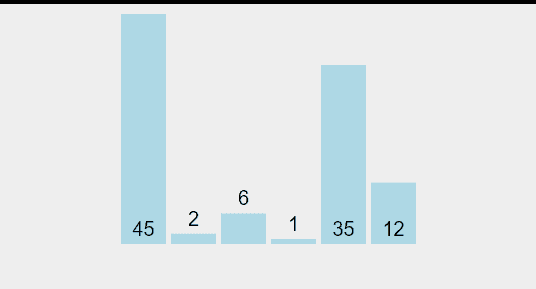
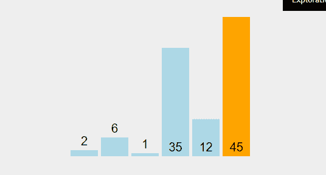
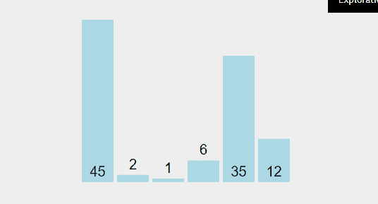
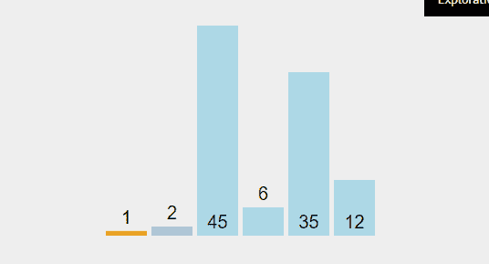
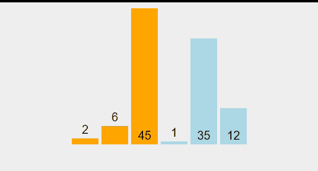

# JavaScript 中的简单排序算法

> 原文：<https://javascript.plainenglish.io/simple-sorting-algorithms-in-javascript-57d512ceaf5d?source=collection_archive---------2----------------------->

## 冒泡、选择和插入排序

排序是程序员在处理数据时最常遇到的问题之一。在这篇博客中，我们将回顾一些简单的排序算法，每个程序员都应该掌握。所有这些都被认为是简单的，因为它们都具有较慢的时间复杂度 O(n)。如果你不确定什么是大 O，看看我写的这个[博客](https://medium.com/swlh/small-math-to-big-o-901a90998871)。

我还推荐书签 [TopTal 的排序算法动画](https://www.toptal.com/developers/sorting-algorithms)或 [Visualgo 的排序部分](https://visualgo.net/en/sorting?slide=1)来帮助你在阅读这篇博客时以及在你的整个编程生涯中可视化这些算法。程序员最好的朋友是互联网！

# 交换助手方法

所有这些算法都涉及交换数组中的元素。为了更好地理解算法是如何工作的，我们将抽象出一个叫做“swap”的可重用函数。“Swap”接受一个数组，以及要交换的数组的两个索引。以下是 JS 和 Ruby 中的实现:

Swap function in JavaScript

# 冒泡排序

每个简单的排序算法都是从**定义一个被排序的部分**开始，然后**从那个被排序的部分**向外移动。冒泡排序从查找数组中的最大值开始，并将其移动到最后一个元素——排序部分。然后重复，直到排序后的部分封装了整个数组。

Bubble Sort First Pass

上面我们看到了冒泡排序是如何得名的——它通过不断比较两个元素并交换它们，将最高的元素冒泡到顶部。当上面 GIF 中的数字变成橙色时，它被视为“已排序”，排序从开始处重新开始。然后继续这个过程，直到整个数组排序完毕。

Bubble Sort Next Pass

在我下面的实现中，我跟踪两个变量 currentIndex(排序比较的内容)和 endIndex(已经排序的部分)。

JavaScript Implementation of Bubble Sort

# **选择排序**

选择排序基本上与冒泡排序相反。排序不是找到最大的元素并将其冒泡到顶部，而是找到数组中最小的**元素并将其移动到数组的开头- **新排序的部分**。然后重复，直到排序后的部分包含整个数组。**

Selection Sort First Pass

选择排序之所以得名，是因为它遍历了整个数组，而*选择了*最底层的元素，只有在遍历完整个数组后才交换它。

Selection Sort Next 2 Passes

在下面的实现中，我这次跟踪了 3 个变量——最小的元素、我要比较的当前元素和排序部分的开始。

Selection Sort in JavaScript

# **插入排序**

最后，我们得出插入排序。插入排序与我们讨论过的前两种排序略有不同，它不首先查找最高或最低的数字——它将数组中的第一个数字视为已排序，并且**相应地将**数字插入排序中。

Insertion Sort First 3 Passes

在上面的 GIF 中，我们看到这种交换有点不同——我们用它们的下一个索引交换元素，为我们正在比较的当前值腾出空间——以便找到正确的位置*插入*它。

Insertion Sort 4th Pass

在实现中，我们希望跟踪三个变量——我们正在排序的部分的 beginningIndex、我们正在检查的 currentIndex 和我们正在比较的 currentVal。

Insertion Sort JS

请记住，这些排序算法在最坏的情况下都有 O(n)的时间复杂度，所以如果处理大量未排序的数据，它们可能会非常慢。然而，这些算法充其量只能达到 O(n ),所以如果您有一组几乎已经排序的数据，这些实现中的任何一个都应该可以快速运行。如果你想看看用 for 循环编写的这些种类的替代版本，请查看这个[要点](https://gist.github.com/Giagnus64/a1276f8b885221eedd05b79306536588)。如果你想看用 Ruby 写的这些排序，看看这个[要点](https://gist.github.com/Giagnus64/d1909852e74a6df31a66d8e54655d319)。

 [## 简化你对大 O 符号和算法复杂性的理解

### 这里有一个解释算法复杂性的有用指南，以及理解大 O 符号如何帮助你写得更好…

medium.com](https://medium.com/@sydbails/simplify-your-understanding-of-big-o-notation-and-algorithmic-complexity-dfe20a277b7b)