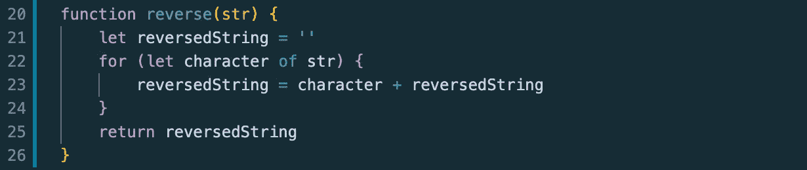
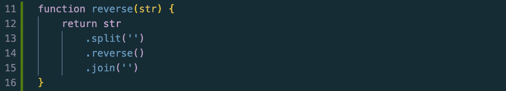
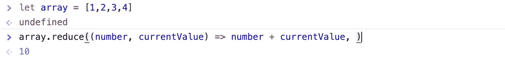
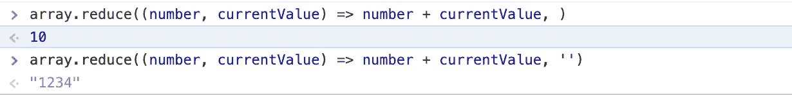

# 算法:简单字符串反转

> 原文：<https://javascript.plainenglish.io/simple-string-reversal-ds-a-i-b43b0ef2619f?source=collection_archive---------10----------------------->

*我的数据结构和算法初学者系列的第一部分。在本文中，我将解决一个应该很好并且很容易开始的问题:字符串反转。*

Photo by [Safar Safarov](https://unsplash.com/@codestorm?utm_source=medium&utm_medium=referral)

*免责声明:所有代码都是用 JavaScript 编写的，但我会更加关注逻辑，这样这个博客在其他编码语言中也能适用。*

在本系列的介绍中，我谈到了我想如何深入研究运行时复杂性。考虑了一会儿这个概念后，我意识到如果没有先解决这些问题的经验，试图理解运行时的复杂性将是非常困难的。所以在这个博客中，我将从一个非常基本的初学者问题开始，帮助大家开始。通过在谷歌浏览器的开发者控制台中创建一个函数，创建一个字符串，然后以该字符串作为参数调用该函数，您可以自由尝试这些解决方案。

我们开始吧！

字符串反转是最常见的初学者算法问题之一，虽然它可能不会经常出现在技术访谈中，但它是开始处理一般算法的好方法:

**给定一个字符串，写一个函数，接受一个字符串的输入，然后反转该字符串。例如，“你好，世界！”，当输入到函数中时，将返回"！dlrow olleH”。**

有三种不同的方法来解决这个问题。

## **溶液 1**

我首先声明一个空字符串，并将其称为 *reversedString* 。 *reversedString* 将用于存储作为参数给出的字符串的每个字符。然后，我使用[循环遍历给定字符串的每个字符..](https://developer.mozilla.org/en-US/docs/Web/JavaScript/Reference/Statements/for...of)声明摘要。在 MDN 文档中，为..语句创建一个循环，该循环迭代任何可迭代对象。在这种情况下，它将遍历给定字符串中的每个字符。第二部分为..for loop 是一个将在每个可迭代对象上执行的语句，因此是一个将在字符串的每个字符上执行的操作。

这个解决方案的逻辑是将给定字符串的每个字符添加到 *reversedString 的前面。*循环完成后，返回*反转字符串*。务必返回解决方案的最终结果。

让我们用一个示例字符串“Hello world！”。首先， *reversedString* 被声明，但它是一个空字符串。现在对于“你好世界”中的每个角色，我将把它添加到*反转字符串*的前面，以及其中的内容。第一次迭代会将空的*反转字符串*改为包含“H”。第二次迭代会将下一个字符添加到前面，因此生成“eH”。第三个是 leh，以此类推。

## **方案二**

这种解决方案需要对内置 JavaScript 方法有一些基本的理解，因此可能不适用于其他编码语言。在这个解决方案中，我使用了[反向](https://developer.mozilla.org/en-US/docs/Web/JavaScript/Reference/Global_Objects/Array/reverse)、[分割](https://developer.mozilla.org/en-US/docs/Web/JavaScript/Reference/Global_Objects/String/split)和[连接](https://developer.mozilla.org/en-US/docs/Web/JavaScript/Reference/Global_Objects/Array/join)的方法。当然，您可以随时参考 MDN 文档来获得关于这些方法的更多信息，但是我也将在这里简要地介绍一下它们。reverse 方法是不言自明的——它接受一个数组并反转其中的内容。这里的关键区别是它接受一个数组，而我们得到的是一个字符串，那么我们如何改变它呢？

分裂的方法是我们需要的。它接受一个字符串的参数，并将其分解为字符串参数中每个字符的子字符串。因此，一串“Hello”将被分解成一个数组，如下所示:['H '，' e '，' l '，' l '，' o']。在字符串上使用 split 之后，我们可以在数组上使用相反的方法。然后，我们的示例数组将反转为['o '，' l '，' l '，' e '，' H']。下一步是将数组变回字符串。这就是可以使用 join 方法的地方。join 方法接受一个数组的参数，然后通过连接数组中的所有元素创建并返回一个新字符串。在我们的例子中，对反转的数组使用 join 将返回“olleH”。

最后，不要忘记返回修改后的字符串！

**解决方案 3**

第三种解决方案也需要使用助手方法。具体来说， [reduce](https://developer.mozilla.org/en-US/docs/Web/JavaScript/Reference/Global_Objects/Array/reduce) 数组辅助方法。reduce 方法接受两个独立的参数。第一个参数是一个箭头函数，第二个参数是函数的起始初始值。在 arrow 函数中，它接受一个累加器和当前值。给定两个参数，它将遍历数组，对每个 iterable 对象执行指定的操作，并替换当前值，最终返回一个值。例如，对于一个数组[1，2，3，4]，对其使用 reduce 并指定每个后续值都将被添加到当前值，我们将得到 10 的解。

为了澄清任何混淆，第二行的 undefined 是在第一行声明数组的结果，因为任何声明都不会隐式返回任何内容。另一个重要的注意事项是，在*当前值*之后，我有一个空的空间。这是第二个参数，也就是开始的初始值。如果我把它改为 10，我们的答案将变成 20，因为我们从 10 开始，然后把数组中的每个元素都加到 10。还有另一个场景，我觉得提出来很重要。我之前犯了一个愚蠢的错误，插入了一个空字符串而不是一个空格作为起始初始值，导致结果变成了“1234”。

这与 JavaScript 类型强制有更多的关系。虽然这是一个相当令人困惑的话题，但是这个例子中的想法很简单，因为我以字符串形式开始初始值，所以 JavaScript 将在给定数组中的整数添加到当前值时强制它们也变成字符串。在 JavaScript 中，将两个字符串相加只是将它们并排放置，因此将一个字符串“1”和一个字符串“2”相加将得到“12”。

那么我们如何使用 reduce 来表示我们的“Hello world！”字符串？这个想法类似于前面的解决方案，在这个方案中，我们必须首先使用 split 方法将我们的字符串转换成一个数组，然后在这个数组上使用 reduce 方法。返回一个*反转的*字符串的关键区别在于，我们将每个字符添加到当前值的前面，所以在这种情况下，*反转的字符串*。

希望这是有意义的，但请随意尝试一下 reduce 方法，因为它需要一些时间来适应！

最后但同样重要的是，永远记住返回反转的字符串。我再次提到这一点是因为我不知道有多少次我对为什么我什么也没有得到感到困惑，只是意识到我从来没有要求返回值。

***注释***

这里有三种不同的方法来解决反转字符串的问题。有时候面试官可能会要求你不要使用辅助方法，因为这样会让解决方案变得非常容易。在这种情况下，在字符上循环的解决方案可以工作。每个人理解概念的速度也不同，所以有些人可能会发现一个解决方案比其他人更容易掌握。

在我的下一篇博客中，我将讨论整数反转。虽然策略非常相似，但是使用整数会带来一些有趣的挑战。这是下周的问题。如果你愿意，试着自己解决它！

给定一个整数，写一个函数，它接受一个整数的输入，然后对该整数求逆。例如，“-321”输入到函数中时，将返回“-123”，而“82”将返回“28”。